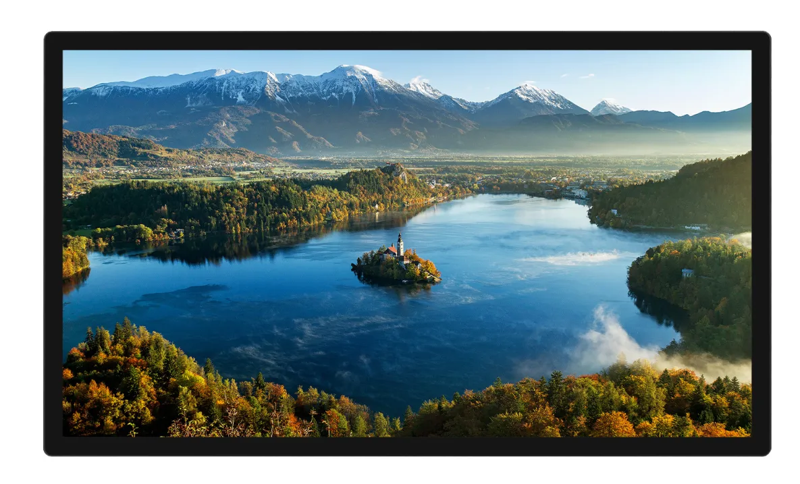

<!-- Image Reference -->

import Feature from './images/Feature.webp';
import Interface_Introduction_1 from './images/Interface-Introduction-1.webp';
import Size from './images/Size.webp';

# 27inch FHD Monitor

 

| SKU   | Product                 |
| ----- | ----------------------- |
| 33975 | 27inch FHD Monitor      |
| 34082 | 27inch FHD Monitor (EU) |
| 34083 | 27inch FHD Monitor (UK) |

## Features

- 27inch IPS screen with 1920x1080 hardware resolution
- 10-point capacitive touch with toughened glass panel, hardness up to 6H
- Uses optical bonding touch process for better display effect
- Supports Raspberry Pi OS / Ubuntu / Kali and Retropie when used with Raspberry Pi
- Supports Windows 11 / 10 / 8.1 / 8 / 7 when used as a computer monitor
- Supports Ubuntu when used with Jetson Nano
- Supports multi-language OSD menu (for power control, brightness/contrast adjustment, etc.)
- Built-in high-fidelity speaker supporting HDMI audio output

 

## Specifications

| **Item**                  |         **Description**          | **Unit** |
| :------------------------ | :------------------------------: | :------: |
| Model                     |        27inch FHD Monitor        |    /     |
| Size                      |                27                |   Inch   |
| Viewing Angle             |               178                |   Deg    |
| Resolution                |            1920×1080             |  Pixels  |
| Dimensions                | 629.62(H) × 367.40(V) × 18.00(D) |    mm    |
| Active Area               |      597.88(H) × 336.31(V)       |    mm    |
| Pixel Pitch               |      0.3114(H) × 0.3114(V)       |    mm    |
| Color Gamut               |               99%                |   sRGB   |
| Contrast Ratio            |              1500:1              |    /     |
| Backlight Adjustment      |             OSD Menu             |    /     |
| Refresh Rate              |                60                |    Hz    |
| Display Interface         |     Standard HDMI Interface      |    /     |
| Power Interface           |               12V                |    /     |
| Typical Power Consumption |                36                |   Watt   |
| Weight                    |               4.92               |    kg    |

# Electrical Specifications

| Parameter             | Min  | Typical | Max  | Unit | Note   |
| --------------------- | ---- | ------- | ---- | ---- | ------ |
| Operating Temperature | 0    | 25      | 60   | ℃    | Note 3 |
| Storage Temperature   | 0    | 25      | 60   | ℃    | Note 3 |
| Input Voltage         | 11.5 | 12.00   | 12.5 | V    | Note 1 |
| Input Current         | 3    | 3       | TBD  | A    | Note 2 |

**Note 1:** Exceeding the maximum input voltage or improper operation may cause permanent damage to the device.  
**Note 2:** The input current must be ≥3A, otherwise startup failure or display abnormalities may occur.  
**Note 3:** Do not expose to high temperature and high humidity for long periods.

# Interfaces

 

# Dimensions

 

