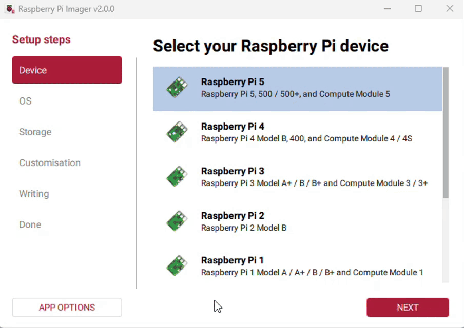

import LCD_7inchproduct3 from './images/7inch-product3.webp';

## Hardware Connection

- 1: Connect the Touch interface to the USB port on the Raspberry Pi
- 2: Connect the HDMI interface to the HDMI port on the Raspberry Pi

<div style={{maxWidth:1200}}> </div>

## Software Settings

:::warning
Supports Raspberry Pi OS/Ubuntu/Kali and Retropie systems for Raspberry Pi.  
When the LCD works on these systems, the resolution must be set manually, otherwise the display resolution will be incorrect, which will affect the experience.
:::

- 1. Download the latest image from the [Raspberry Pi official website](https://www.raspberrypi.com/software/operating-systems/)
     
- 2. Download the compressed file to your PC and extract the .img file
- 3. Connect the TF card to your PC and format it using SDFormatter software
- 4. Open Win32DiskImager software, select the system image prepared in step 1, and click "write" to flash the system image
- 5. After flashing, open the config.txt file in the root directory of the TF card, add the following code at the end of config.txt, save the file, and safely eject the TF card
  ```ini
  hdmi_force_hotplug=1
  hdmi_group=2
  hdmi_mode=87
  hdmi_pixel_freq_limit=200000000
  hdmi_timings=1080 0 80 20 80 1080 0 10 10 14 0 0 0 60 0 84210000 0
  ```
- 6. Insert the TF card into the Raspberry Pi, power it on, and wait a few seconds for normal display

> Due to the characteristics of the round screen, it is recommended to perform the initial setup using the Raspberry Pi remote login tutorial.
