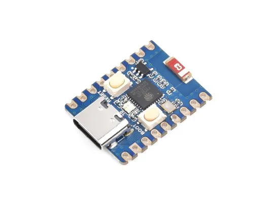
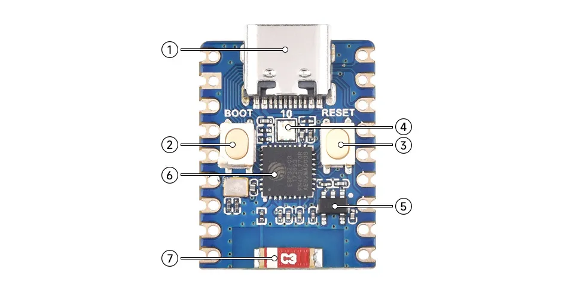
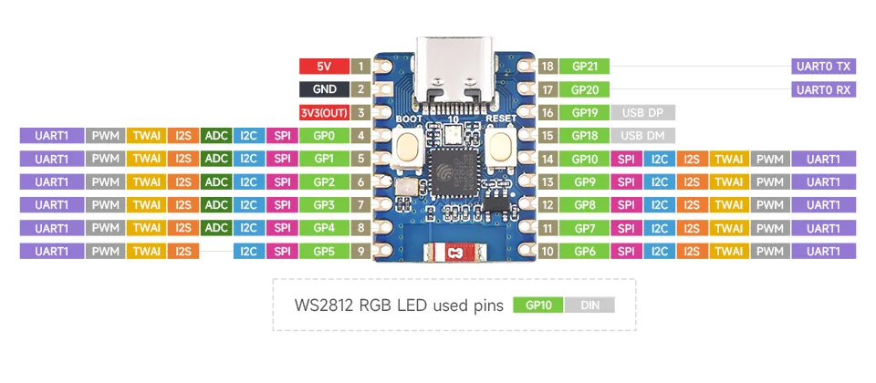
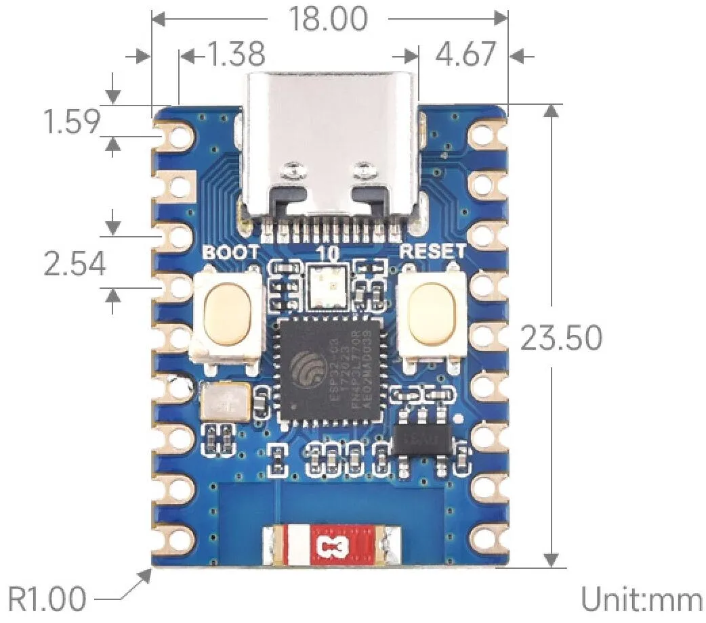

# ESP32-C3-Zero

:::info New and Upgraded
You are browsing the new documentation. If you are more familiar with the old version, you can still access the **[legacy page](https://www.waveshare.com/wiki/ESP32-C3-Zero)**.
:::

import Tabs from '@theme/Tabs';
import TabItem from '@theme/TabItem';

<Tabs>
  <TabItem value="ESP32-C3-Zero" label="ESP32-C3-Zero (Without header)">
    
  </TabItem>
  <TabItem value="ESP32-C3-Zero-M" label="ESP32-C3-Zero-M (With pre-soldered header)" default>
    
  </TabItem>
  <TabItem value="ESP32-C3-Zero-Basic-Kit" label="ESP32-C3-Zero-Basic-Kit" default>
    
  </TabItem>
</Tabs>

The [ESP32-C3-Zero (Without header)](https://www.waveshare.com/esp32-c3-zero.htm?sku=25452) and [ESP32-C3-Zero-M (With pre-soldered header)](https://www.waveshare.com/esp32-c3-zero.htm?sku=25532) are compact modules featuring castellated holes, making them easy to integrate into other carrier boards. The ESP32-C3-Zero features an on-board Type-C USB connector and breaks out most available pins in a small form factor. It utilizes the ESP32-C3FH4, a System-on-Chip (SoC) that integrates low-power Wi-Fi and BLE 5, along with 4MB of Flash. Additionally, it includes hardware cryptographic accelerators, RNG, HMAC, and a Digital Signature module, meeting IoT security requirements and offering rich peripheral interfaces. Its various low-power operating states satisfy the power consumption needs of application scenarios such as the Internet of Things (IoT), mobile devices, wearable electronics, and smart homes.

## Features

- Equipped with the ESP32-C3FH4 chip, featuring a RISC-V 32-bit single-core processor running at up to 160 MHz.
- Supports 2.4GHz Wi-Fi (802.11 b/g/n) and Bluetooth® 5 (LE).
- Built-in 400KB SRAM and 384KB ROM, with 4MB stacked Flash.
- Uses a castellated module design with an on-board ceramic antenna, facilitating integration into user-designed baseboards.
- Supports flexible clock settings and independent module power control to realize multi-scenario low-power modes.
- Integrated USB Serial full-speed controller, breaking out 15 GPIOs for flexible peripheral configuration.
- Features peripherals including 3 × SPI, 1 × I2C, 2 × UART, 1 × I2S, 2 × ADC, etc.

## Onboard Resources

1. **USB Type-C Port**
2. **BOOT Button:** Hold this button and then press the RESET button to enter download mode.
3. **RESET Button**
4. **WS2812 RGB LED**
5. **ME6217C33M5G:** Low Dropout Regulator (LDO), max output current 800mA.
6. **ESP32-C3FH4:** Main frequency up to 160MHz.
7. **2.4G Ceramic Antenna**

## Hardware Description

- When using the ESP32-C3-Zero as a daughter board, ensure the ceramic antenna area is kept clear. Avoid covering the ceramic antenna with the PCB, metal, or plastic components.
- On the ESP32-C3-Zero, GPIO12~GPIO17 are not broken out as these pins are used for the stacked 4MB Flash.
- The ESP32-C3-Zero uses GPIO10 to connect the WS2812 RGB LED. For the WS2812 datasheet, please refer to this [link](https://files.waveshare.com/wiki/ESP32-C3-Zero/XL-0807RGBC-WS2812B.pdf).
- The ESP32-C3-Zero does not use a USB-to-UART bridge chip. To download firmware, you must hold the BOOT (GPIO9) button before connecting the Type-C cable.
- The TX and RX silkscreen markings on the board represent the ESP32-C3-Zero's default UART0 pins, where TX is GPIO21 and RX is GPIO20.
- The board's IO pins support a voltage of 3.3V.

### Hardware Connection

- Every time you download firmware, hold the BOOT (GPIO9) button before connecting the Type-C cable.
- When powered by an external source, input a 3.7V~6V power supply at the pad marked "5V".

## Pinout

### Dimensions

