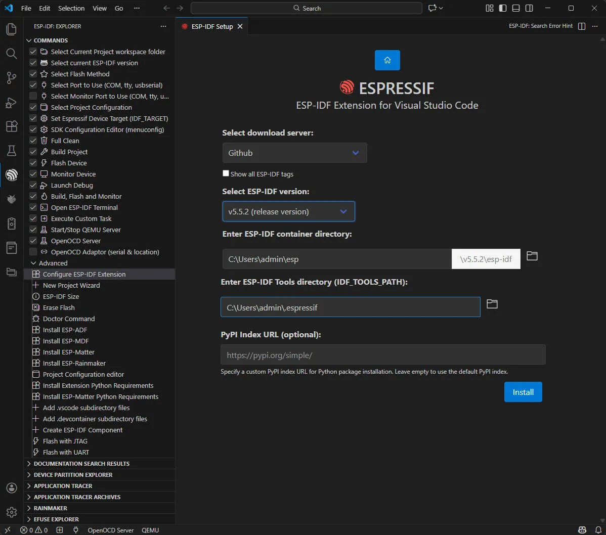

import EspidfTutorialIntro from '@site/docs/ESP32/snippets/EspidfTutorialIntro.mdx';

<!-- Image Reference -->

# Working with ESP-IDF

This chapter includes the following sections, please read as needed:

- [Setting Up Development Environment](#setting-up-development-environment)
- [Demo](#demo)

## Setting Up Development Environment

:::note
The following environment settings are applicable to Windows 10/11 systems. For Mac/Linux users, please refer to the **[official instructions](https://docs.espressif.com/projects/esp-idf/en/latest/esp32/get-started/index.html)**
:::

1. Download and install [Visual Studio Code](https://code.visualstudio.com/).

2. In VS Code, open the **Extensions** view by clicking the  in the VS Code sidebar or using the shortcut (<kbd>Ctrl+Shift+X</kbd>). Then, search for the [ESP-IDF](https://marketplace.visualstudio.com/items?itemName=espressif.esp-idf-extension) extension and install it.

   

3. After the extension is installed, the  will appear in the activity bar on the left side of VS Code. Clicking this icon will view the basic command list for the ESP-IDF extension. Select **Configure ESP-IDF extension** under **Advanced**.

   <!-- Alternatively, press <kbd>F1</kbd>, type `Configure ESP-IDF Extension`, and select the **ESP-IDF: Configure ESP-IDF Extension** option. -->

   

4. Choose **Express** to enter quick configuration mode:

   

5. Modify the following options as needed:

   - **Select download server**:
     - Espressif: For users in China, use Espressif's China server for faster downloads.
     - Github: Use the official GitHub release link.
   - **ESP-IDF Version**: Typically, select the version required by the development board. If no specific requirement, it's recommended to use the latest stable version. For [ESP32-C6-Touch-AMOLED-1.8](https://www.waveshare.com/esp32-c6-touch-amoled-1.8.htm), it is recommended to use the Espressif IDF version ≥ v5.5.0.
   - **ESP-IDF Container directory**: It is recommended to use the default path, or use a path that contains only English characters and no spaces.
   - **ESP-IDF Required Tools directory**: It is recommended to use the default path, or use a path that contains only English characters and no spaces.

   

6. Click **Install** to start the installation. You will see a page displaying the installation progress, including the progress status of ESP-IDF download, ESP-IDF tool download and installation, as well as the creation of the Python virtual environment.

   

7. If everything is installed correctly, you'll get a prompt confirming all the setup is done, and you're ready to start using the extension.

   

:::warning
Note: If ESP-IDF installation fails or needs to be reinstalled, you can try deleting the `C:\Users\%Username%\esp` and `C:\Users\%Username%\.espressif` folders and then retry.
:::

## Demo

### 01_ESP32-C6-LCD-1.3-Test

#### Demo Description

- This example demonstrates a drawn LVGL interface, with the RGB LED dynamically switching between colors like red, green, yellow, etc., using a breathing light animation effect.

#### Hardware Connection

- Connect the development board to the computer

#### Operation Result

- LCD Display: After the device powers on, the LCD lights up automatically, showing the UI interface drawn by LVGL with a stable refresh rate (typically 30-60 fps).
- RGB LED Effect: By default, it displays preset colors. The RGB LED dynamically switches between colors like red, green, yellow, etc., using a breathing light animation effect.

| 
 
 | 
 
 | 
 
 | 
 
 |
| --------------------------------------------------------------- | --------------------------------------------------------------- | --------------------------------------------------------------- | --------------------------------------------------------------- |