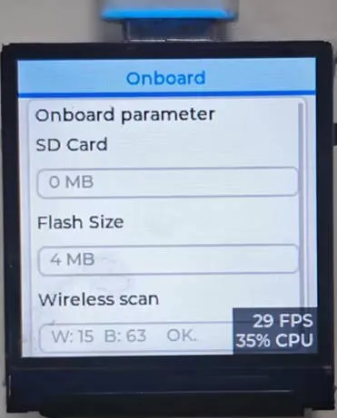
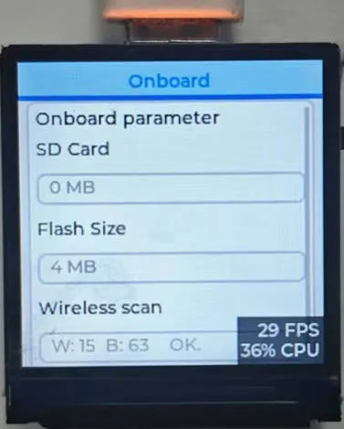
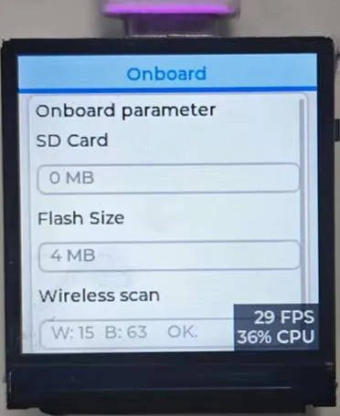
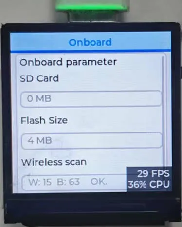

import EspidfTutorialIntro from '@site/docs/ESP32/snippets/EspidfTutorialIntro.mdx';

<!-- Image Reference -->

# Working with ESP-IDF

This chapter includes the following sections, please read as needed:

- [Setting Up Development Environment](#esp-idf-setup)
- [Demo](#demo)

## Setting up the Development Environment{#esp-idf-setup}

:::info
For the ESP32-C6-LCD-1.3 development board, it is recommended to use ESP-IDF V5.5.0 or higher.
:::

import EspidfSetup from '@site/docs/ESP32/snippets/EspidfSetup.mdx';

<EspidfSetup />

## Demo

### 01_ESP32-C6-LCD-1.3-Test

#### Demo Description

- This example demonstrates a drawn LVGL interface, with the RGB LED dynamically switching between colors like red, green, yellow, etc., using a breathing light animation effect.

#### Hardware Connection

- Connect the development board to the computer

#### Operation Result

- LCD Display: After the device powers on, the LCD lights up automatically, showing the UI interface drawn by LVGL with a stable refresh rate (typically 30-60 fps).
- RGB LED Effect: By default, it displays preset colors. The RGB LED dynamically switches between colors like red, green, yellow, etc., using a breathing light animation effect.

| 
 
 | 
 
 | 
 
 | 
 
 |
| --------------------------------------------------------------- | --------------------------------------------------------------- | --------------------------------------------------------------- | --------------------------------------------------------------- |