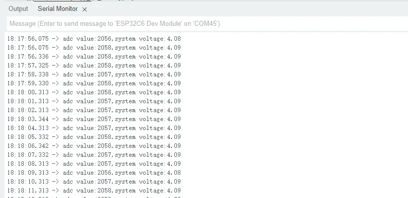
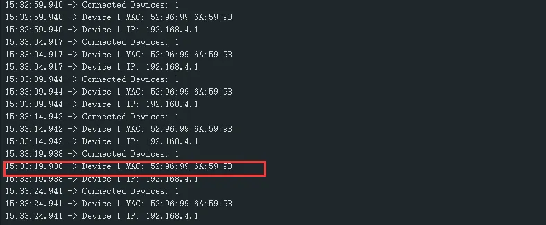
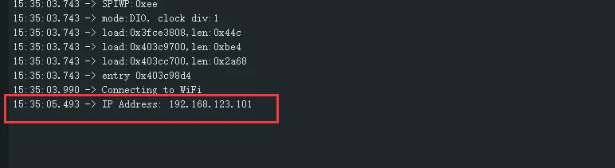
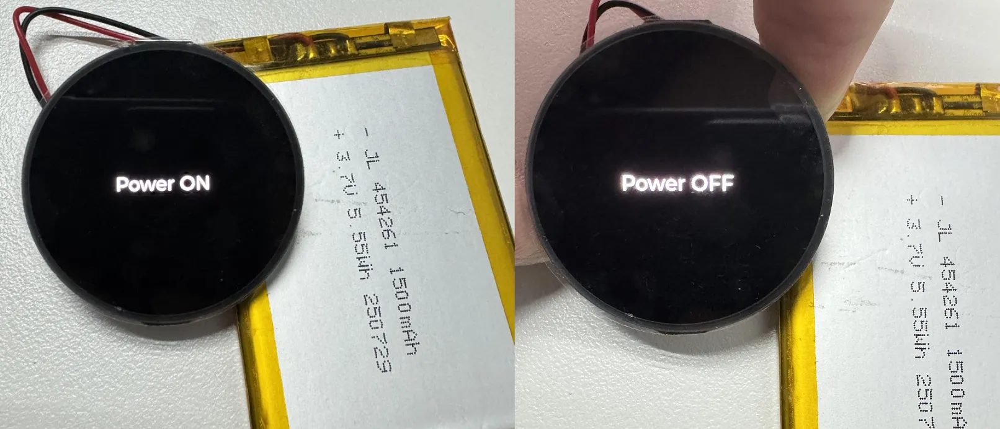

import Tabs from '@theme/Tabs';
import TabItem from '@theme/TabItem';
import Details from '@theme/Details';
import ArduinoTutorialIntro from '@site/docs/ESP32/snippets/ArduinoTutorialIntro.mdx';

<!-- Example-related Image References -->


# Working with Arduino

This chapter contains the following sections. Please read as needed:

- [Setting Up Development Environment](#setting-up-development-environment)
- [Demo](#demo)

<ArduinoTutorialIntro />

## Setting Up Development Environment

### 1. Installing and Configuring Arduino IDE

Please refer to the tutorial **[Installing and Configuring Arduino IDE Tutorial](/docs/ESP32/Tutorials/Arduino-Tutorials/01-Arduino-IDE-Setup.md)** to download and install the Arduino IDE and add ESP32 support.

### 2. Installing Libraries

- When installing Arduino libraries, there are typically two methods: **Online Installation** and **Offline Installation**. If the library installation requires offline installation, you must use the provided library file.
- For most libraries, users can easily search and install them through the online Library Manager in the Arduino software. However, some open-source libraries or custom libraries are not synchronized to the Arduino Library Manager, so they cannot be acquired through online searches. In this case, users can only manually install these libraries offline.
- The sample program package for the ESP32-C6-Touch-AMOLED-1.32 development board can be downloaded from [here](./Resources-And-Documents.md#Demo). The <code>Arduino\libraries</code> directory within the package already includes all the library files required for this tutorial.

| Library/File Name  | Description  | Version  | Installation Method |
| :----------: | :----: | :------------: | :--------: |
|LVGL | Graphical library || v8.3.11/v9.3.0 || "Install Offline”
| SensorLib | Sensor library | v0.3.1|  "Install Online" or "Install Offline"

:::warning Version Compatibility Description

There are strong dependencies between versions of LVGL and its driver libraries. For example, a driver written for LVGL v8 may not be compatible with LVGL v9. To ensure stable reproduction of the examples, it is recommended to use the specific versions listed in the table above. Mixing different library versions may cause compilation failures or runtime exceptions.
:::

### 3. Arduino Project Parameter Settings

import esp32S3RLCD4_2ArduinoToolCfg from './images/ESP32-C6-Touch-AMOLED-1.32-ArduinoToolCfg.webp';

<div 
    style={{maxWidth:600}}> 
    
</div>

## Demo

The Arduino demos are located in the `Arduino/examples` directory of the [demo package](./Resources-And-Documents.md#Demo).

|                         Demo                         |   Basic Program Description | Dependency Library|
|:--------------:|:-----------------------------------------:|:----------:|
| 01_ADC_Test | Get the voltage value of the lithium battery | - |
| 02_WIFI_AP | Set to AP mode to obtain the IP address of the access device | - |
| 03_WIFI_STA | Set to STA mode to connect to WiFi and obtain an IP address | - |
| 04_BATT_PWR_Test | Control power via the PWR button when powered solely by the lithium battery |      -       |
| 05_Audio_Test | Play the sound recorded by the microphone through the speaker | LVGL V8.3.11 |
| 06_LVGL_V8_Test | LVGLV8 demo | LVGL V8.3.11 |
| 07_LVGL_V9_Test | LVGLV9 demo | LVGL V9.3.0 |

### 01_ADC_Test

**Demo Description**

- The analog voltage connected through the GPIO is converted to digital by the ADC, and then the actual lithium battery voltage is calculated and printed to the terminal.

**Hardware Connection**

- Connect the board to the computer using a USB cable

**Code Analysis**

- `adc_bsp_init(void)`: Initializes ADC1, including creating an ADC one-shot trigger unit and configuring Channel 0 of ADC1.
- `adc_get_value(float *value,int *data)`: Reads the value from Channel 0 of ADC1, calculates the corresponding voltage based on the reference voltage and resolution, and stores it at the location pointed to by the passed pointer. Stores 0 if the read fails.
- `adc_example(void* parameter)`: After initializing ADC1, creates an ADC task. This task reads the ADC value every second and calculates the system voltage from the raw ADC reading.

**Operation Result**

- After the program is compiled and downloaded, you can view the printed ADC values and voltage output by opening the Serial Monitor, as shown in the following image:

  <div style={{maxWidth: 800}}>
  	
  </div>

### 02_WIFI_AP

**Demo Description**

- This demo can set the development board as a hotspot, allowing phones or other devices in STA mode to connect to the development board.

**Hardware Connection**

- Connect the board to the computer using a USB cable

**Code Analysis**

- In the `02_WIFI_AP.ino` file, locate `ssid` and `password`. Phones or other STA mode devices can then connect to the board using this SSID and password.

  ```cpp
  const char *ssid = "ESP32_AP";
  const char *password = "12345678";
  ```

**Operation Result**

- After flashing the program, open the Serial Terminal. If a device successfully connects to the hotspot, the MAC address of that device will be output, as shown:

  <div style={{maxWidth: 800}}>
  		
  </div>

### 03_WIFI_STA

**Demo Description**

- This example can configure the development board as a STA device to connect to a router, thereby enabling access to the system network.

**Hardware Connection**

- Connect the board to the computer using a USB cable

**Code Analysis**

- In the `03_WIFI_STA.ino` file, locate ` ssid` and ` password`, and modify them to match the SSID and Password of an available router in the current environment.

  ```cpp
  const char *ssid = "you_ssid";
  const char *password = "you_password";
  ```

**Operation Result**

- After flashing the program, open the serial terminal, if the device is successfully connected to the hotspot, the IP address obtained will be output, as shown in the figure:

  <div style={{maxWidth: 800}}>
		
  </div>

### 04_BATT_PWR_Test

**Demo Description**

- Demonstrates how to control the system power via the PWR button when powered by the lithium battery.

**Hardware Connection**

- Connect the board to the computer using a USB cable

**Code Analysis**

- `setup_ui(lv_ui *ui)`: Initializes the UI interface for visual control.
- `BatteryMonitor batt_dev(ADC_CHANNEL_3,18,17)`: Initializes the control IO ports for the lithium battery.
- `user_button_init()`: Initializes the buttons and their trigger events.
- `Custom_ButtonPWRLoopTask(void *arg)`: A task that waits for button event triggers.

**Operation Result**

- After the program is flashed, disconnect the USB power supply and connect the lithium battery. Power on by pressing and holding the PWR button, as shown in the figure:
  <div style={{maxWidth: 800}}>
		
  </div>

  :::tip
  1. Press and hold the PWR button, wait for the screen to display "Power ON", which means that the startup is successful, and release the button
  2. Press and hold the PWR button again, wait for the screen to display "Power OFF", which means that the power is turned off successfully, and release the button
  :::

### 05_Audio_Test

**Demo Description**

- Demonstrates how to capture microphone data, play sound, and other audio functions.

**Hardware Connection**

- Connect the board to the computer using a USB cable

**Code Analysis**

- `I2cMasterBus i2c_dev(ESP32_SCL_NUM,ESP32_SDA_NUM,0)`: Initializes the I2C bus.
- `audio_dev = new I2sAudioCodec("S3_AMOLED_1_32")`: Initializes the Audio Codec.
- `audio_dev->I2sAudio_SetSpeakerVol(90)`: Sets the playback volume level.
- `audio_dev->I2sAudio_SetMicGain(20)`: Sets the recording gain.

**Operation Result**

- After the program is flashed, speak into the microphone. The speaker will automatically play the recorded sound. The screen display is as shown in the figure:
  <div style={{maxWidth: 500}}>
		
  </div>

  :::tip
  1. If the playback volume seems low, first try increasing it using `audio_dev->I2sAudio_SetSpeakerVol(90)`.
  2. If increasing the playback volume is insufficient, you can use `audio_dev->I2sAudio_SetMicGain(20)` to increase the recording gain.
  :::

### 06_LVGL_V8_Test

**Demo Description**

- Implements various multifunctional GUI interfaces on the screen by porting LVGL V8.

**Hardware Connection**

- Connect the board to the computer using a USB cable

**Code Analysis**

- To perform a backlight test, locate the macro definition `#define BacklightTestEN 0` in the `user_config.h` file and change its value to 1.

  ```cpp
  #define BacklightTestEN  0  //Backlight Test
  ```

**Operation Result**

- After the program is flashed, the device operation result is as follows:

  <div style={{maxWidth: 500}}>
  		
  </div>

### 07_LVGL_V9_Test

**Demo Description**

- Implements various multifunctional GUI interfaces on the screen by porting LVGL V9.

**Hardware Connection**

- Connect the board to the computer using a USB cable

**Code Analysis**

- To perform a backlight test, locate the macro definition `#define BacklightTestEN 0` in the `user_config.h` file and change its value to 1.

  ```cpp
  #define BacklightTestEN  0  //Backlight Test
  ```

**Operation Result**

- After the program is flashed, the device operation result is as follows:

  <div style={{maxWidth: 500}}>
		
  </div>