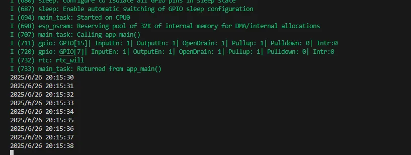
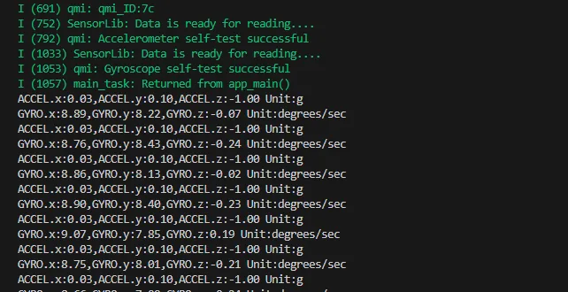
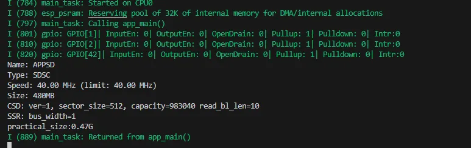
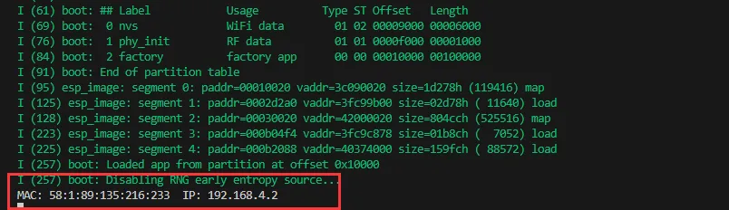
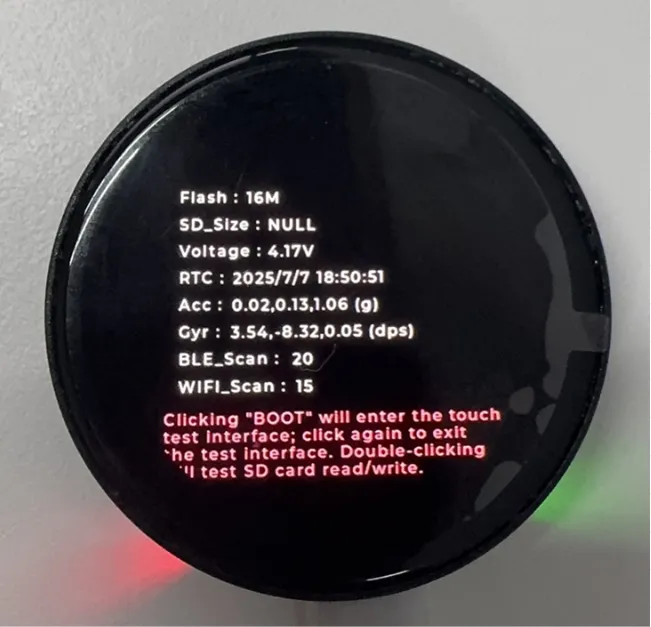
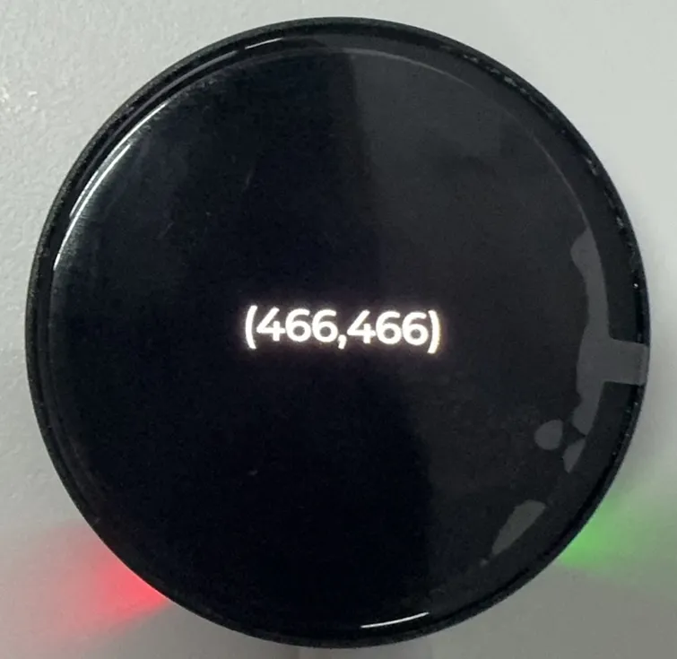
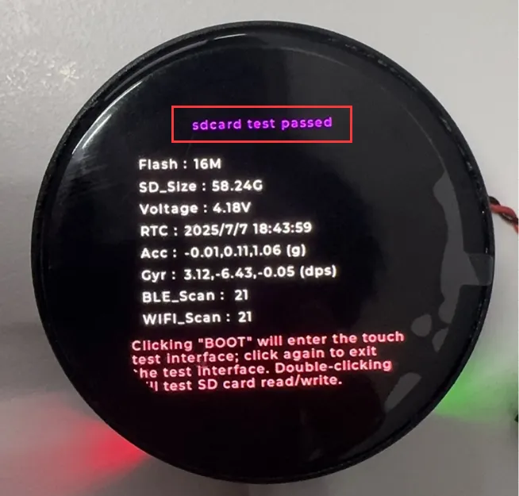
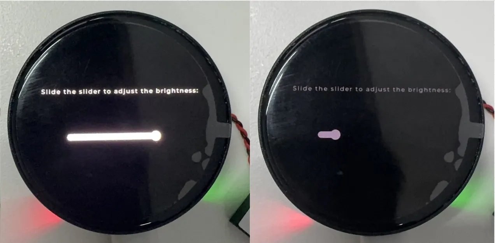

<!-- Example-related Image References -->


import EspidfTutorialIntro from '@site/docs/ESP32/snippets/EspidfTutorialIntro.mdx';
import EspidfSetup from '@site/docs/ESP32/snippets/EspidfSetup.mdx';

# ESP-IDF

This chapter contains the following sections. Please read as needed:

- [ESP-IDF Getting Started](#esp-idf-getting-started)
- [Setting Up Development Environment](#esp-idf-setup)
- [Demo](#demo)

## ESP-IDF Getting Started {#esp-idf-getting-started}

<EspidfTutorialIntro />

## Setting Up Development Environment]{#esp-idf-setup}

:::info
For the ESP32-C6-Touch-AMOLED-1.43 development board, ESP-IDF V5.5.0 or above is required.
:::

<EspidfSetup />

## Demo

| Demo | Basic Program Description | Dependency Library|
|:-:|:-:|:-:|
| 01_ADC_Test | Get the voltage value of the lithium battery | - |
| 02_I2C_PCF85063 | Print real-time time of RTC chip | SensorLib |
| 03_I2C_QMI8658 | Print the raw data from IMU | SensorLib
| 04_SD_Card | Load and display the information of the TF card | - |
| 05_WIFI_AP | Set to AP mode to obtain the IP address of the access device | - |
| 06_WIFI_STA | Set to STA mode to connect to WiFi and obtain an IP address | - |
| 07_BATT_PWR_Test | Control power via the PWR button when powered solely by the lithium battery |      -       |
| 08_Audio_Test | Play the sound recorded by the microphone through the speaker | - |
| 09_LVGL_V8_Test | LVGLV9 demo | LVGL V8.3.11 |
| 10_LVGL_V9_Test | LVGLV8 demo | LVGL V9.3.0 |
| 11_FactoryProgram | Comprehensive demo | LVGL V8.3.11|

### 01_ADC_Test


**Demo Description**


- The analog voltage connected through the GPIO is converted to digital by the ADC, and then the actual lithium battery voltage is calculated and printed to the terminal.


**Hardware Connection**


- Connect the board to the computer using a USB cable


**Code Analysis**


- `adc_bsp_init(void)`: Initializes ADC1, including creating an ADC one-shot trigger unit and configuring Channel 0 of ADC1.
- `adc_get_value(float *value,int *data)`: Reads the value from Channel 0 of ADC1, calculates the corresponding voltage based on the reference voltage and resolution, and stores it at the location pointed to by the passed pointer. Stores 0 if the read fails.
- `adc_example(void* parameter)`: After initializing ADC1, creates an ADC task. This task reads the ADC value every second and calculates the system voltage from the raw ADC reading.


**Operation Result**


- After the program is compiled and downloaded, you can view the printed ADC values and voltage output by opening the Serial Monitor, as shown in the following image:


  <div style={{maxWidth: 800}}>
      
  </div>


### 02_I2C_PCF85063


**Demo Description**


- Through the I2C protocol, initialize the PCF85063 chip, set the time, and then periodically read the time and print it to the terminal


**Hardware Connection**


- Connect the board to the computer using a USB cable


**Code Analysis**


- `void i2c_rtc_loop_task(void *arg)`: Creates an RTC task to implement the RTC function, reading the clock of the RTC chip every second and outputting it to the terminal.


**Operation Result**


- Open the serial port monitoring, you can see the RTC time of the printout, as shown in the figure below:


  <div style={{maxWidth: 800}}>
      
  </div>


### 03_I2C_QMI8658


**Demo Description**


- Initialize the QMI8658 chip via the I2C protocol, then read the corresponding attitude information every 200ms and print it to the terminal.


**Hardware Connection**


- Connect the board to the computer using a USB cable


**Code Analysis**


- `void i2c_qmi_loop_task(void *arg)`: Creates a QMI task to acquire attitude information. The task reads and prints accelerometer and gyroscope data at 200ms intervals, and outputs the results to the serial console.


**Operation Result**


- Open the serial monitor to view the raw data output from the IMU (Euler angles require conversion), as shown in the figure below:


  <div style={{maxWidth: 800}}>
      
  </div>


### 04_SD_Card


**Demo Description**


- Drive the TF card via SDSPI mode. After successful mounting, print the TF card information to the terminal.


**Hardware Connection**


- Install a FatFs-formatted into the board before powering on


**Code Analysis**


- `sdcard_init(void)`: Initializes the TF card using SDSPI mode.
- `loop()`: Tests TF card read/write functions. You need to uncomment the `#define sdcard_write_Test` macro definition.

 ```cpp
 //#define sdcard_write_Test
 ```


**Operation Result**


- Click to open the Serial Monitor device. You can see the output TF card information; practical_size indicates the actual capacity of the TF card, as shown below:


  <div style={{maxWidth: 800}}>
      
  </div>


### 05_WIFI_AP


**Demo Description**


- This demo can set the development board as a hotspot, allowing phones or other devices in STA mode to connect to the development board.


**Hardware Connection**


- Connect the board to the computer using a USB cable


**Code Analysis**


- In the `05_WIFI_AP.ino` file, locate `ssid` and `password`. Phones or other STA mode devices can then connect to the board using this SSID and password.

  ```cpp
  const char *ssid = "ESP32_AP";
  const char *password = "12345678";
  ```


**Operation Result**


- After flashing the program, open the serial terminal. If the device is successfully connected to the hotspot, the MAC address of the device will be output, as shown in the figure:


  <div style={{maxWidth: 800}}>
      
  </div>


### 06_WIFI_STA


**Demo Description**


- This example can configure the development board as a STA device to connect to a router, thereby enabling access to the system network.


**Hardware Connection**


- Connect the board to the computer using a USB cable


**Code Analysis**


- In the `06_WIFI_STA.ino` file, locate ` ssid` and ` password`, and modify them to match the SSID and Password of an available router in your current environment.

  ```cpp
  const char *ssid = "you_ssid"; 
  const char *password = "you_password";
  ```


**Operation Result**


- After flashing the program, open the serial terminal, if the device is successfully connected to the hotspot, the IP address obtained will be output, as shown in the figure:


  <div style={{maxWidth: 800}}>
      
  </div>


### 07_BATT_PWR_Test


**Demo Description**


- Demonstrates how to control the system power via the PWR button when powered by the lithium battery.


**Hardware Connection**


- Power the development board with a lithium battery.


**Code Analysis**


- `setup_ui(lv_ui *ui)`: Initializes the UI interface for visual control.
- `esp_io_expander_new_i2c_tca9554()`: Initializes the lithium battery control IO port.
- `user_button_init()`: Initializes the buttons and their trigger events.
- `example_button_task(void* parameter)`: Task waiting for button event triggers.

**Operation Result**


- After the program is flashed, disconnect the USB power supply and connect the lithium battery. Power on by pressing and holding the PWR button, as shown in the figure:


  <div style={{maxWidth: 800}}>
      
  </div>

  :::tip
  1. Press and hold the PWR button, wait until the screen displays "Power on succeeded", indicating successful power-on, then release the button.
  2. Press and hold the PWR button again, wait until the screen displays "Power on failed", indicating successful power-off, then release the button.
  :::

### 08_Audio_Test


**Demo Description**


- Demonstrates how to get data from the microphone and then play it through the speaker


**Hardware Connection**


- Connect the board to the computer using a USB cable
- Connect the speaker to the onboard MX1.25 2PIN speaker interface.


**Code Analysis**


- `i2c_master_Init()`: Initializes the I2C bus.
- `esp_io_expander_new_i2c_tca9554()`: Initializes the amplifier CTRL control IO port.
- `esp_codec_dev_set_out_vol()`: Sets the output volume during playback.
- `esp_codec_dev_set_in_gain()`: Sets the input gain for recording.

**Operation Result**


- After the program is flashed, speak into the microphone, and the speaker will automatically play back the recorded sound. This example has no UI display.

  :::tip
  1. If you find the playback volume to be too low, prioritize using "esp_codec_dev_set_out_vol" to increase the playback volume
  2. If the sound is still not loud enough after increasing the playback volume, you can use "esp_codec_dev_set_in_gain" to increase the gain during recording
  :::


### 09_LVGL_V8_Test


**Demo Description**


- Implements various multifunctional GUI interfaces on the screen by porting LVGL V8.


**Hardware Connection**


- Connect the board to the computer using a USB cable


**Code Analysis**


- If you need to rotate the display by 90 degrees, locate the `#define EXAMPLE_Rotate_90` macro definition in the `user_config.h` file and uncomment it.
- If you need to perform a backlight test, locate the `#define Backlight_Testing` macro definition in the `user_config.h` file and uncomment it.

  ```cpp
  //#define Backlight_Testing
  //#define EXAMPLE_Rotate_90
  ```

**Operation Result**

- After the program is flashed, the device operation result is as follows:


  <div style={{maxWidth: 400}}>
      
  </div>


### 10_LVGL_V9_Test


**Demo Description**


- Implements various multifunctional GUI interfaces on the screen by porting LVGL V9.


**Hardware Connection**


- Connect the board to the computer using a USB cable


**Code Analysis**


- If you need to rotate the display by 90 degrees, locate the `#define EXAMPLE_Rotate_90` macro definition in the `user_config.h` file and uncomment it.
- If you need to perform a backlight test, locate the `#define Backlight_Testing` macro definition in the `user_config.h` file and uncomment it.

  ```cpp
  //#define Backlight_Testing
  //#define EXAMPLE_Rotate_90
  ```

**Operation Result**


- After the program is flashed, the device operation result is as follows:


  <div style={{maxWidth: 400}}>
      
  </div>


### 11_FactoryProgram


**Demo Description**


- Comprehensive project, you can simply test the onboard hardware functions, or directly use the BIN firmware we provide for flashing.


**Hardware Connection**


- Connect the board to the computer using a USB cable


**Code Analysis**

  ```cpp      
  ContsGroups = xEventGroupCreate();            // Create an event group for task synchronization
  Serial.begin(115200);                // Initialize serial communication, baud rate 115200
  Tca9554_Init();                               // Initialize the TCA9554 GPIO expander chip
  display = new DisplayPort(i2cbus, 466, 466);  // Create a display port instance, resolution 466x466
  display->DisplayPort_TouchInit();             // Initialize the display touch function
  Lvgl_PortInit(*display);                      // Initialize the LVGL graphics library port
  Adc_PortInit();                               // Initialize the ADC port
  Custom_ButtonInit();                          // Initialize custom buttons
  I2cRtcSetup(&i2cbus, 0x51);                  // Initialize the I2C RTC clock chip, address 0x51
  Set_I2cRtcTime(2026, 1, 1, 0, 0, 0);          // Set RTC time to 2026-01-01 00:00:00
  I2cQmiSetup(&i2cbus, 0x6b);                   // Initialize the I2C IMU sensor, address 0x6b
  codecport = new CodecPort(i2cbus,"C6_AMOLED_1_43"); // Create an audio codec port instance    
  ```

**Operation Result**


- The display cycles through red, green, and blue colors (transition interval 1.5 seconds), as shown:

  <div style={{maxWidth: 1200}}>
    
  </div>

- After the system finishes displaying the above colors, it will automatically enter the onboard hardware information interface, as shown in the figure:

  <div style={{maxWidth: 400}}>
    
  </div>

  :::tip
  1. Displays the ESP32C6 stacked Flash 
  2. Displays the actual capacity of the inserted TF card
  3. Displays the voltage of the connected lithium battery
  4. Real-time display of RTC time and QMI attitude data
  5. Scans for nearby Bluetooth and Wi-Fi devices
  :::

- Click the BOOT button on the onboard hardware information interface to enter the Touch function interface, as shown:

  <div style={{maxWidth: 400}}>
    
  </div>

- Click the BOOT button again to exit the Touch function interface and activate the microphone recording and speaker playback functions:

  :::tip
  1. Speak into the microphone, and the speaker will automatically play back the recorded sound.
  2. Press and hold the BOOT button to play music; release to stop.
  :::

- Test the TF card read/write function, as shown:

  <div style={{maxWidth: 400}}>
    
  </div>

  :::tip
  1. Double-click the BOOT button to perform the test.
  :::

- Swipe left to enter the AMOLED backlight setting interface, as shown:

  <div style={{maxWidth: 800}}>
    
  </div> 

- Power the board using only a lithium battery, with the PWR button controlling the power:

  :::tip
  1. Press and hold the PWR button to turn on the system power, and press and hold it again to turn off the system power
  :::
