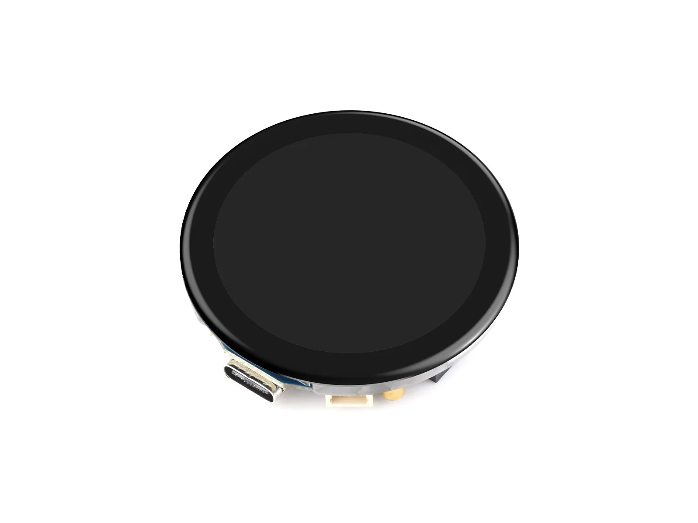
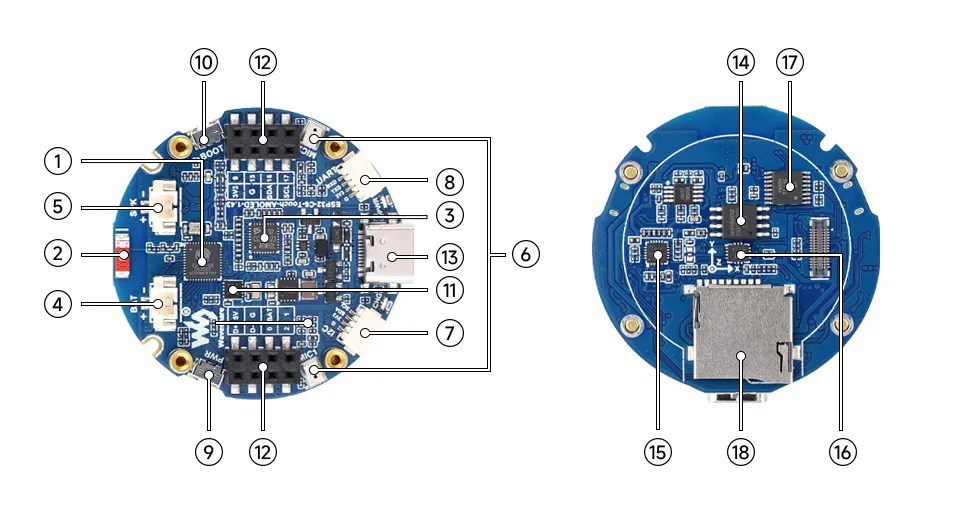
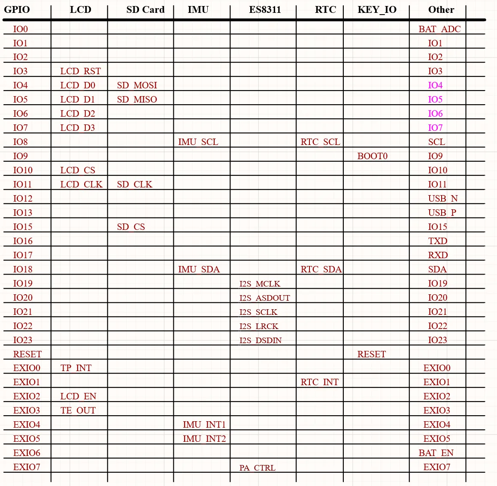
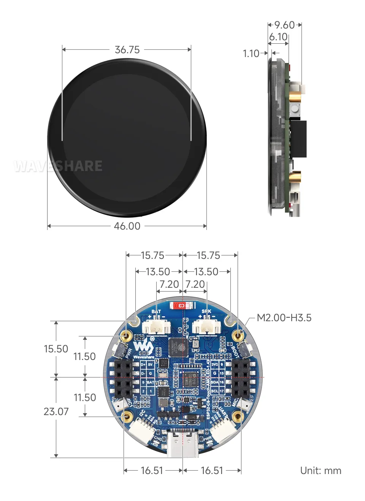
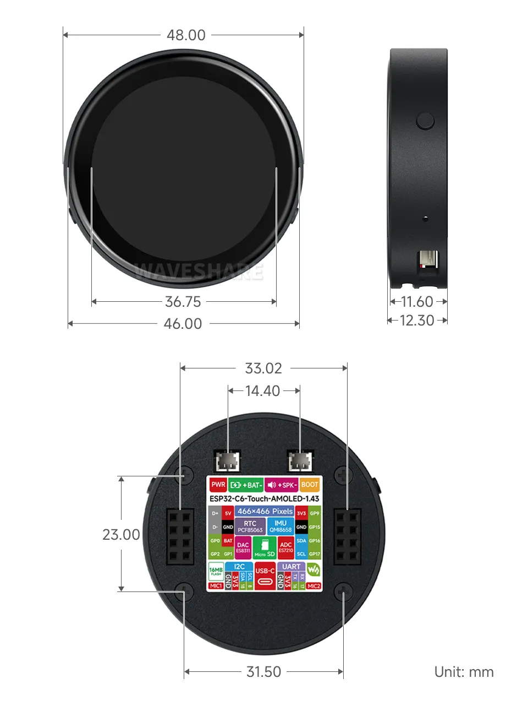
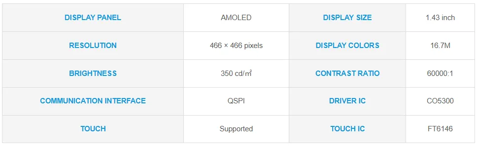

# ESP32-C6-Touch-AMOLED-1.43

import Tabs from '@theme/Tabs';
import TabItem from '@theme/TabItem';

<Tabs queryString="variant">
  <TabItem value="ESP32-C6-Touch-AMOLED-1.43" label="ESP32-C6-Touch-AMOLED-1.43 (Without Case)">
    
 

  </TabItem>
  <TabItem value="ESP32-C6-Touch-AMOLED-1.43-M" label="ESP32-C6-Touch-AMOLED-1.43-B (With Case)" default>
    
 

  </TabItem>
</Tabs>

This product is a high-performance, highly integrated microcontroller development board designed by Waveshare, with an external high-capacity Flash. It features a 1.43inch HD AMOLED display, highly integrated RTC, IMU, TF card slot, low-power audio codec chip, dual MIC circuit, and lithium battery charging and discharging peripherals. It also reserves USB, UART, I2C, and GPIO interfaces, providing flexible expandability for development and easy integration into products.

| SKU | Product |
| ------ |   ------------------ |
| 31897 | ESP32-C6-Touch-AMOLED-1.43 |
| 31905 | ESP32-C6-Touch-AMOLED-1.43-B |

## Features

- Equipped with ESP32-C6 high-performance 32-bit RISC-V processor, up to 160MHz operating frequency
- Integrated WiFi 6, Bluetooth 5 and IEEE 802.15.4 (Zigbee 3.0 and Thread) wireless communication, with superior RF performance
- Built-in 512KB HP SRAM, 16KB LP SRAM, and 320KB ROM, stacked with 16MB Flash
- Onboard 1.43inch capacitive touch high-definition AMOLED display, 466 × 466 resolution, 16.7M colors, enabling clear display of color images
- Integrated CO5300 driver chip and FT6146 capacitive touch controller, communicating via QSPI and I2C interfaces respectively, enhancing performance while minimizing pin usage
- Equipped with dual digital microphone arrays, supporting advanced voice interaction functions, suitable for precise speech recognition and near-field/far-field voice wake-up applications
- Onboard QMI8658 six-axis inertial measurement unit (3-axis accelerometer, 3-axis gyroscope) for motion posture detection, step counting, etc.
- Onboard PCF85063 RTC chip for convenient RTC functionality implementation
- Onboard two side buttons, PWR and BOOT, with customizable functions for convenient custom button operation development
- Onboard 3.7V MX1.25 lithium battery charge/discharge interface
- Onboard TF card slot for flexible storage expansion and fast data transfer, suitable for data logging and media playback, simplifying circuit design
- Exposed UART and I2C SH1.0 4PIN interfaces, with reserved 2 × 4PIN 2.54mm pitch headers
- AMOLED screen offers higher contrast, wider viewing angles, rich colors, and fast response times for superior visual effects, along with advantages such as slim design, low power consumption, and flexibility
- Optional CNC-machined enclosure with elegant design, clearly labeled interface descriptions, overall aesthetic appeal, and portability

## Onboard Resources

 

          
1. **ESP32-C6** Integrates a RISC-V single-core processor running at 160MHz, supports 2.4GHz Wi-Fi 6 and BLE 5  
2. **Onboard Chip Antenna** Supports 2.4GHz Wi-Fi (802.11 b/g/n) and Bluetooth 5 (LE)  
3. **ES7210 ADC Audio Codec** High-performance, low-power audio analog-to-digital converter, supports multi-microphone input  
4. **MX1.25 2PIN Lithium Battery Header** For connecting a lithium battery, supports battery power supply   
5. **MX1.25 2PIN Speaker Header** Audio signal output, supports external speaker connection  
6. **Dual Microphone Array Design** Dual digital microphone arrays for advanced voice interaction functions  
7. **SH1.0 4Pin I2C Interface** Standard I2C bus interface for easy expansion of sensors and other devices  
8. **SH1.0 4Pin UART Interface** For debugging or data exchange with other modules  
9. **PWR Power Button** Can be used with programs to control power when operating on a battery  
10. **BOOT Button** Hold the BOOT button and power on the device again to enter download mode  
11. **PCF85063** RTC clock chip, supporting time-keeping functionality  
12. **2 × 4PIN 2.54mm Pitch Female Header** For external module expansion, compatible with wires   
13. **Type-C Interface** Used for program flashing and log printing  
14. **W25Q128JVSI** 16MB Flash memory   
15. **ES8311 DAC Audio Codec** High-performance, low-power audio digital-to-analog converter  
16. **QMI8658** 3-axis accelerometer + 3-axis gyroscope for posture sensing, motion recognition, etc  
17. **TCA9554PWR** 8-bit I2C GPIO expander chip  
18. **TF Card Slot ** Supports FAT32-formatted TF card for data expansion

## Interfaces

 

## Dimensions

### Without Case Version

 

### With Case Version

 

### AMOLED Display Specifications

 

## Development Methods     

The ESP32-C6-Touch-AMOLED-1.43 supports two development frameworks: Arduino IDE and ESP-IDF, providing flexibility for developers to choose the tool that best fits their project requirements and personal preference.

Each method has its advantages, and developers can select based on their needs and skill level. Arduino is simple to learn and easy to get started with, suitable for beginners and non-professionals; ESP-IDF provides more advanced development tools and stronger control capabilities, suitable for developers with professional backgrounds or those with higher performance requirements, and is more suitable for complex project development.

- **Arduino IDE** is a convenient, flexible, and easy-to-use open-source electronics prototyping platform. It requires minimal foundational knowledge, allowing for rapid development after a short learning period. Arduino has a vast global community that provides a wealth of open-source code, project examples, tutorials, and rich libraries that encapsulate complex functionalities, enabling developers to implement various features quickly. You can refer to the **[Working with Arduino](./Arduino.md)** to complete the initial setup, and the tutorial also provides related demos for reference.

- **ESP-IDF** (Espressif IoT Development Framework) is a professional development framework released by Espressif for its ESP series chips. It is developed based on the C language, including a compiler, debugger, and flashing tool, etc. It supports development via command line or an Integrated Development Environment (such as Visual Studio Code with the Espressif IDF plugin), which provides features like code navigation, project management, and debugging, etc. We recommend using VS Code for development. For the specific configuration process, please refer to the **[Working with ESP-IDF](./ESP-IDF.md)**. The tutorial also provides relevant demos for reference.
