import Tabs from '@theme/Tabs';
import TabItem from '@theme/TabItem';
import Details from '@theme/Details';
import ArduinoTutorialIntro from '@site/docs/ESP32/snippets/ArduinoTutorialIntro.mdx';

<!-- Image Reference -->

# Working with Arduino

This chapter includes the following sections, please read as needed:

- [Arduino Getting Started Tutorial](#arduino-tutorial-for-beginners)
- [Setting Up Development Environment](#setting-up-development-environment)
- [Demo](#demo)

## Arduino Getting Started Tutorial{#arduino-tutorial-for-beginners}

<ArduinoTutorialIntro />
  
## Setting Up Development Environment

### 1. Installing and Configuring Arduino IDE

Please refer to the tutorial **[Installing and Configuring Arduino IDE Tutorial](/docs/ESP32/Tutorials/Arduino-Tutorials/01-Arduino-IDE-Setup.md)** to download and install the Arduino IDE and add ESP32 support.

### 2. Installing Libraries

- When installing Arduino libraries, there are typically two methods: **Online Installation** and **Offline Installation**. If the library installation requires offline installation, you must use the provided library file.
- For most libraries, users can easily search and install them through the online Library Manager in the Arduino software. However, some open-source libraries or custom libraries are not synchronized to the Arduino Library Manager, so they cannot be acquired through online searches. In this case, users can only manually install these libraries offline.
You can click [this link](https://github.com/waveshareteam/ESP32-C6-Touch-AMOLED-1.8/tree/main/examples) to download the demo package for the  ESP32-C6-Touch-AMOLED-1.8 board from the `Arduino` directory. The `Arduino\libraries` directory within the package already includes all the library files required for this tutorial.

| Library/File Name  |  Description  |  Version  |  Installation Method  |
| :---------------------: | :----------------------------: | :----: | :--------------------: |
| GFX Library for Arduino | ST7789 display driver graphics library | v1.6.4| Install via library manager or manually|
| SensorLib | PCF85063, QMI8658 sensor driver library | v0.3.3 | Install via library manager or manually|
| XPowersLib | AXP2101 driver library | v0.2.6 | Install via library manager or manually|
| lvgl | LVGL display framework | v8.4.0| Install via library manager or manually|
| Arduino_DriveBus | I2C, touch driver library | v1.0.1 | Install manually|
| Adafruit_BusIO       | Abstracted I2C/SPI communication   | v1.0.1 |Install via library manager or manually|
| Adafruit_XCA9554     | I2C GPIO expander library              | v1.0.1 |Install via library manager or manually|
|      Mylibrary          | Board pin macro definition                | ——     |   Install manually|
|      ui_a               | Custom UI library                      | ——     |Install manually|
|      ui_b               | Custom UI library                      | ——     |Install manually|
|      ui_c               | Custom UI library                      | ——     |Install manually|
|      lv_conf.h          | LVGL configuration file                   | ——     |Install manually|

:::warning Version Compatibility Description

There are strong dependencies between versions of LVGL and its driver libraries. For example, a driver written for LVGL v8 may not be compatible with LVGL v9. To ensure stable reproduction of the examples, it is recommended to use the specific versions listed in the table above. Mixing different library versions may cause compilation failures or runtime exceptions.
:::

**Installation Steps**:

1. Download the [demo package](https://github.com/waveshareteam/ESP32-C6-Touch-AMOLED-1.8/tree/main/examples).
2. Copy all folders (Arduino_DriveBus, GFX_Library_for_Arduino, etc.) in the `Arduino\libraries` directory to the Arduino library folder.

   :::info
   The path to the Arduino libraries folder is typically: `c:\Users\<Username>\Documents\Arduino\libraries`.

   You can also locate it within the Arduino IDE via **File > Preferences**, by checking the "**Sketchbook location**". **The library folder is the `libraries` folder under this path.**
   :::

3. For other installation methods, please refer to: [Arduino Library Management Tutorial](/docs/ESP32/Tutorials/Arduino-Tutorials/01-Arduino-IDE-Setup.md#ArduinoIDE-Install-Libraries).

## Demo

The Arduino demos are located in the `Arduino/examples` directory of the [demo package](https://github.com/waveshareteam/ESP32-C6-Touch-AMOLED-1.8/tree/main/examples).

|                         Demo                         |   Basic Program Description | Dependency Library|
| :-------------------------------------------------------------: | :----------------------------------------------------------------------: | :---------------------------------------: |
|  [01_HelloWorld](#Demo-1-HelloWorld)                            | Demonstrates the basic graphics library function and can also be used to test the basic performance of display screens and the display effect of random text    | GFX_Library_for_Arduino |
|  [02_Drawing_board](#Demo-2-Drawing_board)                      | Demonstrates the basic graphics library functions and can also be used to test the basic performance of display screens and the display effect of random text     | GFX_Library_for_Arduino, Arduino_DriveBus, Adafruit_XCA9554 |
|  [03_GFX_AsciiTable](#Demo-3-GFX_AsciiTable)                    | Prints ASCII characters in rows and columns on the screen according to the screen size                                | GFX_Library_for_Arduino  |
|  [04_GFX_FT3168_Image](#Demo-4-GFX_FT3168_Image)                | Shows image display effects, switching displayed images via touch |             GFX_Library_for_Arduino, Arduino_DriveBus, Adafruit_XCA9554 |
|  [05_GFX_PCF85063_simpleTime](#Demo-5-GFX_PCF85063_simpleTime)  | GFX library displays the current time                                                   | SensorLib, GFX_Library_for_Arduino |
|  [06_GFX_ESPWiFiAnalyzer](#Demo-6-GFX_ESPWiFiAnalyzer)          | Draws WiFi band signal strength on the screen                                              | GFX_Library_for_Arduino |
|  [07_GFX_Clock](#Demo-7-GFX_Clock)                              | Implements a clock using simple marker pointers and time management                                       | GFX_Library_for_Arduino |
|  [08_LVGL_Animation](#Demo-8-LVGL_Animation)                    | Custom UI to control backlight brightness                                                  | LVGL, Arduino_DriveBus, ui_a |
|  [09_LVGL_change_background](#Demo-9-LVGL_change_background)    | Custom UI to control background colorbrightness                                                       | LVGL, Arduino_DriveBus, ui_b |
|  [10_LVGL_PCF85063_simpleTime](#Demo-10-LVGL_PCF85063_simpleTime)  |  LVGL library displays the current time                                                  | LVGL, SensorLib |
|  [11_LVGL_QMI8658_ui](#Demo-11-LVGL_QMI8658_ui)                 | LVGL draws an acceleration line chart                                                   | LVGL, SensorLib |
|  [12_LVGL_Widgets](#Demo-12-LVGL_Widgets)                       | LVGL demonstration                                                               | LVGL, Arduino_DriveBus, Adafruit_XCA9554 |
|  [13_ES8311](#Demo-13-ES8311)                                   | ES8311 driver example, plays simple audio                                           | —— |
|  [14_LVGL_Sqprj](#Demo-14-LVGL_Sqprj)                           | SquareLine UI combined with LVGL example                                               | LVGL |

- ESP32-C6-Touch-AMOLED-1.8 select model
<div style={{maxWidth:800}}> 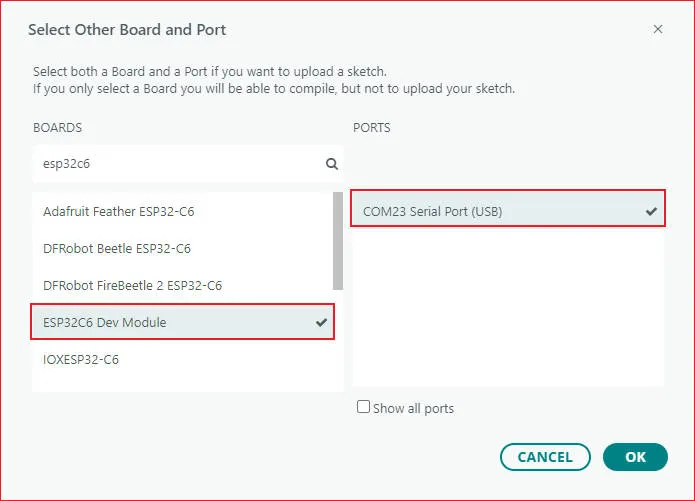</div>

### 01_HelloWorld {#Demo-1-HelloWorld}

#### Demo Description

- This demo demonstrates how to control the SH8601 display using the Arduino GFX library, demonstrating basic graphics library functions through dynamically changing text. This code can also be used to test the basic performance of the display and the random text display effects

#### Hardware Connection

- Connect the development board to the computer

#### Code Analysis

- Display initialization:

  ```cpp
  if (!gfx->begin()) {
     USBSerial.println("gfx->begin() failed!");
  }
  ```

- Clear the screen and display text:

  ```cpp
   gfx->fillScreen(BLACK);
   gfx->setCursor(10, 10);
   gfx->setTextColor(RED);
   gfx->println("Hello World!");
  ```

- Animated display:

  ```cpp
   gfx->setCursor(random(gfx->width()), random(gfx->height()));
   gfx->setTextColor(random(0xffff), random(0xffff));
   gfx->setTextSize(random(6), random(6), random(2));
   gfx->println("Hello World!");
 
  ```

#### Execution Result

<div style={{maxWidth:800}}> 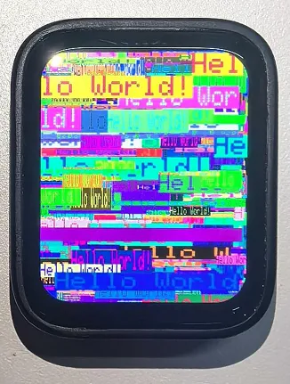</div>

### 02_Drawing_board {#Demo-2-Drawing_board}

#### Demo Description

- This example demonstrates how to use the ESP32 to control the FT3168 touch controller and TCA9554 GPIO expander via the I2C interface, while using the Arduino GFX and Arduino_DriveBus libraries to drive the SH8601 display

#### Hardware Connection

- Connect the development board to the computer

#### Code Analysis

- Display initialization and brightness fade animation:

  ```cpp
   gfx->begin();
   gfx->fillScreen(WHITE);
   for(int i = 0;i <= 255;i++){
      gfx->Display_Brightness(i);
      gfx->setCursor(30, 150);
      gfx->setTextColor(BLUE);
      gfx->setTextSize(4);
      gfx->println("Loading board");
      delay(3);
   }
  ```

- Touch interrupt handling and coordinate reading:

  ```cpp
   gfx->fillScreen(BLACK);
   gfx->setCursor(10, 10);
   gfx->setTextColor(RED);
   gfx->println("Hello World!");
  ```

- Animated display:

  ```cpp
   void Arduino_IIC_Touch_Interrupt(void) {
      FT3168->IIC_Interrupt_Flag = true;
   }

   int32_t touchX = FT3168->IIC_Read_Device_Value(FT3168->Arduino_IIC_Touch::Value_Information::TOUCH_COORDINATE_X);
   int32_t touchY = FT3168->IIC_Read_Device_Value(FT3168->Arduino_IIC_Touch::Value_Information::TOUCH_COORDINATE_Y); 

   if (FT3168->IIC_Interrupt_Flag == true) {
      FT3168->IIC_Interrupt_Flag = false;
      USBSerial.printf("Touch X:%d Y:%d\n", touchX, touchY);
      if (touchX > 20 && touchY > 20) {
         gfx->fillCircle(touchX, touchY, 5, BLUE);
      }
   }
 
  ```

#### Execution Result

<div style={{maxWidth:800}}> 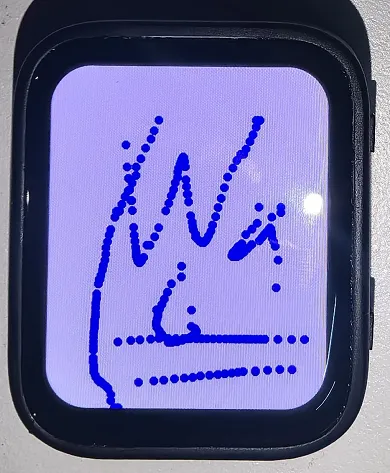</div>

### 03_GFX_AsciiTable {#Demo-3-GFX_AsciiTable}

#### Demo Description

- This demo shows how to display a basic ASCII character table on the SH8601 display by using the Arduino GFX library on an ESP32. The core function of the code is to initialize the display and print ASCII characters in rows and columns according to the screen size

#### Hardware Connection

- Connect the development board to the computer

#### Code Analysis

- Create data bus and graphic display objects<br />
   - Here a data bus object `bus` is created for communicating with the display, initialized with specific pin configurations. Then a graphics display object `gfx` is created, passing parameters such as the data bus, reset pin, rotation angle, whether it is an IPS panel, and the width and height of the display
  ```cpp
   Arduino_DataBus *bus = new Arduino_ESP32QSPI(
      LCD_CS /* CS */, LCD_SCLK /* SCK */, LCD_SDIO0 /* SDIO0 */, LCD_SDIO1 /* SDIO1 */,
      LCD_SDIO2 /* SDIO2 */, LCD_SDIO3 /* SDIO3 */);

   Arduino_GFX *gfx = new Arduino_SH8601(bus, -1 /* RST */,
                                       0 /* rotation */, false /* IPS */, LCD_WIDTH, LCD_HEIGHT);
  ```

- Draw row and column numbers and character table
   - First set the text color to green and print the row numbers one by one on the display. Then set the text color to blue and print the column numbers. Next, use a loop to draw each character individually, forming the character table, with each character using white foreground and black background

  ```cpp
   gfx->setTextColor(GREEN);
   for (int x = 0; x < numRows; x++) {
      gfx->setCursor(10 + x * 8, 2);
      gfx->print(x, 16);
   }
   gfx->setTextColor(BLUE);
   for (int y = 0; y < numCols; y++) {
      gfx->setCursor(2, 12 + y * 10);
      gfx->print(y, 16);
   }

   char c = 0;
   for (int y = 0; y < numRows; y++) {
      for (int x = 0; x < numCols; x++) {
         gfx->drawChar(10 + x * 8, 12 + y * 10, c++, WHITE, BLACK);
      }
   }
  ```

#### Execution Result

<div style={{maxWidth:800}}> 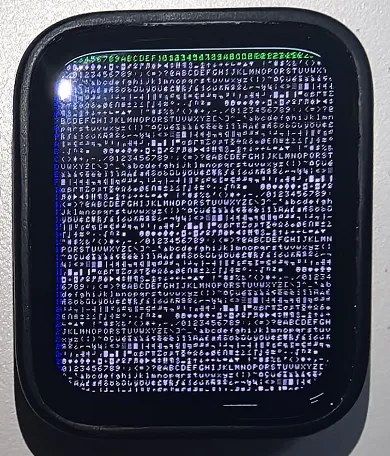</div>


### 04_GFX_FT3168_Image {#Demo-4-GFX_FT3168_Image}

#### Demo Description

- This demo implements a touch screen display interface using the QSPI-driven SH8601 display on an ESP32-S3. It integrates an I2C touch controller (FT3168) for detecting touch input, as well as an I2C GPIO expander (TCA9554) for managing additional output pins. This code sets up the display screen, touch controller, and expander, and cycles through multiple images when the screen is touched

#### Hardware Connection

- Connect the development board to the computer

#### Code Analysis

- Image display:
  ```cpp
   if (fingers_number > 0) {
      switch (Image_Flag) {
         case 0: gfx->draw16bitRGBBitmap(0, 0, (uint16_t *)gImage_1, LCD_WIDTH, LCD_HEIGHT); break;
         case 1: gfx->draw16bitRGBBitmap(0, 0, (uint16_t *)gImage_2, LCD_WIDTH, LCD_HEIGHT); break;
         case 2: gfx->draw16bitRGBBitmap(0, 0, (uint16_t *)gImage_3, LCD_WIDTH, LCD_HEIGHT); break;
         case 3: gfx->draw16bitRGBBitmap(0, 0, (uint16_t *)gImage_4, LCD_WIDTH, LCD_HEIGHT); break;
         case 4: gfx->draw16bitRGBBitmap(0, 0, (uint16_t *)gImage_5, LCD_WIDTH, LCD_HEIGHT); break;
      }
   Image_Flag++;
   if (Image_Flag > 4) {
         Image_Flag = 0;
      }
   }
  ```
#### Code Modification
- The image content resources are large. You need to set: Tools -> Partition Scheme -> 16M Flash (3MB APP/9.9MB FATFS)

#### Execution Result

| <div style={{maxWidth:800}}> 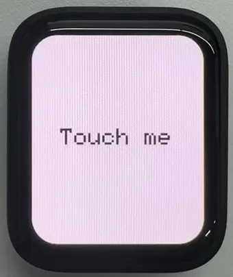</div> | <div style={{maxWidth:340}}> 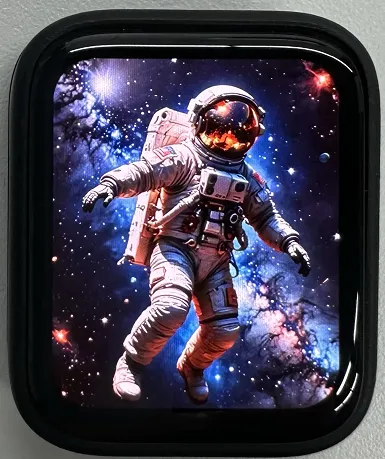</div> | <div style={{maxWidth:800}}> 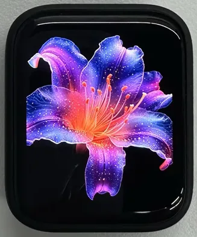</div>
| ---------------------------------------------------------------------------------------------------------------- | ---------------------------------------------------------------------------------------------------------------- | ---------------------------------------------------------------------------------------------------------------- |

### 05_GFX_PCF85063_simpleTime {#Demo-5-GFX_PCF85063_simpleTime}

#### Demo Description

- This demo demonstrates how to use the PCF85063 RTC module to display the current time on the SH8601 display. It retrieves the time every second and updates the display only when the time changes

#### Hardware Connection

- Connect the development board to the computer

#### Code Analysis

- setup: Performs demo initialization settings
   - Initializes the serial port to provide a channel for outputting error messages
   - Initializes the real-time clock chip, including connection checks and setting the initial time to ensure time accuracy
   - Initializes the graphics display device, sets the background color and brightness, providing a visual interface for time display

- loop: Continuously checks for time changes and updates the time display on the screen during program execution
   - Periodically checks if the time has changed by comparing the difference between the current time and the last updated time to determine if an update is needed
   - Retrieves time information from the RTC and formats it for correct display on the screen
   - If the time changes, clears the previous time display area, sets text color and size, calculates the centered position, and displays the new time on the screen. Finally saves the current time as the previous time for the next comparison


#### Execution Result

<div style={{maxWidth:1000}}> 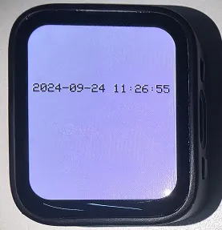</div>

### 06_GFX_ESPWiFiAnalyzer {#Demo-6-GFX_ESPWiFiAnalyzer}

#### Demo Description

- This demo demonstrates drawing WiFi band signal strength on the SH8601 display, implementing the function of a WiFi analyzer

#### Hardware Connection

- Connect the development board to the computer

#### Code Analysis

- setup: Prepares for the initialization of the entire program
   - Initializes serial port communication, sets the baud rate to 115200 for outputting information and debugging
   - Sets WiFi to station mode and disconnects, preparing for subsequent network scanning
   - Performs some additional pre-initialization operations based on different hardware conditions (if GFX_EXTRA_PRE_INIT is defined)
   - Initializes the graphic display device, calculates some display-related parameters such as text size, banner height, etc., and sets the display brightness. Finally draws the initial banner information

- loop: Executes the main program logic, including performing WiFi network scanning, processing scan results, drawing charts and displaying statistical information, and performing power-saving operations as needed
   - WiFi scanning and processing: Performs WiFi network scanning, obtains the number of networks and various network information; counts the number of access points per channel, calculates noise levels and determines signal peaks; draws WiFi signal strength charts based on scan results, including drawing ellipses representing signal strength and displaying related network information
   - Displaying statistical information: Prints the number of networks found and information about channels with less noise on the display, draws chart baselines and channel markers, and displays the number of access points per channel
   - Power-saving operations: Based on the configured number of scans, performs power-saving operations when conditions are met, such as turning off the display power pin and entering deep sleep mode


#### Execution Result

<div style={{maxWidth:800}}> 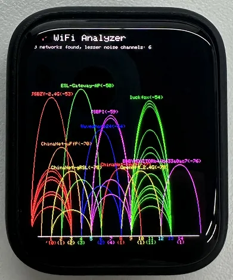</div>

### 07_GFX_Clock {#Demo-7-GFX_Clock}

#### Demo Description

- This demo demonstrates a simple SH8601 clock, implementing a clock example using simple marker pointers and time management

#### Hardware Connection

- Connect the development board to the computer

#### Code Analysis

- Drawing hour, minute, and second hands:
  ```cpp
   void redraw_hands_cached_draw_and_erase() {
      gfx->startWrite();
      draw_and_erase_cached_line(center, center, nsx, nsy, SECOND_COLOR, cached_points, sHandLen + 1, false, false);
      draw_and_erase_cached_line(center, center, nhx, nhy, HOUR_COLOR, cached_points + ((sHandLen + 1) * 2), hHandLen + 1, true, false);
      draw_and_erase_cached_line(center, center, nmx, nmy, MINUTE_COLOR, cached_points + ((sHandLen + 1 + hHandLen + 1) * 2), mHandLen + 1, true, true);
      gfx->endWrite();
   }
  ```

#### Execution Result

<div style={{maxWidth:800}}> 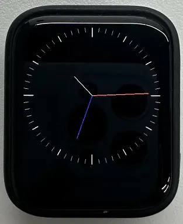</div>

### 08_LVGL_Animation {#Demo-8-LVGL_Animation}

#### Demo Description

- This demo demonstrates a simple LVGL slider example that can change the screen backlight brightness by adjusting the slider value

#### Hardware Connection

- Connect the development board to the computer

#### Code Analysis

- Modify the backlight brightness in real time
  ```cpp
   int32_t slider_value = lv_slider_get_value(ui_Slider1);
   int32_t brightness = map(slider_value, 0, 100, 5, 255);
   gfx->Display_Brightness(brightness);
  ```

#### Execution Result

<div style={{maxWidth:800}}> 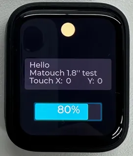</div>

### 09_LVGL_change_background {#Demo-9-LVGL_change_background}

#### Demo Description

- This demo demonstrates an LVGL background brightness/darkness scene change, implementing background color changes by defining simple button components

#### Hardware Connection

- Connect the development board to the computer

#### Code Analysis

- setup: Responsible for the initialization of the entire system
   - First, initializes the serial port for possible debugging output
   - Then initializes the I2C bus and expansion chip, setting the pin modes and initial states of the expansion chip
   - Continuously attempts to initialize the touch controller, setting its power mode upon success
   - Initializes the graphics display device and sets brightness, also prints LVGL and Arduino version information
   - Initializes LVGL, including registering a debug print callback function, initializing display driver and input device driver
   - Creates and starts an LVGL timer, initializes the user interface and prints the setup completion message
- loop
   - In the main loop, continuously calls lv_timer_handler() to let the LVGL graphics library handle various tasks
   - Adds a small delay to avoid excessive CPU resource consumption
- my_touchpad_read: Reads the coordinates of the touchpad, sets the state of LVGL's input device based on touch status, and updates touch coordinates


#### Execution Result

| <div style={{maxWidth:800}}> </div> | <div style={{maxWidth:800}}> 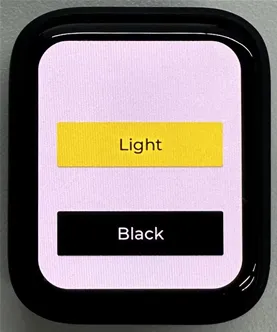</div>
| ---------------------------------------------------------------------------------------------------------------- | ---------------------------------------------------------------------------------------------------------------- | 

### 10_LVGL_PCF85063_simpleTime {#Demo-10-LVGL_PCF85063_simpleTime}

#### Demo Description

- This demo demonstrates using the PCF85063 RTC module to display the current time on the SH8601 display under LVGL. It retrieves the time every second and updates the display only when the time changes, resulting in better time refresh effects

#### Hardware Connection

- Connect the development board to the computer

#### Code Analysis

- setup: Responsible for initializing various hardware devices and the LVGL graphics library environment
   - Serial initialization: USBSerial.begin(115200) prepares for serial debugging
   - Real-time clock initialization: Attempts to initialize the real-time clock rtc. If it fails, enters an infinite loop. Set the date and time
   - Touch controller initialization: Continuously attempts to initialize the touch controller FT3168. If initialization fails, prints an error message and waits with a delay; prints a success message upon success
   - Graphics display initialization: Initializes the graphics display device gfx, sets brightness, and prints LVGL and Arduino version information Then initializes the LVGL, including registering a print callback function for debugging, initializing the display driver and the input device driver. Creates and starts an LVGL timer. Finally creates a label and sets its initial text to "Initializing..."
- loop
   - lv_timer_handler(): This is an important function in the LVGL graphics library, used to handle various timer events, animation updates, input processing, and other tasks for the graphical interface. Calling this function in each loop ensures the graphical interface runs smoothly and responds to interactions promptly
   - Time update and display: Gets the real-time clock time every second and prints it via the serial port. Then formats the time into a string and updates the text of the label to display the current time. Simultaneously sets the font of the label to a specific font. Finally adds a small delay


#### Execution Result

<div style={{maxWidth:800}}> </div>

### 11_LVGL_QMI8658_ui {#Demo-11-LVGL_QMI8658_ui}

#### Demo Description

- This demo demonstrates using LVGL for graphical display, communicating with the QMI8658 IMU to obtain accelerometer and gyroscope data

#### Hardware Connection

- Connect the development board to the computer

#### Code Analysis

- setup: Responsible for initializing various hardware devices and the LVGL graphics library environment
   - Serial initialization: USBSerial.begin(115200) prepares for serial debugging
   - Touch controller initialization: Continuously attempts to initialize the touch controller FT3168. If initialization fails, prints an error message and waits with a delay; prints a success message upon success
   - Graphics display initialization: Initializes the graphics display device gfx, sets brightness, and prints LVGL and Arduino version information Then initializes the LVGL, including registering a print callback function for debugging, initializing the display driver and the input device driver. Creates and starts an LVGL timer. Finally creates a label and sets its initial text to "Initializing..."
   - Creating a chart: Creates a chart object chart, sets chart properties such as type, range, number of data points, etc., and adds data series for the three axes of acceleration
   - Acceleration sensor initialization: Initializes the acceleration sensor qmi, configures accelerometer and gyroscope parameters, enables them, and prints the chip ID and control register information
- loop
   - lv_timer_handler(): This is an important function in the LVGL graphics library, used to handle various timer events, animation updates, input processing, and other tasks for the graphical interface. Calling this function in each loop ensures the graphical interface runs smoothly and responds to interactions promptly
   - Reading acceleration sensor data: If acceleration sensor data is ready, reads acceleration data and prints it via the serial port, while updating the chart to display acceleration data. If the gyroscope data is ready, reads the gyroscope data and prints it via the serial port. Finally adds a small delay to increase data polling frequency


#### Execution Result

<div style={{maxWidth:800}}> 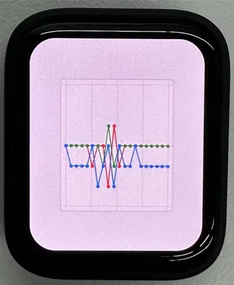</div>

### 12_LVGL_Widgets {#Demo-12-LVGL_Widgets}

#### Demo Description

- This example demonstrates LVGL Widgets. The frame rate can reach 50~60 fps in dynamic states. Optimizing the SH8601 display library can achieve smoother frame rates. This can be compared with scenarios where double buffering and dual acceleration are enabled in the ESP-IDF environment

#### Hardware Connection

- Connect the development board to the computer

#### Code Analysis

- setup: Responsible for initializing various hardware devices and the LVGL graphics library environment
   - Serial initialization: USBSerial.begin(115200) prepares for serial debugging
   - I2C bus Initialization: Wire.begin(IIC_SDA, IIC_SCL); initializes I2C bus for communicating with other I2C devices
   - Expansion chip initialization: Creates and initializes the expansion chip expander, sets pin modes to output, and performs some initial pin state settings
   - Touch controller initialization: Continuously attempts to initialize the touch controller FT3168. If initialization fails, prints an error message and waits with a delay; prints a success message upon success
   - Graphics display initialization: Initializes the graphics display device gfx, sets brightness, and obtains the width and height of the screen. Then initializes LVGL, including registering a print callback function for debugging, setting the touch controller's power mode to monitoring mode, initializing display driver and input device driver. Creates and starts an LVGL timer. Creates a label and sets its text. Finally calls lv_demo_widgets() to showcase LVGL example widgets
- loop
   - lv_timer_handler(): This is an important function in the LVGL graphics library, used to handle various timer events, animation updates, input processing, and other tasks for the graphical interface. Calling this function in each loop ensures the graphical interface runs smoothly and responds to interactions promptly
   - delay(5);: Adds a small delay to avoid excessive CPU resource consumption


#### Execution Result

| <div style={{maxWidth:600}}> 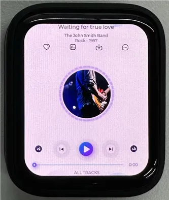</div> | <div style={{maxWidth:600}}> </div>
| ---------------------------------------------------------------------------------------------------------------- | ---------------------------------------------------------------------------------------------------------------- | 

### 13_ES8311 {#Demo-13-ES8311}

#### Demo Description

- This demo demonstrates using I2S to drive the ES8311 chip, playing the converted binary audio file

#### Hardware Connection

- Connect the development board to the computer

#### Code Analysis

- es8311_codec_init: Initializes the ES8311 audio codec.
   - Creates an ES8311 codec handle es_handle
   - Configures ES8311 clock parameters, including master clock and sampling clock frequencies, clock polarity, etc.
   - Initializes the codec, sets audio resolution to 16-bit
   - Configures sampling frequency
   - Configures microphone-related parameters, such as turning off the microphone, setting volume and microphone gain
- setup: Performs overall initialization settings, including serial port, pins, I2S, and the ES8311 codec
   - Initializesserial port for debugging output
   - Sets a specific pin as output and pulls it high
   - Configures the I2S bus, setting pins, operating mode, sample rate, data bit width, channel mode, etc.
   - Initializes the I2C bus
   - Calls the es8311_codec_init function to initialize the ES8311 codec
   - Plays a pre-defined audio data (canon_pcm) via the I2S bus


#### Execution Result

- The device will play auido directly without showing content on the screen

### 14_LVGL_Sqprj {#Demo-14-LVGL_Sqprj}

#### Demo Description

- This demo demonstrates SquareLine UI combined with LVGL. It uses the QMI8658 sensor to achieve adaptive screen display orientation, displays real-time time via WiFi, and changes backlight brightness by detecting touch input in specific areas

#### Hardware Connection

- Connect the development board to the computer

#### Code Analysis

- setup
   - Serial initialization
   - Wi-Fi initialization: Wi-Fi connection and network time configuration
   - I2C communication and expander initialization: Initializes I2C communication bus, specifies SDA and SCL pins, configures multiple pins (pins 0, 1, 2, 6) of the expander
   - Sensor initialization: Initializes the QMI8658 sensor, initializes the touch controller (FT3168 object)
   - Display initialization and related configuration
- loop()
   - Interface rotation processing based on sensor data
   - LVGL graphical interface update
   - Display brightness adjustment processing
   - Interface element value updates

#### Execution Result

- The image content resources are large. You need to set: Tools -> Partition Scheme -> 16M Flash (3MB APP/9.9MB FATFS)
- Modify to your available WiFi

<div style={{maxWidth:800}}> 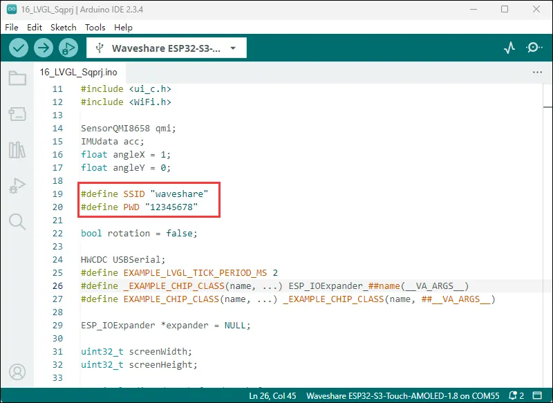</div>

#### Execution Result

<div style={{maxWidth:800}}> 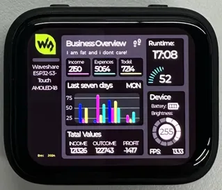</div>