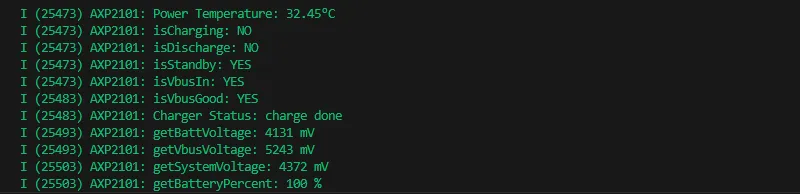
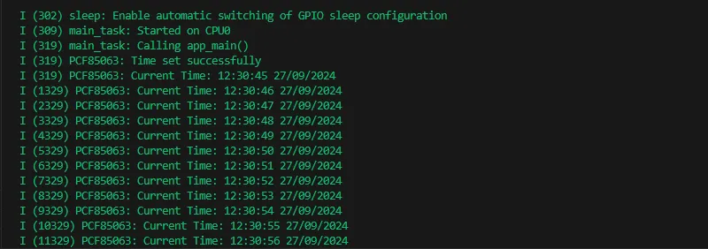
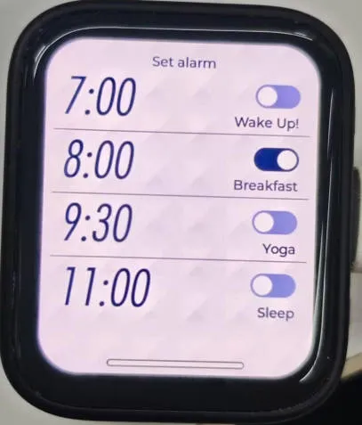
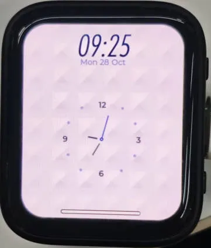
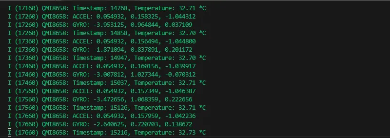
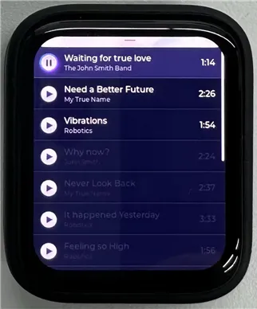

# Working with ESP-IDF

This chapter includes the following sections, please read as needed:

- [Setting Up Development Environment](#esp-idf-setup)
- [Demo](#demo)

## Setting up the Development Environment{#esp-idf-setup}

:::info
For the ESP32-C6-Touch-AMOLED-1.8 development board, it is recommended to use ESP-IDF V5.5.0 or higher.
:::

import EspidfSetup from '@site/docs/ESP32/snippets/EspidfSetup.mdx';

<EspidfSetup />

## Demo

The ESP-IDF demos are located in the `ESP-IDF` directory of the [demo package](https://github.com/waveshareteam/ESP32-C6-Touch-AMOLED-1.8/tree/main/examples).

|                            Demo                             |                               Basic Description                               |
| :-------------------------------------------------------------: | :----------------------------------------------------------------------: |
|  [01_AXP2101](#Demo-1-AXP2101)                              | Drives the AXP2101 PMU using the ported XPowersLib to get power-related data                           |
|  [02_PCF85063](#Demo-2-PCF85063)                          | Drives the PCF85063 RTC for time storage and reading                                          |
|  [03_esp_brookesia](#Demo-3-esp-brookesia)                    | Show a complete mobile-style UI system, including components such as the status bar, navigation bar, app launcher, and gesture interactions |
|  [04_QMI8658](#Demo-4-QMI8658)                        | Drives the QMI8658 IMU using the ported SensorLib to get gyroscope-related data                         |
|  [05_LVGL_WITH_RAM](#Demo-5-LVGL_WITH_RAM)           | Run the LVGL demo by enabling double buffering and DMA acceleration to prevent tearing |

### 01_AXP2101 {#Demo-1-AXP2101}

#### Demo Description

- This demo demonstrates porting XPowersLib in ESP-IDF, and driving AXP2101 to obtain power-related data through the ported XPowersLib

#### Hardware Connection

- Connect the development board to the computer

#### Code Analysis

- i2c_init: Initializes the I2C master to prepare for communication with other devices (like the PMU)
    - Configures I2C parameters, including setting the master device mode, specifying the SDA and SCL pins, enabling the pull-up resistor, and determining the clock frequency
    - Installs the I2C driver and apply the configuration to the actual hardware
- pmu_register_read: Reads a series of bytes of data from a specific register on the PMU
    - Performs parameter checks to ensure the incoming parameters are valid and avoid invalid read operations
    - Performs I2C operations in two steps, first sends the register address to read, then reads the data. During the reading process, different processing is carried out according to the length of bytes to be read to ensure accurate reading of the data. At the same time, handles error cases in the I2C communication process and returns the corresponding status code so that the upper-layer code can determine if the read operation is successful

#### Expected Result

- This demo will not light up the screen
- The serial port monitor displays the parameters: chip temperature, charging state, discharging state, standby state, Vbus connection, Vbus condition, charger status, battery voltage, Vbus voltage, system voltage, battery percentage

 

### 02_PCF85063 {#Demo-2-PCF85063}

#### Demo Description

- This demo uses a simple way to drive the PCF85063 for time storage and reading functionality

#### Hardware Connection

- Connect the development board to the computer

#### Code Analysis

- i2c_master_init
    - Defines the I2C configuration structure conf, set the master device mode, SDA and SCL pins, pull-up resistor, and clock frequency
    - Uses the i2c_param_config function to configure I2C parameters. If the configuration fails, an error log is recorded and an error code is returned
    - Uses the i2c_driver_install function to install the I2C driver, apply the configuration to the actual hardware, and return the result
- rtc_get_time
    - Defines a 7-byte array to store the read time data
    - Calls the rtc_read_reg function to read 7 bytes of time data starting from the specific register address (0x04) of the RTC chip. If the reading fails, an error log is recorded and an error code is returned
    - Processes the time data read, separately extract the seconds, minutes, hours, days, weeks, months, and years, and convert BCD to decimal
    - Uses ESP_LOGI to output the formatted current time

#### Expected Result

- This demo will not light up the screen
- The serial port monitor prints time information

 

### 03_esp_brookesia {#Demo-3-esp-brookesia}

#### Demo Description

- This example showcases a complete mobile-style UI system. It includes components like a status bar, navigation bar, app launcher, and gesture interactions.

#### Hardware Connection

- Connect the development board to the computer

#### Expected Result

| 
 
 | 
 
 | 
 
 
| ---------------------------------------------------------------------------------------------------------------- | ---------------------------------------------------------------------------------------------------------------- | ---------------------------------------------------------------------------------------------------------------- | 

### 04_QMI8658 {#Demo-4-QMI8658}

#### Demo Description

- This demo demonstrates porting SensorLib in ESP-IDF, then using the ported SensorLib to drive qmi8658 to obtain gyroscope-related data

#### Hardware Connection

- Connect the development board to the computer

#### Code Analysis

- setup_sensor: Sets up and initializes the environment and parameters required to communicate with the QMI8658 sensor
    - Initializes I2C communication to ensure that the connection channel to the sensor is established
    - Initializes the sensor, check if the sensor is properly connected
    - Configures the sensor's accelerometer and gyroscope parameters to meet specific application needs
    - Enables the sensor to start collecting data
- read_sensor_data: Reads and processes data from the QMI8658 sensor in a continuous loop and outputs the results
    - In the loop, continuously checks if the sensor data is ready
    - When the data is ready, the accelerometer, gyroscope, timestamp, and temperature data are read and logged out
    - Handles the failure of data reading by recording an error log for troubleshooting
    - Controls the execution speed of the loop through delay to avoid excessive consumption of system resources

#### Expected Result

- This demo will not light up the screen
- The serial port monitor prints sensor data

 

### 05_LVGL_WITH_RAM {#Demo-5-LVGL_WITH_RAM}

#### Demo Description

- This example shows LVGL demo, which can run LVGL demo by enabling dual caching, enabling DMA acceleration and anti-tearing, etc. to run dynamic graphics and texts smoothly, achieving a frame rate of 200-300 FPS

#### Hardware Connection

- Connect the development board to the computer

#### Code Analysis

- app_main: The initialization and startup process of the entire application
    - Hardware initialization: Configures and initializes hardware devices related to LCD display and touch input (if available), such as GPIO pins, SPI bus, I2C bus, LCD panel driver, and touch controller driver, etc.
    - LVGL initialization: Initializes the LVGL library, allocates drawing buffers, registers display driver and touch input device driver (if available), installs timers, and creates smutexes and starts LVGL tasks
    - Example display: Finally shows LVGL examples, such as widget examples, etc.
- example_lvgl_port_task: LVGL task function, responsible for handling LVGL regular updates and task delay control, ensuring the smooth operation of the LVGL interface
    - Timed update: In its loop, it grabs a mutex lock and calls the lv_timer_handler to handle the LVGL timer event, which updates the UI state
    - Delay control: Determine the task's delay time based on the results of timer processing to avoid excessive CPU resource usage and ensure timely response to LVGL events

#### Expected Result

| 
 
 | 
 

| ---------------------------------------------------------------------------------------------------------------- | ---------------------------------------------------------------------------------------------------------------- | 