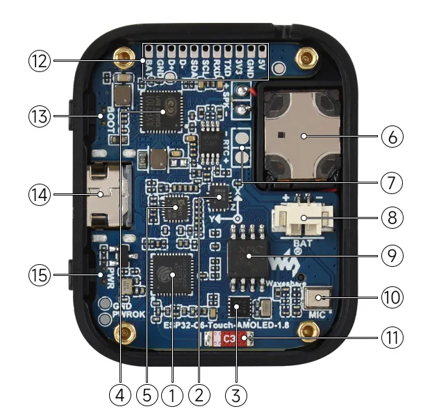
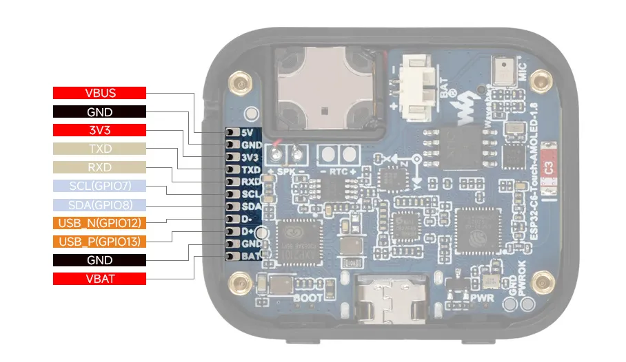
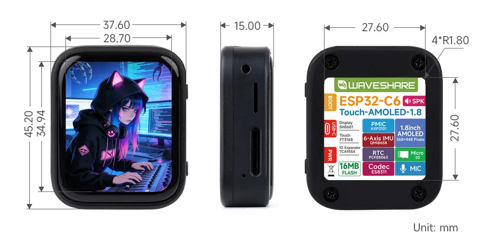

<!-- Image Reference -->

# ESP32-C6-Touch-AMOLED-1.8

 

The ESP32-C6-Touch-AMOLED-1.8 is a high-performance, highly integrated microcontroller development board designed by Waveshare. It is equipped with a 1.8inch capacitive high-definition AMOLED screen, a highly integrated Power Management Unit (PMU), a 6-axis IMU (3-axis accelerometer and 3-axis gyroscope), a RTC, a low-power audio codec chip and other peripherals in a smaller board size, which are convenient for development and embedding into the product.

| SKU | Product | 
| --- | --- | 
| 33305 | ESP32-C6-Touch-AMOLED-1.8 |
| 33366 | ESP32-C6-Touch-AMOLED-1.8-EN |

## Features

- Equipped with ESP32-C6 high-performance 32-bit RISC-V processor, up to 160MHz operating frequency
- Supports Wi-Fi 6, Bluetooth 5, and IEEE 802.15.4 (Zigbee 3.0 and Thread) wireless communication with excellent RF performance and onboard antenna
- Onboard 512KB HP Static RAM, 16KB LP Static RAM, 320KB ROM and external 16MB Flash memory
- Adopts Type-C interface to improve user convenience and device compatibility
- Onboard 1.8inch capacitive touch HD AMOLED display for clear color picture display, 368 × 448 resolution, 16.7M color
- Built-in SH8601 display driver and FT3168 / FT6146 capacitive touch chip, using QSPI and I2C communication respectively, effectively saving the IO resources
- Onboard QMI8658 6-axis IMU (3-axis accelerometer and 3-axis gyroscope)
- Onboard PCF85063 RTC chip, powered by Lithium Batt through AXP2101 chip for uninterrupted power supply, with reserved RTC Batt pads for connecting a backup Batt, ensuring RTC function during the replacement of the main battery
- Onboard PWR and BOOT programmable buttons for easy custom function development
- Onboard 3.7V MX1.25 lithium battery recharge/discharge header
- Adapting 1-ch I2C, 1-ch USB and 1-ch UART pads for external devices connection and debugging, enabling flexible peripheral configuration
- Onboard TF card slot for expanded storage, fast data transfer, and transfer flexibility, suitable for applications such as data recording and media playback, simplifying circuit design
- Adopts AXP2101 IC for efficient power management, supports multiple voltage outputs, battery charging, battery management, and battery life optimization, etc.
- Adopts AMOLED screen, featuring advantages of high contrast, wide viewing angle, rich colors, fast response, thinner design, and low power consumption, flexibility, etc.

## Onboard Resources

 
    

1. **ESP32-C6** Supports Wi-Fi and Bluetooth SoC, with a 160MHz operating frequency
2. **QMI8658** 6-axis IMU includes a 3-axis gyroscope and a 3-axis accelerometer
3. **PCF85063** RTC chip
4. **AXP2101** Highly integrated power management IC
5. **ES8311** Low power audio codec IC
6. **Speaker** Onboard speaker output
7. **Backup Batt pads** Maintains RTC power supply during main battery replacement
8. **MX1.25 Lithium Batt header** MX1.25 2PIN connector, for 3.7V Lithium Batt (optional), supports charging and discharging. (To fit inside the case, a Batt size of 3.85 × 24 × 28 mm is recommended)
9. **16MB NOR-Flash** For storing data
10. **Microphone** For audio capture
11. **Onboard antenna** Supports 2.4GHz Wi-Fi (802.11 b/g/n) and Bluetooth 5 (LE)
12. **Reserved GPIO pads (pitch 1.5mm)** Adapting available I/O function pins for easy expansion
13. **BOOT button** For device startup and function debugging
14. **USB Type-C port** ESP32-C6 USB interface, for program flashing and log printing
15. **PWM button** For system power supply ON/OFF, supports custom functions

## Pinout Definition

 
    

## Dimensions

 
    

## Development Methods

The ESP32-C6-Touch-AMOLED-1.8 supports two development frameworks: Arduino IDE and ESP-IDF, providing flexibility for developers to choose the tool that best fits their project requirements and personal preference.

Each method has its advantages, and developers can select based on their needs and skill level. Arduino is simple to learn and easy to get started with, suitable for beginners and non-professionals; ESP-IDF provides more advanced development tools and stronger control capabilities, suitable for developers with professional backgrounds or those with higher performance requirements, and is more suitable for complex project development.

- **Arduino IDE** is a convenient, flexible, and easy-to-use open-source electronics prototyping platform. It requires minimal foundational knowledge, allowing for rapid development after a short learning period. Arduino has a vast global community that provides a wealth of open-source code, project examples, tutorials, and rich libraries that encapsulate complex functionalities, enabling developers to implement various features quickly. You can refer to the **[Working with Arduino](./Arduino.md)** to complete the initial setup, and the tutorial also provides related demos for reference.

- **ESP-IDF** (Espressif IoT Development Framework) is a professional development framework released by Espressif for its ESP series chips. It is developed based on the C language, including a compiler, debugger, and flashing tool, etc. It supports development via command line or an Integrated Development Environment (such as Visual Studio Code with the Espressif IDF plugin), which provides features like code navigation, project management, and debugging, etc. We recommend using VS Code for development. For the specific configuration process, please refer to the **[Working with ESP-IDF](./ESP-IDF.md)**. The tutorial also provides relevant demos for reference.