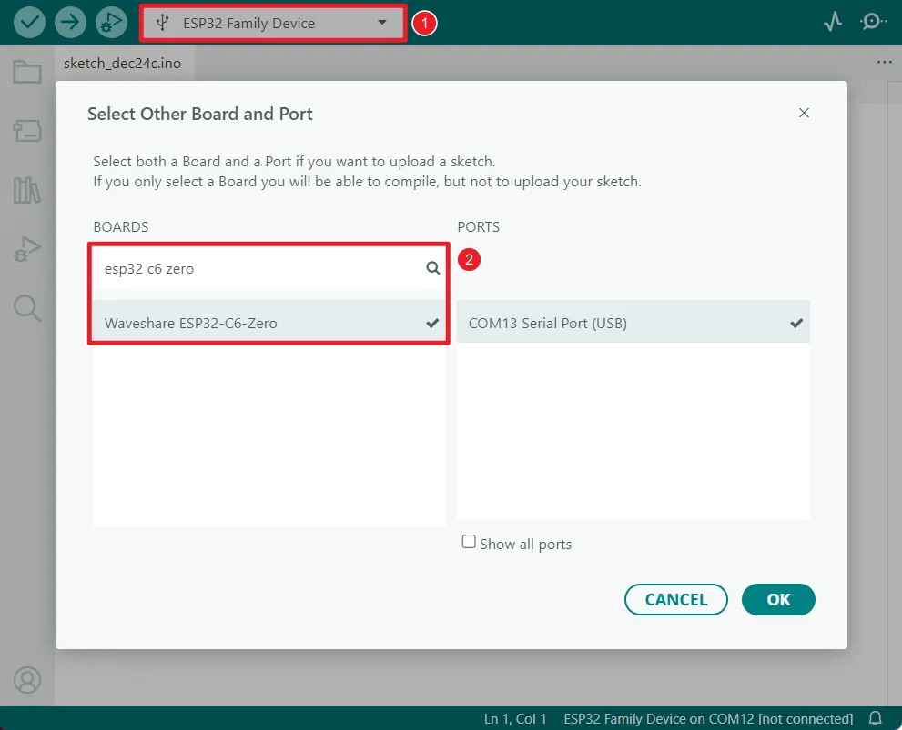
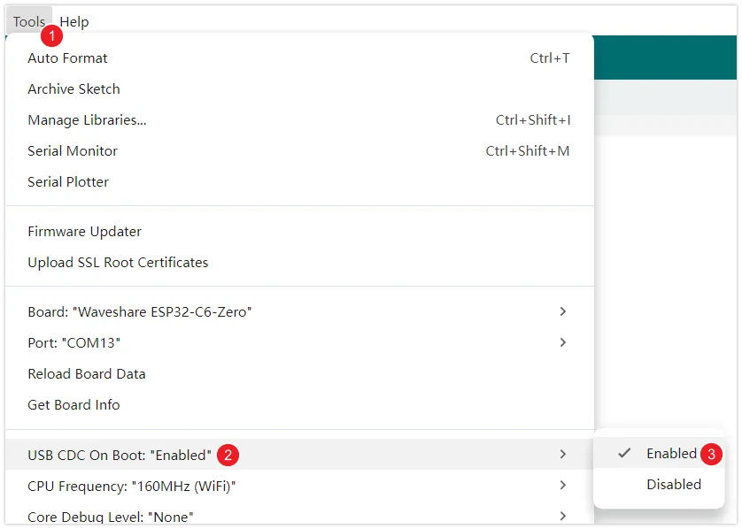

import ArduinoTutorialIntro from '@site/docs/ESP32/snippets/ArduinoTutorialIntro.mdx';

# Arduino

This chapter includes the following sections. Please read as needed:

- [Arduino Tutorial](#arduino-tutorial-for-beginners)
- [Configuring the Development Environment](#configuring-the-development-environment)

<ArduinoTutorialIntro />

## Configuring the Development Environment

### 1. Installing and Configuring Arduino IDE

Please refer to the **[Arduino IDE Setup Tutorial](/docs/ESP32/Tutorials/Arduino-Tutorials/01-Arduino-IDE-Setup.md)** to download and install the Arduino IDE and add ESP32 support.

### 2. Other Tips

1. The ESP32-C6-Zero supports direct model selection in the Arduino IDE. Select "Waveshare ESP32-C6-Zero".

   
 

2. The ESP32-C6-Zero uses the ESP32-C6 native USB interface, not a UART-to-USB bridge. For serial communication:

   - The `printf()` function can be used directly;

   - To use the `Serial.println()` function, you need to enable the USB CDC feature. Please follow the steps below to check and confirm that your environment configuration is correct:

     1. Update ESP32 Library: It is recommended to update the ESP32 board library in the Arduino IDE to version **3.3.5 or higher**. Newer versions of the library have enabled the USB CDC feature for this board by default.

     2. Check Configuration Options: In the Arduino IDE "Tools" menu, check and confirm that the "USB CDC On Boot" option is set to "Enabled".

        :::note
        As shown in the figure below, the "USB CDC On Boot" option should be `Enabled` under the correct configuration.
   
        
 

   
        :::