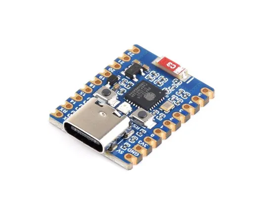
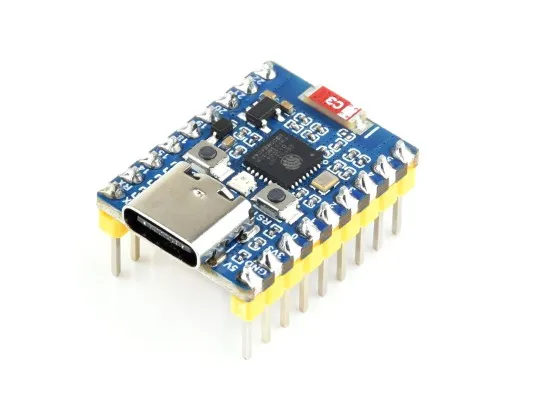
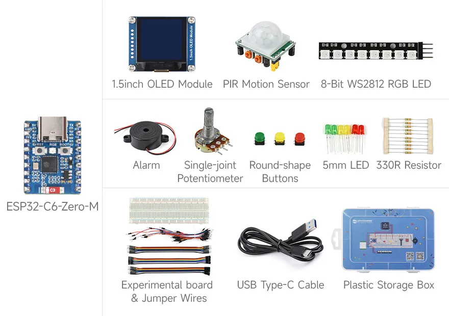
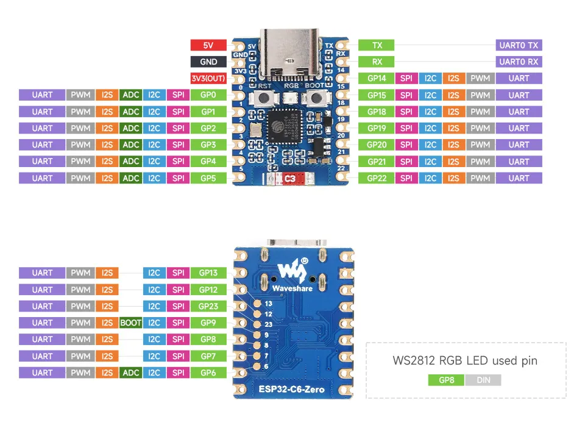
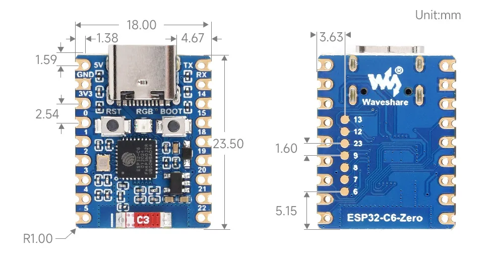

# ESP32-C6-Zero

:::info New and Upgraded
You are browsing the new documentation. If you are more familiar with the old version, you can still access the **[legacy page](https://www.waveshare.com/wiki/ESP32-C6-Zero)**.
:::

import Tabs from '@theme/Tabs';
import TabItem from '@theme/TabItem';

<Tabs queryString="variant">
  <TabItem value="ESP32-C6-Zero" label="ESP32-C6-Zero (Without header)">
    
 

  </TabItem>
  <TabItem value="ESP32-C6-Zero-M" label="ESP32-C6-Zero-M (With pre-soldered header)">
    
 

  </TabItem>
  <TabItem value="ESP32-C6-Zero-Basic-Kit" label="ESP32-C6-Zero-Basic-Kit">
    
 

  </TabItem>
</Tabs>

The ESP32-C6-Zero is a compact microcontroller development board integrated with multiple digital interfaces.

In terms of hardware, it adopts the ESP32-C6FH8 chip, equipped with a RISC-V 32-bit high-performance processor (HP Core) running at up to 160 MHz, and a 32-bit low-power coprocessor (LP Core) running at up to 20 MHz. The chip features built-in 8MB Flash, 320KB ROM, 512KB HP SRAM, and 16KB LP SRAM, allowing for convenient expansion of various peripherals.In terms of software, it supports development with the ESP-IDF environment or Arduino IDE, facilitating a quick start and application in actual products.

The [ESP32-C6-Zero-Basic-Kit (Basic Kit)](./?variant=ESP32-C6-Zero-Basic-Kit) includes the [ESP32-C6-Zero-M](https://www.waveshare.com/esp32-c6-zero.htm?sku=26976) and the [ESP32-XX-Basic-Kit-Acce kit](https://www.waveshare.com/esp32-xx-basic-kit.htm?sku=33355), equipped with a breadboard, wires, LEDs, resistors, a [1.5-inch OLED](https://www.waveshare.com/1.5inch-oled-module.htm), and other modules. It provides the core hardware needed to learn the [Waveshare ESP32 Arduino Tutorial](/docs/ESP32/Tutorials/Arduino-Tutorials/index.md) and [Waveshare ESP32 MicroPython Tutorial](/docs/ESP32/Tutorials/MicroPython-Tutorials/index.md), making it suitable for getting started quickly with Arduino, MicroPython, and ESP-IDF programming. Relevant example programs and wiring diagrams can be downloaded here: [ESP32-C6-Zero-Basic-Kit-main.zip](https://github.com/waveshareteam/ESP32-C6-Zero-Basic-Kit/archive/refs/heads/main.zip) ([GitHub Repository](https://github.com/waveshareteam/ESP32-C6-Zero-Basic-Kit)).

| SKU | Product | 
| --- | --- | 
| 27035 | ESP32-C6-Zero |
| 26976 | ESP32-C6-Zero-M |
| 33357 | ESP32-C6-Zero-Basic-Kit |

## Features

- Equipped with the ESP32-C6FH8 chip, integrating a high-performance and low-power dual-core RISC-V 32-bit processor with main frequencies up to 160MHz and 20MHz respectively.
- Built-in 320KB ROM, 512KB HP SRAM, 16KB LP SRAM, and 4MB Flash memory.
- Integrated Wi-Fi 6, Bluetooth 5, and IEEE 802.15.4 (Zigbee 3.0 and Thread) wireless communication with superior RF performance.
- Adopts USB Type-C interface, supporting reversible connections.
- Rich peripheral interfaces with excellent compatibility and expandability.
- Castellated module design, allowing direct soldering to user carrier boards.
- Supports multiple low-power modes, allowing flexible adjustment of communication distance, data rate, and power consumption balance to suit different application scenarios.

## Block Diagram

## Onboard Resources

1. **ESP32-C6FH8** Equipped with a RISC-V 32-bit single-core processor, up to 160MHz.
2. **USB Type-C Port** Used for program downloading and debugging.
3. **ME6217C33M5G** Low Dropout (LDO) linear regulator, max output current 800mA.
4. **WS2812 RGB LED**
5. **2.4G Ceramic Antenna**
6. **BOOT Button** Press and hold this button while pressing the reset button to enter download mode.
7. **RESET Button**
8. **ESP32-C6FH8 Pin Headers**

## Pinout

## Dimensions

