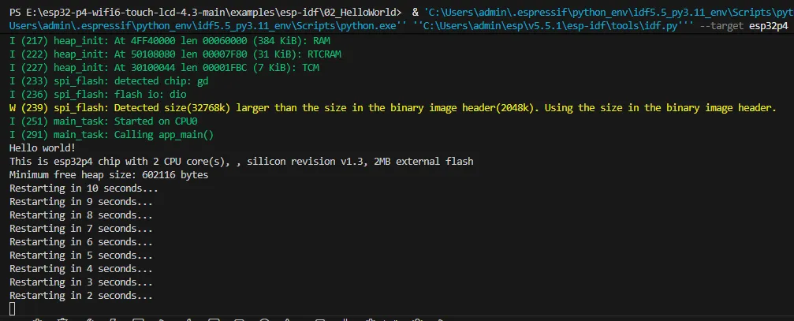
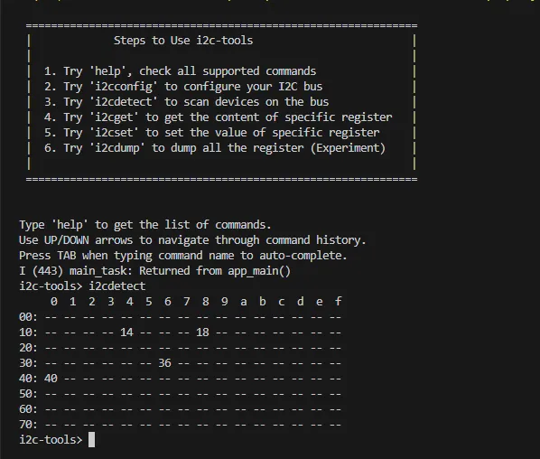
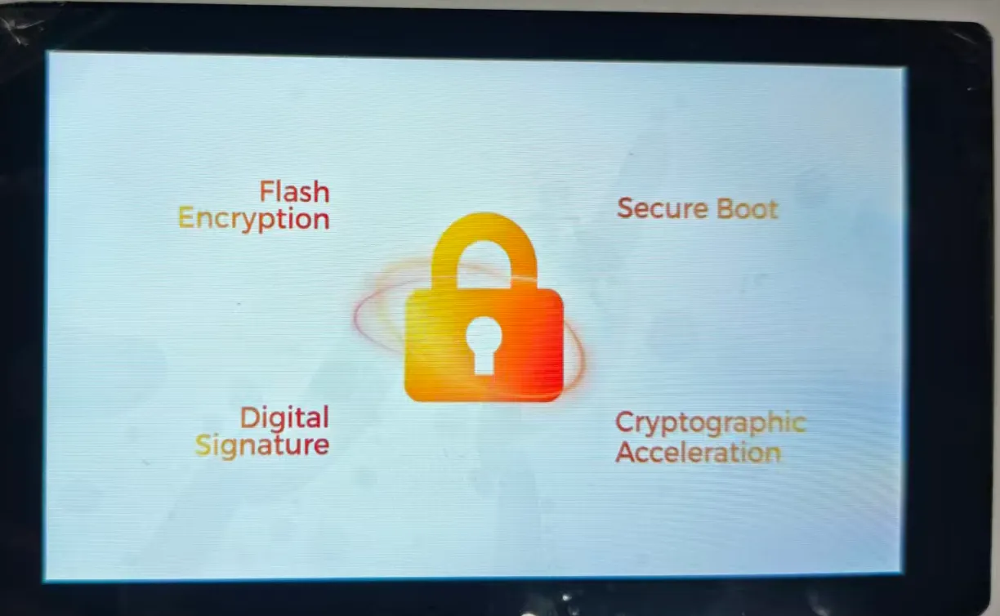
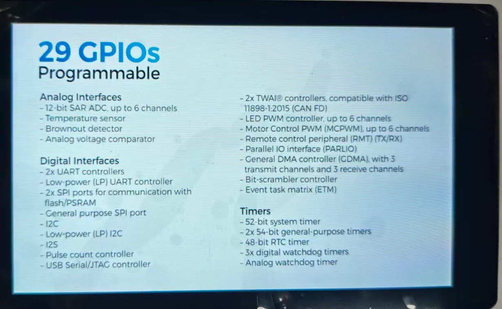
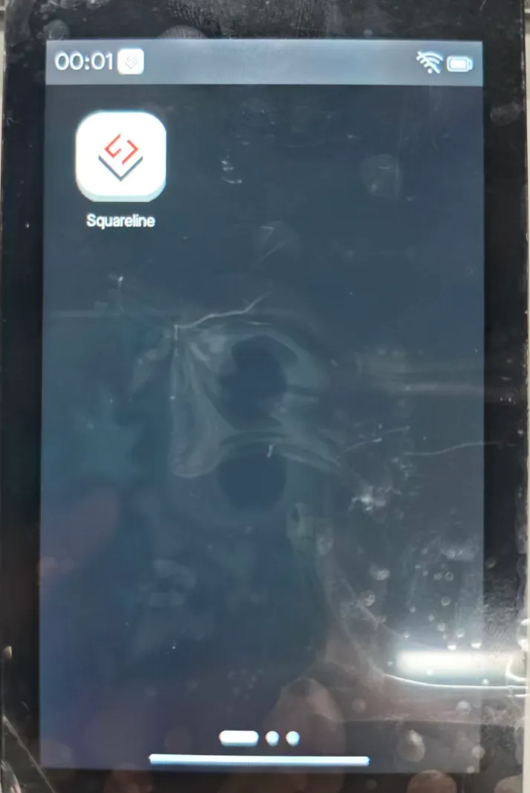
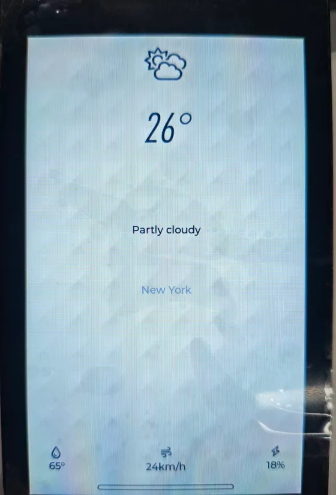
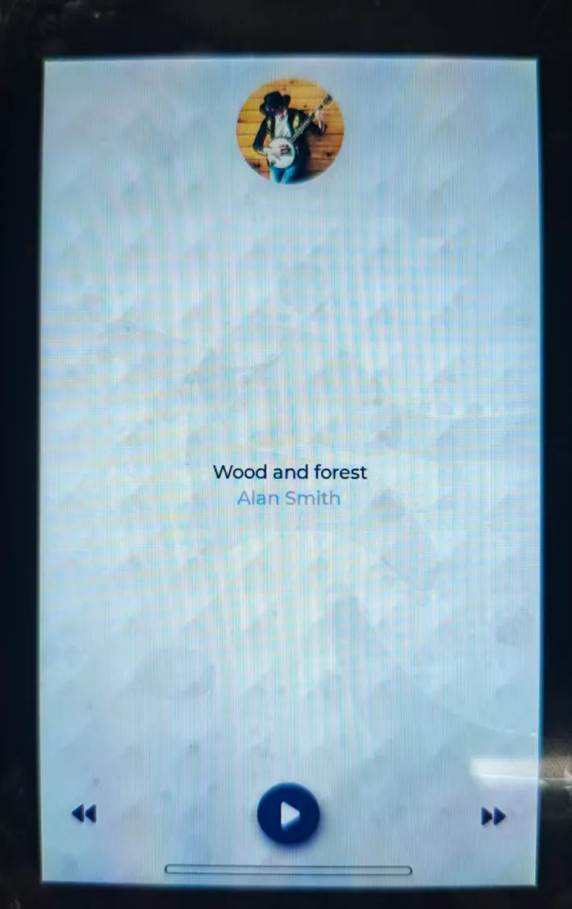
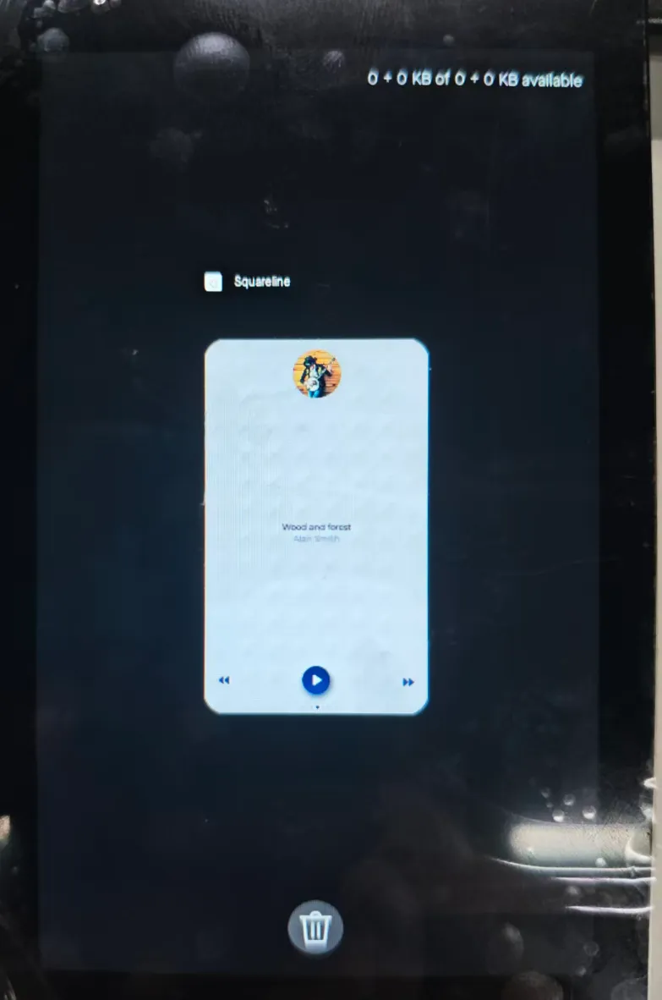

import EspidfTutorialIntro from '@site/docs/ESP32/snippets/EspidfTutorialIntro.mdx';

# Working with ESP-IDF

This chapter includes the following sections, please read as needed:

- [ESP-IDF Getting Started](#esp-idf-getting-started)
- [Setting Up Development Environment](#esp-idf-setup)
- [Demo](#demo)

## ESP-IDF Getting Started {#esp-idf-getting-started}

<EspidfTutorialIntro />

## Setting Up Development Environment]{#esp-idf-setup}

:::info
For the ESP32-P4-WIFI6-Touch-LCD-4.3 development board, it is recommended to use ESP-IDF V5.3.1 or later.
:::

import EspidfSetup from '@site/docs/ESP32/snippets/EspidfSetup.mdx';

<EspidfSetup />

## Demo{#demo}

### 01_HowToCreateProject

- **Project Structure:**
  - Open the ESP-IDF plugin, click New project, select the ESP-IDF demo -- > sample_project  -- > click Create

  - After creation and opening in a new window, you can view the VS Code structure as follows:

    ```
    ├── CMakeLists.txt
    ├── main
    │   ├── CMakeLists.txt
    │   └── main.c
    └── README.md
    ```

- **ESP-IDF Project Details:**
  - Component: In ESP-IDF, components are the basic building blocks of an application. Each component is typically a relatively independent codebase or library that implements specific functions or services and can be reused by the application or other components, similar to the concept of libraries in Python development.
    - Referencing Components: In the Python development environment, importing a library only requires "import library name or path". However, ESP-IDF is based on C language, and importing libraries is configured and defined through CMakeLists.txt.
    - When using online components, we typically use `idf.py add-dependency <componetsName>` to add an online component to the project, which generates an `idf_component.yml` file for managing components.
    - Role of CmakeLists.txt: During ESP-IDF compilation, the CMake tool first reads the build rules by reading the content of the top-level CMakeLists.txt in the project directory, identifying what needs to be compiled. When the required components and demos are imported into the CMakeLists.txt, the compilation tool CMake will import everything that needs to be compiled according to the index. The compilation process is as follows:

      

- **Description of VS Code User Interface Bottom Toolbar:**

  When opening an ESP-IDF project, the environment will be loaded automatically at the bottom. For the development of ESP32-P4-WIFI6-Touch-LCD-4.3, the bottom toolbar is very important, as shown in the figure:

  
  - **①. ESP-IDF Development Environment Version Manager**: When our project needs to distinguish between different development environment versions, we can manage them separately by installing different versions of ESP-IDF. When a project uses a specific version, you can switch using this manager
  - **②. Device Flash COM port**: Select the COM port to flash the compiled program into the chip
  - **③. Select set-target Chip Model**: Select the corresponding chip model. For example, for the ESP32-P4-WIFI6-Touch-LCD-4.3, you need to select esp32p4 as the target chip
  - **④. menuconfig**: Click it to modify sdkconfig configuration file
  - **⑤. fullclean Button**: When a project compilation error or other operations pollute the compilation content, click to clean all compilation content
  - **⑥. Build Project**: When a project meets the build requirements, use this button to compile
  - **⑦. flash button**: When a project Build passes, select the corresponding board COM port and click this button to flash the compiled firmware to the chip
  - **⑧. monitor**: Start flash port monitoring. After a project Build -> Flash, you can click this button to view the log output from the flash/debug port to observe whether the application is working correctly
  - **⑨. Build Flash Monitor One-click Button**: Used to sequentially execute Build -> Flash -> Monitor, often referred to as "Little Flame”

### 02_HelloWorld

After understanding the explanation of the VS Code user interface bottom toolbar, the Hello World project allows for a quick start and understanding of the basic project structure of the ESP32 development environment. It demonstrates how to use ESP-IDF to create a basic application and covers the ESP32 development process, including compilation, flashing, and monitor debugging steps.

1. After opening the example project `HelloWorld`, set the target port and chip type (Note: when selecting the chip type, there is a loading action in the lower right corner. This is ESP-IDF executing the `idf.py set-target esp32p4` operation command. It needs to pull the architecture package environment for the corresponding chip from the package manager, which takes some time. Please be patient. If you click build or other operations at this time, errors will occur!!!)

2. By using the bottom tool <kbd>🔥</kbd> to build, burn, and monitor with just one click. You can see the terminal output "Hello World!".

3. Code content analysis
   1. There is only one `app_main` main function in the code, which determines the print content output through conditional judgment, and adds a loop at the end to achieve 10s restart of the chip.
   2. The `app_main` function is the entry point for user applications in the ESP-IDF (Espressif IoT Development Framework) development framework. It is the core function of an ESP-IDF project, equivalent to the main function in a standard C program. In ESP32 development, the `app_main` function is the first task scheduled by the Real-Time Operating System (FreeRTOS), marking the starting point for user code execution.

4. Code Effect
   <div style={{maxWidth:750}}>
   
   </div>

### 03_i2c_tools

I2C is a commonly used serial communication bus, which can communicate through two lines, one data cable (SDA, Serial Data) and one clock cable (SCL, Serial Clock), and supports multi-master and multi-slave mode. The ESP32-P4 chip features two I2C bus interfaces. Internally, the GPIO switch matrix allows these interfaces to be configured to use any GPIO pin. This flexibility enables users to freely assign any GPIO as I2C pins. Additionally, the ESP32-P4 I2C supports both slave and master modes. The following section focuses on the I2C master mode, which is used by the ESP32-P4 to initiate communication, control, and send data requests to or receive data from slave devices (such as any I2C‑compatible sensor). The I2C pins on the ESP32-P4-WIFI6-Touch-LCD-4.3 default to `SCL(GPIO8)` and `SDA(GPIO7)`.


In ESP-IDF, the I2C bus must be configured using the `i2c_master_bus_config_t`:

- `i2c_master_bus_config_t::clk_source` selects the source clock for the I2C bus. To use the default I2C clock source (which is typically recommended), set it to I2C_CLK_SRC_DEFAULT.
- `i2c_master_bus_config_t::i2c_port` sets the I2C port to be used by the controller. As mentioned above, the ESP32-P4 has two I2C ports. When two different I2C buses need to be enabled simultaneously, this is used to distinguish them.
- `i2c_master_bus_config_t::scl_io_num` sets the GPIO number for the Serial Clock Line (SCL). On the ESP32-P4-WIFI6-Touch-LCD-4.3, this is 8.
- `i2c_master_bus_config_t::sda_io_num` sets the GPIO number for the Serial Data Line (SDA). On the ESP32-P4-WIFI6-Touch-LCD-4.3, this is 7.
- `i2c_master_bus_config_t::glitch_ignore_cnt` sets the Glitch Period for the Master Bus. If the glitch period on the line is less than this value, it can be filtered out. The typical value is 7.
- `i2c_master_bus_config_t::enable_internal_pullup` enables internal pullups. On the ESP32-P4-WIFI6-Touch-LCD-4.3, there are already external I2C pullups, so internal pullups do not need to be enabled.

Based on the above, the I2C configuration is defined as follows:

```C
   i2c_master_bus_config_t i2c_bus_config = {
       .clk_source = I2C_CLK_SRC_DEFAULT,
       .i2c_port = I2C_NUM_0,
       .scl_io_num = 8,
       .sda_io_num = 7,
       .glitch_ignore_cnt = 7,
       .flags.enable_internal_pullup = false,
   };
```

1. Open the `i2c_tools` project, select the correct COM port and chip model, then click the <kbd>⚙️</kbd> to enter the settings. This will open a new tab: **SDK Configuration editor**, also known as menuconfig. Directly search for "I2C” in the search bar. You will see the relevant retrieved content, and the SCL GPIO Num and SDA GPIO Num in the example code should already correspond to `SCL(GPIO8)` and `SDA(GPIO7)`.
2. Next, you can directly compile, flash, and monitor by clicking <kbd>🔥</kbd>. After completion, a command menu will appear in the terminal. When you execute i2cdetect, all I2C addresses will be printed. If a device exists, a number will be displayed, as shown in the figure:

   

3. The above steps have already implemented the foundation for I2C device communication. In devices that use the I2C communication protocol, it is often necessary to write register configurations to the device at the corresponding address via the I2C bus to enable the I2C device's functions. At this point, we need to write the initialization program for the I2C device in the code to drive it. Different I2C devices have different I2C addresses. During development, we can use the i2ctools tool to query the I2C address of the connected device, then read its chip manual to find the registers, configurations, etc., to implement I2C bus communication.

### 04_wifistation

The ESP32-P4 itself does not have Wi-Fi/BT functionality. However, the ESP32-P4-WIFI6-Touch-LCD-4.3 expands Wi-Fi functionality by connecting an ESP32-C6 module via SDIO. The ESP32-C6 acts as a Slave, and through a series of instruction sets, it enables the ESP32-P4 (Host) to use Wi-Fi 6/BT 5 functions via SDIO. After adding two components, you can seamlessly use `esp_wifi`.

```C
// In a Wi-Fi project, add the following two components using the ESP-IDF component manager
// Depending on component updates, different versions might be required. Refer to actual testing for specifics
idf.py add-dependency espressif/esp_wifi_remote==0.14.*
idf.py add-dependency espressif/esp_hosted==1.4.*
```

1. Open the `wifistation` project and proceed to add the required components.

   

2. As shown in the figure above, these are the specific steps for adding components:
   1. Open the ESP-IDF Terminal.
   2. Add the required components in the Terminal.
   3. After successful addition, an `idf_component.yml` file will appear in the main folder of the project. As explained in the ESP‑IDF project directory section, this file is used to manage project components.
   4. Opening this file, it can be seen that two components have been added: `espressif/esp_hosted: "1.4.*"` and `espressif/esp_wifi_remote: "0.14.*"`. These components will be included in the project during the build process.

3. Next, click the <kbd>⚙️</kbd> to open the settings. Search for Example and set the **ssid** and **password** of the Wi-Fi you want to connect to. **Note: The ESP32‑C6 supports 2.4 GHz Wi‑Fi 6. When selecting the target Wi-Fi, ensure the frequency is 2.4GHz. **After modifying the settings, remember to save them; otherwise, errors may occur.

   

4. Next, you can directly compile, flash, and monitor by clicking <kbd>🔥</kbd>. After completion, you will see the following result in the terminal, indicating that the ESP32-P4-WIFI6-Touch-LCD-4.3 has successfully connected to Wi-Fi and is online:

   [Wi-Fi Networking Example Output](https://www.waveshare.net/w/upload/d/db/ESP32-P4-Nano-WiFistation_240907_03.png)

### 05_sdmmc

The ESP32-P4-WIFI6-Touch-LCD-4.3 features an onboard 4-Wire SDIO3.0 card slot, allowing for external storage expansion

- **Supported Rate Modes**
  - Default rate (20 MHz)
  - High-speed mode (40 MHz)

- **Configuring Bus Width and Frequency**

  In ESP-IDF, configuration is set using `sdmmc_host_t` and `sdmmc_slot_config_t `. For example, to set the default 20 MHz communication frequency with a 4‑line bus width, it would be:

  ```C
  sdmmc_host_t host = SDMMC_HOST_DEFAULT();
  sdmmc_slot_config_t slot_config = SDMMC_SLOT_CONFIG_DEFAULT();
  ```

  In the design that supports 40 MHz communication, you can adjust the max_freq_khz field in the sdmmc_host_t structure to increase the bus frequency:

  ```C
  sdmmc_host_t host = SDMMC_HOST_DEFAULT();
  host.max_freq_khz = SDMMC_FREQ_HIGHSPEED;
  ```

  The SDMMC 4-wire connection definition on the ESP32-P4-WIFI6-Touch-LCD-4.3 should be defined as:

  ```C
  sdmmc_slot_config_t slot_config = SDMMC_SLOT_CONFIG_DEFAULT();
  slot_config.width = 4;
  slot_config.clk = 43;
  slot_config.cmd = 44;
  slot_config.d0 = 39;
  slot_config.d1 = 40;
  slot_config.d2 = 41;
  slot_config.d3 = 42;
  slot_config.flags |= SDMMC_SLOT_FLAG_INTERNAL_PULLUP;
  ```

  1. Open the SDMMC project, select the appropriate COM port and chip model. Since the demo project defines the pins as macros, they need to be configured here; alternatively, you can directly enter the pin numbers. Click <code>⚙️</code> button to enter the settings. This will open a new tab: SDK Configuration editor, also known as menuconfig. In the search bar, type sd to find the relevant configuration. The example settings are already prepared. Enable the option for default initialization and ensure the example file is created by default.

     

  2. Next, insert the prepared TF card. Click <kbd>🔥</kbd> to compile, flash and monitor. After completion, the terminal will display a command menu and list the contents of the directory on the TF card.

     

### 06_I2SCodec

**I2S (Inter-IC Sound)** is a digital communication protocol designed for transmitting audio data. I2S is a serial bus interface mainly used for digital audio data transmission between audio devices, such as Digital Signal Processors (DSPs), Digital-to-Analog Converters (DACs), Analog-to-Digital Converters (ADCs), and audio codecs.
The ESP32-P4 includes one I2S peripheral. By configuring these peripherals, you can use the I2S driver to input and output sampled data.

The ESP32-P4-WIFI6-Touch-LCD-4.3 is equipped with an onboard es8311 Codec chip and an NS4150B amplifier chip. The I2S bus and pin distribution are as follows:

- **MCLK (Master Clock)**: The master clock signal. The clock is typically provided to the ES8311 by an external device (such as an MCU or DSP), which serves as the clock source for its internal digital audio processing module.
- **SCLK (Serial Clock)**: The serial clock signal. This signal is typically used for clock synchronization for I2S data transmission and is generated by the master device to indicate the rate at which the data is transferred. The transmission of each bit of each audio sample requires a clock cycle.
- **ASDOUT (Audio Serial Data Output)** or **DOUT**: The audio data output pin. The ES8311 outputs decoded digital audio data to this pin, which is then transmitted to an amplifier chip or other audio device.
- **LRCK (Left/Right Clock)** or **WS (Word Select)**: The left/right channel selection signal, indicating whether the current data sample belongs to the left or right channel. Typically in the I2S protocol, one clock cycle represents the left channel data and the other clock cycle represents the right channel data.
- **DSDIN (Digital Serial Data Input)** or **DIN**: The digital audio data input pin. This pin receives audio data from an external audio device or a master. The ES8311 decodes this data and processes the audio signals through an internal digital signal processing module.


|               Function Pin                | ESP32-P4-WIFI6-Touch-LCD-4.3 Pin |
| :-----------------------------------: | :-------------------------------: |
|                 MCLK                  |            GPIO13            |
|                 SCLK                  |            GPIO12            |
|                ASDOUT                 |            GPIO11            |
|                 LRCK                  |              GPIO10               |
|                 DSDIN                 |            GPIO9             |
| PA_Ctrl (Amplifier enable, active high) |            GPIO53            |

The ESP32-P4-WIFI6-Touch-LCD-4.3 es8311 driver uses the [ES8311](https://components.espressif.com/component/espressif/es8311) component, which can be added via the IDF Component Manager when used.

```powershell
idf.py add-dependency "espressif/es8311"
```

1. Open the `i2scodec` project and proceed to add the required components.

   
   1. Open the ESP-IDF Terminal.
   2. Add the required components in the Terminal.
   3. After successful addition, an `idf_component.yml` file will appear in the main folder of the project. As explained in the ESP‑IDF project directory section, this file is used to manage project components.
   4. Once opened, you can see that `espressif/es8311` component has been added, and will be included in the project during the build process.

2. Next, click the <kbd>⚙️</kbd> button to open the settings, search for Example, and adjust the volume to a suitable level.

   

3. Connect a speaker, you can directly compile, flash, and monitor by clicking <kbd>🔥</kbd>. After completion, you will see the following result in the terminal, indicating that the ESP32-P4-WIFI6-Touch-LCD-4.3 is now playing audio:

   

4. When the `echo` mode is set in the settings, the audio will be recorded by the microphone and output through the speaker.

   

### 07_Displaycolorbar

The ESP32-P4-WIFI6-Touch-LCD-4.3 uses the ESP32-P4NRW32 chip, which features the following new characteristics:

- Compliant with the MIPI-DSI protocol, using D-PHY v1.1, supporting up to 2-lane x 1.5Gbps (3Gbps total)
- Supports RGB888, RGB565, and YUV422 input formats
- Supports RGB888, RGB666, and RGB565 output formats
- Uses video mode to output video streams and supports outputting fixed image patterns

For MIPI-DSI image processing, it can also utilize the 2D-DMA controller, supporting the PPA and JPEG codec peripherals.

**MIPI-DSI LCD Driving Principle**


**Display Initialization Steps**

1. The compatible screen driver has been packaged as a component, available in the [ESP Component Registry](https://components.espressif.com/components?q=namespace:waveshare)
2. Open the corresponding project, select the esp32p4 target, then proceed by clicking <kbd>🔥</kbd> to compile, flash, and monitor. Upon completion, you can observe that the screen has lit up and is displaying color bars.

   <div style={{maxWidth:400}}>
   
   </div>

### 08_lvgl_demo_v9

This example shows that the ESP32-P4 displays LVGL images through the MIPI DSI interface, which fully demonstrates the powerful image processing capabilities of the ESP32-P4

**Display Initialization Steps**

1. The compatible screen driver is packaged as a component and invoked via the BSP (Board Support Package).
2. After opening the project, configure the relevant parameters in menuconfig under the Display settings. Select the esp32p4 target, then proceed by clicking <kbd>🔥</kbd> to compile, flash, and monitor. Upon completion, the display will show the rendered images.

| <div style={{maxWidth:400}}> </div> | <div style={{maxWidth:400}}> </div> | <div style={{maxWidth:400}}> </div> |
| ------------------------------------------------------------------------------------------------------------------------------------------------------------ | ------------------------------------------------------------------------------------------------------------------------------------------------------------ | ------------------------------------------------------------------------------------------------------------------------------------------------------------ |

### 09_video_lcd_display

This example showcases ESP32-P4's robust image processing power by capturing video from a camera via the MIPI CSI interface and displaying it in real-time on a screen via the MIPI DSI interface.

**Display Initialization Steps**

1. The compatible screen driver is packaged as a component and invoked via the BSP (Board Support Package).
2. Open the project, configure the corresponding parameters in menuconfig under Display, select the esp32p4 core, then directly click <kbd>🔥</kbd> to compile, flash, and monitor. After completion, you can view the screen displaying the captured camera feed.

### 10. MP4 Player

This example demonstrates the ESP32-P4 playing video from a TF card.

**Hardware Required**

- ESP32-P4-WIFI6-Touch-LCD-4.3
- A TF card (storage space ≥ 16GB, Class 10, FAT32 format)
- **File Format**: `.mp4`
- **Download Link**: [test_video.mp4](https://dl.espressif.com/AE/esp-dev-kits/test_video.mp4)

**Display Initialization Steps**

:::note  
The underlying communication speed of the TF card is relatively low. You can download the `0004-fix-sdmmc-aligned-write-buffer.patch` patch file for optimization.
:::

1. Place the provided video file onto the TF card, and then insert the card into the main board's card slot.
2. After opening the project, configure the relevant parameters in menuconfig under the Display settings. Select the esp32p4 target, then proceed by clicking <kbd>🔥</kbd> to compile, flash, and monitor. Upon completion, the display will show the rendered images.

| <div style={{maxWidth:600}}> </div> | <div style={{maxWidth:600}}> </div> |
| ---------------------------------------------------------------------------------------------------------------------------- | ---------------------------------------------------------------------------------------------------------------------------- |

### 11_esp_brookesia_phone

This example is based on [ESP_Brookesia](https://github.com/espressif/esp-brookesia) and demonstrates an Android-like interface containing various applications. This example uses the board's MIPI-DSI port, MIPI-CSI port, ESP32-C6, TF card slot, and audio jack. Based on this example, you can create a use case based on ESP_Brookesia to efficiently develop multimedia applications.

| <div style={{maxWidth:400}}> </div> | <div style={{maxWidth:400}}> </div> |
| ---------------------------------------------------------------------------------------------------------------------------- | ---------------------------------------------------------------------------------------------------------------------------- |
| <div style={{maxWidth:400}}> </div> | <div style={{maxWidth:400}}> </div> |

### 12_usb_extend_screen

The core function of this example is to use the screen as an extended display for a computer/host via USB. Essentially, it implements an extended display based on USB communication with "host screen projection + touch backhaul”.

**Display Initialization Steps**

1. After opening the project, select esp32p4 core, and you can directly click <kbd>🔥</kbd> to compile, flash, and monitor.

2. Connect the development board's USB port to the computer. You can observe the screen effect.
