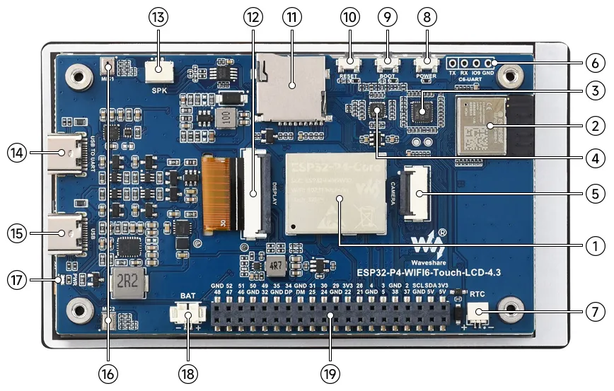
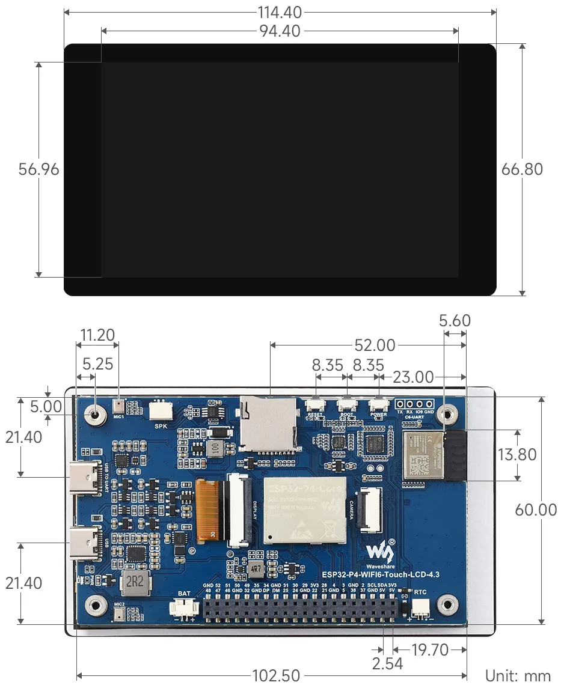

import Tabs from '@theme/Tabs';
import TabItem from '@theme/TabItem';

<Tabs>
  <TabItem value="Standard Version" label="Standard Version">
    
 
      
    

  </TabItem>
  <TabItem value="With OV5647 Camera" label="With OV5647 Camera">
    
 
      
    

  </TabItem>
</Tabs>

This product is a high-performance development board based on the ESP32-P4 chip, featuring a dual-core plus single-core RISC-V architecture. It is equipped with a 4.3inch IPS touch display with 480 × 800 resolution. It supports a rich set of human-machine interaction interfaces, including MIPI-CSI (with an integrated Image Signal Processor - ISP). It also supports USB OTG 2.0 HS for high-speed connectivity, and features an onboard 40PIN GPIO expansion header compatible with some Raspberry Pi HAT expansion boards, enabling broader application adaptability. The ESP32-P4 chip integrates a digital signature peripheral and a dedicated key management unit to ensure data and operational security. It is designed for high-performance and high-security applications, and fully meets the higher requirements of embedded applications for human-computer interface support, edge computing capabilities, and I/O connectivity features.

| SKU | Product |
| ------ |   ------------------ |
| 33874 | ESP32-P4-WIFI6-Touch-LCD-4.3 |
| 33875 | ESP32-P4-WIFI6-Touch-LCD-4.3 |

## Features

- High-performance MCU with RISC-V 32-bit dual-core and single-core processors
- Onboard ESP32-C6-MINI module, Wi-Fi 6 coprocessor, expanding the ESP32-P4's Wi-Fi 6 and BLE5 capabilities
- 128KB HP ROM, 16KB LP ROM, 768KB HP L2MEM, 32KB LP SRAM, 8KB TCM
- Powerful image and voice processing capabilities; image and voice processing interfaces include JPEG codec, Pixel Processing Accelerator (PPA), Image Signal Processor (ISP), and H264 video encoder
- 32MB PSRAM stacked within the chip package, and 32MB Nor Flash integrated externally
- Utilizes a Type-C interface, improving user convenience and device compatibility
- Onboard 4.3inch capacitive touch HD IPS screen with 480 × 800 resolution for clear display of color images
- Onboard 3.7V MX1.25 lithium battery charge/discharge interface
- Brings out I2C, UART, USB, and multiple GPIOs for external device connection and debugging, allowing flexible peripheral function configuration
- Onboard TF card slot, providing expanded storage, fast data transfer, and flexibility, suitable for data logging and media playback, simplifying circuit design
- Onboard camera interface supporting OV5647 and other cameras (MIPI-CSI)
- Security mechanisms: Secure Boot, Flash encryption, hardware encryption accelerator, and hardware random number generator. It also supports hardware access protection, enabling Access Permission Management (APM) and privilege separation

## Hardware Description

1. **ESP32-P4-Core** Integrates ESP32-P4NRW32 and 32MB Nor Flash
2. **ESP32-C6-MINI-1 Module** SDIO interface protocol, expands the development board with Wi-Fi 6, Bluetooth 5 (LE)
3. **ES7210 Echo Cancellation Chip** Used for echo cancellation to improve audio capture accuracy
4. **ES8311 Low-Power Audio Codec Chip** For audio encoding and decoding
5. **MIPI CSI Interface** 15PIN, 1.0mm pitch, supports MIPI-2lane cameras
6. **2.54mm 4PIN Pads** For flashing firmware to the ESP32-C6 module
7. **RTC Battery Header** For connecting a rechargeable RTC battery (only supports rechargeable RTC batteries)
8. **POWER Button** Long press 2s to power off; short press to power on
9. **BOOT Button** Press during power-up or reset to enter download mode
10. **RESET Button**
11. **TF Card Slot** SDIO 3.0 interface protocol
12. **MIPI DSI LCD Interface** For connecting MIPI 2-lane screens
13. **Speaker Header** GH 1.25 2PIN connector (with lock), supports 8Ω 2W speaker (recommended)
14. **Type-C Interface (USB TO UART)** For power supply, programming, and debugging
15. **Type-C Interface (USB OTG)** USB OTG 2.0 High Speed interface
16. **Onboard Microphones** Dual microphone array input
17. **PWR LED Indicator** Power indicator
18. **MX1.25 Lithium Battery Header** MX1.25 2PIN connector for connecting a 3.7V lithium battery, supports charging and discharging
19. **40PIN Header Expansion Header** 2.54mm pitch, compatible with some Raspberry Pi HATs (requires pin header adapter)

## Dimensions

## Development Tools

Each of these two development approaches has its own advantages, and developers can choose according to their needs and skill levels. Arduino is suitable for beginners and non-professionals because they are easy to learn and quick to get started. ESP-IDF is a better choice for developers with a professional background or high performance requirements, as it provides more advanced development tools and greater control capabilities for the development of complex projects.
:::warning
Due to the limited adaptation of ESP32-P4 on the Arduino platform, it is recommended to use ESP-IDF at this stage.
:::

- **ESP-IDF**, or full name Espressif IDE, is a professional development framework introduced by Espressif Technology for the ESP series chips. It is developed using the C language, including a compiler, debugger, and flashing tool, etc., and can be developed via the command lines or through an integrated development environment (such as Visual Studio Code with the Espressif IDF plugin). The plugin offers features such as code navigation, project management, and debugging, etc. We recommend using VS Code for development. For the specific configuration process, please refer to the **[Working with ESP-IDF](./ESP-IDF.md)**. The tutorial also provides relevant demos for reference.
