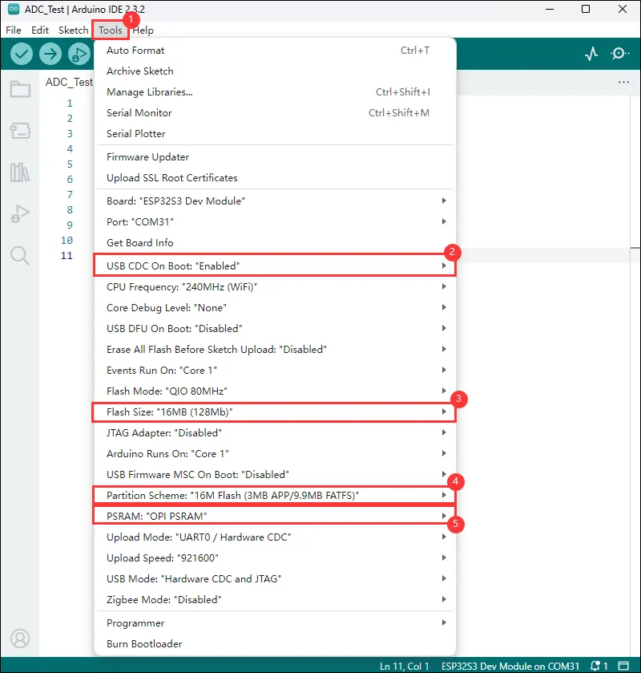
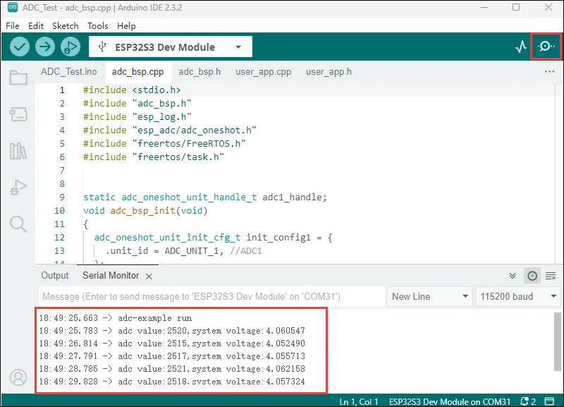
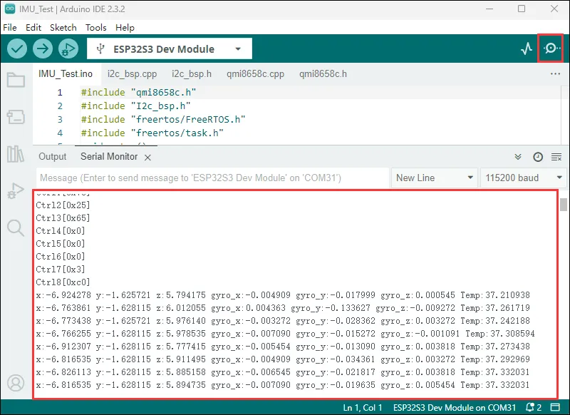
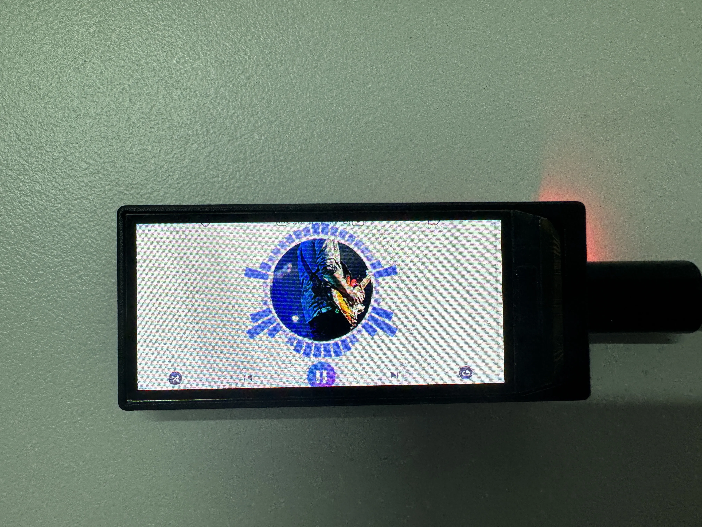
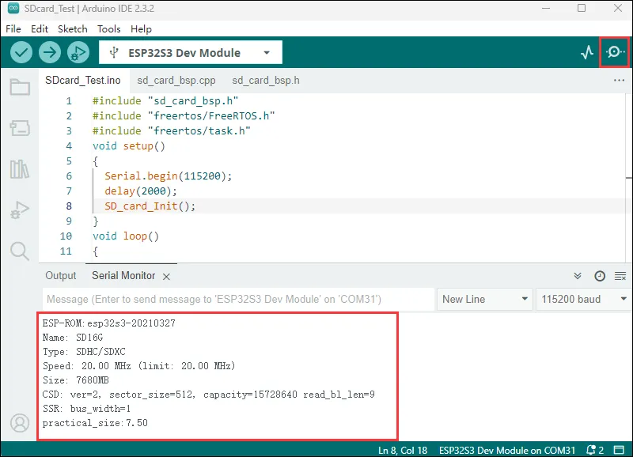
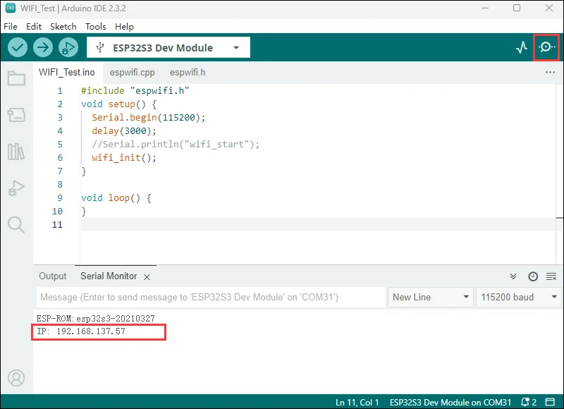
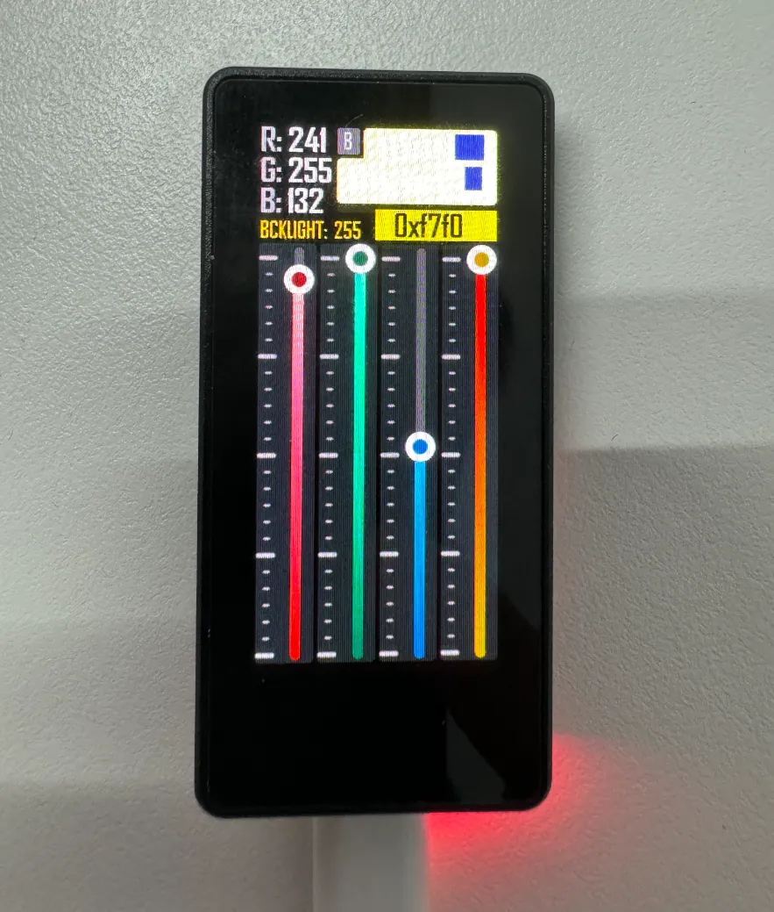
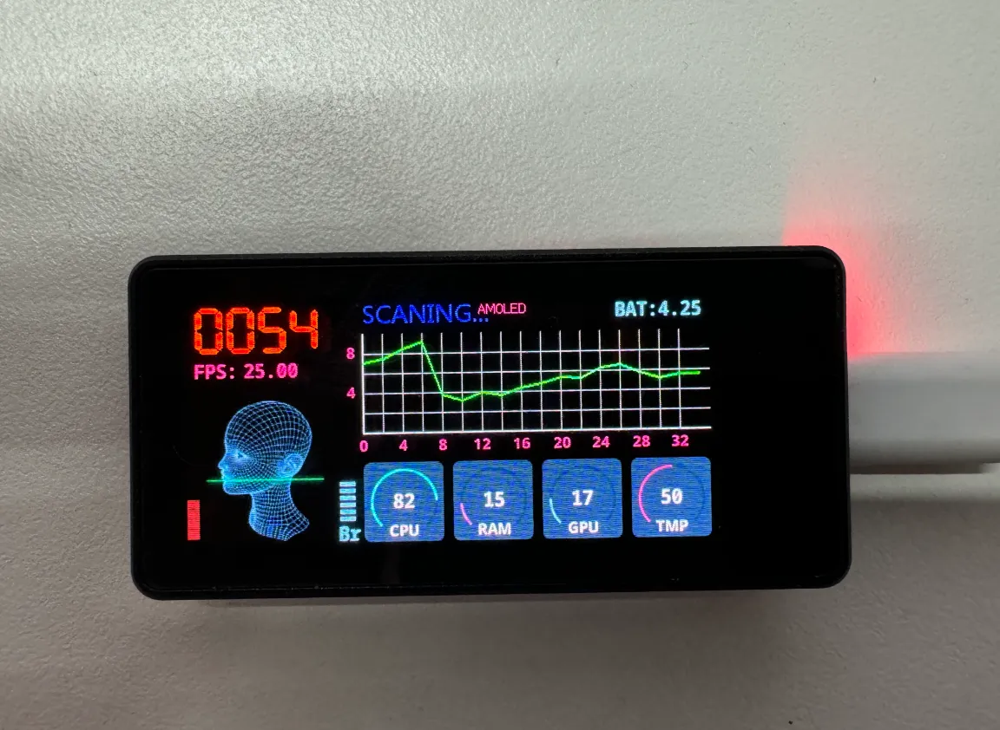
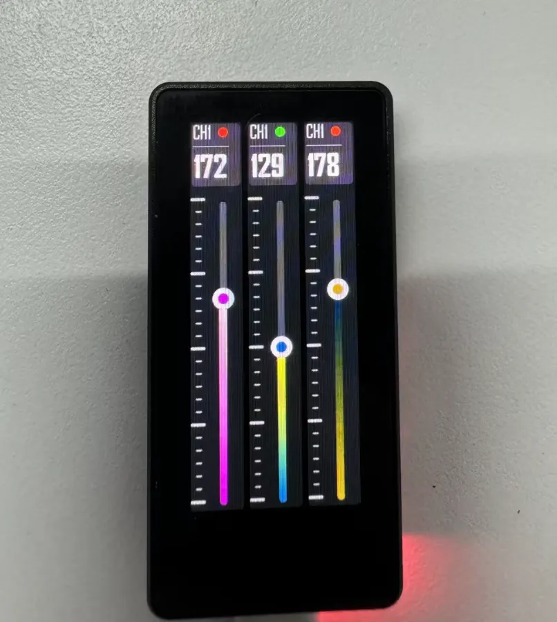

import Tabs from '@theme/Tabs';
import TabItem from '@theme/TabItem';
import Details from '@theme/Details';
import ArduinoTutorialIntro from '@site/docs/ESP32/snippets/ArduinoTutorialIntro.mdx';

<!-- Example-related Image References -->


# Working with Arduino

This chapter includes the following sections, please read as needed:

- [Arduino Getting Started](#arduino-tutorial-for-beginners)
- [Setting Up Development Environment](#setting-up-development-environment)
- [Demo](#demo)

<ArduinoTutorialIntro />

## Setting Up Development Environment

### 1. Installing and Configuring Arduino IDE

Please refer to the tutorial **[Installing and Configuring Arduino IDE Tutorial](/docs/ESP32/Tutorials/Arduino-Tutorials/01-Arduino-IDE-Setup.md)** to download and install the Arduino IDE and add ESP32 support.

### 2. Installing Libraries

- When installing Arduino libraries, there are typically two methods: **Online Installation** and **Offline Installation**. If the library installation requires offline installation, you must use the provided library file.
- For most libraries, users can easily search and install them through the online Library Manager in the Arduino software. However, some open-source libraries or custom libraries are not synchronized to the Arduino Library Manager, so they cannot be acquired through online searches. In this case, users can only manually install these libraries offline.
- The sample program package for the ESP32-S3-AMOLED-1.91 development board can be downloaded from [here](./Resources-And-Documents.md#Demo). The <code>Arduino\libraries</code> directory within the package already includes all the library files required for this tutorial.

| Library/File Name  | Description  | Version  | Installation Method |
| :----------: | :----: | :------------: | :--------: |
|LVGL | Graphical library || v8.4.0 || "Install Offline" |

:::warning Version Compatibility Description

There are strong dependencies between versions of LVGL and its driver libraries. For example, a driver written for LVGL v8 may not be compatible with LVGL v9. To ensure stable reproduction of the examples, it is recommended to use the specific versions listed in the table above. Mixing different library versions may cause compilation failures or runtime exceptions.
:::

### 3. Arduino Project Parameter Settings


<div 
  style={{maxWidth:600}}> 
  
</div>

## Demo

The Arduino demos are located in the `Arduino/examples` directory of the [demo package](./Resources-And-Documents.md#Demo).

|                         Demo                         |   Basic Program Description | Dependency Library|
| :--------------: | :-----------------------------------------: | :----------: |
| 01_ADC_Test | Get the voltage value of the lithium battery | - |
|02_I2C_QMI8658|Prints the raw attitude data from the QMI chip | - |
| 03_LVGL_V8_Test | LVGLV8 demo | LVGL V8.4.0 |
| 04_SD_Card | Load and display the information of the TF card | - |
| 05_WIFI_STA | Set to STA mode to connect to WiFi and obtain an IP address | - |
| 06_WIFI_AP | Set to AP mode to obtain the IP address of the access device | - |
|07_Arduino_Playablity|Playability & DIY Example | - |

### 01_ADC_Test

**Demo Description**

- The analog voltage connected through the GPIO is converted to digital by the ADC, and then the actual lithium battery voltage is calculated and printed to the terminal.

**Hardware Connection**

- Connect the board to the computer using a USB cable

**Code Analysis**

- `adc_bsp_init(void)`: Initializes ADC1, including creating an ADC one-shot trigger unit and configuring Channel 0 of ADC1.
- `adc_get_value(float *value,int *data)`: Reads the value from Channel 0 of ADC1, calculates the corresponding voltage based on the reference voltage and resolution, and stores it at the location pointed to by the passed pointer. Stores 0 if the read fails.
- `adc_example(void* parmeter)`: After initializing the ADC, in an infinite loop, read the value of the ADC channel on GPIO1, print the original ADC value, and calculate the system voltage value, performing this operation once every second.

**Operation Result**

- After the program is compiled and downloaded, you can view the printed ADC values and voltage output by opening the Serial Monitor, as shown in the following image:

  <div style={{maxWidth: 800}}>
  	
  </div>

### 02_I2C_QMI8658

**Demo Description**

- Uses the I2C protocol to initialize the QMI8658 chip, read attitude data at intervals, and print it to the terminal.

**Hardware Connection**

- Connect the board to the computer using a USB cable

**Code Analysis**

- `qmi8658c_example(void* parmeter)`: This function initializes the QMI8658 device. Within an infinite loop, it reads and prints accelerometer, gyroscope, and temperature data once per second. The gyroscope data increases as the board is rotated faster, and the accelerometer calculates the corresponding acceleration based on its current orientation.

**Operation Result**

- After the program is compiled, downloaded, and running, open the Serial Monitor to see the attitude data sent by the QMI chip (Euler angles require conversion by the user), as shown below:

  <div style={{maxWidth: 800}}>
  	
  </div>

### 03_LVGL_V8_Test

**Demo Description**

- Developed based on LVGL 8 adaptation to help users get started with LVGL V8 quickly.

**Hardware Connection**

- Connect the board to the computer using a USB cable

**Code Analysis**

  ```cpp
  /*Color depth: 1 (1 byte per pixel), 8 (RGB332), 16 (RGB565), 32 (ARGB8888)*/
  #define LV_COLOR_DEPTH 16//Color depth, a macro definition that must be concerned with porting LVGL

  #define LV_MEM_CUSTOM 0
  #if LV_MEM_CUSTOM == 0
  /*Size of the memory available for `lv_mem_alloc()` in bytes (>= 2kB)*/
  #define LV_MEM_SIZE (48U * 1024U)          /*[bytes]*/

  /*Set an address for the memory pool instead of allocating it as a normal array. Can be in external SRAM too.*/
  #define LV_MEM_ADR 0     /*0: unused*/
  /*Instead of an address give a memory allocator that will be called to get a memory pool for LVGL. E.g. my_malloc*/
  #if LV_MEM_ADR == 0
    #undef LV_MEM_POOL_INCLUDE
    #undef LV_MEM_POOL_ALLOC
  #endif

  #else       /*LV_MEM_CUSTOM*/
    #define LV_MEM_CUSTOM_INCLUDE <stdlib.h>   /*Header for the dynamic memory function*/
    #define LV_MEM_CUSTOM_ALLOC   malloc
    #define LV_MEM_CUSTOM_FREE    free
    #define LV_MEM_CUSTOM_REALLOC realloc
  #endif     /*LV_MEM_CUSTOM*/
  //The above section is mainly for LVGL memory allocation, 
  //which defaults to lv_mem_alloc() versus lv_mem_free().
  ```

**Code Compatibility Notice**

- For boards without touch: In the main file, find EXAMPLE_USE_TOUCH and change the value from 1 to 0.
- For boards with touch: In the main file, find EXAMPLE_USE_TOUCH and change the value from 0 to 1.
  ```cpp
  #define EXAMPLE_USE_TOUCH  0
  ```

**Operation Result**

- After the program is compiled and flashed, as shown in the figure:

  <div style={{maxWidth: 800}}>
  	
  </div>

### 04_SD_Card

**Demo Description**

- Drive the TF card through SDMMC, and print the TF card information to the terminal after successfully mounting.

**Hardware Connection**

- Install a FatFs-formatted into the board before powering on

**Code Analysis**

  - `SD_card_Init(void)`: This function initializes the TF card based on different configurations, including setting mount parameters, host, and slot parameters. It then attempts to mount the TF card and, if successful, prints the card information and capacity.

**Code Compatibility Notice**

- For V1 boards: The macro definition VersionControl_V2 needs to be commented out. It is enabled by default.
  ```cpp
  #define VersionControl_V2
  #define SDlist "/sd_card" // Directory, acting as a standard path
  #ifdef VersionControl_V2
    #define PIN_NUM_D0    (gpio_num_t)8
    #define PIN_NUM_CMD   (gpio_num_t)42
    #define PIN_NUM_CLK   (gpio_num_t)9
  #else
    #define PIN_NUM_MISO  (gpio_num_t)8
    #define PIN_NUM_MOSI  (gpio_num_t)42
    #define PIN_NUM_CLK   (gpio_num_t)47
    #define PIN_NUM_CS    (gpio_num_t)9
    #define SD_SPI SPI3_HOST
  #endif
  ```

**Operation Result**

- Click to open the Serial Monitor device. You can see the output TF card information; practical_size indicates the actual capacity of the TF card, as shown below:

  <div style={{maxWidth: 800}}>
  	
  </div>

### 05_WIFI_STA

**Demo Description**

- This example can configure the development board as a STA device to connect to a router, thereby enabling access to the system network.

**Hardware Connection**

- Connect the board to the computer using a USB cable

**Code Analysis**

- In the `05_WIFI_STA.ino` file, locate ` ssid` and ` password`, and modify them to match the SSID and Password of an available router in your current environment.

  ```cpp
  const char *ssid = "you_ssid";
  const char *password = "you_password";
  ```

**Operation Result**

- After flashing the program, open the serial terminal, if the device is successfully connected to the hotspot, the IP address obtained will be output, as shown in the figure:

  <div style={{maxWidth: 800}}>
		
  </div>

### 06_WIFI_AP

**Demo Description**

- This demo can set the development board as a hotspot, allowing phones or other devices in STA mode to connect to the development board.

**Hardware Connection**

- Connect the board to the computer using a USB cable

**Code Analysis**

*In the file `01_WIFI_AP.ino`, find `ssid` and `password`, then a phone or other device in STA mode can connect to the development board using these ssid and password.

  ```cpp
  const char *ssid = "ESP32_AP";
  const char *password = "12345678";
  ```

**Operation Result**

- After flashing the program, open the Serial Terminal. If a device successfully connects to the hotspot, the MAC address of that device will be output, as shown:

  <div style={{maxWidth: 800}}>
  		
  </div>

### 07_Arduino_Playablity

**Demo Description**

- This example has strong playability and extensibility.

**Hardware Connection**

- Connect the board to the computer using a USB cable

**Code Compatibility Notice**

- Based on ESP32_Arduino version lower than V3.0.
- The currently tested environment is V2.0.9.
- The relevant example code can be accessed by clicking [Arduino_Playablity](./Resources-And-Documents.md#Demo)

**Operation Result**

- RGBpalette
  <div style={{maxWidth: 500}}>
  	
  </div>

- AnimationDemo
  <div style={{maxWidth: 500}}>
  	
  </div>

- SliderControl
  <div style={{maxWidth: 500}}>
  	
  </div>