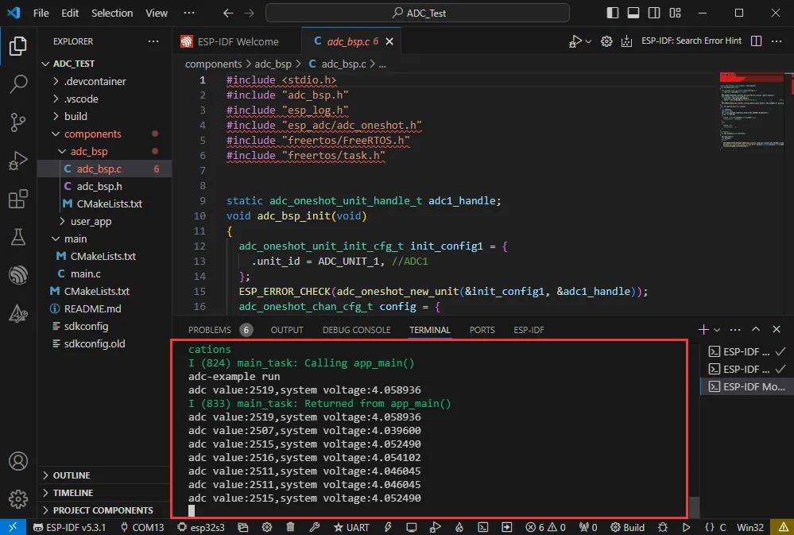
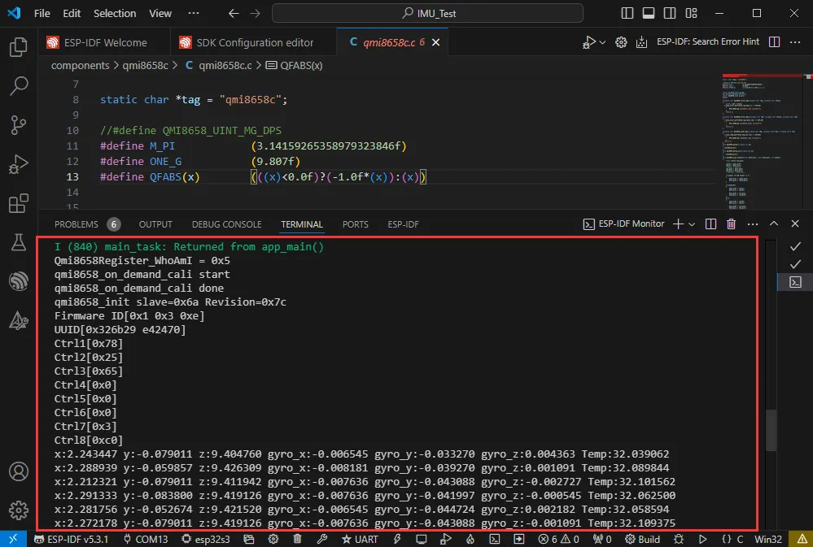
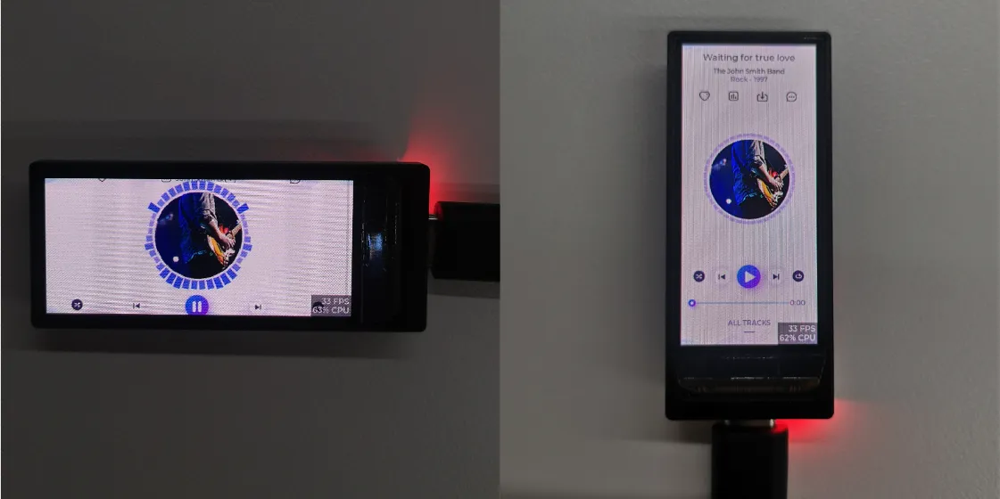
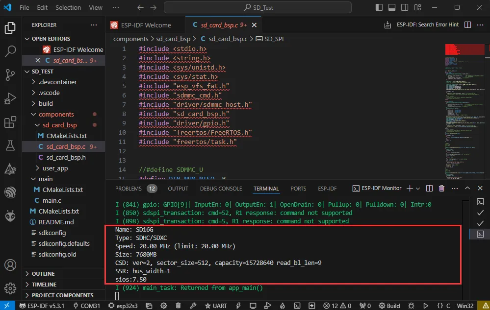
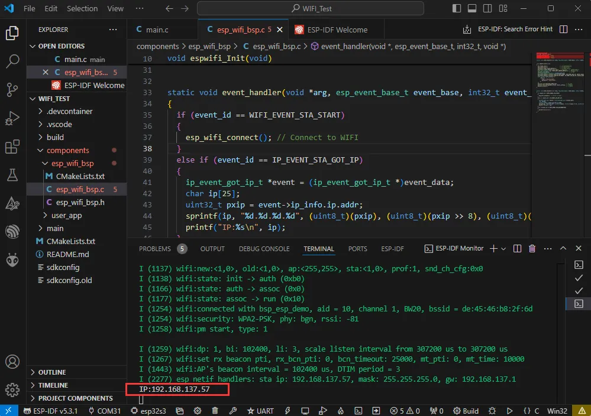
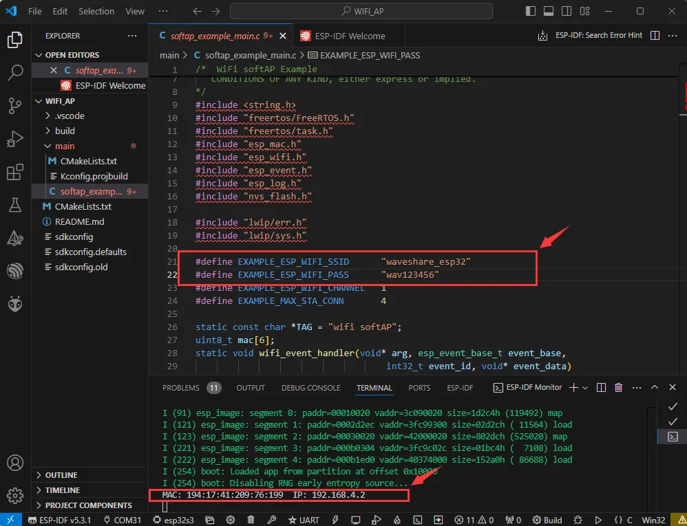
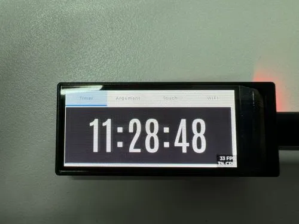
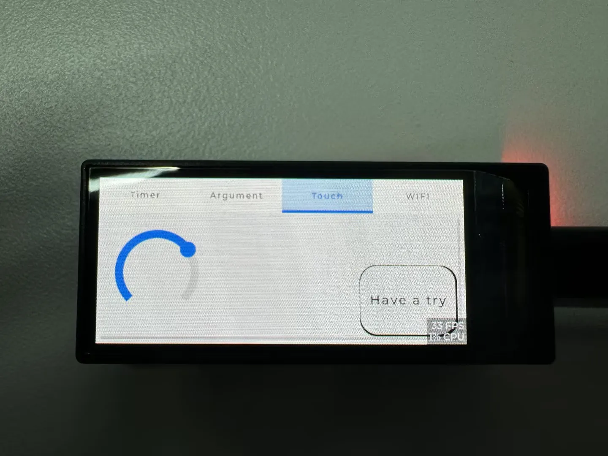
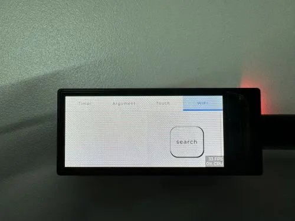

<!-- Example-related Image References -->


import EspidfTutorialIntro from '@site/docs/ESP32/snippets/EspidfTutorialIntro.mdx';
import EspidfSetup from '@site/docs/ESP32/snippets/EspidfSetup.mdx';

# ESP-IDF

This chapter includes the following sections; 

- [ESP-IDF Getting Started and Quick Configuration](#espidf-getting-started-tutorial)
- [Setting Up Development Environment](#esp-idf-setup)
- [Demo](#demo)

## ESP-IDF Getting Started Tutorial {#espidf-getting-started-tutorial}

<EspidfTutorialIntro />

## Setting up the Development Environment{#esp-idf-setup}

:::info
For the ESP32-S3-AMOLED-1.91 development board, it is recommended to use ESP-IDF V5.5.0 or higher.
:::

<EspidfSetup />

## Demo

The ESP-IDF demo is located in the <code>ESP-IDF</code> directory of the [https://github.com/waveshareteam/ESP32-C6-Touch-LCD-1.83/tree/main/examples demo] package.
| Demo | Basic Program Description | Dependency Library|
| :-: | :-: | :-: |
| 01_ADC_Test | Get the voltage value of the lithium battery | - |
|02_I2C_QMI8658|Prints the raw attitude data from the QMI chip | - |
| 03_LVGL_V8_Test | LVGLV8 demo | LVGL V8.4.0 |
| 04_SD_Card | Load and display the information of the TF card | - |
| 05_WIFI_STA | Set to STA mode to connect to WiFi and obtain an IP address | - |
| 06_WIFI_AP | Set to AP mode to obtain the IP address of the access device | - |
|07_FactoryProgram|Comprehensive demo|-|

### 01_ADC_Test

**Demo Description**

- The analog voltage connected through the GPIO is converted to digital by the ADC, and then the actual lithium battery voltage is calculated and printed to the terminal.

**Hardware Connection**

- Connect the board to the computer using a USB cable

**Code Analysis**

- `adc_bsp_init(void)`: Initializes ADC1, including creating an ADC one-shot trigger unit and configuring Channel 0 of ADC1.
- `adc_get_value(float *value)`: Reads the value from Channel 0 of ADC1, calculates the corresponding voltage based on the reference voltage and resolution, and stores it at the location pointed to by the passed pointer. Stores 0 if the read fails.
- `adc_example(void* parmeter)`: After initializing the ADC, in an infinite loop, read the value of the ADC channel on GPIO1, print the original ADC value, and calculate the system voltage value, performing this operation once every second.

**Operation Result**

- After the program is compiled and downloaded, you can view the printed ADC values and voltage output by opening the Serial Monitor, as shown in the following image:

  <div style={{maxWidth: 800}}>
  		
  </div>

### 02_I2C_QMI8658

**Demo Description**

- Uses the I2C protocol to initialize the QMI8658 chip, read attitude data at intervals, and print it to the terminal.

**Hardware Connection**

- Connect the board to the computer using a USB cable

**Code Analysis**

- `qmi8658c_example(void* parmeter)`: This function initializes the QMI8658 device. Within an infinite loop, it reads and prints accelerometer, gyroscope, and temperature data once per second.

**Operation Result**

- After the program is compiled, downloaded, and running, open the Serial Monitor to see the attitude data sent by the QMI chip (Euler angles require conversion by the user), as shown below:

  <div style={{maxWidth: 800}}>
  	
  </div>

### 03_LVGL_V8_Test

**Demo Description**

- Developed based on LVGL 8 adaptation to help users get started with LVGL V8 quickly.

**Hardware Connection**

- Connect the board to the computer using a USB cable

**Code Analysis**
  ```cpp
  /*Here is the initialization code for the landscape mode.*/
  #define EXAMPLE_LCD_H_RES 536
  #define EXAMPLE_LCD_V_RES 240
  static const sh8601_lcd_init_cmd_t lcd_init_cmds[] = {
    {0x11, (uint8_t []){0x00}, 0, 120},   
    {0x36, (uint8_t []){0xF0}, 1, 0},   
    {0x3A, (uint8_t []){0x55}, 1, 0},
    {0x2A, (uint8_t []){0x00,0x00,0x02,0x17}, 4, 0}, 
    {0x2B, (uint8_t []){0x00,0x00,0x00,0xEF}, 4, 0},
    {0x51, (uint8_t []){0x00}, 1, 10},
    {0x29, (uint8_t []){0x00}, 0, 10},
    {0x51, (uint8_t []){0xFF}, 1, 0},
  };
  /*Here is the initialization code for the portrait mode.*/
  #define EXAMPLE_LCD_H_RES 240
  #define EXAMPLE_LCD_V_RES 536
  static const sh8601_lcd_init_cmd_t lcd_init_cmds[] = {
    {0x11, (uint8_t []){0x00}, 0, 120},
    {0x3A, (uint8_t []){0x55}, 1, 0},
    {0x2A, (uint8_t []){0x00,0x00,0x02,0x17}, 4, 0}, 
    {0x2B, (uint8_t []){0x00,0x00,0x00,0xEF}, 4, 0},
    {0x51, (uint8_t []){0x00}, 1, 10},
    {0x29, (uint8_t []){0x00}, 0, 10},
    {0x51, (uint8_t []){0xFF}, 1, 0},
  };
  ```

**Code Compatibility Notice**

- For boards without touch: In the main file, find EXAMPLE_USE_TOUCH and change the value from 1 to 0.
- For boards with touch: In the main file, find EXAMPLE_USE_TOUCH and change the value from 0 to 1.
  ```cpp
  #define EXAMPLE_USE_TOUCH  0
  ```

**Operation Result**

- After the program is compiled and flashed, as shown in the figure:

  <div style={{maxWidth: 1200}}>
  	
  </div>

### 04_SD_Card

**Demo Description**

- Drive the TF card through SDMMC, and print the TF card information to the terminal after successfully mounting.

**Hardware Connection**

- Install a FatFs-formatted into the board before powering on

**Code Analysis**

  - `SD_card_Init(void)`: This function initializes the TF card based on different configurations, including setting mount parameters, host, and slot parameters. It then attempts to mount the TF card and, if successful, prints the card information and capacity.

**Code Compatibility Notice**

- For V1 boards: The macro definition VersionControl_V2 needs to be commented out. It is enabled by default.
  ```cpp
  #define VersionControl_V2
  #define SDlist "/sd_card" // Directory, acting as a standard path
  #ifdef VersionControl_V2
    #define PIN_NUM_D0    (gpio_num_t)8
    #define PIN_NUM_CMD   (gpio_num_t)42
    #define PIN_NUM_CLK   (gpio_num_t)9
  #else
    #define PIN_NUM_MISO  (gpio_num_t)8
    #define PIN_NUM_MOSI  (gpio_num_t)42
    #define PIN_NUM_CLK   (gpio_num_t)47
    #define PIN_NUM_CS    (gpio_num_t)9
    #define SD_SPI SPI3_HOST
  #endif
  ```

**Operation Result**

- Click on the serial port monitoring device, you can see the output information of the TF card, as shown in the figure below:

  <div style={{maxWidth: 800}}>
  	
  </div>

### 05_WIFI_STA

**Demo Description**

- This example can configure the development board as a STA device to connect to a router, thereby enabling access to the system network.

**Hardware Connection**

- Connect the board to the computer using a USB cable

**Code Analysis**

- In the file `esp_wifi_bsp.c`, find `ssid` and `password`, then modify them to the SSID and Password of an available router in your current environment.

  ```cpp
  wifi_config_t wifi_config = {
    .sta = {
    	.ssid = "PDCN",
    	.password = "1234567890",
    },
  };
  ```

**Operation Result**

- After flashing the program, open the serial terminal, if the device is successfully connected to the hotspot, the IP address obtained will be output, as shown in the figure:

  <div style={{maxWidth: 800}}>
  		
  </div>

### 06_WIFI_AP

**Demo Description**

- This demo can set the development board as a hotspot, allowing phones or other devices in STA mode to connect to the development board.

**Hardware Connection**

- Connect the board to the computer using a USB cable

**Code Analysis**

- In the file `softap_example_main.c`, find `SSID` and `PASSWORD`, and then your phone or other device in STA mode can use the SSID and PASSWORD to connect to the development board.

  ```cpp
  #define EXAMPLE_ESP_WIFI_SSID      "waveshare_esp32"
  #define EXAMPLE_ESP_WIFI_PASSWORD      "wav123456"
  ```

**Operation Result**

- After flashing the program, open the serial terminal, if the device is successfully connected to the hotspot, the MAC address and IP address of the device will be output, as shown in the figure:

  <div style={{maxWidth: 800}}>
  		
  </div>

### 07_FactoryProgram

**Demo Description**

- The driver board integrates all hardware components and provides comprehensive examples, enabling users to quickly understand the product.

**Hardware Connection**

- Connect the board to the computer using a USB cable

**Code Compatibility Notice**

- For boards without touch: In the main file, find EXAMPLE_USE_TOUCH and change the value from 1 to 0.
- For boards with touch: In the main file, find EXAMPLE_USE_TOUCH and change the value from 0 to 1.
  ```cpp
  #define EXAMPLE_USE_TOUCH  0
  ```

**Operation Result**

- After the program is flashed, the main interface is displayed, as shown in the figure:

  <div style={{maxWidth: 500}}>
  		
  </div>
  :::tip
  1. Touch versions support switching via the BOOT button or touch.
  2. Use the BOOT button on the side of the board to switch pages; the analog clock interface appears first.
  :::

- Argument interface, as shown:

  <div style={{maxWidth: 500}}>
  		
  </div>
  :::tip
  1. Click the BOOT button to switch to the Argument interface.
  :::

- Touch interface, as shown:

  <div style={{maxWidth: 500}}>
  		
  </div>
  :::tip
  1. Click the BOOT button again to switch to the Touch interface.
  :::

- WIFI interface, as shown:

  <div style={{maxWidth: 500}}>
  		
  </div>
  :::tip
  1. Click the BOOT button again to switch to the WIFI interface.
  :::