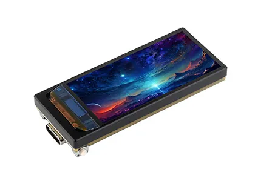
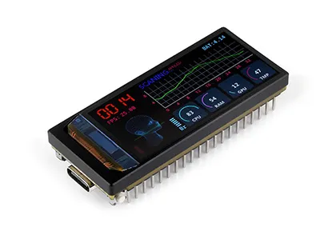
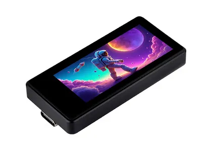
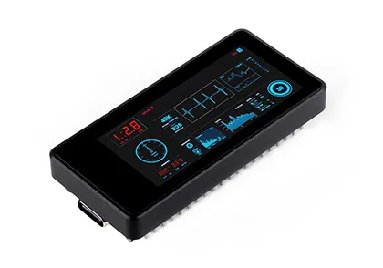
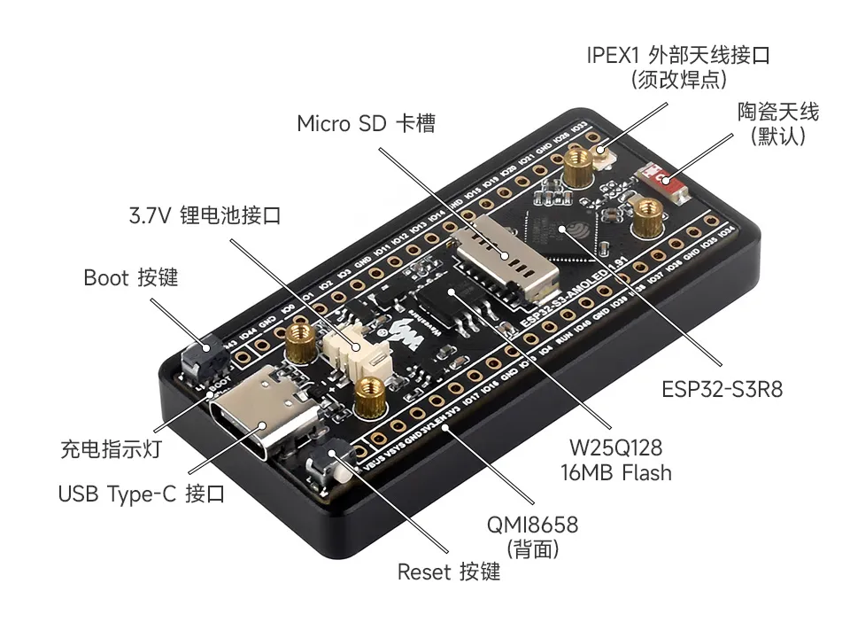
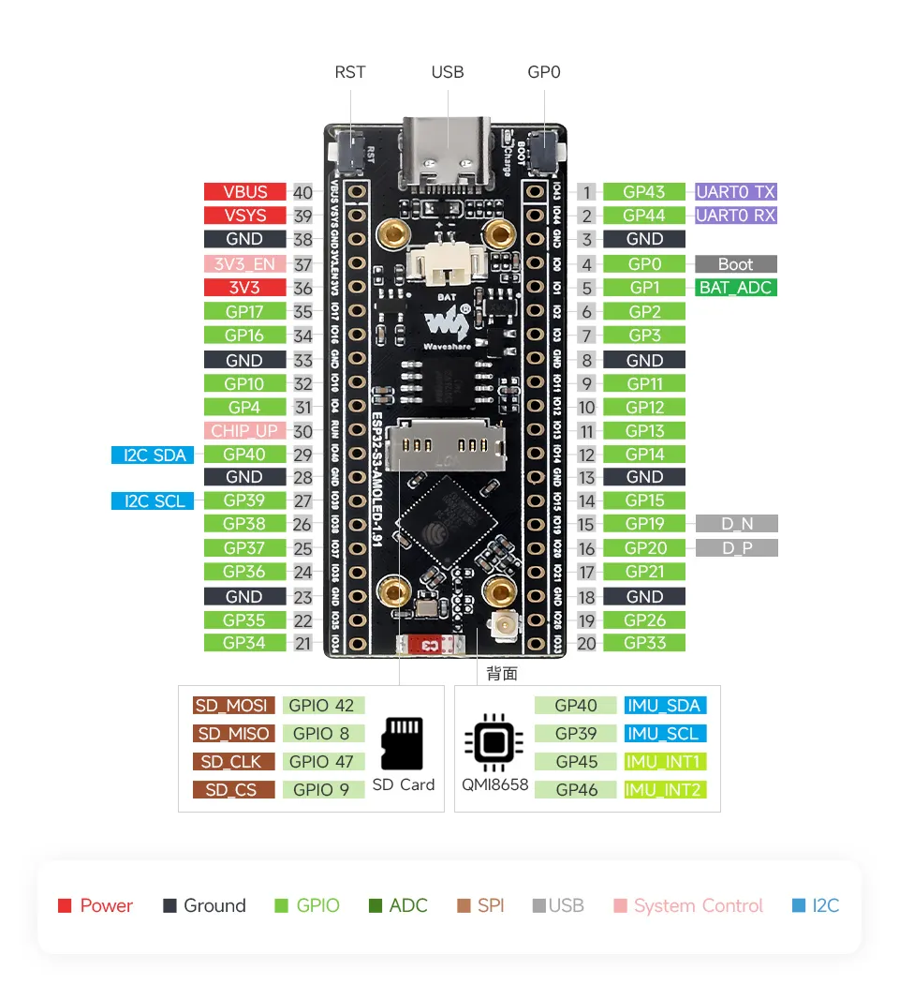
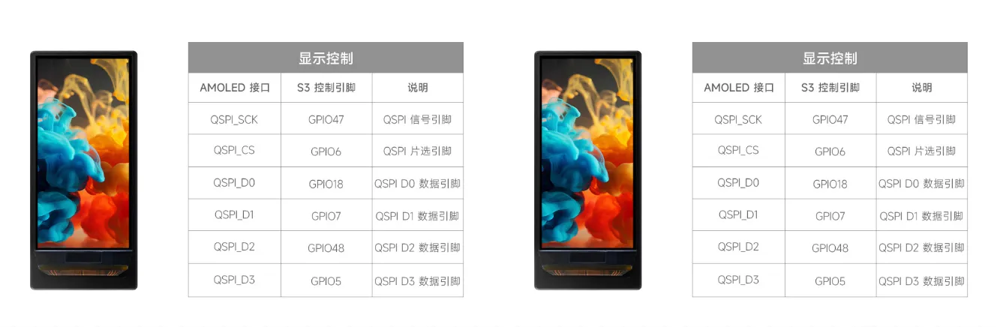
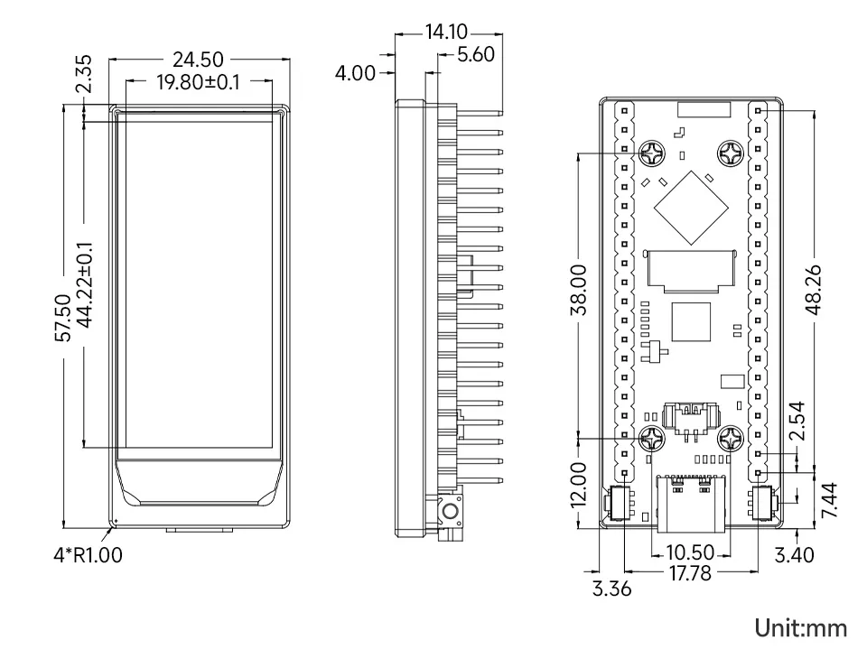

<!-- Image Reference -->

# ESP32-S3-AMOLED-1.91

import Tabs from '@theme/Tabs';
import TabItem from '@theme/TabItem';

<Tabs queryString="variant">
  <TabItem value="ESP32-S3-AMOLED-1.91" label="ESP32-S3-AMOLED-1.91 (Without touch, without header)">
    
 

  </TabItem>
  <TabItem value="ESP32-S3-AMOLED-1.91-M" label="ESP32-S3-AMOLED-1.91-M (Without touch, with header)" default>
    
 

  </TabItem>
  <TabItem value="ESP32-S3-Touch-AMOLED-1.91" label="ESP32-S3-Touch-AMOLED-1.91 (With touch, without header)" default>
    
 

  </TabItem>
  <TabItem value="ESP32-S3-Touch-AMOLED-1.91-M" label="ESP32-S3-Touch-AMOLED-1.91-M (With touch, with header)" default>
    
 

  </TabItem>
</Tabs>

ESP32-S3-AMOLED-1.91 is a low-cost, high-performance and highly scalable ESP32_GUI development board designed by Waveshare. It is available in both touch and non-touch versions, both supporting 2.4GHz WiFi and BLE 5, integrated high-capacity Flash and PSRAM, onboard RTC, IMU and 1.91inch AMOLED screen, exposed UART, GPIO, I2C and USB bus interfaces, and a large number of demos and technical support for you to quickly develop automation and IoT products.

| SKU | Product | 
| --- | --- | 
| 28872 | ESP32-S3-AMOLED-1.91          (Non-Touch, Pin Header-Free Version) |
| 28873 | ESP32-S3-AMOLED-1.91-M        (Non-Touch Version with Pin Headers) |
| 28596 | ESP32-S3-Touch-AMOLED-1.91    (Touch-Enabled, Pin Header-Free Version) |
| 28871 | ESP32-S3-Touch-AMOLED-1.91-M  (Touch-Enabled Version with Pin Headers) |

## Features

- Equipped with a high-performance Xtensa® 32-bit LX7 dual-core processor clocked at up to 240MHz
- Supports 2.4 GHz Wi-Fi (802.11 b/g/n) and Bluetooth 5 (LE) with an onboard antenna.
- Built-in 512KB SRAM and 384KB ROM, stacked with 16MB Flash and 8MB PSRAM
- Onboard 1.91inch wide-capacitive AMOLED screen with 536 × 240 resolution and 65K color
- AMOLED display uses QSPI interface, enhancing speed while saving a large amount of IO
- The touch version uses an I2C interface to communicate with the touch chip, supporting 5-point touch and interrupt output
- Onboard IMU, TF card slot; the appearance is in the form of a development board, exposing a large number of GPIO, making it suitable for various occasions

## Onboard Resources

 

## Interfaces

 

 

## Dimensions

 

## Development Methods

The ESP32-S3-AMOLED-1.91 supports two development frameworks: Arduino IDE and ESP-IDF, offering flexibility for developers. You can choose the appropriate development tool based on project requirements and personal preference.

Each method has its advantages, and developers can select based on their needs and skill level. Arduino is simple to learn and easy to get started with, suitable for beginners and non-professionals; ESP-IDF provides more advanced development tools and stronger control capabilities, suitable for developers with professional backgrounds or those with higher performance requirements, and is more suitable for complex project development.

- **Arduino IDE** is a convenient, flexible, and easy-to-use open-source electronics prototyping platform. It requires minimal foundational knowledge, allowing for rapid development after a short learning period. Arduino has a vast global community that provides a wealth of open-source code, project examples, tutorials, and rich libraries that encapsulate complex functionalities, enabling developers to implement various features quickly. You can refer to the **[Working with Arduino](./Arduino.md)** to complete the initial setup, and the tutorial also provides related demos for reference.

- **ESP-IDF** (Espressif IoT Development Framework) is a professional development framework released by Espressif for its ESP series chips. It is developed based on the C language, including a compiler, debugger, and flashing tool, etc. It supports development via command line or an Integrated Development Environment (such as Visual Studio Code with the Espressif IDF plugin), which provides features like code navigation, project management, and debugging, etc. We recommend using VS Code for development. For the specific configuration process, please refer to the **[Working with ESP-IDF](./ESP-IDF.md)**. The tutorial also provides relevant demos for reference.