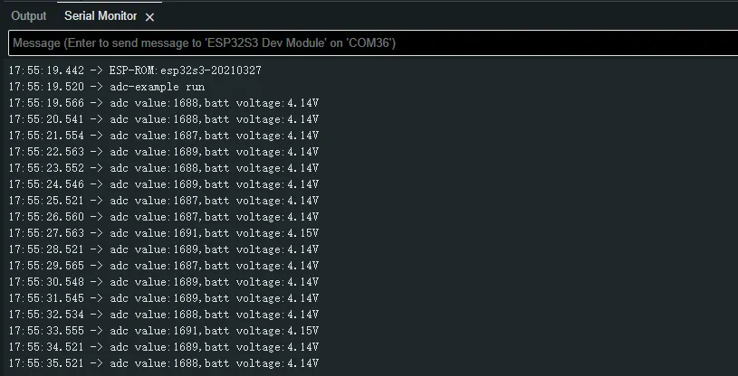
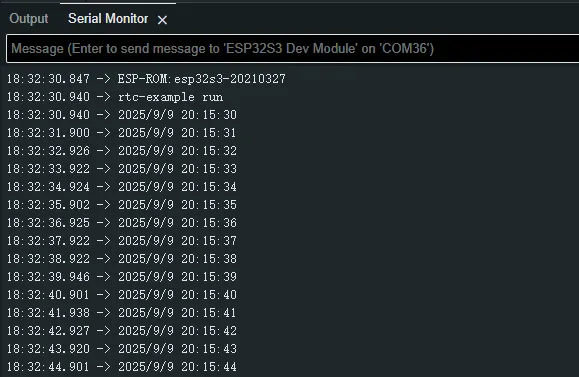
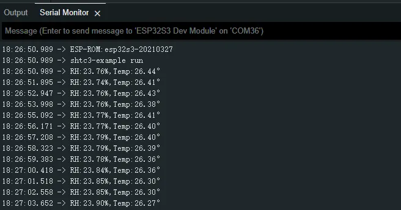
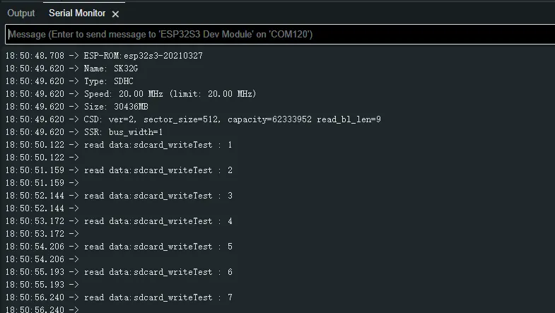
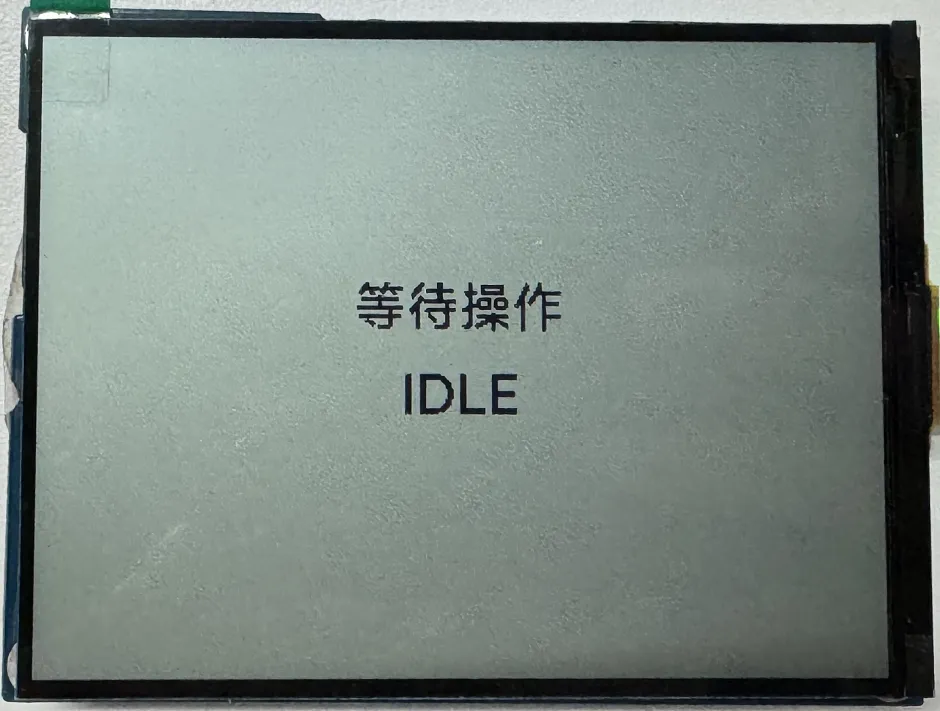

import Tabs from '@theme/Tabs';
import TabItem from '@theme/TabItem';
import Details from '@theme/Details';
import ArduinoTutorialIntro from '@site/docs/ESP32/snippets/ArduinoTutorialIntro.mdx';

<!-- Example-related Image References -->

# Working with Arduino

This chapter includes the following sections, please read as needed:

- [Arduino Getting Started](#arduino-tutorial-for-beginners)
- [Setting Up Development Environment](#setting-up-development-environment)
- [Demo](#demo)

<ArduinoTutorialIntro />

## Setting Up Development Environment

### 1. Installing and Configuring Arduino IDE

Please refer to the tutorial **[Installing and Configuring Arduino IDE Tutorial](/docs/ESP32/Tutorials/Arduino-Tutorials/01-Arduino-IDE-Setup.md)** to download and install the Arduino IDE and add ESP32 support.

### 2. Installing Libraries

- When installing Arduino libraries, there are typically two methods: **Online Installation** and **Offline Installation**. If the library installation requires offline installation, you must use the provided library file.
- For most libraries, users can easily search and install them through the online Library Manager in the Arduino software. However, some open-source libraries or custom libraries are not synchronized to the Arduino Library Manager, so they cannot be acquired through online searches. In this case, users can only manually install these libraries offline.
- The sample program package for the ESP32-S3-RLCD-4.2 development board can be downloaded from [here](./Resources-And-Documents.md#Demo). The <code>Arduino\libraries</code> directory within the package already includes all the library files required for this tutorial.

| Library/File Name  | Description  | Version  | Installation Method |
| :----------: | :----: | :------------: | :--------: |
|LVGL | Graphical library || v8.3.11/v9.3.0 || "Install Offline"
| SensorLib | Sensor library | v0.3.1|  "Install Online" or "Install Offline"

:::Warning Version Compatibility Description

There are strong dependencies between versions of LVGL and its driver libraries. For example, a driver written for LVGL v8 may not be compatible with LVGL v9. To ensure stable reproduction of the examples, it is recommended to use the specific versions listed in the table above. Mixing different library versions may cause compilation failures or runtime exceptions.
:::

### 3. Arduino Project Parameter Settings


<div 
    style={{maxWidth:600}}> 
    
</div>

## Demo

The Arduino demos are located in the `Arduino/examples` directory of the [demo package](./Resources-And-Documents.md#Demo).

| Demo   |   Basic Program Description | Dependency Library|
| :--------------: | :-----------------------------------------: | :----------: |
| 01_WIFI_AP | Set to AP mode to obtain the IP address of the access device | - |
| 02_WIFI_STA | Set to STA mode to connect to WiFi and obtain an IP address | - |
| 03_ADC_Test | Get the voltage value of the lithium battery | - |
| 04_I2C_PCF85063 | Print real-time time of RTC chip | SensorLib |
| 05_I2C_SHTC3 | Print temperature and humidity sensor data | - |
| 06_SD_Card | Load and display the information of the TF card | - |
| 07_Audio_Test | Play the sound recorded by the microphone through the speaker | LVGL V8.3.11 |
| 08_LVGL_V8_Test | LVGLV8 demo | LVGL V8.3.11 |
| 09_LVGL_V9_Test | LVGLV9 demo | LVGL V9.3.0 |

### 01_WIFI_AP

**Demo Description**

- This demo can set the development board as a hotspot, allowing phones or other devices in STA mode to connect to the development board.

**Hardware Connection**

- Connect the board to the computer using a USB cable

**Code Analysis**

*In the file `01_WIFI_AP.ino`, find `ssid` and `password`, then a phone or other device in STA mode can connect to the development board using these ssid and password.

  ```cpp
  const char *ssid = "ESP32_AP";
  const char *password = "12345678";
  ```

**Expected Result**

- After flashing the program and opening the serial terminal, if the device successfully connects to the hotspot, it will output the MAC address of the device, as shown in the figure:

  <div style={{maxWidth: 800}}>
  		
  </div>

### 02_WIFI_STA

**Demo Description**

- This example can configure the development board as a STA device to connect to a router, thereby enabling access to the system network.

**Hardware Connection**

- Connect the board to the computer using a USB cable

**Code Analysis**

- In the file `02_WIFI_STA.ino`, find ` ssid` and ` password`, then modify them to the SSID and Password of an available router in your current environment.

  ```cpp
  const char *ssid = "you_ssid";
  const char *password = "you_password";
  ```

**Expected Result**

- After flashing the program, open the serial terminal, if the device is successfully connected to the hotspot, the IP address obtained will be output, as shown in the figure:

  <div style={{maxWidth: 800}}>
		
  </div>

### 03_ADC_Test

**Demo Description**

- The analog voltage connected through the GPIO is converted to digital by the ADC, and then the actual lithium battery voltage is calculated and printed to the terminal.

**Hardware Connection**

- Connect the board to the computer using a USB cable

**Code Analysis**

- `Adc_PortInit(void)`: Initializes ADC1, including creating an ADC one-time trigger unit and configuring channel 3 for ADC1
- `float Adc_GetBatteryVoltage(int *data)`: Reads the value from ADC1 channel 3 and returns the actual voltage value.
- `uint8_t Adc_GetBatteryLevel(void)`: Returns the battery percentage.
- `void Adc_LoopTask(void *arg)`: Creates an ADC task that reads the ADC value and prints it to the serial port every second.

**Expected Result**

- After the program is compiled and downloaded, you can view the printed ADC values and voltage output by opening the Serial Monitor, as shown in the following image:

  <div style={{maxWidth: 800}}>
  		
  </div>

### 04_I2C_PCF85063

**Demo Description**

- Through the I2C protocol, initialize the PCF85063 chip, set the time, and then periodically read the time and print it to the terminal

**Hardware Connection**

- Connect the board to the computer using a USB cable

**Code Analysis**

  ```cpp
  I2cMasterBus I2cbus(14,13,0);          // Initialize I2C bus
  void setup() {
  Serial.begin(115200);
  delay(1000);
  Serial.printf("rtc-example run \n"); 
  Rtc_Setup(&I2cbus, 0x51);              // Initialize RTC, set RTC slave address to 0x51
  Rtc_SetTime(2025, 9, 9, 20, 15, 30);   // Set RTC time
  }

  void loop() {
    rtcTimeStruct_t rtcData;
    Rtc_GetTime(&rtcData);              // Get the real-time clock (RTC) time
    Serial.printf("%d/%d/%d %02d:%02d:%02d \n",
                  rtcData.year, rtcData.month, rtcData.day, rtcData.hour, rtcData.minute,
                  rtcData.second);
    delay(1000);
  }
  ```

**Expected Result**

- After the program is compiled and downloaded, open the serial port monitoring to see the RTC time of the printout, as shown in the following figure:<br />

  <div style={{maxWidth: 800}}>
  		
  </div>

### 05_I2C_SHTC3

**Demo Description**

- Initialize the SHTC3 chip through the I2C protocol, and then print the temperature and humidity information read every 1 second to the terminal

**Hardware Connection**

- Connect the board to the computer using a USB cable

**Code Analysis**

  ```cpp
  I2cMasterBus I2cbus(14,13,0);
  Shtc3Port *shtc3port = NULL;

  void setup() {
    Serial.begin(115200);
    delay(1000);
    Serial.printf("shtc3-example run \n");
    shtc3port = new Shtc3Port(I2cbus);         // Initialize SHTC3
  }

  void loop() {
    float rh,temp;
    shtc3port->Shtc3_ReadTempHumi(&temp,&rh);  // Get temperature and humidity data
    Serial.printf("RH:%.2f%%,Temp:%.2f° \n",rh,temp);
    delay(1000);
  }
  ```

**Expected Result**

- Open the serial port monitor, you can see the printed temperature and humidity data, as shown in the figure below:

  <div style={{maxWidth: 800}}>
  		
  </div>

### 06_SD_Card

**Demo Description**

- Drive the TF card through SDMMC, and print the TF card information to the terminal after successfully mounting.

**Hardware Connection**

- Install a FatFs-formatted into the board before powering on

**Code Analysis**

  ```cpp
  #define sdcard_write_Test                  

  CustomSDPort *sdcardPort = NULL;

  void setup()
  {
    Serial.begin(115200);
    delay(2000);
    sdcardPort = new CustomSDPort("/sdcard");  // Initialize SDMMC driver
  }

  uint32_t value = 1;
  char sdcard_read[45] = {""};
  char sdcard_write[45] = {""};

  void loop()
  {
  #ifdef sdcard_write_Test      // Test the TF card read/write functionality
    snprintf(sdcard_write,45,"sdcard_writeTest : %ld \n",value);
    sdcardPort->SDPort_WriteFile("/sdcard/writeTest.txt",sdcard_write,strlen(sdcard_write));
    vTaskDelay(pdMS_TO_TICKS(500));
    sdcardPort->SDPort_ReadFile("/sdcard/writeTest.txt",(uint8_t *)sdcard_read,NULL);
    Serial.printf("read data:%s\n",sdcard_read);
    vTaskDelay(pdMS_TO_TICKS(500));
    value++;
  #endif
  }
  ``` 

**Expected Result**

- Click on the serial port monitoring device, you can see the output information of the TF card, as shown in the figure below:

  <div style={{maxWidth: 800}}>
  		
  </div>

### 07_Audio_Test

**Demo Description**

- Demonstrates how to get data from the microphone and then play it through the speaker

**Hardware Connection**

- Connect the board to the computer using a USB cable

**Code Analysis**

- `CodecPort_SetInfo("es8311 & es7210",1,16000,2,16)`: Sets the sampling rate, number of channels, and bit depth of the Codec chip.
- `CodecPort_SetSpeakerVol(100)`: Set the playback gain to 100.
- `CodecPort_SetMicGain(35)`: Set the microphone gain to 35.
- `Codec_LoopTask(void *arg)`: Codec task, which implements recording, playback, and other functions.

**Expected Result**

- After the program is flashed, as shown in the figure:

  <div style={{maxWidth: 500}}>
  		
  </div>

  :::tip
  1. Double-click the BOOT button to enter recording mode, speak into the MIC, and it will automatically end after 3 seconds
  2. Click the BOOT button to play the sound you just recorded
  3. Double-click the KEY button to play a piece of music
  4. Click the KEY button to interrupt music playback
  :::

### 08_LVGL_V8_Test

**Demo Description**

- Demonstrates how to display images using LVGL V8, helping users get started quickly with LVGL V8.

**Hardware Connection**

- Connect the board to the computer using a USB cable

**Code Analysis**

  ```cpp
  /*Create an IMG1 control*/
  ui->screen_img_1 = lv_img_create(ui->screen);
  lv_obj_add_flag(ui->screen_img_1, LV_OBJ_FLAG_CLICKABLE);
  lv_img_set_src(ui->screen_img_1, &_ein_alpha_400x300);
  lv_img_set_pivot(ui->screen_img_1, 50,50);
  lv_img_set_angle(ui->screen_img_1, 0);
  lv_obj_set_pos(ui->screen_img_1, 0, 0);
  lv_obj_set_size(ui->screen_img_1, 400, 300);
  /*Create an IMG1 control*/
  ui->screen_img_2 = lv_img_create(ui->screen);
  lv_obj_add_flag(ui->screen_img_2, LV_OBJ_FLAG_CLICKABLE);
  lv_img_set_src(ui->screen_img_2, &_2_alpha_400x300);
  lv_img_set_pivot(ui->screen_img_2, 50,50);
  lv_img_set_angle(ui->screen_img_2, 0);
  lv_obj_set_pos(ui->screen_img_2, 0, 0);
  lv_obj_set_size(ui->screen_img_2, 400, 300);
  lv_obj_add_flag(ui->screen_img_2, LV_OBJ_FLAG_HIDDEN);
  ```

**Expected Result**

- After the program is flashed, it is displayed alternately at intervals of 1.5 seconds, as shown in the figure:

  <div style={{maxWidth: 800}}>
  		
  </div>

### 09_LVGL_V9_Test

**Demo Description**

- Demonstrates how to display images using LVGL V9, helping users get started quickly with LVGL V9.

**Hardware Connection**

- Connect the board to the computer using a USB cable

**Code Analysis**

  ```cpp
  /*Create an IMG1 control*/
  ui->screen_img_1 = lv_image_create(ui->screen);
  lv_obj_set_pos(ui->screen_img_1, 0, 0);
  lv_obj_set_size(ui->screen_img_1, 400, 300);
  lv_obj_add_flag(ui->screen_img_1, LV_OBJ_FLAG_CLICKABLE);
  lv_image_set_src(ui->screen_img_1, &_ein_RGB565A8_400x300);
  lv_image_set_pivot(ui->screen_img_1, 50,50);
  lv_image_set_rotation(ui->screen_img_1, 0);
  /*Create an IMG1 control*/
  ui->screen_img_2 = lv_image_create(ui->screen);
  lv_obj_set_pos(ui->screen_img_2, 0, 0);
  lv_obj_set_size(ui->screen_img_2, 400, 300);
  lv_obj_add_flag(ui->screen_img_2, LV_OBJ_FLAG_HIDDEN);
  lv_obj_add_flag(ui->screen_img_2, LV_OBJ_FLAG_CLICKABLE);
  lv_image_set_src(ui->screen_img_2, &_2_RGB565A8_400x300);
  lv_image_set_pivot(ui->screen_img_2, 50,50);
  lv_image_set_rotation(ui->screen_img_2, 0);
  ```

**Expected Result**

- After the program is flashed, it is displayed alternately at intervals of 1.5 seconds, as shown in the figure:

  <div style={{maxWidth: 800}}>
  		
  </div>