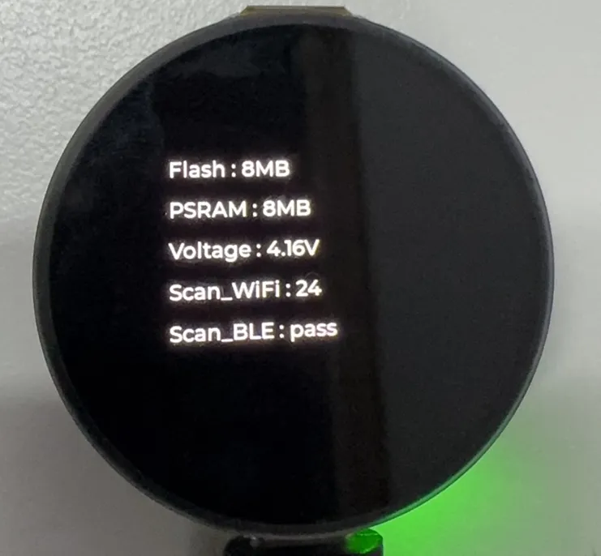

<!-- Example-related Image References -->


import EspidfTutorialIntro from '@site/docs/ESP32/snippets/EspidfTutorialIntro.mdx';
import EspidfSetup from '@site/docs/ESP32/snippets/EspidfSetup.mdx';

# ESP-IDF

This chapter includes the following sections; 

- [ESP-IDF Getting Started and Quick Configuration](#espidf-getting-started-tutorial)
- [Setting Up Development Environment](#esp-idf-setup)
- [Demo](#demo)

<EspidfTutorialIntro />

## Setting up the Development Environment{#esp-idf-setup}

:::info
For the ESP32-S3-Touch-AMOLED-1.32 development board, you need to use ESP-IDF V5.5.0 or higher.
:::

<EspidfSetup />

## Demo

The ESP-IDF demo is located in the <code>ESP-IDF</code> directory of the [https://github.com/waveshareteam/ESP32-C6-Touch-LCD-1.83/tree/main/examples demo] package.
| Demo | Basic Program Description | Dependency Library|
| :-: | :-: | :-: |
| 01_ADC_Test | Get the voltage value of the lithium battery | - |
| 02_WIFI_AP | Set to AP mode to obtain the IP address of the access device | - |
| 03_WIFI_STA | Set to STA mode to connect to WiFi and obtain an IP address | - |
| 04_BATT_PWR_Test | Control power via the PWR button when powered solely by the lithium battery |      -       |
| 05_Audio_Test | Play the sound recorded by the microphone through the speaker | LVGL V8.3.11 |
| 06_LVGL_V8_Test | LVGLV8 demo | LVGL V8.3.11 |
| 07_LVGL_V9_Test | LVGLV9 demo | LVGL V9.3.0 |
| 08_FactoryProgram | Comprehensive demo | LVGL V8.3.11|

### 01_ADC_Test

**Demo Description**

- The analog voltage connected through the GPIO is converted to digital by the ADC, and then the actual lithium battery voltage is calculated and printed to the terminal.

**Hardware Connection**

- Connect the board to the computer using a USB cable

**Code Analysis**

- `adc_bsp_init(void)`: Initializes ADC1, including creating an ADC one-shot trigger unit and configuring Channel 3 of ADC1.
- `adc_get_value(float *value,int *data)`: Reads the value from Channel 3 of ADC1, calculates the corresponding voltage based on the reference voltage and resolution, and stores it at the location pointed to by the passed pointer. Stores 0 if the read fails.
- `adc_example(void* parameter)`: After initializing ADC1, creates an ADC task. This task reads the ADC value every second and calculates the system voltage from the raw ADC reading.

**Operation Result**

- After the program is compiled and downloaded, you can view the printed ADC values and voltage output by opening the Serial Monitor, as shown in the following image:

  <div style={{maxWidth: 800}}>
  		
  </div>
  
### 02_WIFI_AP

**Demo Description**

- This demo can set the development board as a hotspot, allowing phones or other devices in STA mode to connect to the development board.

**Hardware Connection**

- Connect the board to the computer using a USB cable

**Code Analysis**

- In the file `softap_example_main.c`, find `SSID` and `PASSWORD`, and then your phone or other device in STA mode can use the SSID and PASSWORD to connect to the development board.

  ```cpp
  #define EXAMPLE_ESP_WIFI_SSID      "waveshare_esp32"
  #define EXAMPLE_ESP_WIFI_PASSWORD      "wav123456"
  ```

**Operation Result**

- After flashing the program, open the serial terminal, if the device is successfully connected to the hotspot, the MAC address and IP address of the device will be output, as shown in the figure:

  <div style={{maxWidth: 800}}>
  		
  </div>

### 03_WIFI_STA

**Demo Description**

- This example can configure the development board as a STA device to connect to a router, thereby enabling access to the system network.

**Hardware Connection**

- Connect the board to the computer using a USB cable

**Code Analysis**

- In the file `esp_wifi_bsp.c`, find `ssid` and `password`, then modify them to the SSID and Password of an available router in your current environment.

  ```cpp
  wifi_config_t wifi_config = {
    .sta = {
    	.ssid = "PDCN",
    	.password = "1234567890",
    },
  };
  ```

**Operation Result**

- After flashing the program, open the serial terminal, if the device is successfully connected to the hotspot, the IP address obtained will be output, as shown in the figure:

  <div style={{maxWidth: 800}}>
  		
  </div>

### 04_BATT_PWR_Test

**Demo Description**

- Demonstrates how to control the system power via the PWR button when powered by the lithium battery.

**Hardware Connection**

- Connect the board to the computer using a USB cable

**Code Analysis**

- `setup_ui(lv_ui *ui)`: Initializes the UI interface for visual control.
- `BatteryMonitor batt_dev(ADC_CHANNEL_3,18,17)`: Initializes the control IO ports for the lithium battery.
- `user_button_init()`: Initializes the buttons and their trigger events.
- `Custom_ButtonPWRLoopTask(void *arg)`: A task that waits for button event triggers.

**Operation Result**

- After the program is flashed, disconnect the USB power supply and connect the lithium battery. Power on by pressing and holding the PWR button, as shown in the figure:

  :::tip
  1. Press and hold the PWR button, wait for the screen to display "Power ON", which means that the startup is successful, and release the button
  2. Press and hold the PWR button again, wait for the screen to display "Power OFF", which means that the power is turned off successfully, and release the button
  :::

  <div style={{maxWidth: 800}}>
  		
  </div>

### 05_Audio_Test

**Demo Description**

- Demonstrates how to capture microphone data, play sound, and other audio functions.

**Hardware Connection**

- Connect the board to the computer using a USB cable

**Code Analysis**

- `I2cMasterBus i2c_dev(ESP32_SCL_NUM,ESP32_SDA_NUM,0)`: Initializes the I2C bus.
- `audio_dev = new I2sAudioCodec("S3_AMOLED_1_32")`: Initializes the Audio Codec.
- `audio_dev->I2sAudio_SetSpeakerVol(90)`: Sets the playback volume level.
- `audio_dev->I2sAudio_SetMicGain(20)`: Sets the recording gain.

**Operation Result**

- After the program is flashed, speak into the microphone. The speaker will automatically play the recorded sound. The screen display is as shown in the figure:

  :::tip
  1. Press and hold the BOOT button to play a piece of music
  2. If you feel the sound is too low, you can adjust the volume using `audio_dev->I2sAudio_SetSpeakerVol(90);`, range 0-100
  :::

  <div style={{maxWidth: 500}}>
  		
  </div>

### 06_LVGL_V8_Test

**Demo Description**

- Implements various multifunctional GUI interfaces on the screen by porting LVGL V8.

**Hardware Connection**

- Connect the board to the computer using a USB cable

**Code Analysis**

- To perform a backlight test, locate the macro definition `#define BacklightTestEN 0` in the `user_config.h` file and change its value to 1.

  ```cpp
  #define BacklightTestEN  0  //Backlight Test
  ```

**Operation Result**

- After the program is flashed, the device operation result is as follows:

  <div style={{maxWidth: 500}}>
  		
  </div>

### 07_LVGL_V9_Test

**Demo Description**

- Implements various multifunctional GUI interfaces on the screen by porting LVGL V9.

**Hardware Connection**

- Connect the board to the computer using a USB cable

**Code Analysis**

- To perform a backlight test, locate the macro definition `#define BacklightTestEN 0` in the `user_config.h` file and change its value to 1.

  ```cpp
  #define BacklightTestEN  0  //Backlight Test
  ```

**Operation Result**

- After the program is flashed, the device operation result is as follows:

  <div style={{maxWidth: 500}}>
		
  </div>

### 08_FactoryProgram

**Demo Description**

- Comprehensive project, you can simply test the onboard hardware functions, or directly use the BIN firmware we provide for flashing.

**Hardware Connection**

- Connect the board to the computer using a USB cable

**Operation Result**

- The display screen transitions through red, green, and blue colors (with a transition interval of 1.5 seconds), as shown in the figure:

  <div style={{maxWidth: 900}}>
		
  </div>

- After the system finishes displaying the above colors, it will automatically enter the onboard hardware information interface, as shown in the figure:

  <div style={{maxWidth: 400}}>
		
  </div>

- Click the BOOT button on the onboard hardware information interface to enter the backlight debugging interface,  where the screen backlight can be controlled via the slider, as shown in the figure:

  <div style={{maxWidth: 400}}>
  		
  </div>

- Click the BOOT button again to exit the backlight control interface, then click the PWR button to enter the Touch interface, as shown in the figure:

  Touch coordinates are displayed on the screen.

  <div style={{maxWidth: 400}}>
		
  </div>

- Use the audio function in a simple way, and the speaker wiring is as shown:<br/>
  
  :::note
  1. Speak into the MIC, and the speaker will play the received sound
  2. Hold down the BOOT button, and the speaker will play music
  :::

  <div style={{maxWidth: 800}}>
		
  </div>

- When using the lithium battery for power supply alone, the PWR button controls the power:
  
  Press and hold the PWR button to turn on the system power; press and hold it again to shut down the system power.
  