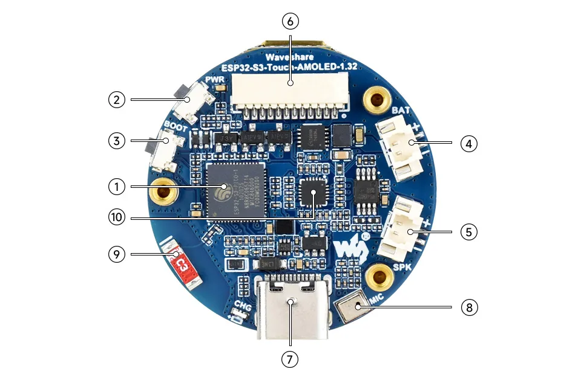
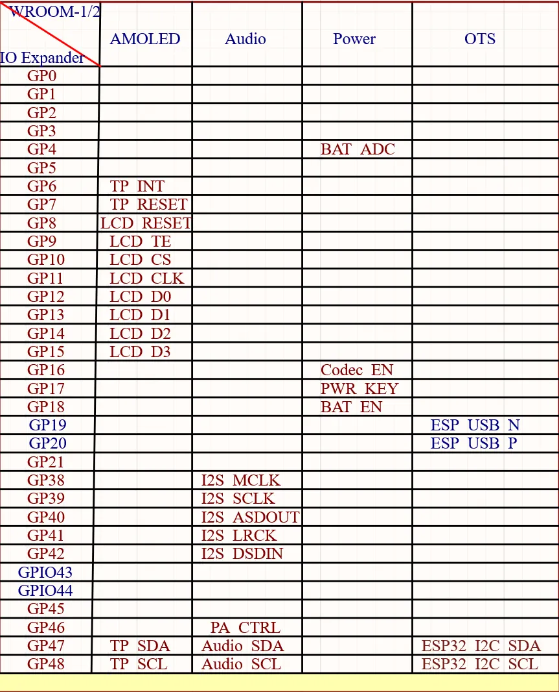
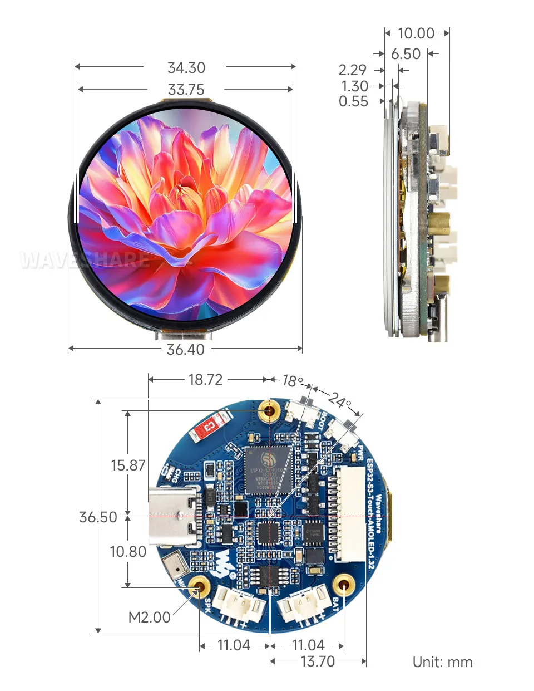

# ESP32-S3-Touch-AMOLED-1.32

 

 

The ESP32-S3-Touch-AMOLED-1.32 is a compact 1.32inch HD AMOLED capacitive touch display development board designed by Waveshare. It has onboard power management module, low power audio codec circuit, and MIC, adapting 12PIN expansion I/O interface, Lithium Batt. header, and speaker header, suitable for applications such as AI voice agents.

| SKU | Product | 
| --- | --- | 
| 32767 | ESP32-S3-Touch-AMOLED-1.32|

## Features

- Equipped with ESP32-S3 high-performance Xtensa 32-bit LX7 dual-core processor, operating at up to 240 MHz.
- Supports 2.4GHz Wi-Fi (802.11 b/g/n) and Bluetooth 5 (LE) with an onboard antenna.
- Built-in 512KB SRAM and 384KB ROM, stacked with 8MB PSRAM and 8MB Flash.
- Features a 1.32inch capacitive touch HD AMOLED display with a resolution of 466 × 466, supporting 16.7 million colors for clear and vibrant image display.
- Built-in CO5300 driver chip and CST820 capacitive touch controller chip, communicating via QSPI and I2C interfaces respectively, minimizing the use of I/O pin resources
- Onboard two side buttons, PWR and BOOT, with customizable functions for convenient custom button operation development
- Onboard 3.7V MX1.25 lithium battery recharge/discharge header.
- Integrates an ES8311 low-power audio codec chip, supporting high-quality audio input and output for various applications like voice interaction and audio playback.
- Exposes a 12PIN SH1.0 expansion interface for DIY functional extensions.
- Utilizes an AMOLED screen, offering higher contrast, wider viewing angles, richer colors, faster response times, and superior visual effects, along with advantages like a slim design, low power consumption, and flexibility.

## Onboard Resources

 

1. **ESP32-S3-PICO-1-N8R8** Wi-Fi and Bluetooth SoC, operating at 240MHz, stacked with 8MB PSRAM and 8MB Flash.
2. **PWR Power Button** Can be used with programs to control power when operating on a battery.
3. **BOOT Button** Hold the BOOT button and power on the device again to enter download mode.
4. **MX1.25 2PIN Lithium Battery Header** For connecting a lithium battery, enabling battery-powered operation.
5. **MX1.25 2PIN Speaker Header** Audio signal output, for connecting an external speaker.
6. **SH1.0 12PIN Interface** For connecting external devices and debugging, allowing flexible peripheral configuration.
7. **Type-C Interface** Used for program flashing and log printing.
8. **Microphone** For audio capture.
9. **Onboard Ceramic Antenna** Supports 2.4 GHz Wi-Fi (802.11 b/g/n) and Bluetooth 5 (LE).
10. **ES8311** High-performance, low-power audio codec chip.

## Interfaces

 

## Dimensions

 

## Development Methods

The ESP32-S3-Touch-AMOLED-1.32 supports two development frameworks: Arduino IDE and ESP-IDF, providing flexibility for developers to choose the tool that best fits their project requirements and personal preference.

Each method has its advantages, and developers can select based on their needs and skill level. Arduino is simple to learn and easy to get started with, suitable for beginners and non-professionals; ESP-IDF provides more advanced development tools and stronger control capabilities, suitable for developers with professional backgrounds or those with higher performance requirements, and is more suitable for complex project development.

- **Arduino IDE** is a convenient, flexible, and easy-to-use open-source electronics prototyping platform. It requires minimal foundational knowledge, allowing for rapid development after a short learning period. Arduino has a vast global community that provides a wealth of open-source code, project examples, tutorials, and rich libraries that encapsulate complex functionalities, enabling developers to implement various features quickly. You can refer to the **[Working with Arduino](./Arduino.md)** to complete the initial setup, and the tutorial also provides related demos for reference.

- **ESP-IDF** (Espressif IoT Development Framework) is a professional development framework released by Espressif for its ESP series chips. It is developed based on the C language, including a compiler, debugger, and flashing tool, etc. It supports development via command line or an Integrated Development Environment (such as Visual Studio Code with the Espressif IDF plugin), which provides features like code navigation, project management, and debugging, etc. We recommend using VS Code for development. For the specific configuration process, please refer to the **[Working with ESP-IDF](./ESP-IDF.md)**. The tutorial also provides relevant demos for reference.
