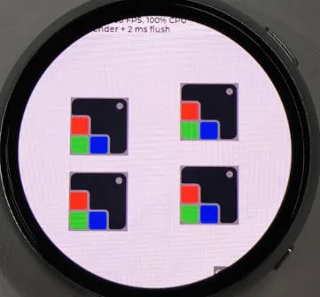
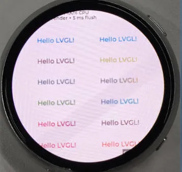
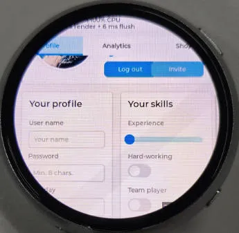
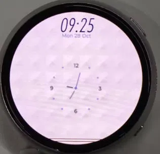
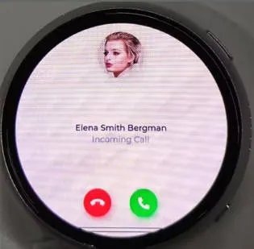
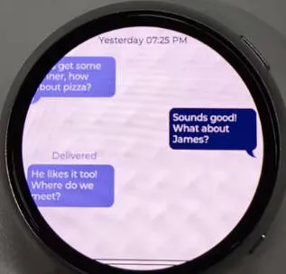
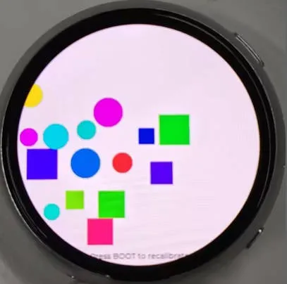
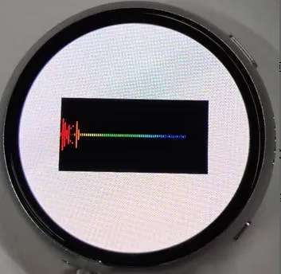

# Working with ESP-IDF

This chapter includes the following sections, please read as needed:

- [Setting Up Development Environment](#esp-idf-setup)
- [Demo](#demo)

## Setting up the Development Environment{#esp-idf-setup}

:::info
For the ESP32-S3-Touch-AMOLED-1.75C development board, it is recommended to use ESP-IDF V5.5.0 or higher.
:::

import EspidfSetup from '@site/docs/ESP32/snippets/EspidfSetup.mdx';

<EspidfSetup />

## Demo

The ESP-IDF demos are located in the `ESP-IDF` directory of the [demo package](https://github.com/waveshareteam/ESP32-S3-Touch-AMOLED-1.75C/tree/main/examples).

|                            Demo                             |                               Basic Description                               |
| :-------------------------------------------------: | :----------------------------------------------------------------------: | 
|            [01_AXP2101](#Demo-1-AXP2101)            |                  Gets power-related data by driving the AXP2101 via the ported XPowersLib                    |
|        [02_lvgl_demo_v9](#Demo-2-lvgl_demo_v9)      |                                       LVGL Demonstration                                       |
|      [03_esp-brookesia](#Demo-3-esp-brookesia)      |             Demonstrates a complete phone-style UI system, including status bar, navigation bar, app launcher, and gesture interaction components         |
|    [04_Immersive_block](#Demo-4-Immersive_block)    | Uses the QMI8658 six-axis sensor to collect acceleration data, driving randomly generated geometric shapes rendered by the LVGL graphics library to move in sync with device tilt |
|      [05_Spec_Analyzer](#Demo-5-Spec_Analyzer)      |  Showcases a real-time audio spectrum visualization analyzer, presenting audio frequency distribution intuitively via 64 colored symmetrical spectrum bars with peak tracking  |

### 01_AXP2101 {#Demo-1-AXP2101}

#### Demo Description

- This demo demonstrates porting XPowersLib in ESP-IDF, and driving AXP2101 to obtain power-related data through the ported XPowersLib

#### Hardware Connection

- Connect the development board to the computer

#### Code Analysis

- `i2c_init`: Initializes the I2C master device, preparing it for communication with other devices (e.g., the PMU)
  - Configures I2C parameters, including setting the master device mode, specifying the SDA and SCL pins, enabling the pull-up resistor, and determining the clock frequency
  - Installs the I2C driver to apply the configuration to the actual hardware
- `pmu_register_read`: Reads a series of byte data from a specific register of the PMU
  - Performs parameter checks to ensure the incoming parameters are valid and avoid invalid read operations
  - Performs I2C operations in two steps, first sends the register address to read, then reads the data During the reading process, different processing is carried out according to the length of bytes to be read to ensure accurate reading of the data. At the same time, handles error cases in the I2C communication process and returns the corresponding status code so that the upper-layer code can determine if the read operation is successful

#### Operation Result

- This demo will not light up the screen
- The serial port monitor displays the parameters: chip temperature, charging state, discharging state, standby state, Vbus connection, Vbus condition, charger status, battery voltage, Vbus voltage, system voltage, battery percentage

### 02_lvgl_demo_v9 {#Demo-2-lvgl_demo_v9}

#### Demo Description

- This demo runs the LVGL V9 demo program

#### Hardware Connection

- Connect the development board to the computer

#### Operation Result

| 
 
 | 
 
 | 
 
 |
| ----------------------------------------------------------------------- | ----------------------------------------------------------------------- | ----------------------------------------------------------------------- |

### 03_esp-brookesia {#Demo-3-esp-brookesia}

#### Demo Description

- This example demonstrates a complete phone-style UI system, including components such as a status bar, navigation bar, app launcher, and gesture interaction

#### Hardware Connection

- Connect the development board to the computer

#### Operation Result

| 
 
 | 
 
 | 
 
 |
| ----------------------------------------------------------------------- | ----------------------------------------------------------------------- | ----------------------------------------------------------------------- |

### 04_Immersive_block {#Demo-4-Immersive_block}

#### Demo Description

- This example uses the QMI8658 six-axis sensor to collect acceleration data, driving randomly generated geometric shapes rendered by the LVGL graphics library to move in sync with device tilt

#### Hardware Connection

- Connect the development board to the computer

#### Code Analysis

- `generate_random_shapes()`: Generates graphics randomly
    - Initializes the random seed (based on system time) and resets the shape count
    - Loops to attempt generating shapes, up to 100 attempts to find a valid position (not overlapping with existing shapes)
    - Valid position criteria: The shape's center is within the screen boundaries and does not overlap with any previously generated shape
    - For a valid position: Updates the LVGL object position (`lv_obj_set_pos`) and stores it in the shapes array
    - For an invalid position: Deletes the LVGL shape object to avoid memory leaks
- `perform_level_calibration()`: Core function for horizontal calibration
    - Collects 200 acceleration samples, calculates the average value for X/Y axes as the bias values (`accel_bias_x/y`)
    - Detects sample fluctuation range (if the range for X/Y axes is greater than 0.1, calibration is considered unstable and a retry is triggered)
    - After calibration is complete, sets the `calibration_done` flag and prints the bias information

#### Operation Result

 

### 05_Spec_Analyzer {#Demo-5-Spec_Analyzer}

#### Demo Description

- This example showcases a real-time audio spectrum visualization analyzer. It intuitively presents audio frequency distribution via 64 colored symmetrical spectrum bars with peak tracking

#### Hardware Connection

- Connect the development board to the computer

#### Code Analysis

- `timer_cb`: LVGL timer callback function, responsible for spectrum visualization rendering
    - Canvas and Layer Initialization: Gets the canvas object, initializes an LVGL layer (layer rendering improves refresh efficiency and prevents flickering), and clears the screen (black background)
    - Basic Parameter Calculation: Calculates spectrum bar width (canvas width / 64), canvas center Y coordinate (for symmetrical drawing), and spectrum bar gap
    - Iterates to render 64 spectrum bars
    - Layer Rendering Completion: Calls `lv_canvas_finish_layer` to commit the layer rendering and updates the canvas display
- `lv_example_canvas_10`: Canvas initialization
    - Static Draw Buffer Definition: Uses `LV_DRAW_BUF_DEFINE_STATIC` to define a 300×150 pixel RGB565 format draw buffer
    - Canvas Creation: Creates an LVGL canvas object, sets its size and centers it, and binds the static draw buffer
    - Timer Creation: Creates a 33ms timer, binds the `timer_cb` callback function, and passes the canvas object as user data to enable timed rendering

#### Expected Result

 

