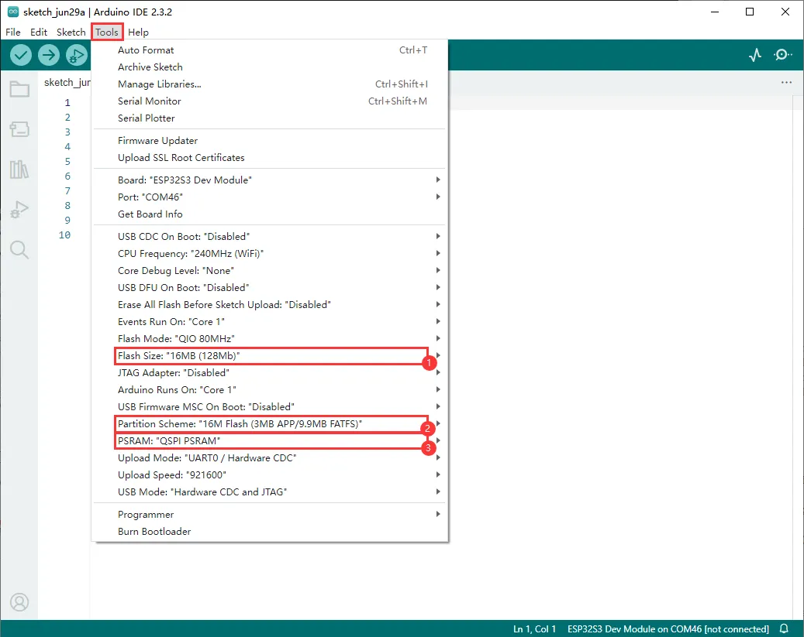
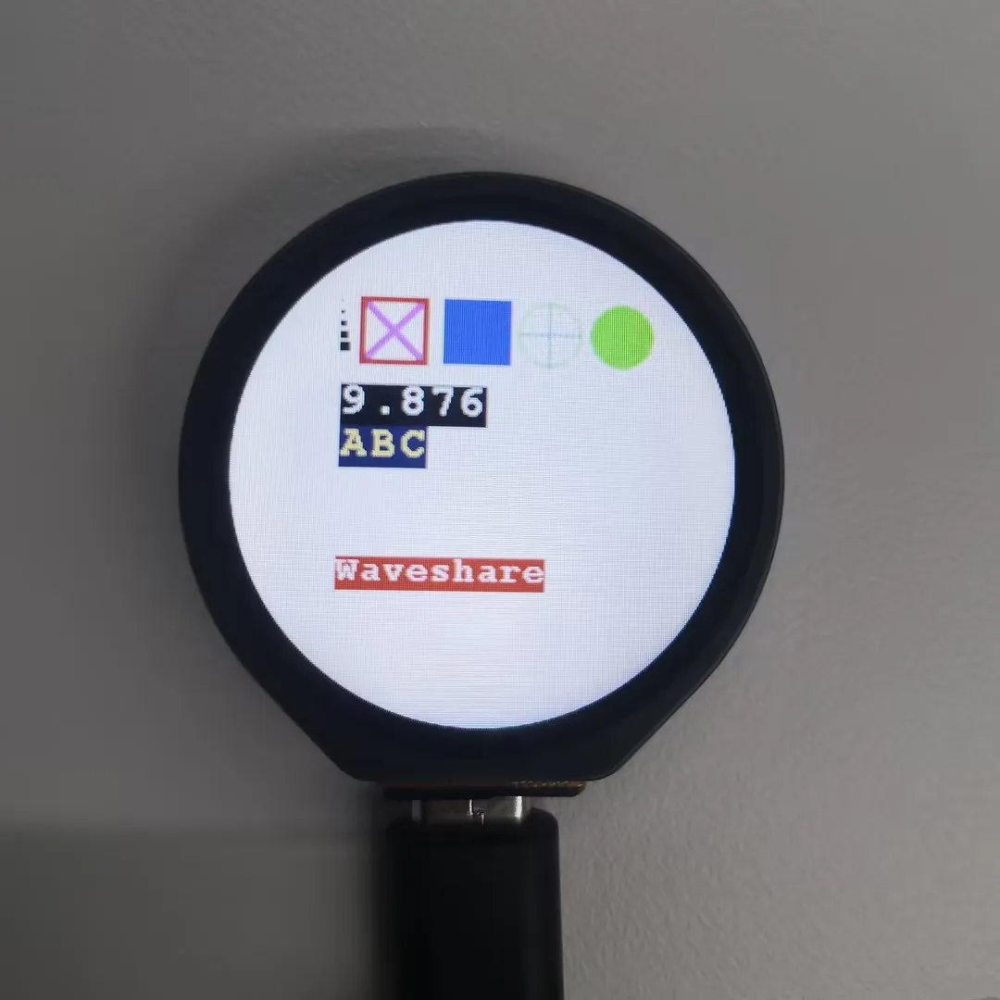
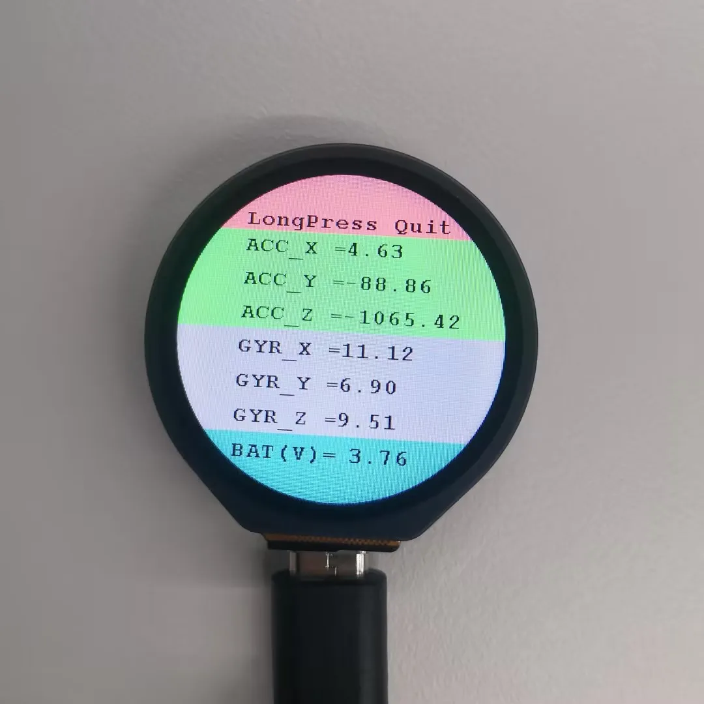
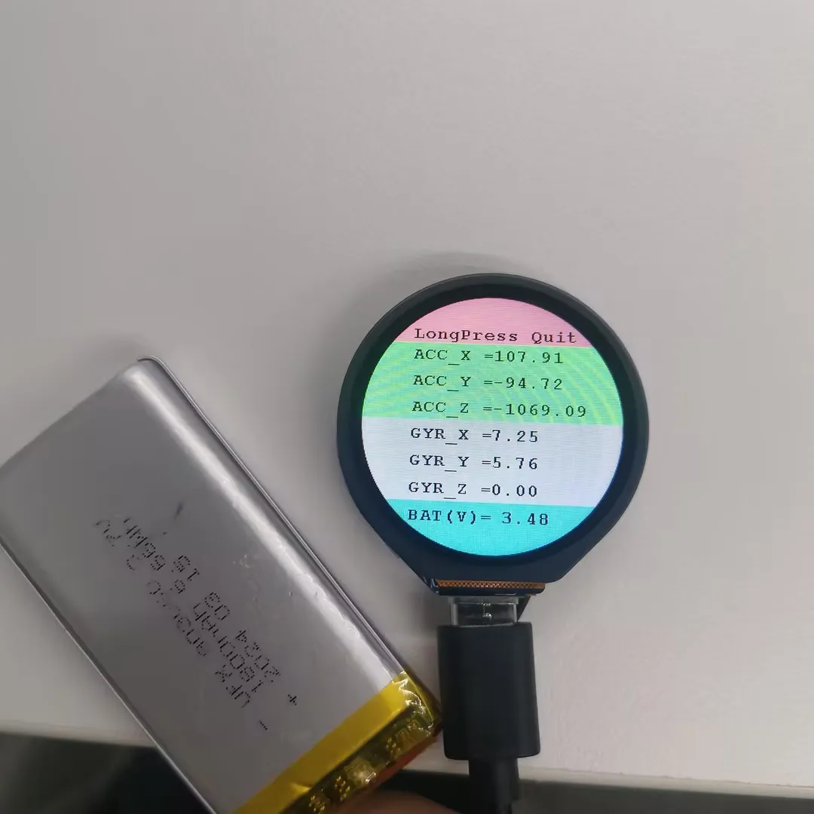
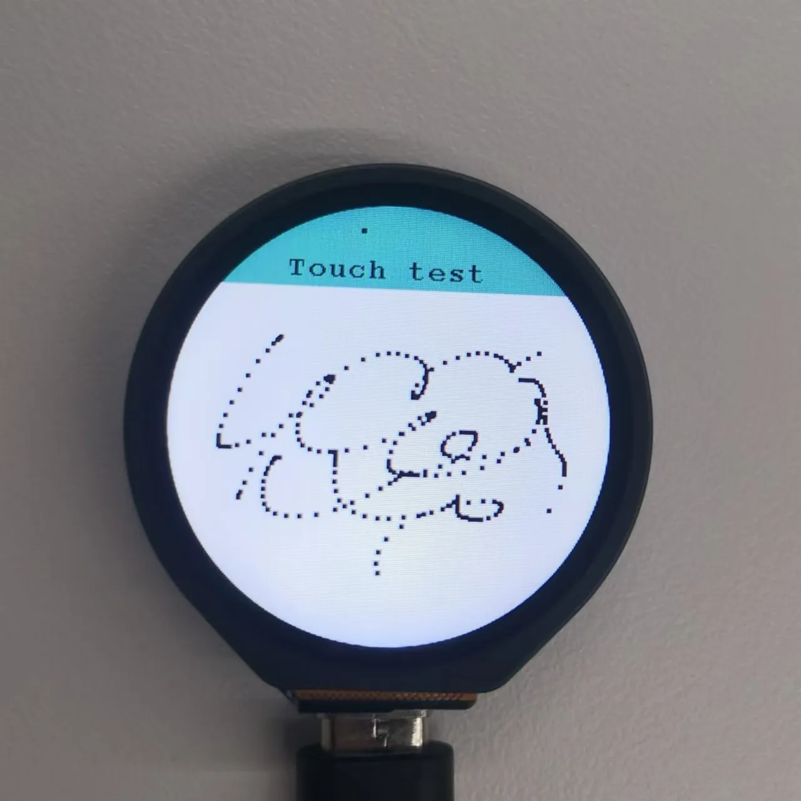
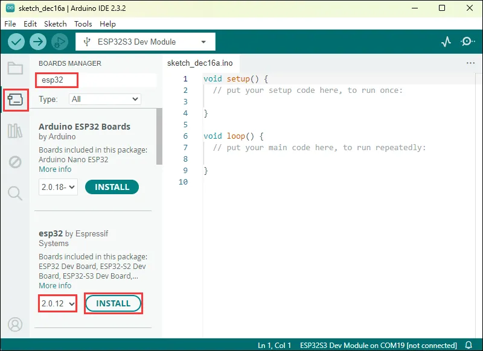
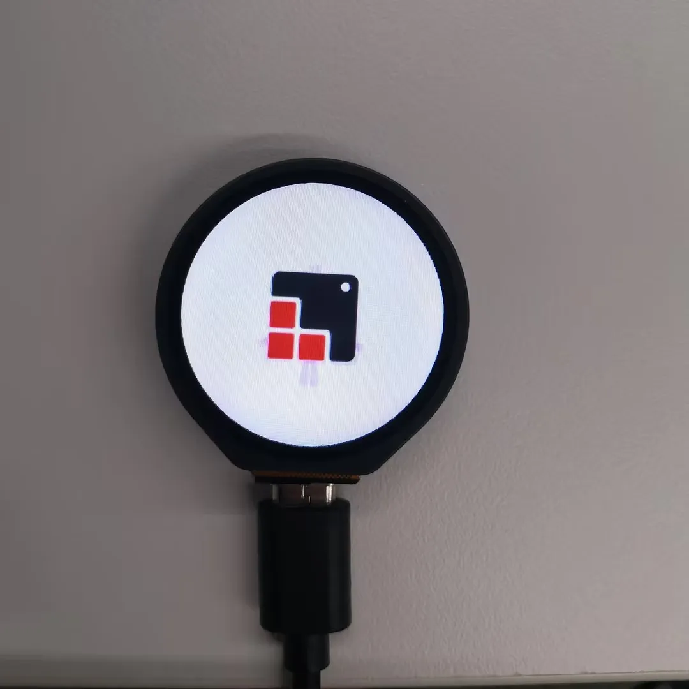
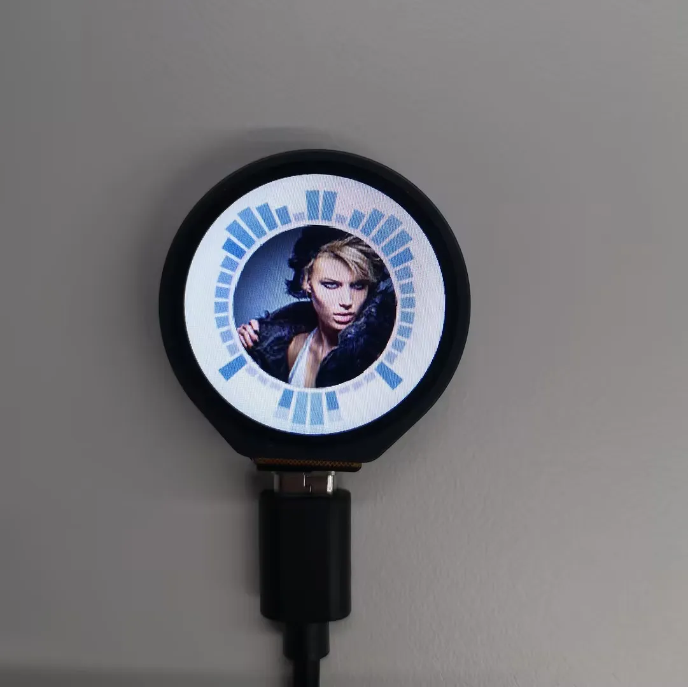
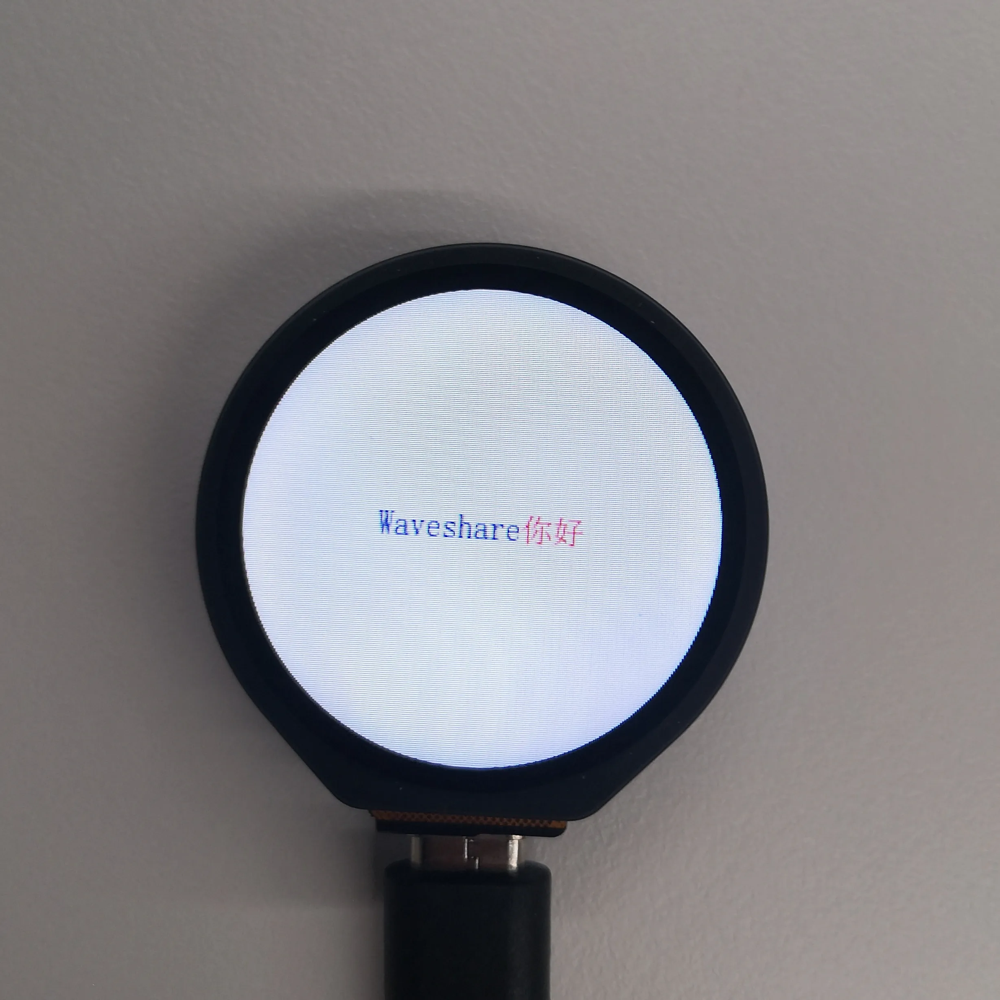
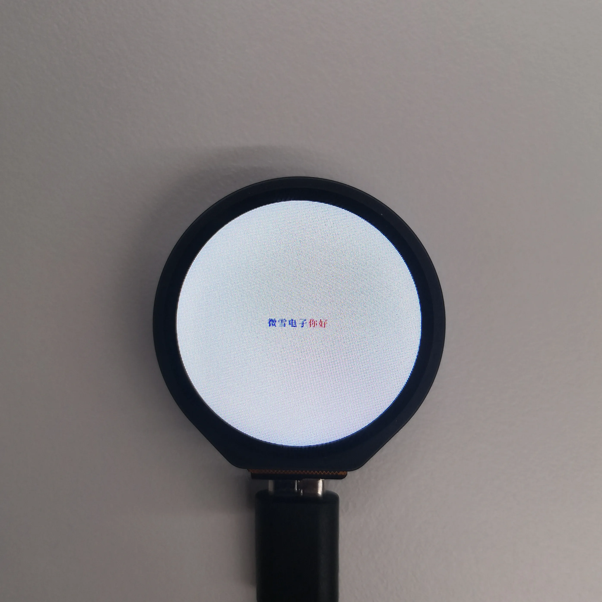

import Tabs from '@theme/Tabs';
import TabItem from '@theme/TabItem';
import Details from '@theme/Details';
import ArduinoTutorialIntro from '@site/docs/ESP32/snippets/ArduinoTutorialIntro.mdx';

# Working with Arduino

This chapter contains the following sections. Please read as needed:

- [Arduino Getting Started](#arduino-getting-started)
- [Setting Up Development Environment](#setting-up-development-environment)
- [Demo](#demo)

## Arduino Getting Started{#arduino-getting-started}

<ArduinoTutorialIntro />

## Setting Up Development Environment

### 1. Installing and Configuring Arduino IDE

Please refer to the tutorial **[Installing and Configuring Arduino IDE](/docs/ESP32/Tutorials/Arduino-Tutorials/01-Arduino-IDE-Setup.md)** to download and install the Arduino IDE and add ESP32 support.

|               Board Name                |                 Installation Requirement               |             Version Requirement              |
| :----------: | :----: | :------------------: |
|    esp32 by Espressif Systems      |            "Install Offline" / "Install Online"        |                3.1.0                   |

### 2. Installing Libraries

- When installing Arduino libraries, there are typically two methods: **Install Online** and **Install Offline**. If the library installation requires **Install Offline**, you must use the provided library file.
- For most libraries, users can easily search for and install them via the Arduino IDE's online Library Manager. However, some open-source or custom libraries are not synchronized to the Arduino Library Manager and therefore cannot be found through online search. In this case, users can only install these libraries manually via offline methods.
- The sample program package for the ESP32-S3-Touch-LCD-1.28 development board can be downloaded from [here](./Resources-And-Documents.md#Demo). The `Arduino\libraries` directory within the package already contains all the library files required for this tutorial.

| Library/File Name  | Description  | Version  | Installation Method |
| :----------: | :----: | :------------: | :--------: |
|     LVGL              | Graphics Library               | v8.3.10       |  "Install Offline" |
|     TFT_eSPI          | LCD library                  | 	v2.5.34      | "Install Offline" |
|     TFT_eSPI_Setups   |  Custom library           | --            | "Install Offline" |

:::warning Version Compatibility Notes

There are strong dependencies between versions of LVGL and its driver libraries. For example, a driver written for LVGL v8 may not be compatible with LVGL v9. To ensure that the examples can be reproduced reliably, it is recommended to use the specific versions listed in the table above. Mixing different versions of libraries may lead to compilation failures or runtime errors.
:::

### 3. Arduino Project Parameter Settings

 

## Demo

The Arduino demos are located in the `Arduino/examples` directory of the [demo package](./Resources-And-Documents.md#Demo).

| Demo | Basic Program Description | Dependency Library|
| :--------------------------------------------------------------: | :------------------------------------------------------------------------: | :---------------------------------------------------------: |
| ESP32-S3-Touch-LCD-1.28-Test   |  Test onboard devices                            |                  ---                    |
| LVGL_Arduino                   |  Display LVGL benchmark, music, etc.              |       LVGL, TFT_eSPI , TFT_eSPI_Setups   |
| LVGL_Chinese_Font              |  Display LVGL's built-in 1000 common Chinese characters         |       LVGL, TFT_eSPI, TFT_eSPI_Setups   |
| LVGL_Chinese_7500_Char         |  Display LVGL's built-in 7500 Chinese characters	             |   LVGL, TFT_eSPI, TFT_eSPI_Setups      |

### ESP32-S3-Touch-LCD-1.28-Test

**Demo Description**

- This demo is used to test the screen, 6-axis sensor, BAT, and touch sensor

**Hardware Connection**

- Connect the board to the computer using a USB cable
  
 
  
  

**Code Analysis**

- `setup()`:
  - Initializes serial communication with a baud rate of 115200
  - Initializes the touch sensor
  - Initializes the external PSRAM (if available) and allocate memory space for the images
  - Initializes the LCD display, including setting it to horizontal display mode, clearing the screen to white, creating a new image cache, and setting the relevant parameters
  - Performs a series of graphic drawing operations, including drawing points, lines, rectangles, circles, numbers, strings, and more, and display them on the LCD
  - Reads the data from the QMI8658 sensor and displays it on the LCD, while also detecting touch events
  - Finally, performs a touch test: when a touch event occurs, draws a point at the touched location and updates the display

**Operation Result**
- After power-on, the screen first displays white, red, green, and blue colors at 2-second intervals to check for light leakage or dead pixels. If the colors change too quickly and are not clearly visible, press the `RESET` button to restart.
- Then, the sensor test begins. After the color display, sensor data will be shown on the screen. The ACC_X, ACC_Y, and ACC_Z values change as the device's angle changes; the GYR_X, GYR_Y, and GYR_Z values change with the device's movement acceleration
- At this point, connect a 3.7V lithium battery. Under normal conditions, the BAT (V) value will decrease.
- After checking the sensor, long press the red area "LongPress Quit" to enter the touch test phase. Tap the demo on the white area of the Touch test
- Simply flash the demo. The LCD screen will display as shown in the figures:
  | 
 
  | 
 
 | 
 
 | 
 
  |
  | --- | ------ | ---- | ---- |

- If errors occur, ensure that the ESP32 board version is 2.0.12
  
 

### LVGL_Arduino

**Demo Description**

- The demo is used to display LVGL benchmark, music, etc

**Hardware Connection**

- Connect the development board to the computer

**Code Analysis**

- `void my_disp_flush()`: Callback function in the LVGL library for display refreshing; responsible for refreshing the contents of LVGL's draw buffer to the TFT LCD
  - `lv_disp_drv_t *disp_drv`: Pointer to the provided display driver structure, which contains display-related information and function pointers. In this function, it is used to notify LVGL that the refresh is complete
  - `const lv_area_t *area`: Pointer to the defined area structure, indicating the region that needs to be refreshed. This area is a rectangular area relative to the entire display screen
  - `lv_color_t *color_p`: Pointer to the defined color structure, representing the color data to be displayed within the refresh area. In this function, the drawing is done by writing this color data to the TFT buffer
- `void example_increase_reboot()`: Timer callback function containing a counter `count`. Each call increments the counter, and when the count reaches a certain value, it triggers an action – here, simulating a reboot after 30 timer triggers. The specific behavior can be adjusted as needed
- `void my_touchpad_read()`: Input device read callback function in the LVGL library, used to handle touch screen input events
  - `lv_indev_drv_t *indev_drv`: Pointer to the LVGL input device driver structure. This structure contains information about input devices and callback functions
  - `lv_indev_data_t *data`: Pointer to the LVGL input device data structure. The structure is used to store the status and data of the input device, including the current touch state (pressed or released) and the coordinates of the touch points

**Operation Result**
- LCD screen display:
  | 
 
  | 
 
 |
  | --- | ------ | 

- If errors occur, ensure that the ESP32 board version is 2.0.12
  
 

### LVGL_Chinese_Font

**Demo Description**

- The demo is used to display LVGL's built-in 1000 common Chinese characters

**Hardware Connection**

- Connect the development board to the computer

**Code Analysis**

- `my_disp_flush()`
  - This function is the refresh callback function for the LVGL display driver
  - Calculates the width `w` and height `h` to be refreshed based on the incoming display area parameter `area`
  - Calls TFT display functions `tft.startWrite()`, `tft.setAddrWindow()`, and `tft.pushColors()` to write the color data `color_p` from LVGL to the specified area of the TFT display
  - Finally, calls `lv_disp_flush_ready()` to notify LVGL that the refresh is complete

**Operation Result**
- LCD screen display:
  
 

- If errors occur, ensure that the ESP32 board version is 2.0.12
  
 

### LVGL_Chinese_7500_Char

**Demo Description**

- The demo is used to display LVGL's 7500 Chinese characters. The font file is large, so downloading the firmware takes a relatively long time

**Hardware Connection**

- Connect the development board to the computer

**Code Analysis**

- `setup()`
  - First, initializes serial communication with a baud rate of 115200, in preparation for possible serial debugging
  - Initializes `LVGL (Light and Versatile Graphics Library)`, including outputting version information and registering a log print callback function (if logging is enabled)
  - Initializes the TFT display `tft` and touch sensor `touch`, including setting the display rotation direction and possible touch calibration data
  - Initializes LVGL's display buffer `draw_buf` and display driver `disp_drv`, sets the display resolution, refresh callback function, etc., and register the display driver with LVGL
  - Initializes the input device driver `indev_drv`, sets it to pointer type, specifies the touch read callback function, and then registers the input device driver
  - Creates a label `label`, sets the text font, text content (supports color re-drawing), and centers it on the screen
  - Optionally calls LVGL example or demo functions to showcase different functional effects
- `loop()`
  - Calls the `lv_timer_handler()` function to let the LVGL graphics library handle its internal timer tasks and events
  - Introduces a small delay using the `delay(5)` function to avoid excessive CPU usage

**Operation Result**
- LCD screen display:
  
 

- If errors occur, ensure that the ESP32 board version is 2.0.12
  
 
