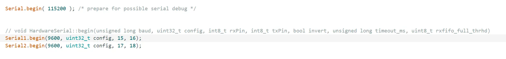
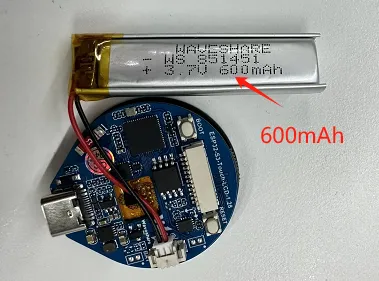

import Details from '@theme/Details';

# FAQ

  - Press and hold the Reset button for more than 1 second, wait for the PC to re-recognize the device, then download again
  - You can press and hold the `BOOT` button, simultaneously press `RESET`, then release `RESET`, and finally release the `BOOT` button. At this point, the module will enter download mode, which can resolve most download issues.

  - This situation may be caused by an unstable USB port due to a blank Flash. You can press and hold the `BOOT` button, simultaneously press `RESET`, then release `RESET`, and finally release the `BOOT` button. At this point, the module will enter download mode to flash the firmware (program), which should resolve the issue.

  - The first compilation being slow is normal; just wait patiently

  - Some AppData folders are hidden by default. You can set your system to show them.
  - English System: File Explorer -> View -> Check "Hidden items"
  - Chinese System: File Explorer -> View -> Show -> Check "Hidden items"

  - Windows System:
    - ①Check via Device Manager: Press <kbd>Windows</kbd> + <kbd>R</kbd> to open the "Run" dialog box. Type `devmgmt.msc` and press Enter to open Device Manager. Expand the "Ports (COM & LPT)" section. All COM ports and their current status will be listed here.
    - ②Check using Command Prompt: Open the Command Prompt (CMD), type the `mode` command, which will display status information for all COM ports.
    - ③Check Hardware Connection: If an external device is already connected to a COM port, the device typically occupies a port number. You can determine which port is being used by checking the connected hardware.

  - Linux System:
    - ①Check using the `dmesg` command: Open the terminal.
    - ②Check using the `ls` command: Type `ls /dev/ttyS*` or `ls /dev/ttyUSB*` to list all serial devices.
    - ③Check using the `setserial` command: Type `setserial -g /dev/ttyS*` to view configuration information for all serial devices.

  - Install the [MAC driver](https://files.waveshare.com/wiki/common/CH34XSER_MAC.7z) and then flash again.

  - GC9A01A

  - Yes, just specify the pins directly when initializing UART:
    
 
    
    

  - MX1.25 2P connector, which can be used to connect a 3.7V battery, supports charging and discharging, as shown in the figure:
    
 
    
    

