# MicroPython

This chapter contains the following sections. Please read as needed:

- [MicroPython Getting Started Tutorials](#micropython-getting-started)
- [Setting Up Development Environment](#setting-up-development-environment)

## MicroPython Getting Started Tutorials {#micropython-getting-started}

New to ESP32 MicroPython development and want to get started quickly? We have prepared a general introductory tutorial **[ESP32 MicroPython Getting Started](/docs/ESP32/Tutorials/MicroPython-Tutorials/index.md)** for you.

- [Section 1 Set Up Development Environment](/docs/ESP32/Tutorials/MicroPython-Tutorials/01-Setup.md)
- [Section 2 Basics](/docs/ESP32/Tutorials/MicroPython-Tutorials/02-Basics.md)
- [Section 3 GPIO Digital Output/Input](/docs/ESP32/Tutorials/MicroPython-Tutorials/03-Digital-IO.md)
- [Section 4 ADC Analog Input](/docs/ESP32/Tutorials/MicroPython-Tutorials/04-Analog-Input.md)
- [Section 5 PWM Output](/docs/ESP32/Tutorials/MicroPython-Tutorials/05-PWM.md)
- [Section 6 UART Communication](/docs/ESP32/Tutorials/MicroPython-Tutorials/06-UART-Communication.md)
- [Section 7 I2C Communication](/docs/ESP32/Tutorials/MicroPython-Tutorials/07-I2C-Communication.md)
- [Section 8 SPI Communication](/docs/ESP32/Tutorials/MicroPython-Tutorials/08-SPI-Communication.md)
- [Section 9 Wi-Fi Networking Basics](/docs/ESP32/Tutorials/MicroPython-Tutorials/09-WiFi-Networking.md)
- [Section 10 Web Server](/docs/ESP32/Tutorials/MicroPython-Tutorials/10-Web-Server.md)
- [Section 11 Bluetooth](/docs/ESP32/Tutorials/MicroPython-Tutorials/11-Bluetooth-Communication.md)
- [Section 12 Comprehensive Projects](/docs/ESP32/Tutorials/MicroPython-Tutorials/12-Fun-Project.md)

## Setting Up Development Environment{#setting-up-development-environment}

### 1. Flash MicroPython Firmware and Configure Thonny

Please refer to the **[Set Up MicroPython Development Environment](/docs/ESP32/Tutorials/MicroPython-Tutorials/01-Setup.md#setup-micropython)** to flash the MicroPython firmware.

### 2. Other Tips

- MicroPython Firmware Download Link: https://micropython.org/download/ESP32_GENERIC_S3/

- If flashing the MicroPython firmware using the [Espressif Flash Download Tool](https://dl.espressif.com/public/flash_download_tool.zip), the flashing address is `0x0`.

## Demo

|                            Demo                             |                               Basic Description                               |
| :-----------------------: | :------------------------------------------: |
| cst816_example.py   |          Touch the screen, print corresponding coordinates                                       |
|  alien.py           |       Randomly display the "alien.jpg" image                                     |
|  bitarray.py        |      Create and display multiple randomly positioned "Pac-Man" sprite animations                        |
|  hello.py           |   Randomly display "Hello!" text in different colors, and cycle through different rotation angles     |
|  hershey.py         |           Cycle through displaying different greetings                                        |
|  jpg.py             |                Display two JPEG images alternately                                |
| noto_fonts.py       |        Display the names of three different fonts                                         |
| pbitmap.py          |                Display a pre-compiled bitmap image                               |
| rotation.py         |      Cycle through displaying text effects at different rotation values                               |
|  scroll.py          |          Implement smooth scrolling display of characters on the screen                             |

## Uploading Demos and Special Demos

### Uploading Demos
- To upload a local file to the development board, select the file, right-click, and choose "upload to/" to download
  
 
  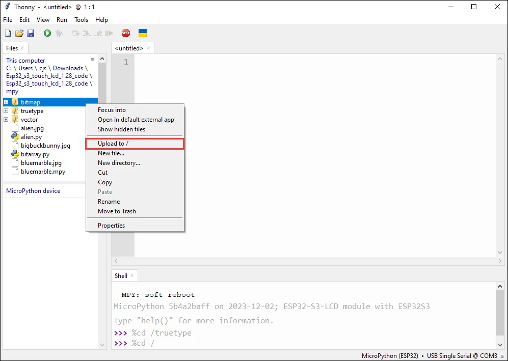
  

- Below is the interface after all files have been downloaded. Ensure the downloaded files match those in the red box exactly, otherwise execution may fail
  
 
  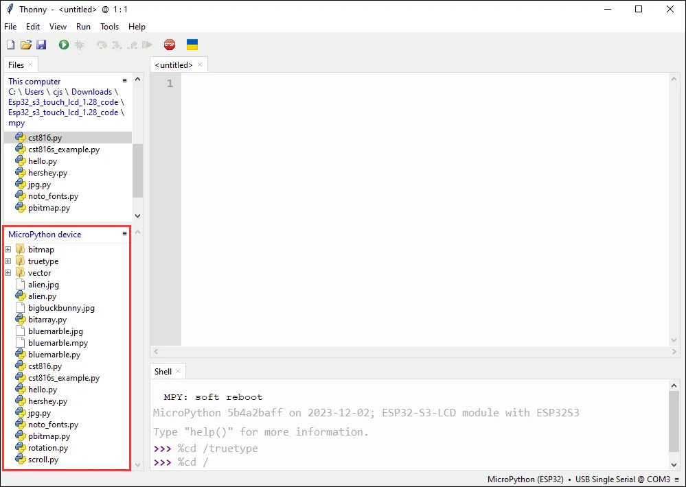
  

- Select a file with the `.py` extension, click the green button to flash and run (operation screenshots are provided later)
  
 
  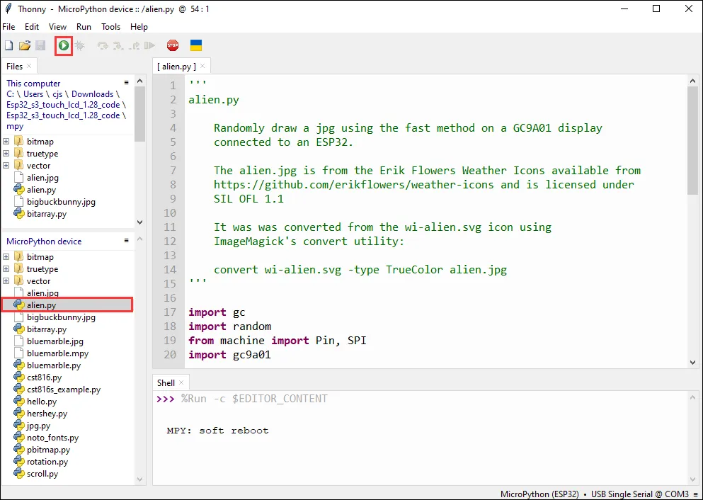
  

- To run another file, first click the red Stop button; only then can the other file run correctly
  
 
  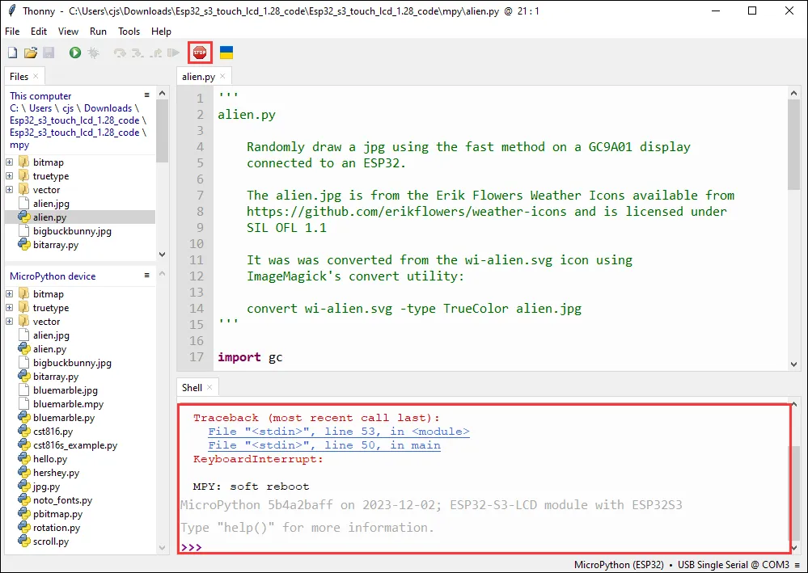
  

### Special Demos
Among the provided demos, the files `bluenarble.py`, `cst816.py`, and `cst816_example.py` are special. Please read all the following points before trying to flash them yourself.
- `bluenarble.py` stores an image, and `cst816.py` contains functions for touchpad operations. **Running them shows no visible effect**
  
 
  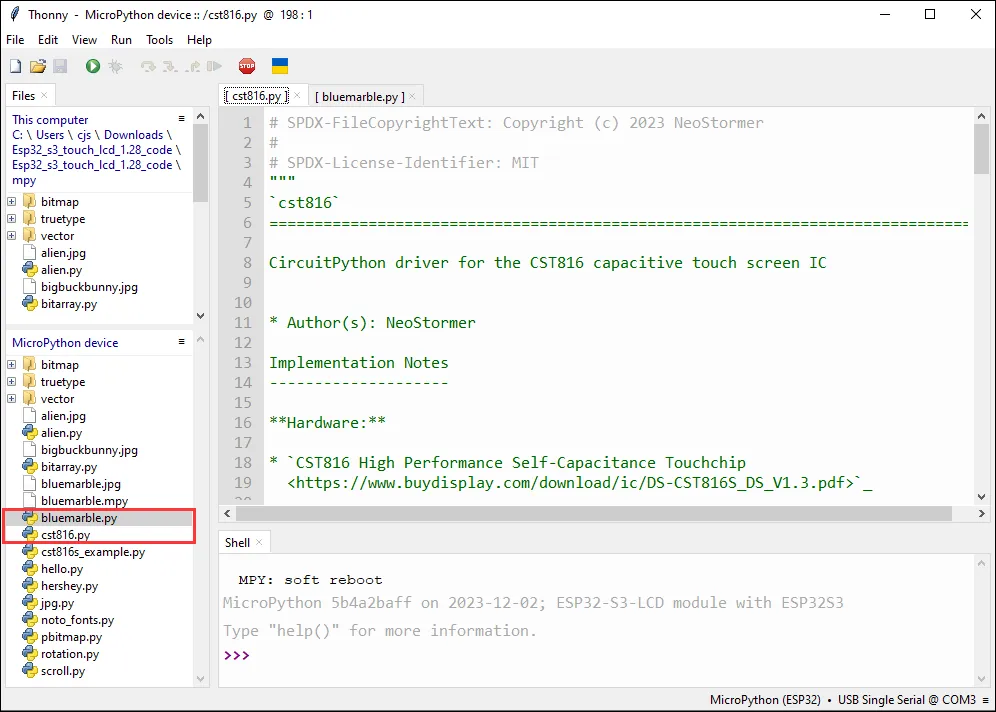
  

- After running `cst816_example.py`, touching the screen will print the corresponding coordinates, but **the LCD will not light up**
  
 
  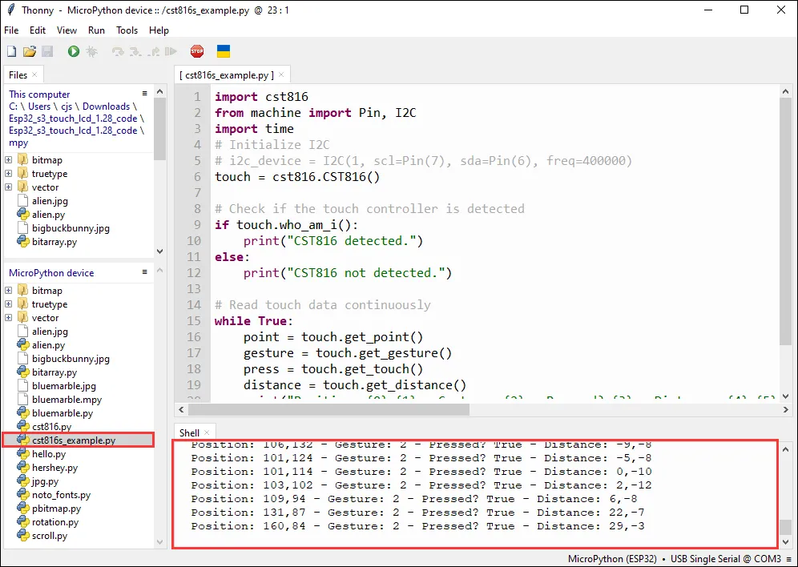
  

### alien.py

#### Demo Description

- This demo is used to randomly display the `"alien.jpg"` image on a specific display

#### Hardware Connection

- Connect the development board to the computer
  
 
  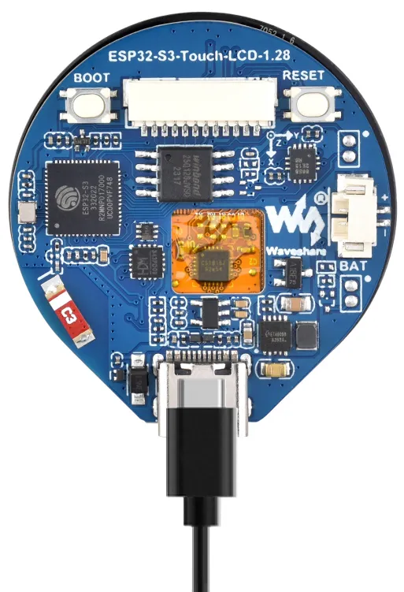
  

#### Code Analysis

- `GC9A01()`: The GC9A01 constructor is important for establishing hardware connections, setting initial parameters, and creating an operable display object, laying the foundation for subsequent display operations
- `spi_interface`: Establishes SPI communication with the display
- `width` and `height`: Sets the display resolution
- `reset_pin`: Connects the various control pins of the display
- `rotation`: Sets the initial rotation angle

#### Operation Result
- LCD screen display
  
 
  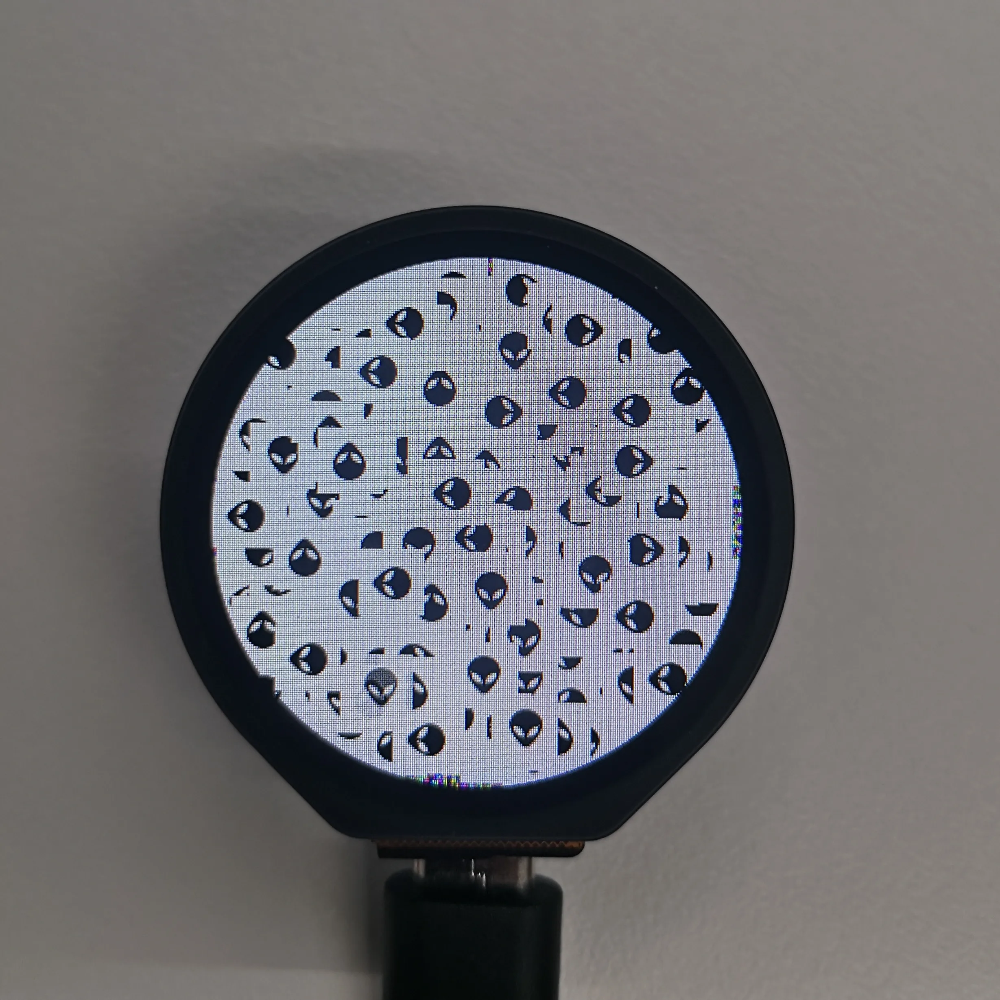
  

### bitarray.py

#### Demo Description

- The demo creates and displays an animation of multiple randomly positioned "Pac-Man" sprites on a specific display

#### Hardware Connection

- Connect the development board to the computer

#### Code Analysis

- **The `move` method of the `pacman` class**: Responsible for updating the state of the "Pac-Man" sprite, achieving its movement and animation effects on the screen
  - First, it increments the sprite's current step count, then uses modulo operation to ensure the step cycles within the defined `SPRITE_STEPS` range, which likely corresponds to different animation frames or states of the sprite
  - Next, it moves the sprite's position horizontally. When the sprite's horizontal position reaches a specific value (302), it resets the step count, possibly to trigger a specific animation state or behavior. Finally, it ensures the sprite's horizontal position cycles within a certain range using modulo to avoid going out of the display area
- **`tft.map_bitarray_to_rgb565`**
  - The `tft.map_bitarray_to_rgb565` function selects bitmap data from `SPRITE_BITMAPS` based on the sprite's current step count and converts it into an RGB565 format buffer `sprite`. It also specifies the sprite's width, foreground color, and background color
- **`tft.blit_buffer`**
  - The `tft.blit_buffer` function draws the converted buffer onto a specific position on the display, determined by the sprite's current coordinates, and specifies the sprite's width and height

#### Operation Result
- LCD screen display
  
 
  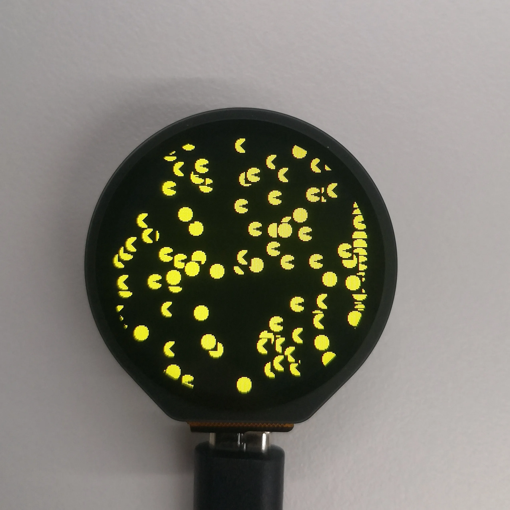
  

### hello.py

#### Demo Description

- The demo randomly displays displays "Hello!" text in different colors on a specific display and cycles through different rotation angles

#### Hardware Connection

- Connect the development board to the computer

#### Code Analysis

- `tft.text`: Draws the text "Hello!" on the display
  - It uses the specified font, determines the text position randomly within the display area, and sets the foreground and background colors based on randomly generated RGB565 color values
- `while True`: Implements the dynamic effect of randomly displaying "Hello!" text at different rotation angles
  - Through an infinite loop and iterating over four rotation angles, it sets the display rotation angle, clears the screen, calculates the text display range, and repeatedly calls the `tft.text` function to display the text at random positions with random colors

#### Operation Result
- LCD screen display
  
 
  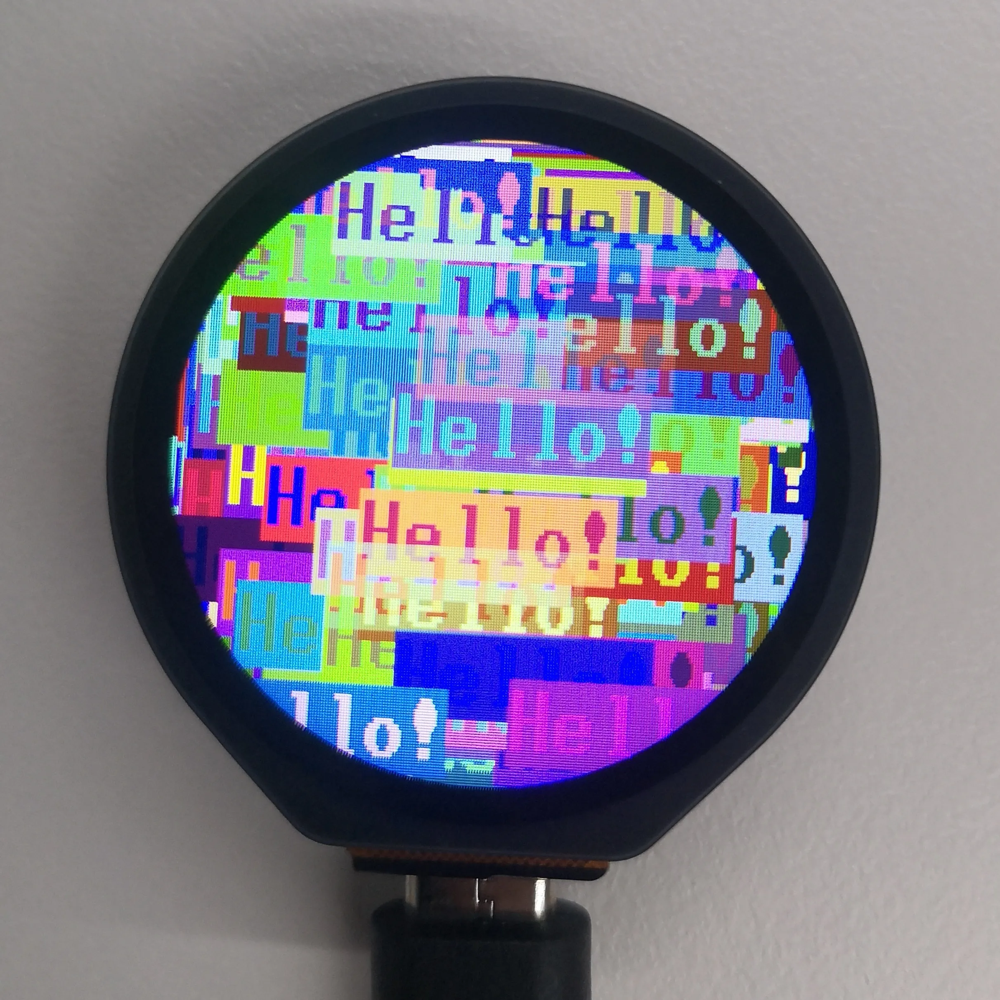
  

### hershey.py

#### Demo Description

- The demo cycles through displaying different greetings on a specific display

#### Hardware Connection

- Connect the development board to the computer

#### Code Analysis

- `main`: The loop part in the function, cycles through displaying greetings in different fonts and colors on the display
  - It moves the display position line by line, gets the next color, font, and greeting, clears the previous line content, draws the new content, resets the line position when it exceeds a certain range, and adds a delay to control the display speed
- `cycle`: Creates a cyclically iterable object
  - It accepts parameters. If the parameter is iterable, it iterates directly. If it's a single element, it converts it into an iterable list and returns it cyclically. This is used to conveniently cycle through lists of colors, fonts, and greetings

#### Operation Result
- LCD screen display
  
 
  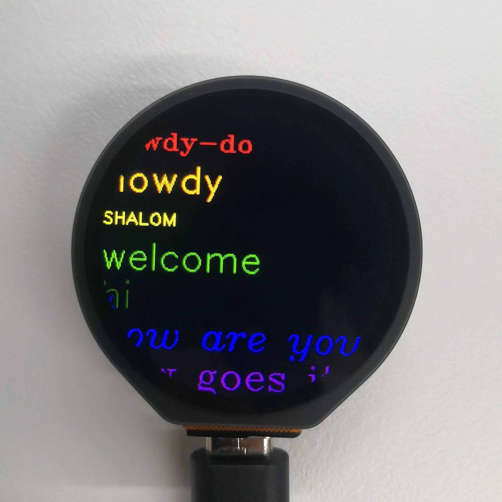
  

### jpg.py

#### Demo Description

- This demo displays two JPEG images alternately on a specific display

#### Hardware Connection

- Connect the development board to the computer

#### Code Analysis

- `main`: The loop part in the function, cycles through displaying greetings in different fonts and colors on the display
  - It iterates through the list of image filenames, calls the `tft.jpg` function to display the image at a specific position in slow mode, then waits for 5 seconds
- `tft.jpg`: Displays a specified JPEG image on the display
  - It reads, decodes the image file, and draws it onto the display. The display position and mode are determined by the passed parameters

#### Operation Result
- LCD screen display
  | 
 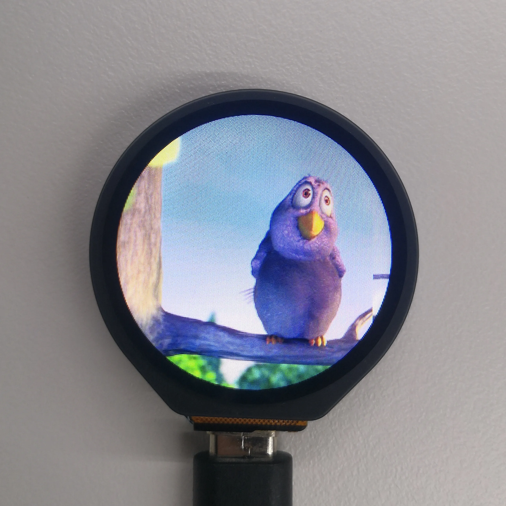
  | 
 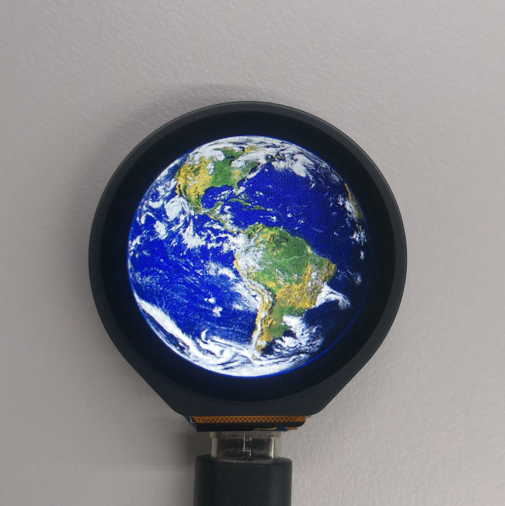
 |
  | --- | ------ |

### noto_fonts.py

#### Demo Description

- The demo displays the names of three different fonts (NotoSans, NotoSerif, NotoSansMono) centered on different lines of a specific display

#### Hardware Connection

- Connect the development board to the computer

#### Code Analysis

- `main`: The main entry point of the program, initializes the display and displays the three font names
  - Creates a display object and initializes it, fills the background with black, and calls the `center` function to display the three font names sequentially
- `center`: Displays a given string centered on the display using the specified font
  - Gets the display width, calculates the width of the string. If the string width is less than the screen width, it calculates the coordinates for horizontal centering; otherwise, it left-aligns it. Finally, it displays the string at the calculated position

#### Operation Result
- LCD screen display
  
 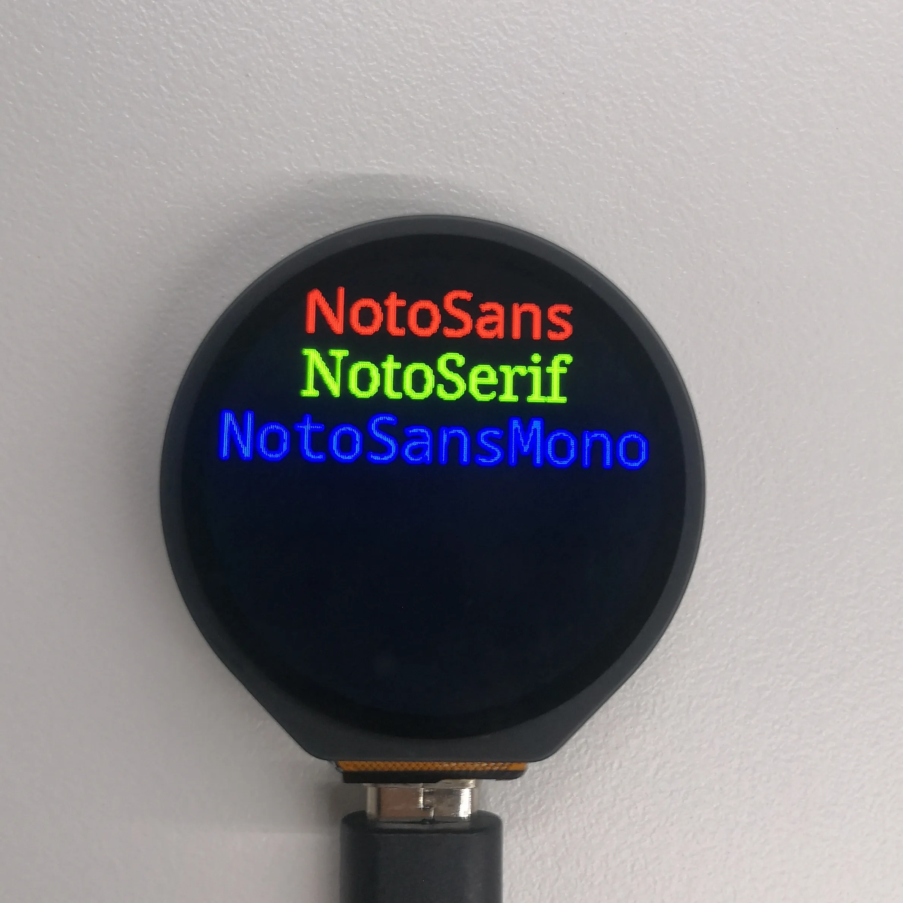

### pbitmap.py

#### Demo Description

- This demo displays a pre-compiled bitmap image on a specific display

#### Hardware Connection

- Connect the development board to the computer

#### Code Analysis

- `main`: The main entry point of the program, initializes the display and displays the bitmap
  - Creates a display object, initializes it, fills the background with black, and calls `tft.pbitmap` to display the image from the pre-compiled bitmap module
- `tft.pbitmap`: Displays a pre-compiled bitmap on the display
  - Reads the bitmap data and draws it onto the display. The display position is determined by the passed parameters

#### Operation Result
- LCD screen display
  
 
 

### rotation.py

#### Demo Description

- The demo cycles through displaying text effects at different rotation values on a specific display

#### Hardware Connection

- Connect the development board to the computer

#### Code Analysis

- `main`: The main entry point of the program, initializes the display and cycles through displaying text effects at different rotation values
  - Creates a display object and initializes it. In a loop, it sequentially sets different rotation values, clears the screen, displays text containing the rotation value information, and waits for observation
- `tft.rotation`: Sets the display rotation angle
  - Adjusts the display orientation based on the passed parameter

#### Operation Result
- LCD screen display
  
 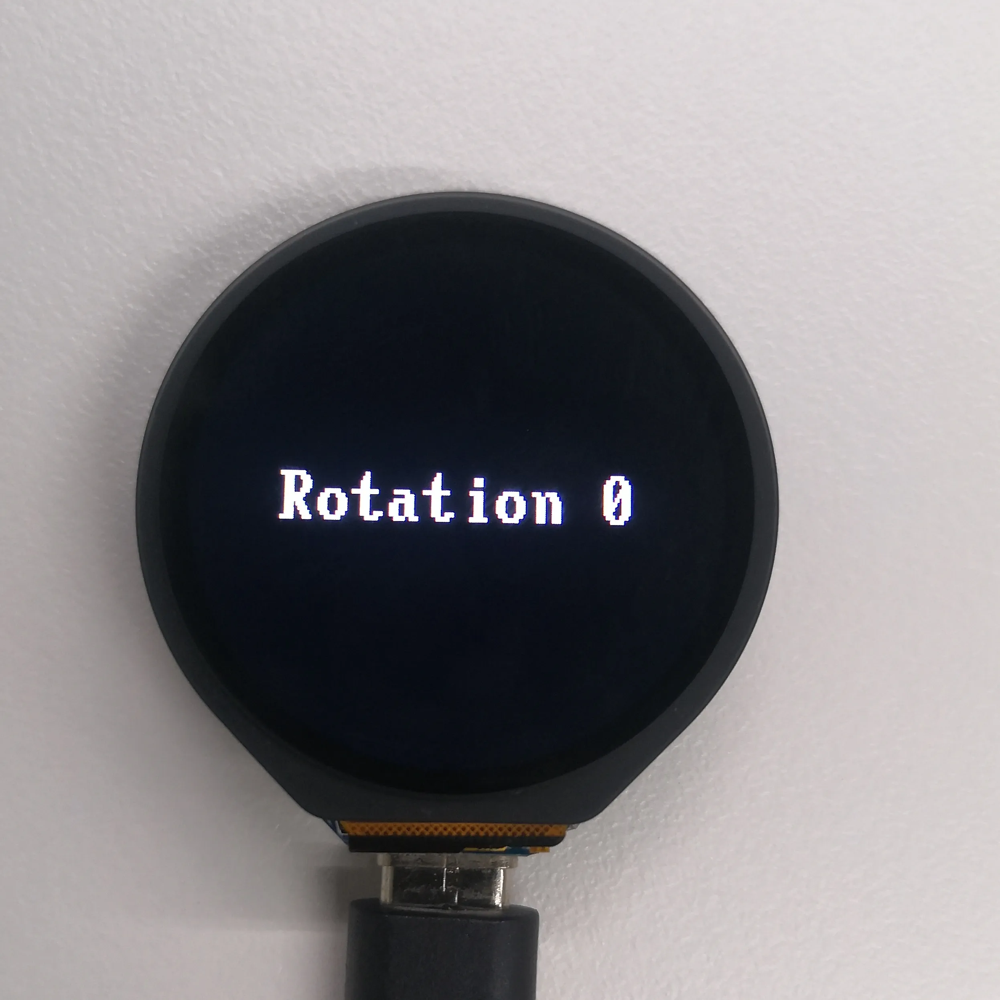
 

### scroll.py

#### Demo Description

- This demo implements smooth scrolling display of characters on a specific display

#### Hardware Connection

- Connect the development board to the computer

#### Code Analysis

-  `main`: The main entry point of the program, initializes the display, sets colors, and scrolls characters
  - Creates a display object, sets up a color generator to get foreground colors, initializes the display, sets the scrolling area, clears the top line in a loop, displays new characters on a new line, updates colors and character values, implements scrolling by setting the scroll address, and controls the speed
-  `cycle`: Creates a cyclically iterable object
  -  Accepts parameters. If the parameter is iterable, it iterates directly. If it's a single element, it converts it into an iterable list and returns it cyclically

#### Operation Result
- LCD screen display
  
 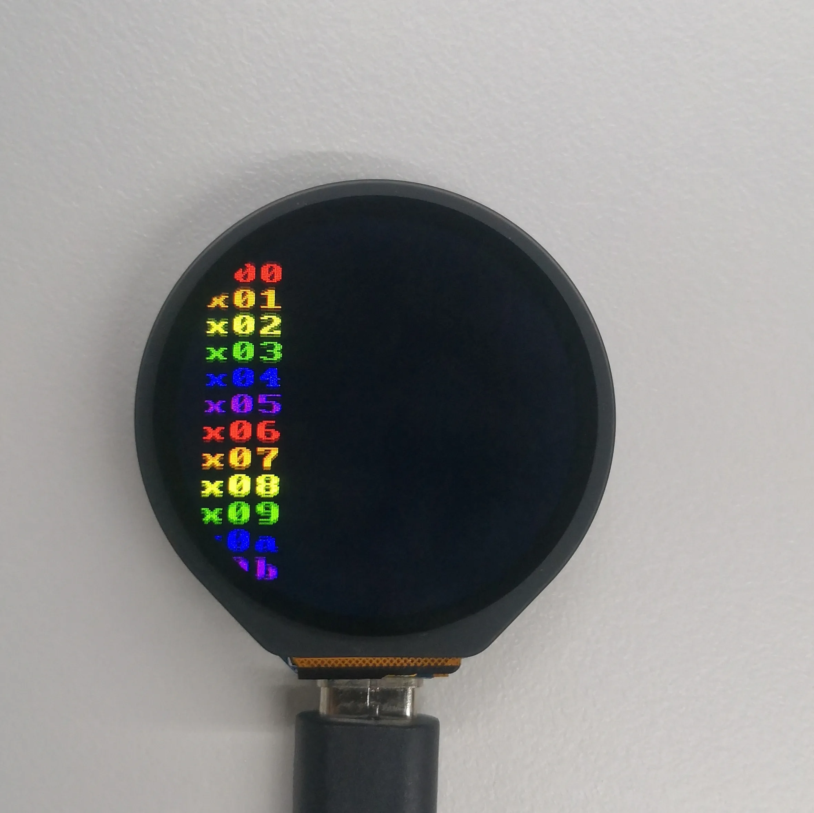
 