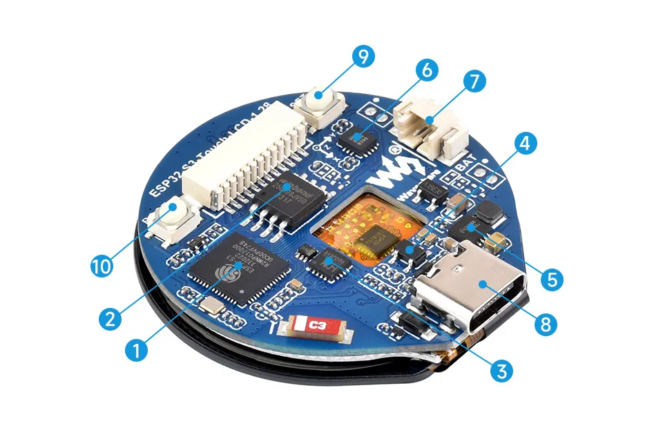
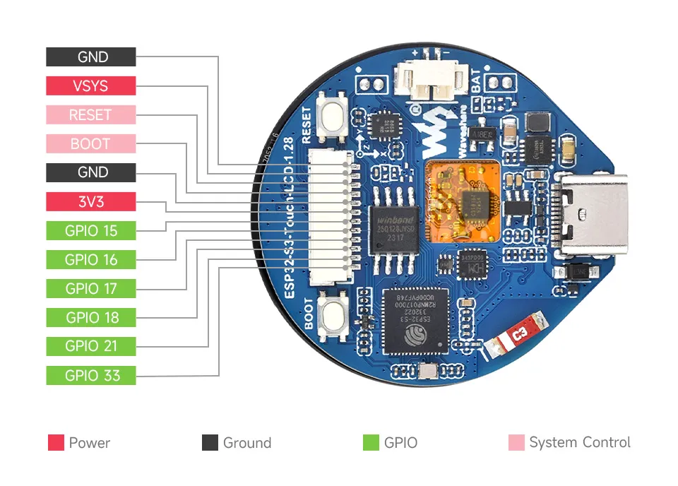
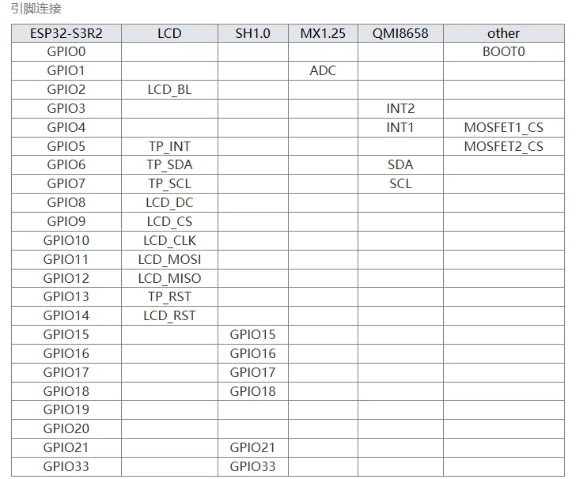
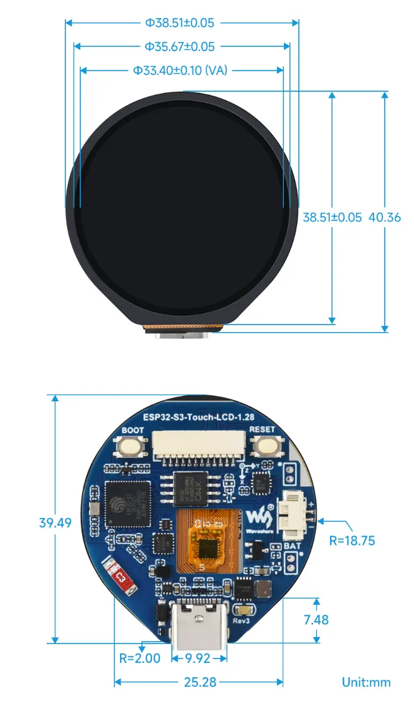

# ESP32-S3-Touch-LCD-1.28

 

 

The ESP32-S3-Touch-LCD-1.28 is a low-cost, high-performance microcontroller development board designed by Waveshare. It features an onboard 1.28inch capacitive touch LCD screen, a lithium battery charging chip, a 6-axis sensor (3-axis accelerometer and 3-axis gyroscope), and other peripherals. It utilizes the ESP32-S3R2, a System-on-Chip (SoC) integrating low-power Wi-Fi and BLE 5.0, and also includes external 16MB Flash and 2MB PSRAM. The SoC's integrated hardware encryption accelerators, RNG, HMAC, and Digital Signature modules meet the security requirements of IoT applications. Its multiple low-power operating states meet the power consumption requirements of application scenarios such as the Internet of Things (IoT), mobile devices, wearable electronic devices, and smart homes.

| SKU | Product |
| ------ |   ------------------ |
| 25098 | ESP32-S3-Touch-LCD-1.28 |
|26959 |ESP32-S3-Touch-LCD-1.28-B|

## Features

- Equipped with a high-performance Xtensa 32-bit LX7 dual-core processor clocked at up to 240 MHz
- Supports 2.4 GHz Wi-Fi (802.11 b/g/n) and Bluetooth® 5 (LE) with an onboard antenna
- Built-in 512KB SRAM and 384KB ROM, with stacked 2MB PSRAM and external 16MB Flash
- Features a Type-C interface for easy plug-and-play (no orientation concerns)
- Onboard 1.28inch capacitive touch LCD screen, 240×240 resolution, 65K colors
- Onboard QMI8658 6-axis IMU (3-axis accelerometer, 3-axis gyroscope) for motion detection and posture sensing
- Onboard 3.7V lithium battery charge/discharge interface and a SH1.0 connector that exposes 6 GPIOs
- Supports precise control features like flexible clocking and independent module power supply settings, enabling low-power modes for multiple scenarios
- Integrated USB full-speed serial controller, GPIOs can be flexibly configured for peripheral functions

## Onboard Resources

 

1. **ESP32-S3R8** WiFi and Bluetooth SoC, 240MHz operating frequency, packaged with 2MB PSRAM
2. **W25Q128JVSIQ** 16MB NOR-Flash
3. **CH343P** USB to UART chip
4. **ME6217C33M5G** 800mA output, low dropout, high PSRR LDO
5. **ETA6096** High-efficiency lithium battery charging chip
6. **QMI8658** 6-axis IMU includes a 3-axis gyroscope and a 3-axis accelerometer
7. **MX1.25 Battery Connector** MX1.25 2P connector for connecting a 3.7V lithium battery, supports charging and discharging
8. **USB Type-C Interface** USB to serial port for program flashing and logging
9. **RESET Button** 
10. **BOOT Button** Press and hold while resetting to enter download mode

## Interfaces

 

- **Type-C Interface**: The development board uses the CH343P chip for USB to UART conversion, connecting to the ESP32-S3's UART_TXD (GPIO43) and UART_RXD (GPIO44) for firmware flashing and logging. With the integrated automatic download circuit, it directly downloads the firmware upon connecting the Type-C cable.
- **SH1.0 Connector**: The board exposes 6 GPIOs for external connections. These GPIOs can be configured for peripheral functions like I2C, SPI, etc. VSYS can be used to directly input 5V to power the development board
- **LCD Interface**: The board features a 1.28inch screen communicating via 4-wire SPI, with SPI speeds up to 80MHz. Touch uses I2C communication. (The development board uses GPIO2 to control backlight brightness. Additionally, two MOSFETs for controlling switched contacts are routed around the battery holder, connected to GPIO4 and GPIO5 respectively. These can be used to solder low-current devices like vibration motors. For details, please refer to the [Schematic](https://files.waveshare.com/wiki/ESP32-S3-Touch-LCD-1.28/ESP32-S3-Touch-LCD-1.28-Sch.pdf))
- **I2C Interface**: The ESP32-S3 provides multiple hardware I2C channels. Currently, GPIO6 (SDA) and GPIO7 (SCL) are used for the I2C bus. The onboard QMI8658 6-axis IMU and the LCD touch controller are connected to this bus. For details, please refer to the [Schematic](https://files.waveshare.com/wiki/ESP32-S3-Touch-LCD-1.28/ESP32-S3-Touch-LCD-1.28-Sch.pdf)
- **MX1.25 Connector**: GPIO1 on the development board is used as the battery voltage measurement pin. The battery voltage is divided using a 200kΩ and 100kΩ series resistor network and connected to GPIO1. The ESP32-S3 series has 2 12-bit SAR ADC units. The voltage conversion formula used in the source code is `3.3 / (1<<12) * 3 * AD_Value`

 

## Dimensions

 

## Specifications

- LCD Specifications
  |Display Driver|GC9A01A|Display Interface|SPI|
  | :-: | :-: | :-: | :-: |
  |Touch Controller|CST816S|Touch Interface|I2C|
  |Resolution|240(H)RGB x 240(V)|Display Area|Φ32.4mm|
  |Display Panel|IPS|Pixel Size|0.135(H) x 0.135(V) mm|
- IMU Specifications
  |Sensor|QMI8658|
  | :-: | :-: |
  |Accelerometer Features|Resolution: 16-bit  Scale (Selectable): ±2, ±4, ±8, ±16g|
  |Gyroscope Features  |Resolution: 16-bit  Scale (Selectable): ±16, ±32, ±64, ±128, ±256, ±512, ±1024, ±2048°/sec|

## Development Methods

The ESP32-S3-Touch-LCD-1.28 supports two development frameworks: Arduino IDE and MicroPython. This provides developers with flexible options, allowing you to choose the appropriate development tools based on project requirements and personal preferences.

Each method has its advantages, and developers can choose based on their needs and skill level.

- **Arduino IDE** is a convenient, flexible, and easy-to-use open-source electronics prototyping platform. It requires minimal foundational knowledge, allowing for rapid development after a short learning period. Arduino has a vast global community that provides a wealth of open-source code, project examples, tutorials, and rich libraries that encapsulate complex functionalities, enabling developers to implement various features quickly. You can refer to the **[Working with Arduino](./Arduino.md)** to complete the initial setup, and the tutorial also provides related demos for reference.

- **MicroPython**: MicroPython is a complete implementation of the Python 3 programming language that runs directly on embedded hardware like ESP32 and Raspberry Pi Pico. You can run Python scripts directly on the board via REPL, making it ideal for rapid prototyping. For specific configuration steps, please refer to the **[MicroPython Setup Tutorial](./MicroPython.md)**; the tutorial also provides relevant example programs for reference.