<!-- Example-related Image References -->
import EspidfTutorialIntro from '@site/docs/ESP32/snippets/EspidfTutorialIntro.mdx';
import EspidfSetup from '@site/docs/ESP32/snippets/EspidfSetup.mdx';

# ESP-IDF

This chapter contains the following sections. Please read as needed:

- [ESP-IDF Getting Started](#esp-idf-getting-started)
- [Setting Up Development Environment](#esp-idf-setup)
- [Demo](#demo)

## ESP-IDF Getting Started{#esp-idf-getting-started}

<EspidfTutorialIntro />

## Setting Up Development Environment{#esp-idf-setup}

:::info
For the ESP32-S3-Touch-LCD-3.49 development board, ESP-IDF V5.5.0 or above is required.
:::

<EspidfSetup />

## Demo

|                         Demo                         |   Basic Program Description | Dependency Library|
| :--------------: | :-----------------------------------------: | :----------: |
| 01_ADC_Test | Get the voltage value of the lithium battery | - |
| 02_I2C_PCF85063 | Print real-time time of RTC chip | SensorLib |
| 03_I2C_QMI8658 | Print the raw data from IMU | SensorLib
| 04_SD_Card | Load and display the information of the TF card | - |
| 05_WIFI_AP | Set to AP mode to obtain the IP address of the access device | - |
| 06_WIFI_STA | Set to STA mode to connect to WiFi and obtain an IP address | - |
| 07_BATT_PWR_Test | Control power via the PWR button when powered solely by the lithium battery |      -       |
| 08_Audio_Test | Play the sound recorded by the microphone through the speaker | - |
| 09_LVGL_V8_Test | LVGLV9 demo | LVGL V8.4.0 |
| 10_LVGL_V9_Test | LVGLV8 demo | LVGL V9.3.0 |
| 11_FactoryProgram | Comprehensive demo | LVGL V8.3.11|


### 01_ADC_Test

**Demo Description**

- The analog voltage connected through the GPIO is converted to digital by the ADC, and then the actual lithium battery voltage is calculated and printed to the terminal.

**Hardware Connection**

- Connect the board to the computer using a USB cable

**Code Analysis**

- `adc_bsp_init(void)`: Initializes ADC1, including creating an ADC one-shot trigger unit and configuring Channel 3 of ADC1.
- `adc_get_value(float *value,int *data)`: Reads the value from Channel 3 of ADC1, calculates the corresponding voltage based on the reference voltage and resolution, and stores it at the location pointed to by the passed pointer. Stores 0 if the read fails.
- `adc_example(void* parameter)`: After initializing ADC1, creates an ADC task. This task reads the ADC value every second and calculates the system voltage from the raw ADC reading.

**Operation Result**

- After the program is compiled and downloaded, you can view the printed ADC values and voltage output by opening the Serial Monitor, as shown in the following image:

  <div style={{maxWidth: 800}}>
  	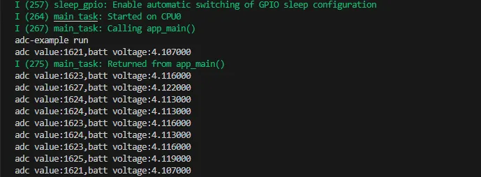
  </div>

### 02_I2C_PCF85063

**Demo Description**

- Through the I2C protocol, initialize the PCF85063 chip, set the time, and then periodically read the time and print it to the terminal

**Hardware Connection**

- Connect the board to the computer using a USB cable

**Code Analysis**

- `void i2c_rtc_loop_task(void *arg)`: Creates an RTC task to implement the RTC function, reading the clock of the RTC chip every second and outputting it to the terminal.

**Operation Result**

- After the program is compiled and downloaded, open the serial port monitoring to see the RTC time of the printout, as shown in the following figure:<br />

  <div style={{maxWidth: 800}}>
  		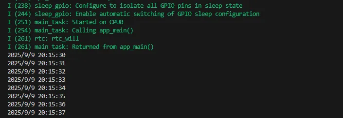
  </div>

### 03_I2C_QMI8658

**Demo Description**

- Initialize the QMI8658 chip via the I2C protocol, then read the corresponding attitude information every 200ms and print it to the terminal.

**Hardware Connection**

- Connect the board to the computer using a USB cable

**Code Analysis**

- `void i2c_qmi_loop_task(void *arg)`: Creates a QMI task to acquire attitude information. The task reads and prints accelerometer and gyroscope data at 200ms intervals, and outputs the results to the serial console.

**Operation Result**

- Open the serial monitor to view the raw data output from the IMU (Euler angles require conversion), as shown in the figure below:

  <div style={{maxWidth: 800}}>
  		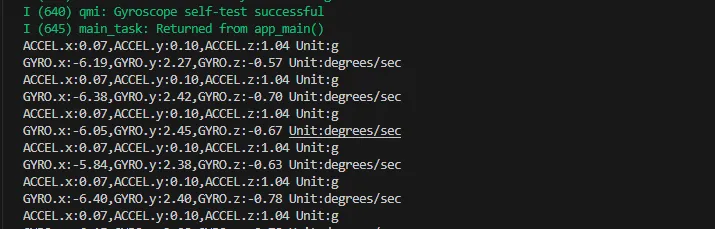
  </div>

### 04_SD_Card

**Demo Description**

- Drive the TF card through SDMMC, and print the TF card information to the terminal after successfully mounting.

**Hardware Connection**

- Install a FatFs-formatted into the board before powering on

**Code Analysis**

- `sdcard_init(void)`: Initializes the TF card using 1-line SDMMC mode.
- `sdcard_loop_task(void *arg)`: A task to test TF card read/write functionality. You need to uncomment the `#define sdcard_write_Test` macro definition.
  ```cpp
  //#define sdcard_write_Test
  ```

**Operation Result**

- Click on the serial port monitoring device, you can see the output information of the TF card, as shown in the figure below:

  <div style={{maxWidth: 800}}>
  	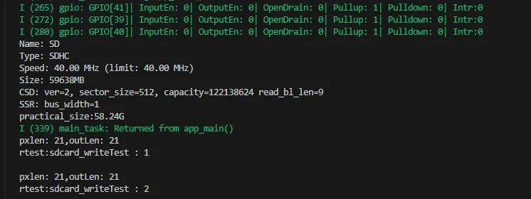
  </div>

### 05_WIFI_AP

**Demo Description**

- This demo can set the development board as a hotspot, allowing phones or other devices in STA mode to connect to the development board.

**Hardware Connection**

- Connect the board to the computer using a USB cable

**Code Analysis**

- In the file `softap_example_main.c`, find `SSID` and `PASSWORD`, and then your phone or other device in STA mode can use the SSID and PASSWORD to connect to the development board.
  ```cpp
  #define EXAMPLE_ESP_WIFI_SSID      "waveshare_esp32"
  #define EXAMPLE_ESP_WIFI_PASSWORD      "wav123456"
  ```

**Operation Result**

- After flashing the program, open the Serial Terminal. If a device successfully connects to the hotspot, it will output the device's MAC address and IP address, as shown in the figure:

  <div style={{maxWidth: 800}}>
  	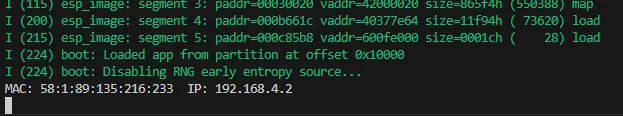
  </div>

### 06_WIFI_STA

**Demo Description**

- This example can configure the development board as a STA device to connect to a router, thereby enabling access to the system network.

**Hardware Connection**

- Connect the board to the computer using a USB cable

**Code Analysis**

- In the file `esp_wifi_bsp.c`, find `ssid` and `password`, then modify them to the SSID and Password of an available router in your current environment.
  ```cpp
  wifi_config_t wifi_config = {
    .sta = {
      .ssid = "PDCN",
      .password = "1234567890",
    },
  };
  ```

**Operation Result**

- After flashing the program, open the serial terminal, if the device is successfully connected to the hotspot, the IP address obtained will be output, as shown in the figure:

  <div style={{maxWidth: 800}}>
		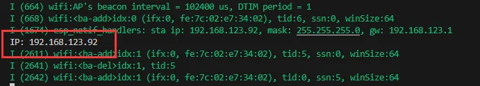
  </div>

### 07_BATT_PWR_Test

**Demo Description**

- Demonstrates how to control the system power via the PWR button when powered by the lithium battery.

**Hardware Connection**

- Connect the board to the computer using a USB cable

**Code Analysis**

- `setup_ui(lv_ui *ui)`: Initializes the UI interface for visual control.
- `tca9554_init()`: Initialize the lithium battery control IO port.
- `button_Init()`: Initialize buttons and various trigger events.
- `example_button_pwr_task(void* parmeter)`: Task that waits for button event triggers.

**Operation Result**

- After the program is flashed, disconnect the USB power supply and connect the lithium battery. Power on by pressing and holding the PWR button, as shown in the figure:

  <div style={{maxWidth: 500}}>
		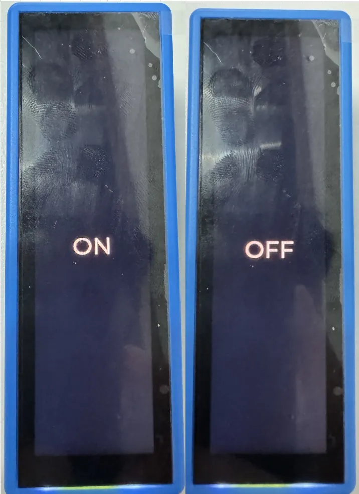
  </div>

  :::tip
  1. Press and hold the PWR button, wait for the screen to display "On", which means that the startup is successful, and release the button
  2. Press and hold the PWR button again, wait for the screen to display "Off", which means that the power is turned off successfully, and release the button
  :::

### 08_Audio_Test

**Demo Description**

- Demonstrates how to get data from the microphone and then play it through the speaker

**Hardware Connection**

- Connect the board to the computer using a USB cable

**Code Analysis**

- `i2c_master_Init()`: Initializes the I2C bus.
- `tca9554_init()`: Initializes the I/O ports for audio amplifier CTRL control.
- `lvgl_port_init()`: Initializes the LVGL interface.
- `user_audio_bsp_init()`: Initializes the audio interface.

**Operation Result**

- After the program is flashed, as shown in the figure:

  <div style={{maxWidth: 250}}>
		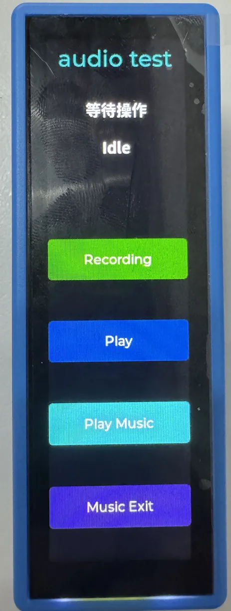
  </div>

  :::tip
  1. Click Recording to enter recording mode, speak into the MIC, and it will automatically end after 3 seconds
  2. Click Play to play the sound you just recorded
  3. Click Play Music to play a piece of music
  4. Click Music Exit to interrupt music playback
  :::

### 09_LVGL_V8_Test

**Demo Description**

- Helps users quickly implement UI design by porting LVGL V8.

**Hardware Connection**

- Connect the board to the computer using a USB cable

**Code Analysis**

- If a 90-degree display rotation is needed, locate the `#define Rotated` macro in the `user_config.h` file and assign the value `"USER_DISP_ROT_90"`.
- If backlight testing is required, locate the `#define Backlight_Testing` macro in the `user_config.h` file and assign the value `"true"`.
  ```cpp
  #define Backlight_Testing 0
  #define USER_DISP_ROT_90 1
  #define USER_DISP_ROT_NONO  0
  #define Rotated USER_DISP_ROT_NONO   //Rotation via software
  ```

**Operation Result**

- After the program is flashed, the device operation result is as follows:

  <div style={{maxWidth: 250}}>
		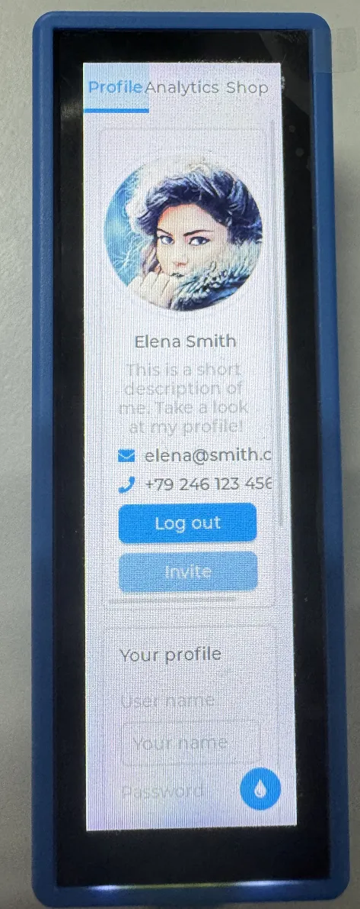
  </div>

### 10_LVGL_V9_Test

**Demo Description**

- Helps users quickly implement UI design by porting LVGL V9.

**Hardware Connection**

- Connect the board to the computer using a USB cable

**Code Analysis**

- If a 90-degree display rotation is needed, locate the `#define Rotated` macro in the `user_config.h` file and assign the value `"USER_DISP_ROT_90"`.
- If backlight testing is required, locate the `#define Backlight_Testing` macro in the `user_config.h` file and assign the value `"true"`.
  ```cpp
  #define Backlight_Testing 0
  #define USER_DISP_ROT_90 1
  #define USER_DISP_ROT_NONO  0
  #define Rotated USER_DISP_ROT_NONO   //Rotation via software
  ```

**Operation Result**

- After the program is flashed, the device operation result is as follows:

  <div style={{maxWidth: 250}}>
		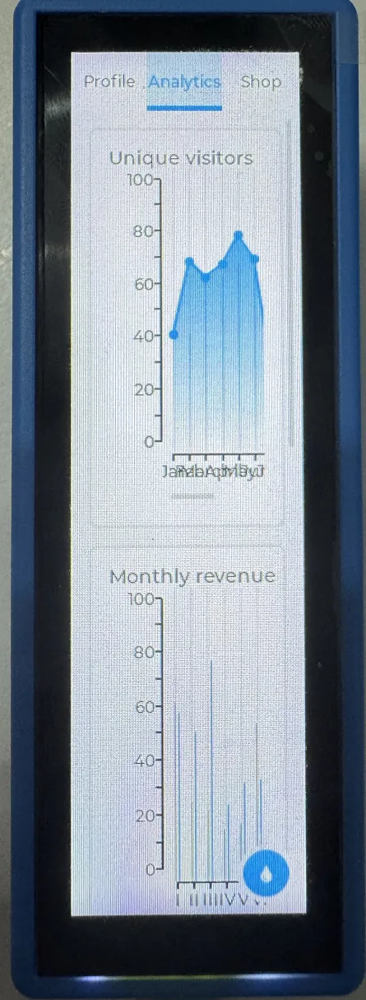
  </div>

### 11_FactoryProgram

**Demo Description**

- Comprehensive project, you can simply test the onboard hardware functions, or directly use the BIN firmware we provide for flashing.

**Hardware Connection**

- Connect the board to the computer using a USB cable

**Code Analysis**

  ```cpp
  setup_ui(&src_ui);            // Set up the UI interface
  lcd_bl_pwm_bsp_init(LCD_PWM_MODE_255);  // Initialize LCD backlight PWM, using 255-level brightness adjustment mode
  tca9554_init();                  // Initialize TCA9554 GPIO expander chip
  button_Init();                       // Initialize buttons
  adc_bsp_init();                  // Initialize ADC for voltage detection
  i2c_rtc_setup();                  // Setup RTC (real-time clock)
  i2c_rtc_setTime(2025,7,7,18,43,30);  // Set RTC time to 2025-07-07 18:43:30
  i2c_imu_setup();                // Setup IMU (inertial measurement unit)
  _sdcard_init();                    // Initialize TF card
  espwifi_init();                      // Initialize WiFi function
  user_audio_bsp_init();      // Initialize user audio onboard support
  audio_play_init();                // Initialize audio playback function
  ```

**Operation Result**

- After the program is flashed, the device operation result is as follows:

  <div style={{maxWidth: 250}}>
		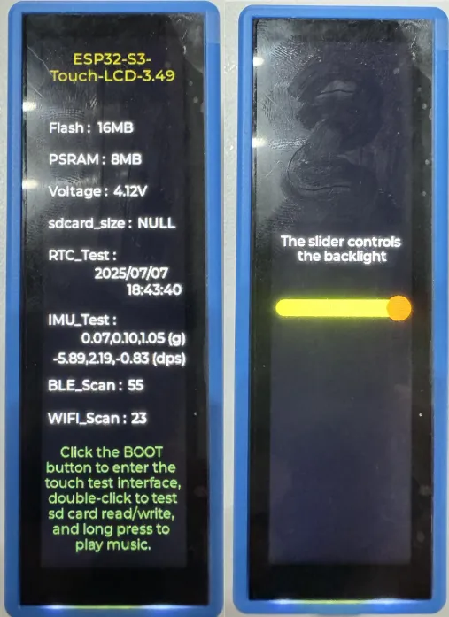
  </div>
  :::tip
  1. Use the main interface to determine whether the onboard hardware is functioning properly.
  2. Swipe left to control the backlight
  :::

- Touch and Audio control interface, as shown:

  <div style={{maxWidth: 250}}>
		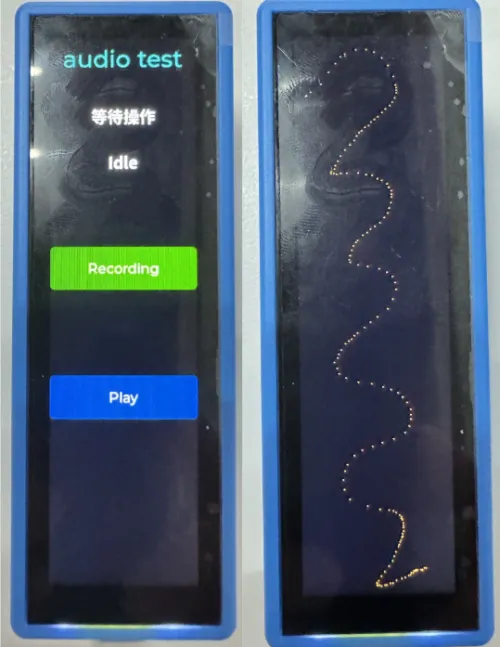
  </div>
  :::tip
  1. Long press the BOOT button to enter the audio interface, where you can test recording and playback functions. Long press the BOOT button again to return to the main interface.
  2. Click the BOOT button to enter the Touch interface, where you can draw Touch trajectories.
  :::