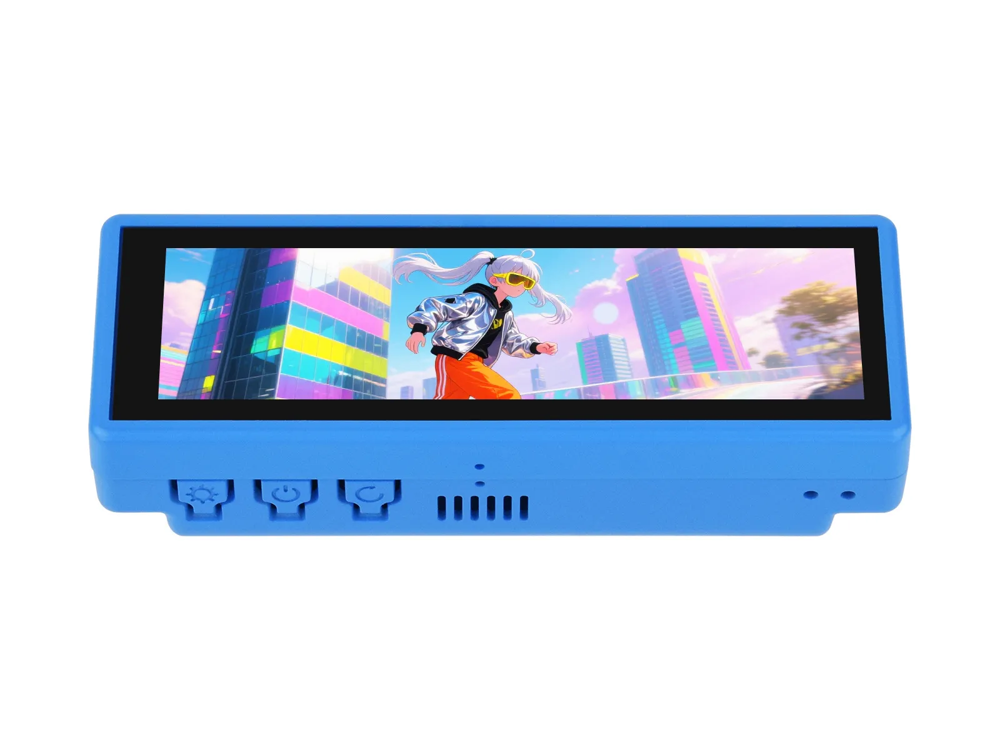
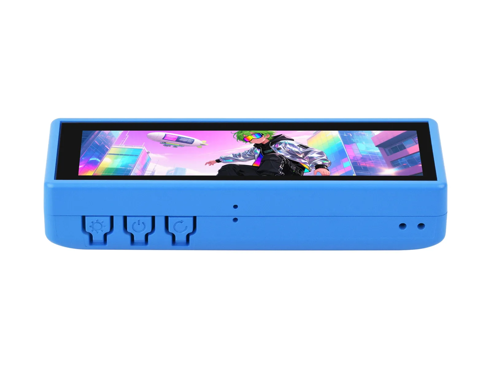
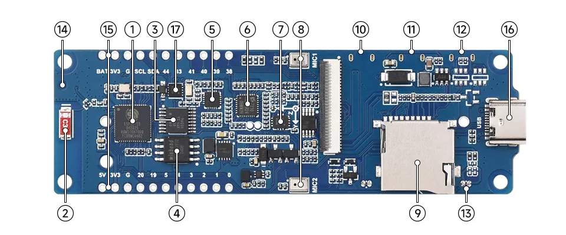
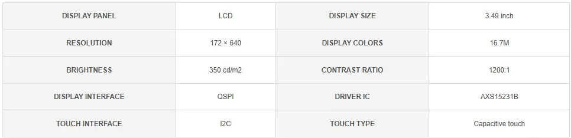
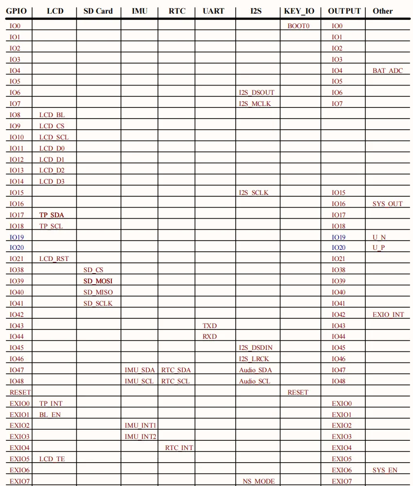
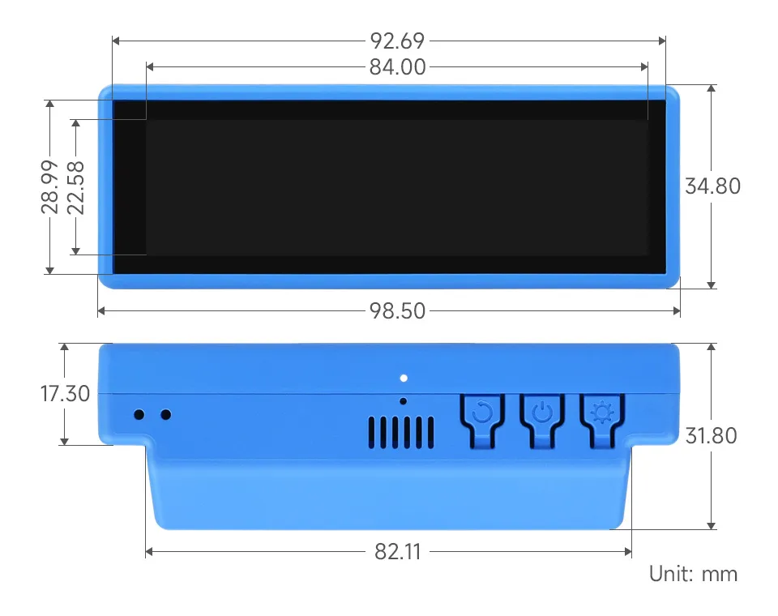
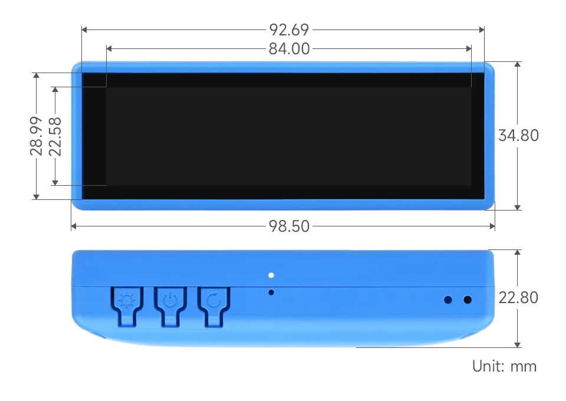

# ESP32-S3-Touch-LCD-3.49

import Tabs from '@theme/Tabs';
import TabItem from '@theme/TabItem';

<Tabs queryString="variant">
  <TabItem value="ESP32-S3-Touch-LCD-3.49" label="ESP32-S3-Touch-LCD-3.49 (Case A, with 18650 Lithium battery)">
    
 

  </TabItem>
  <TabItem value="ESP32-S3-Touch-LCD-3.49-EN" label="ESP32-S3-Touch-LCD-3.49-EN (Case A, without battery)" default>
    
 

  </TabItem>
  <TabItem value="ESP32-S3-Touch-LCD-3.49B" label="ESP32-S3-Touch-LCD-3.49B (Case B, with 3.7V Lithium polymer battery)" default>
    
 

  </TabItem>
  <TabItem value="ESP32-S3-Touch-LCD-3.49B-EN" label="ESP32-S3-Touch-LCD-3.49B-EN (Case B, without battery)" default>
    
 

  </TabItem>
</Tabs>

This product is a high-performance, highly integrated microcontroller development board designed by Waveshare. It is equipped with a 3.49inch capacitive HD IPS screen, a highly integrated power management chip, a 6-axis IMU (3-axis accelerometer and 3-axis gyroscope), an RTC, a low-power audio codec chip, and echo cancellation circuitry, facilitating development and integration into end products.

| SKU | Product |
| ------ |   ------------------ |
|32373 |   ESP32-S3-Touch-LCD-3.49 |
|32374 |   ESP32-S3-Touch-LCD-3.49-EN |
|32375 |   ESP32-S3-Touch-LCD-3.49B |
|32376 |   ESP32-S3-Touch-LCD-3.49B-EN |

## Features

- Equipped with ESP32-S3R8 high-performance Xtensa 32-bit LX7 dual-core processor, operating at up to 240 MHz.
- Supports 2.4GHz Wi-Fi (802.11 b/g/n) and Bluetooth 5 (LE) with an onboard antenna.
- Built-in 512 KB SRAM and 384 KB ROM, with stacked 8MB PSRAM and 16MB Flash
- Onboard 3.49inch resistive touch screen and IPS display, 172 × 320 resolution, 1.67M colors, capable of displaying color images clearly
- Equipped with a dual digital microphone array, enabling audio algorithms such as noise reduction and echo cancellation, suitable for precise voice recognition and near-field/far-field voice wake-up applications
- Integrated AXS15231B display driver chip, communicating via QSPI and I2C interfaces
- Onboard QMI8658 6-axis IMU (3-axis accelerometer, 3-axis gyroscope), capable of detecting device orientation changes, step counting, and other functions
- Onboard PCF85063 RTC chip for convenient RTC functionality implementation
- Onboard two customizable side buttons (PWR, BOOT) for convenient custom function development
- Onboard 3.7V MX1.25 lithium battery charging interface
- Onboard TF card slot for flexible storage expansion and fast data transfer, suitable for data logging and media playback, simplifying circuit design
- Reserved 22PIN 2.54mm pitch communication solder pads, allowing users to connect external modules or expand functionality, enhancing development flexibility

## Onboard Resources

 

1. **ESP32-S3R8** Wi-Fi and Bluetooth SoC, up to 240MHz operating frequency, with onboard 8MB PSRAM
2. **Onboard Antenna** Supports 2.4GHz Wi-Fi (802.11 b/g/n) and Bluetooth 5 (LE)
3. **TCA9554PWR** 8-bit I2C GPIO expander chip
4. **W25Q128JVSI** 16MB Flash memory
5. **ES8311 DAC Audio Codec** High-performance, low-power audio digital-to-analog converter
6. **ES7210 ADC Audio Codec** High-performance, low-power audio analog-to-digital converter, supports multi-microphone input
7. **QMI8658** 3-axis accelerometer and 3-axis accelerometer, suitable for applications such as attitude sensing and motion recognition
8. **Dual Microphone Array Design** Dual digital microphone arrays for advanced voice interaction functions
9. **TF Card Slot ** Supports FAT32-formatted TF cards for data expansion
10. **RESET Button (Back Side)** Press and hold the BOOT button, then click the RESET button to enter download mode
11. **PWR Button (Back Side)** Enables power control via software configuration when using Lithium battery for power supply
12. **BOOT Button (Back Side)** Press and hold the BOOT button, then click the RESET button to enter download mode
13. **MX1.25 2PIN Speaker Header (Back Side)** Audio signal output, for connecting external speaker
14. **IPEX 1 Connector** For connecting external antenna, enabled via resoldering an onboard resistor
15. **22PIN 2.54mm Pitch Through-Hole Solder Pads** For connecting external modules and enabling functional expansion
16. **Type-C Interface** Used for program flashing and log printing
17. **PCF85063** RTC clock chip, supports time retention

## LCD Parameters

 

## Interfaces

 

## Dimensions

### Case A

 

### Case B

 

## Development Methods

The ESP32-S3-Touch-LCD-3.49 supports two development frameworks: Arduino IDE and ESP-IDF, providing flexibility for developers to choose the tool that best fits their project requirements and personal preference.

Each method has its advantages, and developers can select based on their needs and skill level. Arduino is simple to learn and easy to get started with, suitable for beginners and non-professionals; ESP-IDF provides more advanced development tools and stronger control capabilities, suitable for developers with professional backgrounds or those with higher performance requirements, and is more suitable for complex project development.

- **Arduino IDE** is a convenient, flexible, and easy-to-use open-source electronics prototyping platform. It requires minimal foundational knowledge, allowing for rapid development after a short learning period. Arduino has a vast global community that provides a wealth of open-source code, project examples, tutorials, and rich libraries that encapsulate complex functionalities, enabling developers to implement various features quickly. You can refer to the **[Working with Arduino](./Arduino.md)** to complete the initial setup, and the tutorial also provides related demos for reference.

- **ESP-IDF** (Espressif IoT Development Framework) is a professional development framework released by Espressif for its ESP series chips. It is developed based on the C language, including a compiler, debugger, and flashing tool, etc. It supports development via command line or an Integrated Development Environment (such as Visual Studio Code with the Espressif IDF plugin), which provides features like code navigation, project management, and debugging, etc. We recommend using VS Code for development. For the specific configuration process, please refer to the **[Working with ESP-IDF](./ESP-IDF.md)**. The tutorial also provides relevant demos for reference.
