<!-- Image Reference -->

# Using Factory Firmware

:::warning Version Compatibility Description

This firmware is intended to demonstrate related features and will continue to be iterated and improved. If you encounter any abnormalities during use, feedback is welcome. We will address them promptly and update the version.
:::

This chapter includes the following sections:

- [Test Preparation](#test-preparation)
- [Program Overview](#program-overview)
- [Program Usage](#program-usage)
- [Factory Reset](#factory-reset)

## Test Preparation

- Type-C data cable
- Card reader
- TF card

## Program Overview

The application includes: squareline example, handwriting test, image display, music playback, AI chat, Settings (WLAN, sound adjustment, backlight adjustment, battery voltage & CPU temperature reading, and isolation I/O test), and microphone test.

## Program Usage

A brief explanation of the usage and functionality of each program.
:::tip Preparation

For the image display and music playback tests, you need to copy the two folders from `.\firmware\sdcard` to the TF card. The TF card's file system must be formatted as FAT32; otherwise, clicking the icon will restart the system.
:::

### squareline

This example directly runs a squareline demo.

#### Operation Result

 

   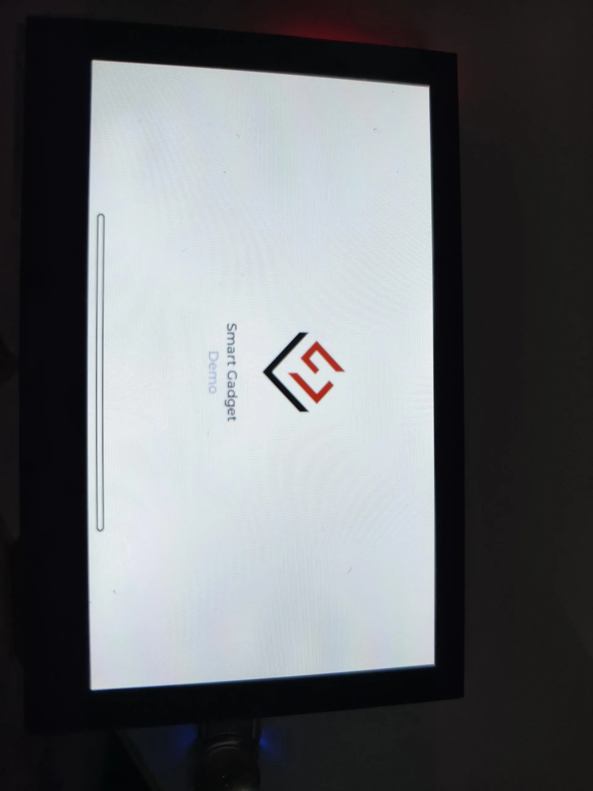
   
   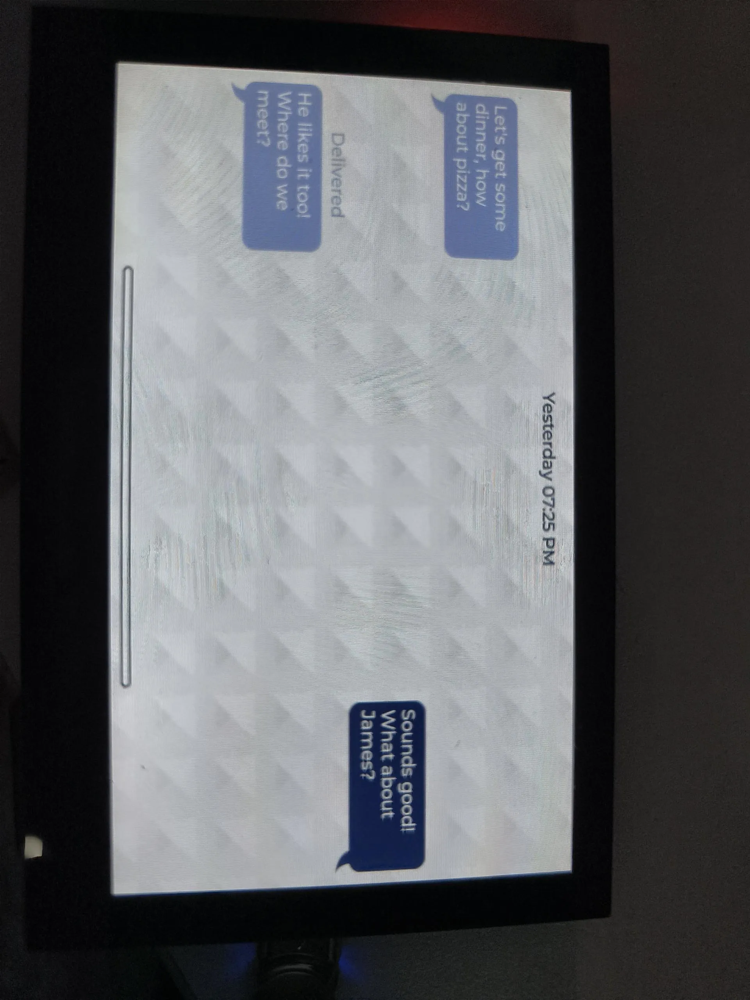
   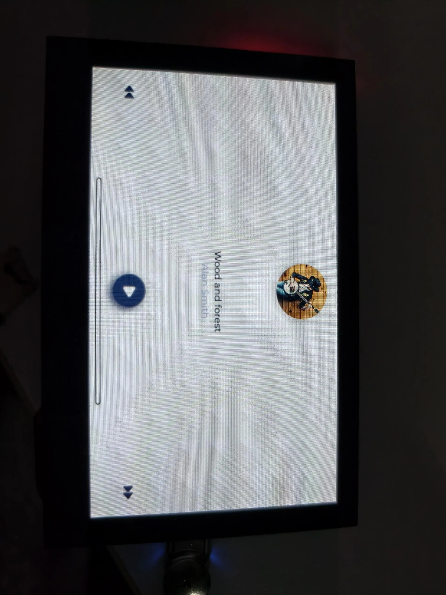
   
 

### DrawPanel

This example tests if the touchscreen is functioning properly.

#### Operation Result

 

   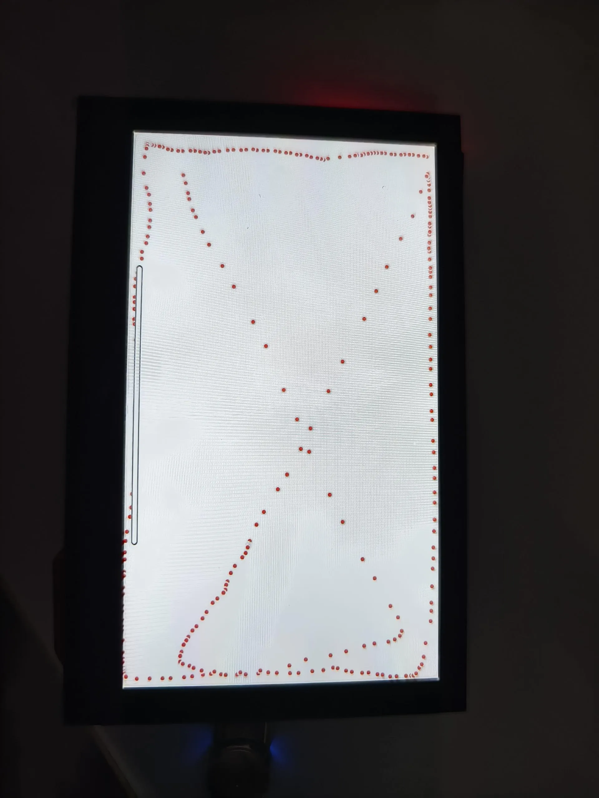
 

### Gallery

This example reads and displays image files from the TF card.

#### Operation Result

 

   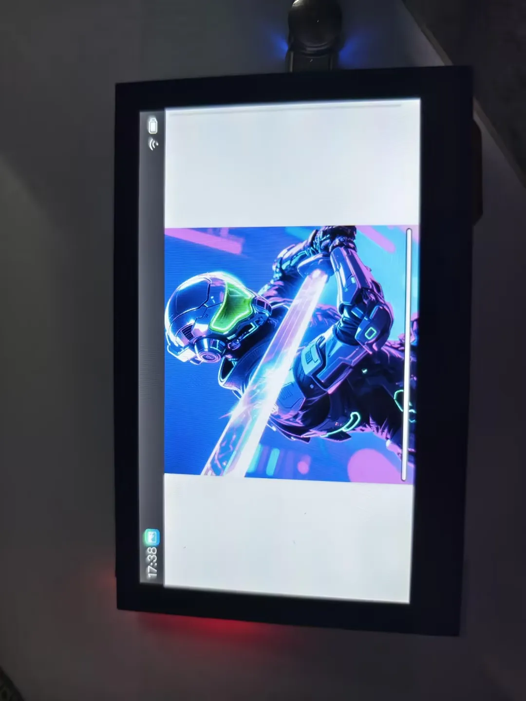
 

### MusicPlayer

This example plays music from the TF card. The volume can be adjusted using the speaker button on the right.

#### Operation Result

 

   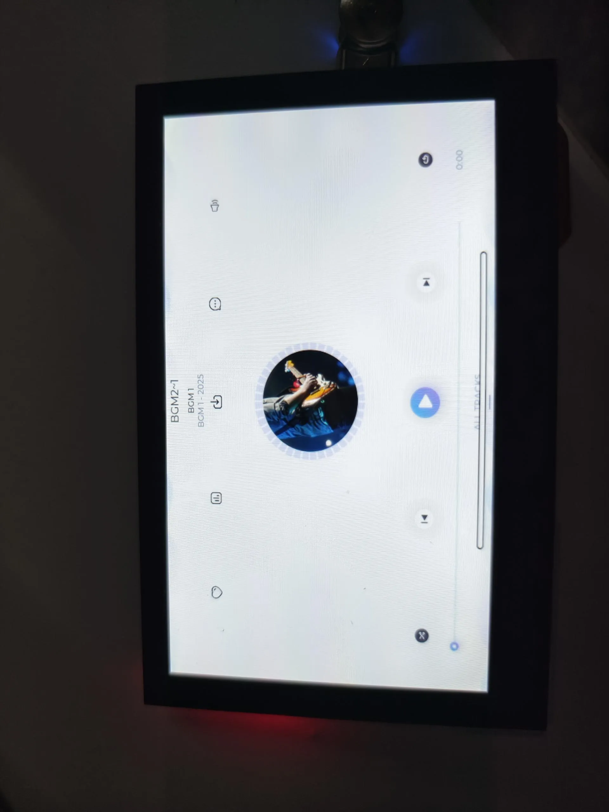
 

### AIChats

This example runs XiaoZhi AI. After configuring XiaoZhi, you can say "Return to the application interface" to go back to the desktop.

#### Operation Result

 

   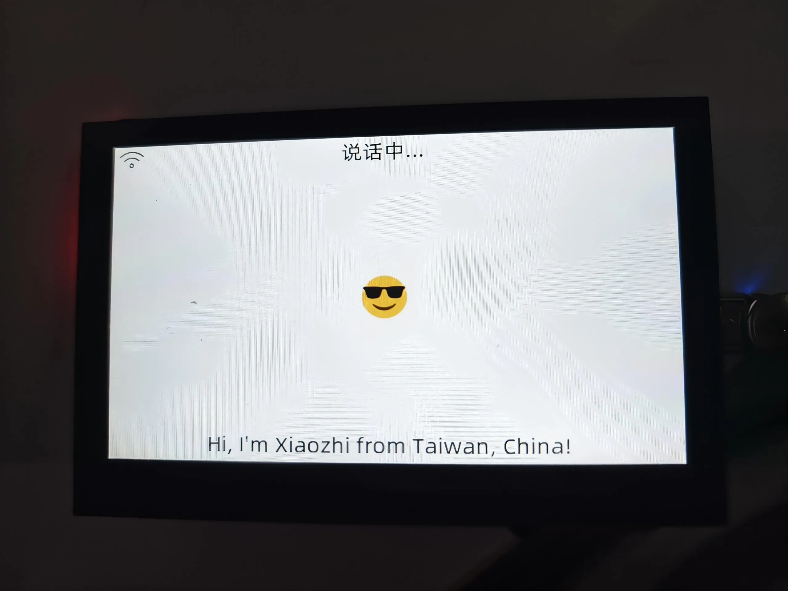
 

### Settings

This example contains several widgets. Here is a brief introduction:

#### WLAN

This widget demonstrates Wi-Fi functionality. The specific operations are as follows:

1. Click the switch to scan nearby Wi-Fi networks and display them in a list (Chinese Wi-Fi names cannot be displayed).
2. Select the Wi-Fi you want to connect to, enter the password,and click the checkmark to connect (to exit the password input, first click the password box, then click a blank area).
3. Wait for the connection to succeed. A checkmark ✅ appears for success, and a cross ❎ appears for failure.
4. After a successful connection, Beijing time will be synchronized automatically.

##### Operation Result

 

   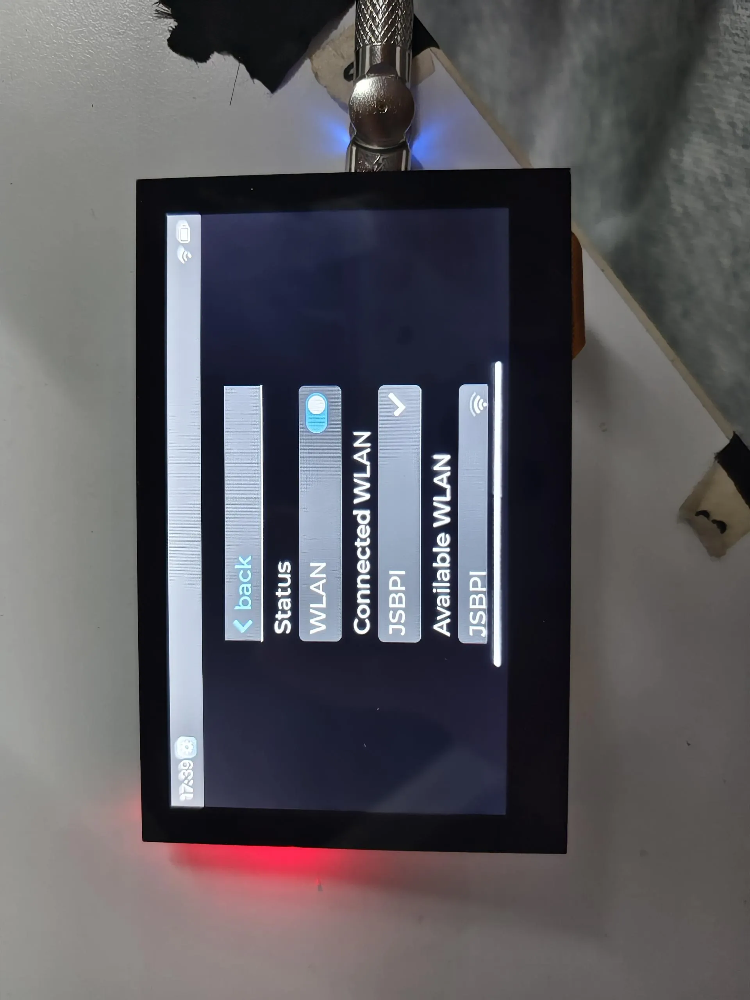
 

#### Sound & Display

These widgets demonstrate sound adjustment and brightness adjustment.

##### Operation Result

 

   
 

#### Battery

This widget displays the CPU temperature and current battery voltage.

##### Operation Result

 

   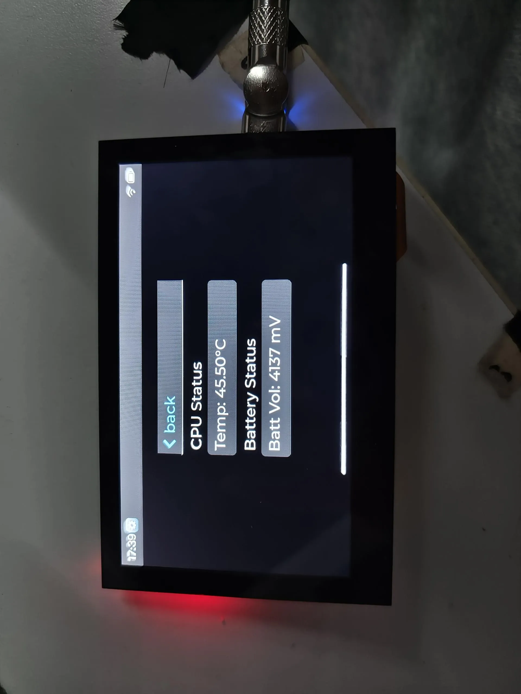
 

#### Isolationio

This widget demonstrates the isolation I/O test. You need to connect DI0 to DO0 and DI1 to DO1.

##### Operation Result

 

   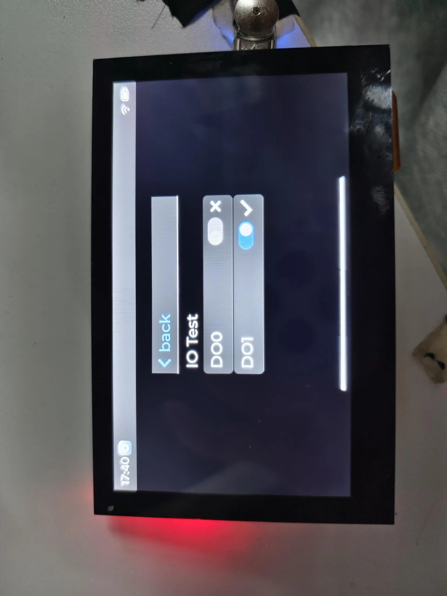
 

### SpecAnalyzer

This example tests if the microphone is working properly by capturing sound and displaying it via animation.

#### Operation Result

 

   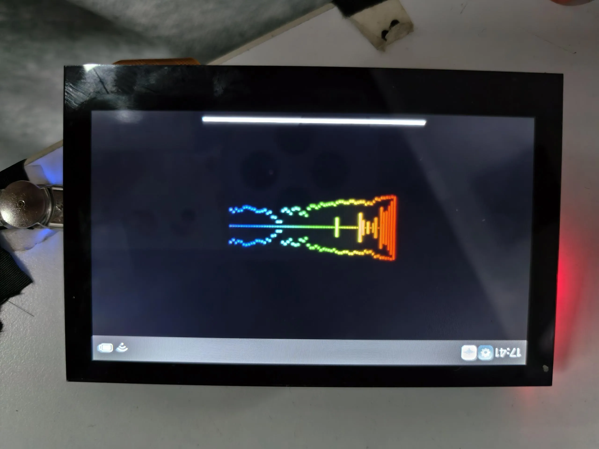
 

## Factory Reset

If you have flashed other programs and cannot test the factory firmware, you can restore the factory settings using the method below:

1.  You need to know how to use Flash Tool. If not, you can click [this link](https://www.waveshare.com/wiki/Flash_Firmware_Flashing_and_Erasing) to learn.

2. Add `.\firmware\ESP32-S3-Touch-LCD-4.3C-Test.bin` to the Flash Tool. The flashing address is 0x00.

3. Connect the development board to the computer. Check the COM port via Device Manager, then select the corresponding COM port in the Flash Tool and click Start. After the flashing is successful, press the RESET button.

   

     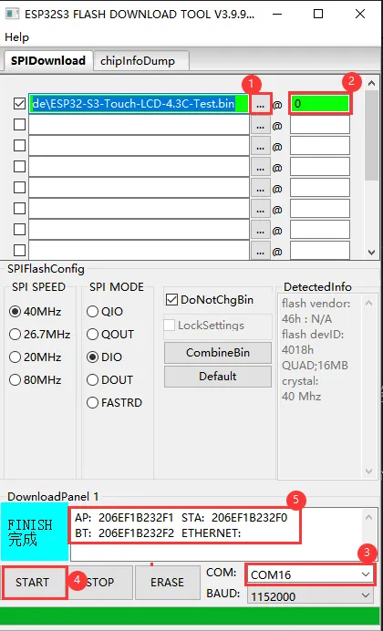
   

   ①. Add the firmware file.
   
   ②. Enter the flashing address.
   
   ③. Select the development board's COM port.
   
   ④. Start flashing.
   
   ⑤. Flashing completed.