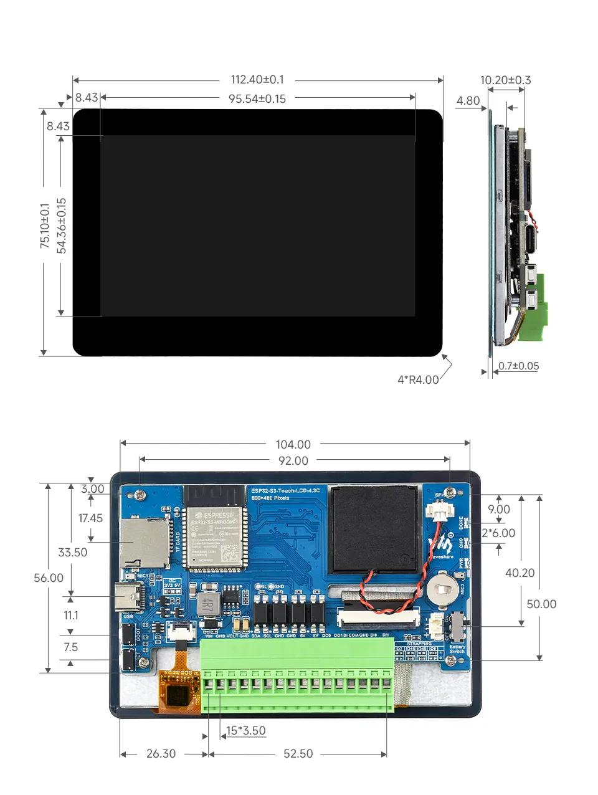
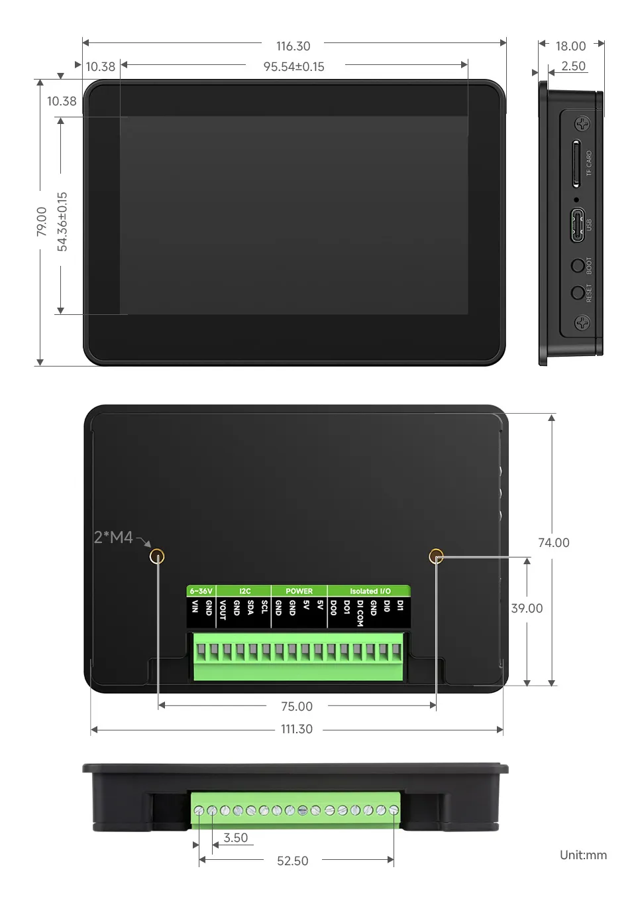

<!-- Image Reference -->

# ESP32-S3-Touch-LCD-4.3C

 

The ESP32-S3-Touch-LCD-4.3C is a low-cost, high-performance development board from Waveshare. It integrates 2.4GHz WiFi, BLE5, large-capacity Flash and PSRAM, and features an onboard 4.3-inch capacitive touch LCD for smooth LVGL GUI operation. It is equipped with an ES8311 audio codec and an ES7210 quad-channel ADC, supporting voice capture and playback. It also provides rich interfaces like I2C and wide-voltage IOs, making it suitable for applications in IoT, mobile devices, and smart homes.

| SKU | Product | 
| --- | --- | 
| 33799 | ESP32-S3-Touch-LCD-4.3C (Without case) |
| 33630 | ESP32-S3-Touch-LCD-4.3C (With plastic case) |

## Features

- Equipped with the high-performance **ESP32-S3R8** featuring an Xtensa® 32-bit LX7 dual-core processor with a clock frequency up to 240 MHz
- Supports 2.4 GHz Wi-Fi (802.11 b/g/n) and Bluetooth® 5 (LE) with an integrated onboard antenna
- Built-in 512KB SRAM and 384KB ROM, with stacked 8MB PSRAM and external 16MB Flash storage
- Onboard 4.3inch wide capacitive touchscreen with 800 × 480 resolution, 65K color
- Supports I2C interface control for capacitive touch, with 5-point touch, and supports interrupts

## Onboard Resources

 

- **Onboard PCF85063 RTC Real-Time Clock Chip**: Enables timekeeping during power loss and alarm functionality.
- **Onboard 4.3inch 800×480 Capacitive Touch LCD Screen**: Supports LVGL graphical interface display.
- **Onboard Isolation I/O Interface**: Provides 2 digital inputs (DI0, DI1) and 2 digital outputs (DO0, DO1) for safe, isolated interaction with external switch devices via the IO_EXTENSION.
- **Onboard TF Card Slot**: Uses the SD_MMC interface for accessing TF cards to store resources like images and music.
- **Onboard ES8311 Audio Amplifier Codec and ES7210 Quad-Channel Audio ADC**: Works in conjunction with the speaker and microphone interfaces.
- **Onboard USB Type-C Port**: Used for firmware downloading, serial log printing, and USB-related debugging. It is the main communication and download channel for Arduino and ESP-IDF examples.
- **Onboard BOOT and RST Functional Buttons**: Allow quick entry into download mode and resetting to run different firmware.

## Interface Description

When using the ESP32-S3-Touch-LCD-4.3C, it's important to understand the hardware connections for different peripherals.

<strong>ESP32-S3 / IO EXTENSION to LCD Pin Mapping Table (Click to expand)</strong>

|          ESP32-S3           |  LCD   |       Description         |
| :-------------------------: | :----: | :--------------: |
| **ESP32-S3 → LCD RGB IF**   | **—**  | **Direct Pin Definition** |
|            GPIO0            |   G3   |  Green Data Bit 3  |
|            GPIO1            |   R3   |  Red Data Bit 3  |
|            GPIO2            |   R4   |  Red Data Bit 4   |
|            GPIO3            | VSYNC  |   Vertical Sync Signal    |
|            GPIO5            |   DE   |   Data Enable Signal    |
|            GPIO7            |  PCLK  |     Pixel Clock Signal     |
|           GPIO10            |   B7   |    Blue Data Bit 7    |
|           GPIO14            |   B3   |    Blue Data Bit 3    |
|           GPIO17            |   B6   |    Blue Data Bit 6    |
|           GPIO18            |   B5   |    Blue Data Bit 5    |
|           GPIO21            |   G7   |    Green Data Bit 7     |
|           GPIO38            |   B4   |    Blue Data Bit 4     |
|           GPIO39            |   G2   |    Green Data Bit 2     |
|           GPIO40            |   R7   |    Red Data Bit 7  |
|           GPIO41            |   R6   |    Red Data Bit 6    |
|           GPIO42            |   R5   |    Red Data Bit 5    |
|           GPIO45            |   G4   |    Green Data Bit 4    |
|           GPIO46            | HSYNC  |   Horizontal Sync Signal |
|           GPIO47            |   G6   |    Green Data Bit 6    |
|           GPIO48            |   G5   |    Green Data Bit 5    |
|      **IO EXTENSION**       | **—**  | **IO Extension Control**  |
|            EXIO2            |  DISP  |   Backlight Enable Pin   |
|          EXIO_PWM           | BL_PWM |   Backlight Adjustment Pin   |

<strong>ESP32-S3 / IO EXTENSION to Touch Pin Mapping Table (Click to expand)</strong>

|         ESP32-S3          | Touch |       Description          |
| :-----------------------: | :---: | :--------------: |
| **ESP32-S3 → Touch IF**   | **—** | **Direct Pin Definition** |
|           GPIO4           |  G3   |   Touch Interrupt Pin      |
|           GPIO8           |  R3   |   I2C Data Pin (SDA)       |
|           GPIO9           |  R4   |   I2C Clock Pin (SCL)      |
|      **IO EXTENSION**       | **—**  | **IO Extension Control**  |
|           EXIO1           | DISP  |   Touch Reset Pin          |

<strong>ESP32-S3 to USB Pin Mapping Table (Click to expand)</strong>

|         ESP32-S3          |  USB   |       Description          |
| :-----------------------: | :----: | :--------------: |
| **ESP32-S3 → Touch IF**   | **—** | **Direct Pin Definition** |
|          GPIO19           | USB_DN |    Data Line D-     |
|          GPIO20           | USB_DP |    Data Line D+     |

<strong>ESP32-S3 / IO EXTENSION to TF Card Pin Mapping Table (Click to expand)</strong>

|        ESP32-S3        |  TF   |       Description          |
| :--------------------: | :---: | :--------------: |
| **ESP32-S3 → TF IF**   | **—** | **Direct Pin Definition** |
|         GPIO11         | MOSI  |  TF Card Input Pin    |
|         GPIO12         |  SCK  |  TF Card Clock Pin        |
|         GPIO13         | MISO  |  TF Card Output Pin       |
|      **IO EXTENSION**       | **—**  | **IO Extension Control**  |
|         EXIO4          | SD_CS |  TF Card Chip Select Pin  |

<strong>ESP32-S3 / IO EXTENSION to RTC Pin Mapping Table (Click to expand)</strong>

| ESP32-S3 / IO EXT |   RTC   |       Description          |
| :---------------: | :-----: | :--------------: |
|   **RTC IF**      |  **—**  | **Direct Pin Definition** |
|       GPIO8       | RTC_SDA |   RTC Data Pin  |
|       GPIO9       | RTC_SCL |   RTC Clock Pin   |
|      **IO EXTENSION**       | **—**  | **IO Extension Control**  |
|        INT        | RTC_INT |   RTC Interrupt Pin   |

<strong>ESP32-S3 / IO EXTENSION to I2C Pin Mapping Table (Click to expand)</strong>

|   ESP32-S3   |  I2C  |       Description         |
| :----------: | :---: | :--------------: |
| **I2C IF**   | **—** | **Direct Pin Definition** |
|    GPIO8     |  SDA  |   I2C Data Pin   |
|    GPIO9     |  SCL  |   I2C Clock Pin   |

<strong>ESP32-S3 / IO EXTENSION to Audio Codec Pin Mapping Table (Click to expand)</strong>

| ESP32-S3 / IO EXT  | SPEAKER / MIC |        Description            |
| :----------------: | :-----------: | :-----------------: |
| **Audio Codec IF** |     **—**     | **Direct Pin Definition**  |
|       GPIO6        |   I2S_MCLK    |     I2S Master Clock      |
|       GPIO8        |   Audio_SDA   |     I2C Data Line (SDA)       |
|       GPIO9        |   Audio_SCL   |     I2C Clock Line (SCL)      |
|       GPIO15       |   I2S_DSDIN   |    I2S Data Input     |
|       GPIO16       |   I2S_LRCK    |  Frame Sync / LR channel selection |
|       GPIO43       |  I2S_ASDOUT   |    I2S Data Output     |
|       GPIO44       |   I2S_SCLK    |    I2S Serial Clock    |
|      **IO EXTENSION**       | **—**  | **IO Extension Control**  |
|       EXIO4        |    PA_CTRL    |    Power Amplifier Control   |

<strong>ESP32-S3 / IO EXTENSION to Isolation I/O Pin Mapping Table (Click to expand)</strong>

|   IO EXTENSION   | DI / DO | Description          |
| :--------------: | :-----: | :-------------: |
| **Isolation IO** |  **—**  | **IO Extension Control** |
|      EXIO0       |   DI0   |   Digital Input 0        |
|      EXIO5       |   DI1   |   Digital Input 1        |
|      EXIO6       |   DO0   |   Digital Output 0     |
|      EXIO7       |   DO1   |   Digital Output 1     |

- **MX1.25 Battery Interface**: The development board uses the efficient charge/discharge management chip CS8501, which can boost a single-cell lithium battery to 5V. The current charging current is 580mA. Users can change the charging current by replacing the R45 resistor. For details, please refer to the [ESP32-S3-Touch-LCD-4.3C Schematic](https://github.com/waveshareteam/ESP32-S3-Touch-LCD-4.3C/blob/main/hardware/schematics/ESP32-S3-Touch-LCD-4.3C-Schematics.pdf)

## Dimensions

### Without Case

 

### With Case

 

## Development Methods
<!-- 
The ESP32-S3-Touch-LCD-4.3C supports three development frameworks: Arduino IDE, ESP-IDF, and PlatformIO, providing developers with flexible choices. You can select the appropriate development tool based on project requirements and personal preference.

Each of the three development methods has its own advantages. Developers can choose based on their needs and skill level. Arduino is simple to learn and quick to get started, suitable for beginners and non-professionals. ESP-IDF provides more advanced development tools and greater control, suitable for developers with a professional background or higher performance requirements, and is more suitable for complex project development. PlatformIO combines the ease of use of Arduino with the flexibility of ESP-IDF, offering a modern development experience based on VS Code, supporting multiple frameworks, multi-environment configurations, and powerful library management capabilities, making it suitable for developers pursuing high efficiency, standardization, and maintainability.

- **Arduino IDE** is a convenient, flexible, and easy-to-use open-source electronics prototyping platform. It requires minimal foundational knowledge, allowing for rapid development after a short learning period. Arduino has a vast global community that provides a wealth of open-source code, project examples, tutorials, and rich libraries that encapsulate complex functionalities, enabling developers to implement various features quickly. You can refer to the **[Working with Arduino](./Arduino.md)** to complete the initial setup, and the tutorial also provides related demos for reference.

- **ESP-IDF** (Espressif IoT Development Framework) is a professional development framework released by Espressif for its ESP series chips. It is developed based on the C language, including a compiler, debugger, and flashing tool, etc. It supports development via command line or an Integrated Development Environment (such as Visual Studio Code with the Espressif IDF plugin), which provides features like code navigation, project management, and debugging, etc. We recommend using VS Code for development. For the specific configuration process, please refer to the **[Working with ESP-IDF](./ESP-IDF.md)**. The tutorial also provides relevant demos for reference.

- **PlatformIO** is a cross-platform embedded development ecosystem based on editors like VS Code. It integrates functions such as project management, library dependency management, compilation, flashing, and debugging. It supports both the Arduino framework and the ESP-IDF framework, allowing developers to switch flexibly within the same development environment, balancing ease of use with professionalism. PlatformIO provides a unified and standardized project structure and powerful library management mechanisms, making it very suitable for developers who need to improve development efficiency, engage in team collaboration, or manage multiple projects. You can refer to the **[PlatformIO Development Environment Setup Tutorial](./PlatformIO.md)** to complete the environment configuration and quickly get started using the example programs in the documentation.
-->

The ESP32-S3-Touch-LCD-4.3C supports two development frameworks: Arduino IDE and ESP-IDF, providing developers with flexible choices. You can select the appropriate development tool based on project requirements and personal preference.

Each method has its advantages, and developers can select based on their needs and skill level. Arduino is simple to learn and easy to get started with, suitable for beginners and non-professionals; ESP-IDF provides more advanced development tools and stronger control capabilities, suitable for developers with professional backgrounds or those with higher performance requirements, and is more suitable for complex project development.

- **Arduino IDE** is a convenient, flexible, and easy-to-use open-source electronics prototyping platform. It requires minimal foundational knowledge, allowing for rapid development after a short learning period. Arduino has a vast global community that provides a wealth of open-source code, project examples, tutorials, and rich libraries that encapsulate complex functionalities, enabling developers to implement various features quickly. You can refer to the **[Working with Arduino](./Arduino.md)** to complete the initial setup, and the tutorial also provides related demos for reference.

- **ESP-IDF** (Espressif IoT Development Framework) is a professional development framework released by Espressif for its ESP series chips. It is developed based on the C language, including a compiler, debugger, and flashing tool, etc. It supports development via command line or an Integrated Development Environment (such as Visual Studio Code with the Espressif IDF plugin), which provides features like code navigation, project management, and debugging, etc. We recommend using VS Code for development. For the specific configuration process, please refer to the **[Working with ESP-IDF](./ESP-IDF.md)**. The tutorial also provides relevant demos for reference.
