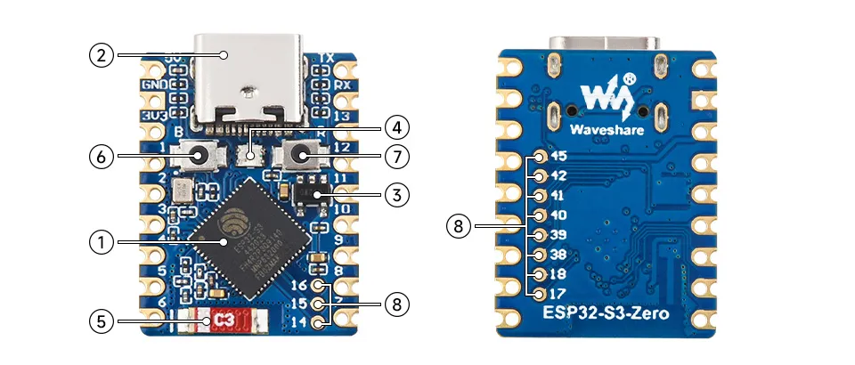

<!-- Image Imports -->
import BoardSizeIamge from './images/Esp32-S3-Zero-Size.webp';
import ESP32S3ZeroImage from './images/ESP32-S3-Zero.webp';
import ESP32S3ZeroMImage from './images/ESP32-S3-Zero-M.webp';
import BasicKitImage from './images/ESP32-S3-Zero-Basic-Kit.webp';

# ESP32-S3-Zero

:::info New and Upgraded
You are browsing the new documentation. If you are more familiar with the old version, you can still access the **[legacy page](https://www.waveshare.com/wiki/ESP32-S3-Zero)**.
:::

import Tabs from '@theme/Tabs';
import TabItem from '@theme/TabItem';

<Tabs>
  <TabItem value="ESP32-S3-Zero" label="ESP32-S3-Zero (Without header)">
    
 

  </TabItem>
  <TabItem value="ESP32-S3-Zero-M" label="ESP32-S3-Zero-M (With pre-soldered header)" default>
    
 

  </TabItem>
  <TabItem value="ESP32-S3-Zero-Basic-Kit" label="ESP32-S3-Zero-Basic-Kit" default>
    
 

  </TabItem>
</Tabs>

The [ESP32-S3-Zero (Without Header)](https://www.waveshare.com/esp32-s3-zero.htm?sku=25081) and [ESP32-S3-Zero-M (With pre-soldered header)](https://www.waveshare.com/esp32-s3-zero.htm?sku=25517) are compact in size and feature a castellated module design (half-hole process), making them easy to integrate into other mainboards. The ESP32-S3-Zero features an onboard Type-C USB port and breaks out most unused pins within a small form factor. It is equipped with the ESP32-FH4R2 chip, integrating Wi-Fi and BLE 5.0, along with 4MB Flash and 2MB PSRAM. Additionally, it features hardware encryption accelerators, RNG, HMAC, and Digital Signature modules to meet IoT security requirements and offers rich peripheral interfaces. Multiple low-power operating modes satisfy the power consumption needs of IoT, mobile devices, wearable electronics, smart homes, and other application scenarios.

## Features

- Powered by a high-performance Xtensa® 32-bit LX7 dual-core processor, running up to 240MHz.
- Supports 2.4GHz Wi-Fi (802.11 b/g/n) and Bluetooth® 5 (LE).
- Built-in 512KB SRAM and 384KB ROM, with stacked 4MB Flash and 2MB PSRAM.
- Adopts a castellated module (stamp hole) design with an onboard ceramic antenna, facilitating integration into user-designed baseboards.
- Supports flexible clock settings, separate module power supply control, and other features to realize multi-scenario low-power modes.
- Integrated USB serial full-speed controller, breaking out 24 GPIOs for flexible peripheral configuration.
- Features 4 × SPI, 2 × I2C, 3 × UART, 2 × I2S, 2 × ADC, and other peripherals.

## Hardware Description

- When using the ESP32-S3-Zero on a baseboard, pay attention to the clearance area for the ceramic antenna; avoid covering the ceramic antenna with PCB, metal, or plastic parts.
- The ESP32-S3-Zero does not break out GPIO33~GPIO37; these pins are reserved for Octal PSRAM.
- The ESP32-S3-Zero uses GPIO21 to connect the WS2812 RGB LED. Please refer to the documentation [link](https://files.waveshare.com/wiki/ESP32-C3-Zero/XL-0807RGBC-WS2812B.pdf) for the WS2812 datasheet.
- The ESP32-S3-Zero does not use a USB-to-UART chip. To download firmware, you must hold the BOOT (GPIO0) button before connecting the Type-C cable.
- The TX and RX silkscreen on the board represent the default UART0 pins of the ESP32-S3-Zero, where TX is GPIO43 and RX is GPIO44.

### Hardware Connection

- Every time you download firmware, you must hold the BOOT (GPIO0) button before connecting the Type-C cable.
- When powered by an external power supply, input 3.7V~6V power at the pad marked with the "5V" silkscreen.

### Dimensions

 

### Pinout

### Onboard Resources

1. **ESP32-S3FH4R2 Dual-core Processor**: Running frequency up to 240MHz.
2. **USB Type-C Port**: For program download and debugging.
3. **ME6217C33M5G**: Low Dropout Regulator (LDO), max output current 800mA.
4. **WS2812 RGB LED**.
5. **2.4G Ceramic Antenna**.
6. **BOOT Button**: Hold this button and then press the Reset button to enter download mode.
7. **RESET Button**.
8. **ESP32-S3FH4R2 Pin Extension**.

## Development Methods

The ESP32 supports multiple development methods. You can use Espressif's official ESP-IDF framework for professional development, or choose platforms like Arduino IDE or MicroPython for rapid prototyping.

Major development platforms include:

- **[ESP-IDF](https://docs.espressif.com/projects/esp-idf/en/stable/esp32s2/get-started/index.html)**: The official development framework from Espressif, designed specifically for the ESP32 series chips. It provides a complete toolchain, code libraries, and documentation. It allows you to fully utilize the performance and features of the ESP32 and is the preferred choice for professional development and commercial products.

- **[Arduino](https://docs.espressif.com/projects/arduino-esp32/en/latest/getting_started.html#)**: A well-known open-source hardware and software platform providing a simple, standard C++ interface. It supports numerous microcontrollers, including the ESP32. Arduino possesses rich libraries and example codes, making it widely used for prototyping and education, and is a popular entry-level platform for beginners. For environment configuration, please refer to the [Arduino Development](./Arduino.md) page.

- **[MicroPython](https://micropython.org/)**: A lean version of Python 3, containing core functionality and optimized for microcontroller environments. It supports instant execution without repeated compiling and flashing, offering an effective way for developers familiar with Python to get started with ESP32 quickly. 

- **Other Development Methods**: The ESP32 development ecosystem is very rich. In addition to the platforms mentioned above, it also supports development via PlatformIO, Mongoose OS, Espruino (JavaScript), ESPHome, and others, satisfying the needs of developers with diverse technical backgrounds.
