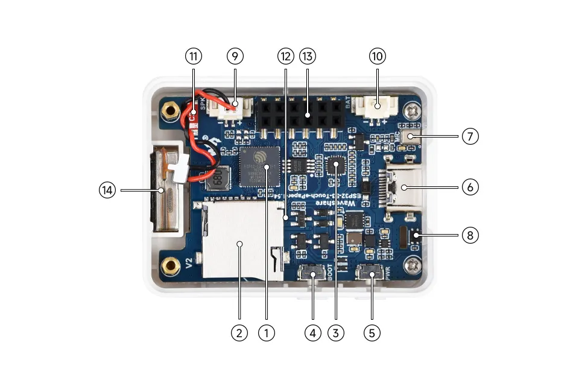
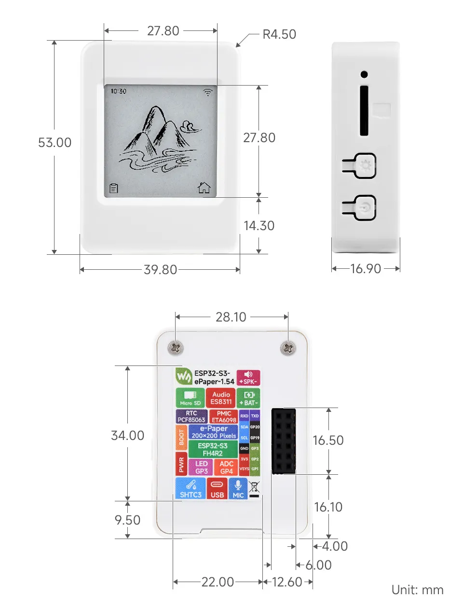

<!-- Image Reference -->
import Esp32s3ePaper_154DocHeader_1 from './images/ESP32-S3-ePaper-1.54-DocHeader-1.webp';
import Esp32s3ePaper_154DocHeader_2 from './images/ESP32-S3-ePaper-1.54-DocHeader-2.webp';

# ESP32-S3-ePaper-1.54 

import Tabs from '@theme/Tabs';
import TabItem from '@theme/TabItem';

<Tabs queryString="variant">
  <TabItem value="ESP32-S3-ePaper-1.54-EN" label="ESP32-S3-ePaper-1.54-EN (Without Lithium Battery Version)">
    
 

  </TabItem>
  <TabItem value="ESP32-S3-ePaper-1.54" label="ESP32-S3-ePaper-1.54 (With Lithium Battery Version)" default>
    
 

  </TabItem>
</Tabs>

The ESP32-S3-ePaper-1.54 is an e-Paper AIoT development board, equipped with ESP32-S3 microcontroller, which supports Wi-Fi and BLE dual-mode communication. The onboard 1.54inch e-paper display, features ultra-low power consumption and sunlight readability, suitable for portable devices and long-lasting scenarios. It integrates an RTC chip, SHTC3 temperature and humidity sensor, TF card slot, low-power audio codec chip circuit, and Lithium battery recharge management circuit. It reserves interfaces including USB, UART, I2C, and GPIO for easy functionality expansion and sensor connectivity, providing a flexible and reliable development platform for IoT terminals, electronic tags, portable displays, and other applications.

:::danger Note
- The V2 version will be phased in starting from November 1, 2025. The products labeled V2 on the back, or with V2 silkscreen in the top-left corner of the PCB, is the V2 version. Otherwise, it is the V1 version. Example programs are not interchangeable between different versions.
- V1 Version: Equipped with ESP32-S3FH4R2, integrated 4MB Flash and 2MB PSRAM.
- V2 Version: Equipped with ESP32-S3-PICO-1-N8R8, integrated 8MB Flash and 8MB PSRAM; also features optimized whole-board power consumption in sleep mode.
:::

| SKU | Product | 
| --- | --- | 
| 32298 | ESP32-S3-ePaper-1.54           (With Lithium Battery) |
| 32299 | ESP32-S3-ePaper-1.54-EN        (Without Lithium Battery) |

## Features

- Equipped with a high-performance Xtensa® 32-bit LX7 dual-core processor clocked at up to 240MHz
- Supports 2.4GHz Wi-Fi and Bluetooth 5 (LE), with an onboard internal antenna
- Built-in 512KB SRAM and 384KB ROM, with integrated Flash and PSRAM in a stacked package
- Features a 1.54inch e-Paper display, resolution 200 × 200, offering high contrast and wide viewing angles
- Onboard audio codec chip supports voice capture and playback, facilitating AI voice interaction applications
- Onboard PCF85063 RTC real-time clock and SHTC3 temperature and humidity sensor enable precise RTC time management and environmental monitoring
- Built-in TF card slot, supports external storage of images or files
- Onboard two side buttons, PWR and BOOT, with customizable functions for convenient custom button operation development
- Reserved 2 × 6 2.54mm pitch female header interface for external expansion

## Onboard Resources

 

1.  **ESP32-S3-PICO-1-N8R8** Wi-Fi and Bluetooth SoC, running at 240MHz, with integrated 8MB Flash and 8MB PSRAM in a stacked package
2. **TF Card Slot** TF card must be formatted as FAT32 for use
3. **ES8311 Audio Codec Chip** Supports audio input and output, low-power design, suitable for voice recognition and playback applications
4. **BOOT Button** Press and hold the BOOT button to power on again to enter download mode
5. **PWR Power Button** Hold BOOT, re-power on to enter download mode
6. **Type-C Interface** ESP32-S3 USB interface for program flashing and serial logging
7. **Microphone** Captures audio
8. **SHTC3 Temperature and Humidity Sensor** Provides ambient temperature and humidity measurement, enabling environmental monitoring function
9. **MX1.25 2PIN Speaker Header** Audio signal output, for connecting external speaker
10. **MX1.25 2PIN Lithium Battery Header** For connecting a lithium battery
11. **Onboard Chip Antenna** Supports 2.4GHz Wi-Fi (802.11 b/g/n) and Bluetooth 5 (LE)
12. **PCF85063 (back side)** RTC clock chip, supports time-keeping function
13. **2 × 6PIN 2.54mm Pitch Female Header** Can be used for expansion
14. **Speaker** Plays audio

## Interfaces

 

## Dimensions

 

## e-Paper Display Parameters

 

## Development Methods

The ESP32-S3-ePaper-1.54 supports two development frameworks: Arduino IDE and ESP-IDF, offering flexibility for developers. You can choose the appropriate development tool based on project requirements and personal preference.

Each method has its advantages, and developers can select based on their needs and skill level. Arduino is simple to learn and easy to get started with, suitable for beginners and non-professionals; ESP-IDF provides more advanced development tools and stronger control capabilities, suitable for developers with professional backgrounds or those with higher performance requirements, and is more suitable for complex project development.

- **Arduino IDE** is a convenient, flexible, and easy-to-use open-source electronics prototyping platform. It requires minimal foundational knowledge, allowing for rapid development after a short learning period. Arduino has a vast global community that provides a wealth of open-source code, project examples, tutorials, and rich libraries that encapsulate complex functionalities, enabling developers to implement various features quickly. You can refer to the **[Working with Arduino](./Arduino.md)** to complete the initial setup, and the tutorial also provides related demos for reference.

- **ESP-IDF** (Espressif IoT Development Framework) is a professional development framework released by Espressif for its ESP series chips. It is developed based on the C language, including a compiler, debugger, and flashing tool, etc. It supports development via command line or an Integrated Development Environment (such as Visual Studio Code with the Espressif IDF plugin), which provides features like code navigation, project management, and debugging, etc. We recommend using VS Code for development. For the specific configuration process, please refer to the **[Working with ESP-IDF](./ESP-IDF.md)**. The tutorial also provides relevant demos for reference.