import EspidfTutorialIntro from '@site/docs/ESP32/snippets/EspidfTutorialIntro.mdx';
import EspidfSetup from '@site/docs/ESP32/snippets/EspidfSetup.mdx';


# ESP-IDF

This chapter includes the following sections; 

- [ESP-IDF Getting Started and Quick Configuration](#espidf-getting-started-tutorial)
- [Setting Up Development Environment](#esp-idf-setup)
- [Demo](#demo)

<EspidfTutorialIntro />

## Setting up the Development Environment{#esp-idf-setup}

:::info
For the ESP32-S3-ePaper-3.97 development board, you need to use ESP-IDF V5.5.0 or higher.
:::

<EspidfSetup />

## Demo

The ESP-IDF demos are located in the `ESP-IDF` directory of the [demo package](https://github.com/waveshareteam/ESP32-S3-ePaper-3.97).

|                            Demo                             |                               Basic Description                               |
| :-------------------------------------------------: | :----------------------------------------------------------------------: | 
|   [01_E-Paper_Example](#Demo-01_E-Paper_Example)                  |                  3.97inch e-Paper display demo          |
|   [02_Mic_test](#Demo-02_Mic_test)                                |                    Playback of sound recorded by the microphone through the speaker |
|   [03_Music](#Demo-03_Music)                                      |                   Mount TF card and read/play music files from it |
|   [04_SD_Test](#Demo-04_SD_Test)                                  |                   Mount TF card, read images from it, and refresh the display     |
|   [05_QMI8658A](#Demo-05_QMI8658A)                                |                        6-axis gyroscope demo                       |
|   [06_I2C_PCF85063](#Demo-06_I2C_PCF85063)                        |                           RTC demo                         |
|   [07_I2C_SHTC3](#Demo-07_I2C_SHTC3)                              |                        Temperature and humidity sensor demo                      |
|   [08_ESP32-S3_e-Paper-3.97](#Demo-08_ESP32-S3_e-Paper-3.97)      |  Integrate file browser, clock, calendar, alarm, weather, network configuration, audio playback, and e-reader functions |

### 01_E-Paper_Example {#Demo-01_E-Paper_Example}

#### Demo Description

- This example demonstrates a native ESP-IDF program for the 3.97inch e-Paper display. It initializes and clears the e-Paper screen, displays an image, draws basic shapes and text, and performs partial refresh to dynamically display the time.

#### Hardware Connection

- Connect the development board to the computer

**Code Analysis**

- Display a predefined image:

  ```cpp
    #if 1
      ESP_LOGI(TAG,"2.show BMP");
      EPD_Init_Fast();
      EPD_Display(gImage_image);
      vTaskDelay(pdMS_TO_TICKS(2000));
   #endif
  ```
- Draw basic shapes, Chinese/English text, numbers, and refresh the display:

  ```cpp
    #if 1
      ESP_LOGI(TAG,"3.Paint_NewImage");
      EPD_Init();
      Paint_NewImage(Image_Mono, EPD_WIDTH, EPD_HEIGHT, 0, WHITE);
      Paint_SelectImage(Image_Mono);
      Paint_Clear(WHITE);
      // Drawing on the image
      Paint_DrawPoint(5, 10, BLACK, DOT_PIXEL_1X1, DOT_STYLE_DFT);
      Paint_DrawPoint(5, 25, BLACK, DOT_PIXEL_2X2, DOT_STYLE_DFT);
      Paint_DrawPoint(5, 40, BLACK, DOT_PIXEL_3X3, DOT_STYLE_DFT);
      Paint_DrawPoint(5, 55, BLACK, DOT_PIXEL_4X4, DOT_STYLE_DFT);

      Paint_DrawLine(20, 10, 70, 60, BLACK, DOT_PIXEL_1X1, LINE_STYLE_SOLID);
      Paint_DrawLine(70, 10, 20, 60, BLACK, DOT_PIXEL_1X1, LINE_STYLE_SOLID);
      Paint_DrawLine(170, 15, 170, 55, BLACK, DOT_PIXEL_1X1, LINE_STYLE_DOTTED);
      Paint_DrawLine(150, 35, 190, 35, BLACK, DOT_PIXEL_1X1, LINE_STYLE_DOTTED);

      Paint_DrawRectangle(20, 10, 70, 60, BLACK, DOT_PIXEL_1X1, DRAW_FILL_EMPTY);
      Paint_DrawRectangle(85, 10, 130, 60, BLACK, DOT_PIXEL_1X1, DRAW_FILL_FULL);

      Paint_DrawCircle(170, 35, 20, BLACK, DOT_PIXEL_1X1, DRAW_FILL_EMPTY);
      Paint_DrawCircle(170, 85, 20, BLACK, DOT_PIXEL_1X1, DRAW_FILL_FULL);

      Paint_DrawNum(5, 180, 123456789, &Font24, BLACK, WHITE);
      Paint_DrawString_CN(5, 100,"你好 abc", &Font16_UTF8, BLACK, WHITE);
      Paint_DrawString_CN(5, 130, "微雪电子", &Font24_UTF8, WHITE, BLACK);

      EPD_Display_Base(Image_Mono);
      vTaskDelay(pdMS_TO_TICKS(2000));
      #endif
  ```
#### Operation Result

- The e-Paper display refreshes and shows content.

<div 
    style={{maxWidth:600}}> 
    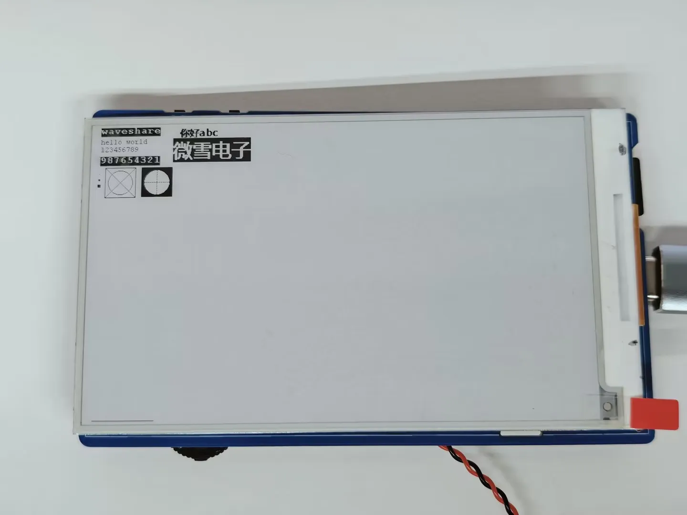
</div>

### 02_Mic_test {#Demo-02_Mic_test}

#### Demo Description

- Demonstrates how to get data from the microphone and then play it through the speaker

#### Hardware Connection

- Connect the development board to the computer

**Code Analysis**

- `i2c_master_Init();`: Initializes the I2C bus.
- `user_ui_init();`: Initializes the global UI.
- `user_button_init();`: Initializes the audio interface.

#### Operation Result

- The screen shows nothing.
- Long press the BOOT button to enter recording mode. Speak into the MIC, and it will automatically stop after 3 seconds.
- Click the BOOT button to play the recorded sound. (If no recording exists, the played sound will be very harsh.)
- Serial port prints:

  <div 
      style={{maxWidth:600}}> 
      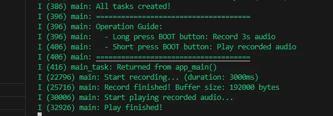
  </div>

### 03_Music {#Demo-03_Music}

#### Demo Description

- Mounts a TF card and reads/plays audio files from it.

#### Hardware Connection

- Connect the development board to the computer
- Connect a speaker to the SPK interface.

**Code Analysis**

- `_sdcard_init();`: Initializes the TF card and reads the audio files from it.
- `i2c_master_init();`: Initializes the I2C bus, providing a communication link for configuration command transmission to the ES8311 audio codec.
- `audio_player_play(audio_fp);`: Starts the audio player, reads the opened MP3 file, and drives the speaker through the ES8311 for playback.

#### Operation Result

- The screen shows nothing.
- The speaker plays audio.

### 04_SD_Test {#Demo-04_SD_Test}

#### Demo Description

- This example reads BMP images from a TF card and refreshes them on the e-Paper display.

#### Hardware Connection

- Connect the development board to the computer
- Place the bmp folder from the current program into the root directory of a TF card, then insert the TF card module.

**Code Analysis**

- `_sdcard_init();`: Initializes the TF card and reads the audio files from it.
- `epaper_port_init();`: Initializes the low-level hardware ports for the e-Paper (pins, communication bus, etc.).
- `EPD_Init();/EPD_Clear();`: Initializes the e-Paper driver parameters and clears the screen to a white background.
- `GUI_ReadBmp("/sdcard/bmp/100x100.bmp", 50, 50);/EPD_Display_Fast(BlackImage);`: Reads a BMP image from the TF card and performs a fast refresh to display it.
- `GUI_ReadBmp_4Gray("/sdcard/bmp/3in97_4Gray.bmp", 0, 0);/EPD_Display_4Gray(BlackImage);`: Reads and displays a 4-grayscale BMP image from the TF card.

#### Operation Result

- Reads and displays images from the TF card.

  <div style={{maxWidth:400}}> 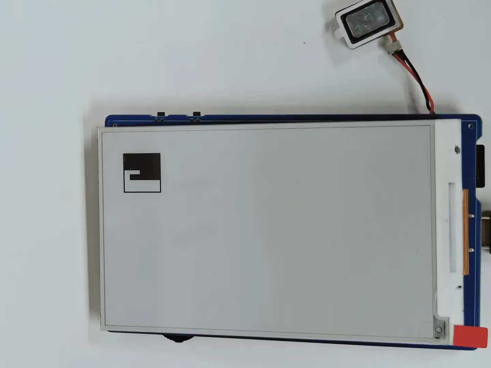</div>
  <div style={{maxWidth:400}}> 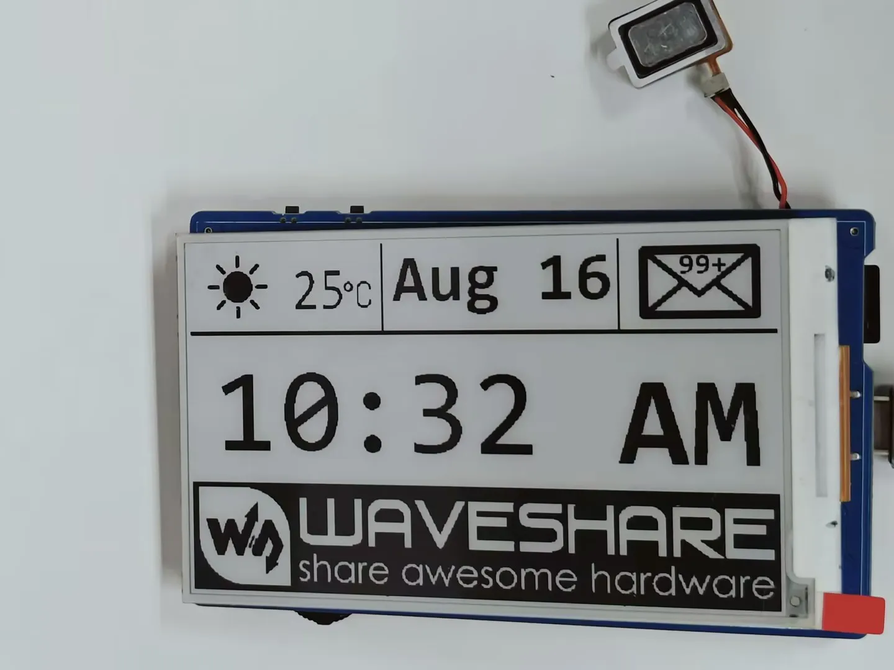</div>
  <div style={{maxWidth:400}}> 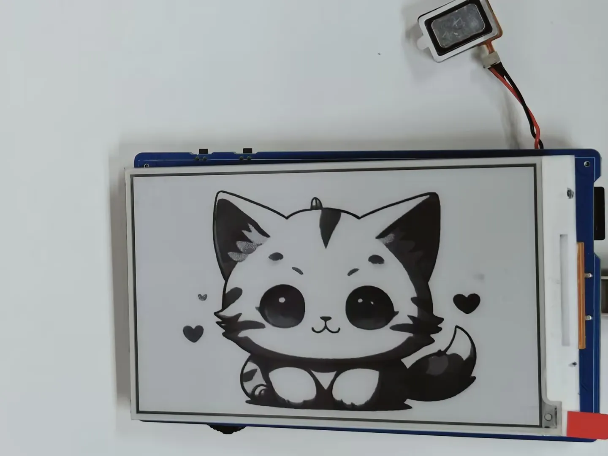</div>

### 05_QMI8658A {#Demo-05_QMI8658A}

#### Demo Description

- This example reads BMP images from a TF card and refreshes them on the e-Paper display.

#### Hardware Connection

- Connect the development board to the computer
- Place the bmp folder from the current program into the root directory of a TF card, then insert the TF card module.

**Code Analysis**

- `epaper_port_init();/EPD_Init();/EPD_Clear();` calling EPD_Display_Partial for a partial e-Paper refresh after drawing values: Initializes the e-Paper's low-level hardware ports and driver parameters, clears the screen to a white background.
- `i2c_master_init();`: Initializes the I2C bus, providing a communication link for configuring and reading data from the QMI8658 sensor.
- `xTaskCreate(qmi8658_test_task, "qmi8658_test_task", 4096, i2c_bus_handle, 5, NULL);`: Creates a FreeRTOS task to execute the QMI8658 sensor data reading logic.
- `qmi8658_is_data_ready(&dev, &ready);`: Checks if the sensor data is ready, and only reads data when it is ready.
- `qmi8658_read_sensor_data(&dev, &data);`: Reads the sensor's acceleration, gyroscope, temperature, and timestamp data, and prints them via the serial port.
- `draw_qmi8658_data_to_epaper(&data);`: After drawing the values, calls `EPD_Display_Partial` for a partial refresh to display the data.

#### Operation Result

- The e-Paper display partially refreshes to show 6-axis gyroscope sensor data.

  <div 
      style={{maxWidth:400}}> 
      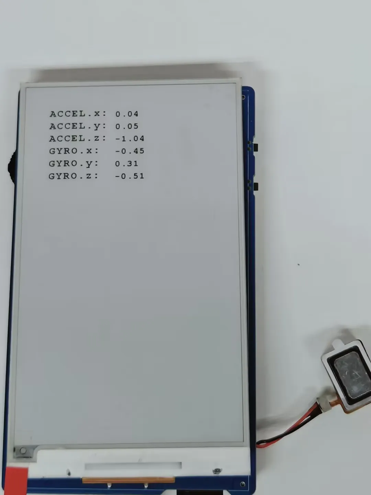
  </div>

### 06_I2C_PCF85063 {#Demo-06_I2C_PCF85063}

#### Demo Description

- This example uses the onboard PCF85063 RTC chip to dynamically display time on the 3.97inch e-Paper screen, combining it with the I2C interface RTC real-time clock module.

#### Hardware Connection

- Connect the development board to the computer

**Code Analysis**

- `epaper_port_init();/EPD_Init();/EPD_Clear();` calling EPD_Display_Partial for a partial e-Paper refresh after drawing values: Initializes the e-Paper's low-level hardware ports and driver parameters, clears the screen to a white background.
- `i2c_master_init();`: Initializes the I2C bus, providing a communication link for configuring and reading time from the PCF85063 RTC module.
- `PCF85063_init();`: Initializes the PCF85063 RTC module, completing the default clock register configuration.
- `PCF85063_GetTime();/PCF85063_SetTime();`: Reads the RTC's current time and sets the default time.
- `xTaskCreate(rtc_test_task, "rtc_display", 4096, NULL, 5, NULL);`: Creates a FreeRTOS task to execute the RTC time reading and display logic.
- `display_time_on_epaper()`: After drawing the values, calls `EPD_Display_Partial` for a partial refresh to display the data.

#### Operation Result

- The e-Paper display partially refreshes to show the time.

  <div 
      style={{maxWidth:400}}> 
      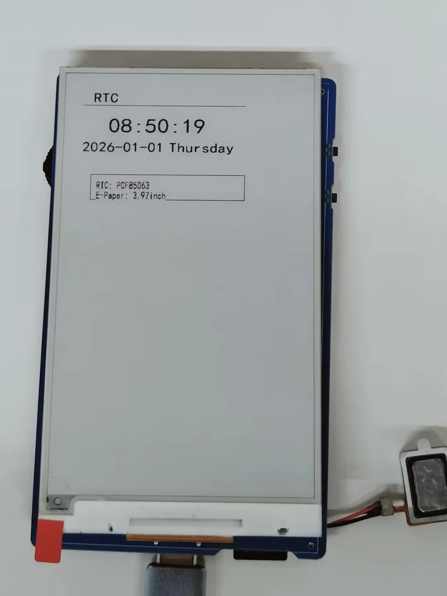
  </div>

### 07_I2C_SHTC3 {#Demo-07_I2C_SHTC3}

#### Demo Description

- This example uses the onboard SHTC3 temperature and humidity sensor to dynamically display temperature and humidity data on the 3.97inch e-Paper display.

#### Hardware Connection

- Connect the development board to the computer

**Code Analysis**

- `epaper_port_init();/EPD_Init();/EPD_Clear();` calling EPD_Display_Partial for a partial e-Paper refresh after drawing values: Initializes the e-Paper's low-level hardware ports and driver parameters, clears the screen to a white background.
- `i2c_master_init();`: Initializes the I2C bus.
- `i2c_shtc3_init();`: Initializes the SHTC3 temperature and humidity sensor module.
- `xTaskCreatePinnedToCore(i2c_SHTC3_loop_task, "i2c_SHTC3_loop_task", 3 * 1024, NULL , 2, NULL,0);`: Creates a FreeRTOS task.
- `i2c_SHTC3_loop_task()`: Obtains temperature and humidity values and prints them, then calls `EPD_Display_Partial` for a partial refresh to display the data.

#### Operation Result

- The e-Paper display partially refreshes to show the temperature and humidity.

  <div 
      style={{maxWidth:400}}> 
      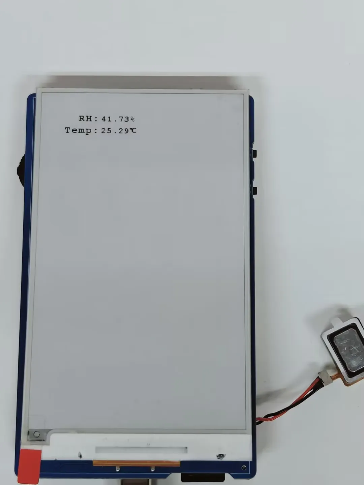
  </div>

### 08_ESP32-S3_e-Paper-3.97 {#Demo-08_ESP32-S3_e-Paper-3.97}

#### Demo Description

- This example integrates eight core functions: file browser, clock, calendar, alarm, weather, network configuration, audio playback, and e-reader, implementing a menu-based interactive interface and button control for the e-Paper.

#### Hardware Connection

- Connect the development board to a computer using a USB cable.
- Copy all files from the TF card folder in the example program to the root directory of a TF card.
- Insert the TF card module.

#### Battery Life

- In clock mode, a 1500mAh battery can operate for over 15 days.

**Code Analysis**

- In `app_main()`, the initialization of NVS, TF card, I2C peripherals (sensors/clock/audio), buttons, and the e-Paper is completed. Configuration (WiFi enable, operating mode) is loaded from NVS, and corresponding tasks are created based on the mode.
- `void user_Task(void *arg)` is responsible for drawing the e-Paper main menu (8 function icons + text), responding to button events (up/down selection, confirm to enter subpage, global refresh, shutdown), managing e-Paper low-power states (sleep after 5 seconds of inactivity, soft shutdown after 10 minutes of inactivity), and refreshing the top status bar (time/battery/WiFi status).
- `file_browser_task();` File browsing module.
- `page_clock_show();` Clock module.
- `page_calendar_show();` Calendar module.
- `page_alarm_menu();` Alarm module.
- `page_weather_city_select();` Weather module.
- `page_handle_network_key_event();` Network configuration module.
- `page_audio_main();`  Audio playback module.
- `page_fiction_file();` E-reader module.

#### Operation Result

- After the program is flashed, it enters the network configuration interface. Configure the network by connecting to the WiFi name displayed on the e-Paper.
  <div style={{maxWidth:400}}> 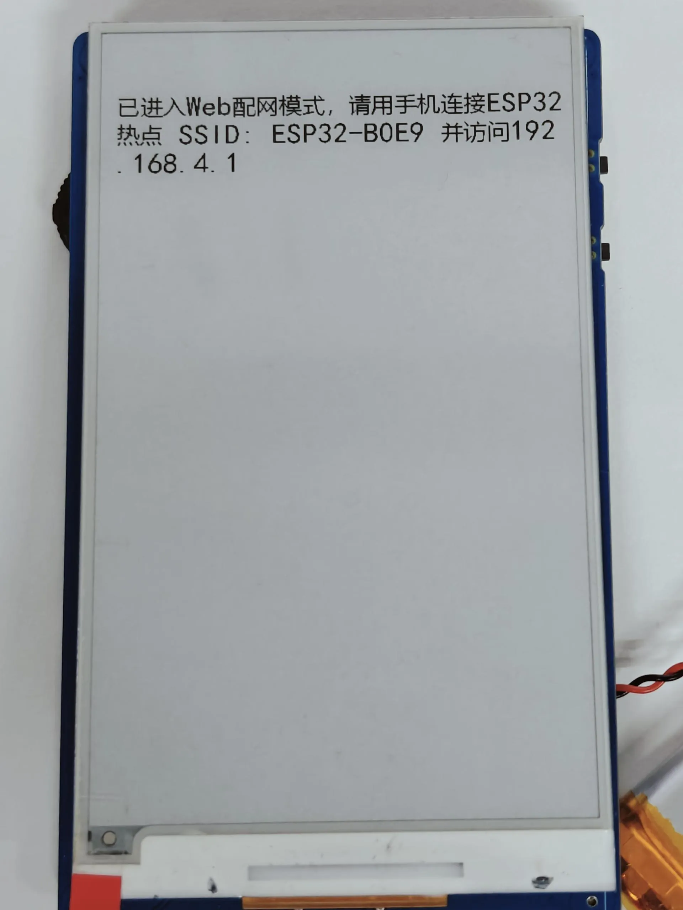</div>

- After network configuration is complete, it enters the main page. Control is via the rotary encoder button and the BOOT and PWR side buttons. The e-Paper automatically sleeps after 60 seconds of inactivity and soft shuts down after 10 minutes of inactivity.
  <div style={{maxWidth:400}}> 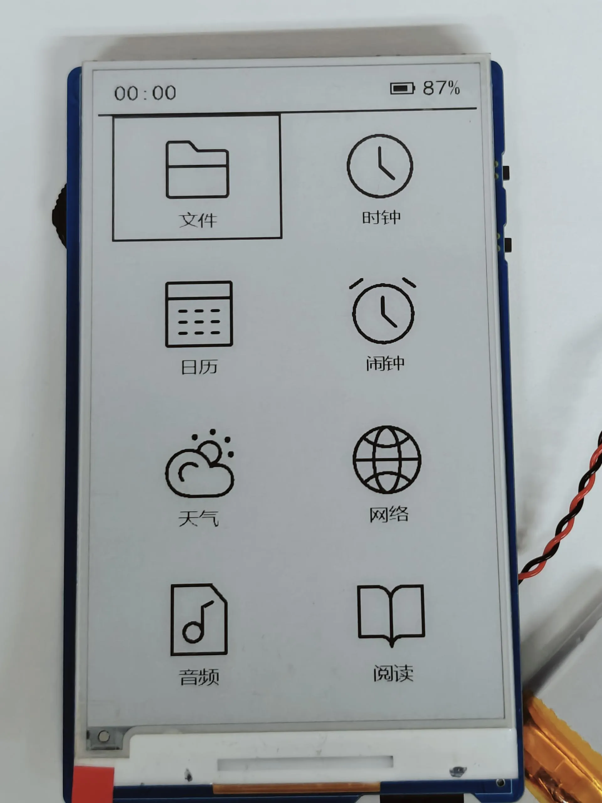</div>

1. File Browser Module
   - Reads all directories and files on the TF card. Only folders, .txt text files, and audio files can be opened; other format files cannot be opened.
     <div style={{maxWidth:400}}> 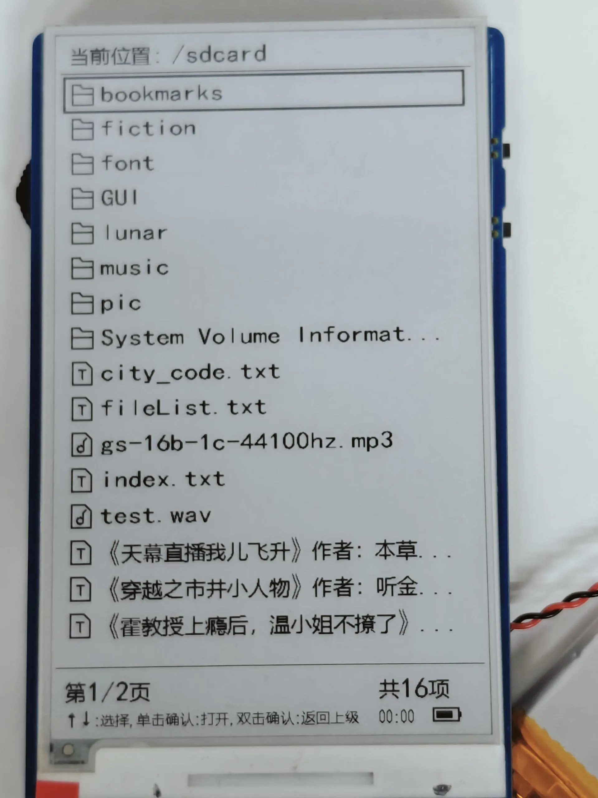</div>
   - Use the rotary encoder up/down (↑↓) to select files/directories. A single click confirms to enter/open.
   - Double-click confirm or press Boot to return to the previous directory. Long press the middle of the rotary encoder to perform a global refresh.

2. Clock Module
   - Refreshes and displays temperature, humidity, time, and battery level.
     <div style={{maxWidth:400}}> 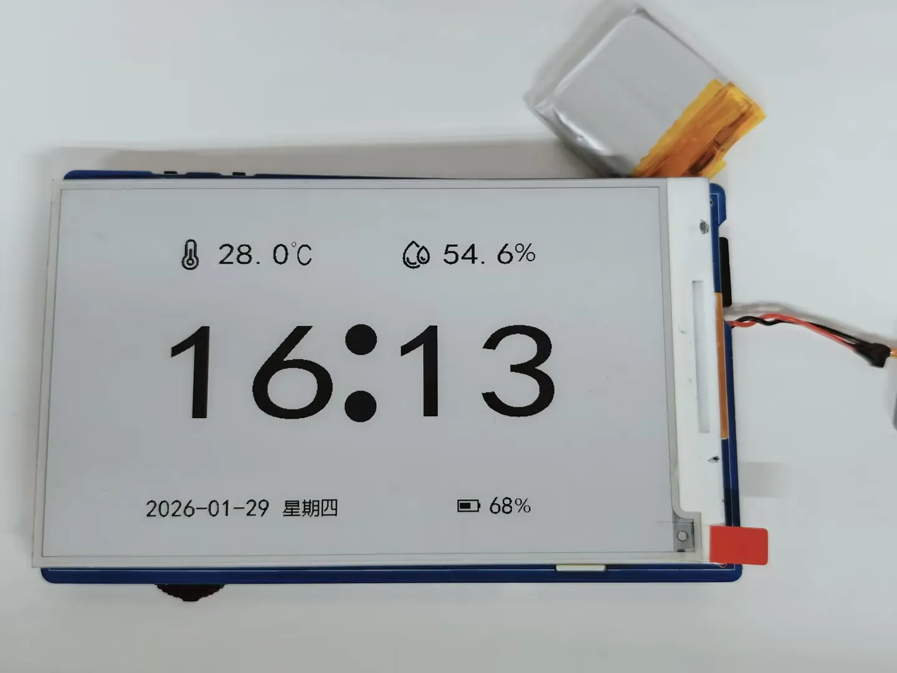</div>
   - Supports timezone selection function: Click confirm to enter the timezone selection interface. The e-Paper displays operation prompts. Use the rotary encoder up/down (↑↓) to select the timezone, then click confirm to apply.
     <div style={{maxWidth:400}}> 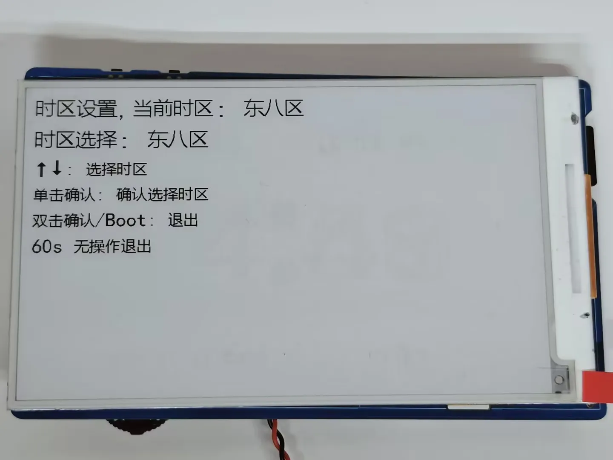</div>

3. Calendar Module 
   - Refreshes and displays the calendar (based on the domestic API in China, which may load slowly for users outside China), including the Gregorian date, Chinese lunar date/solar term/festivals. The current date is highlighted.
     <div style={{maxWidth:500}}> 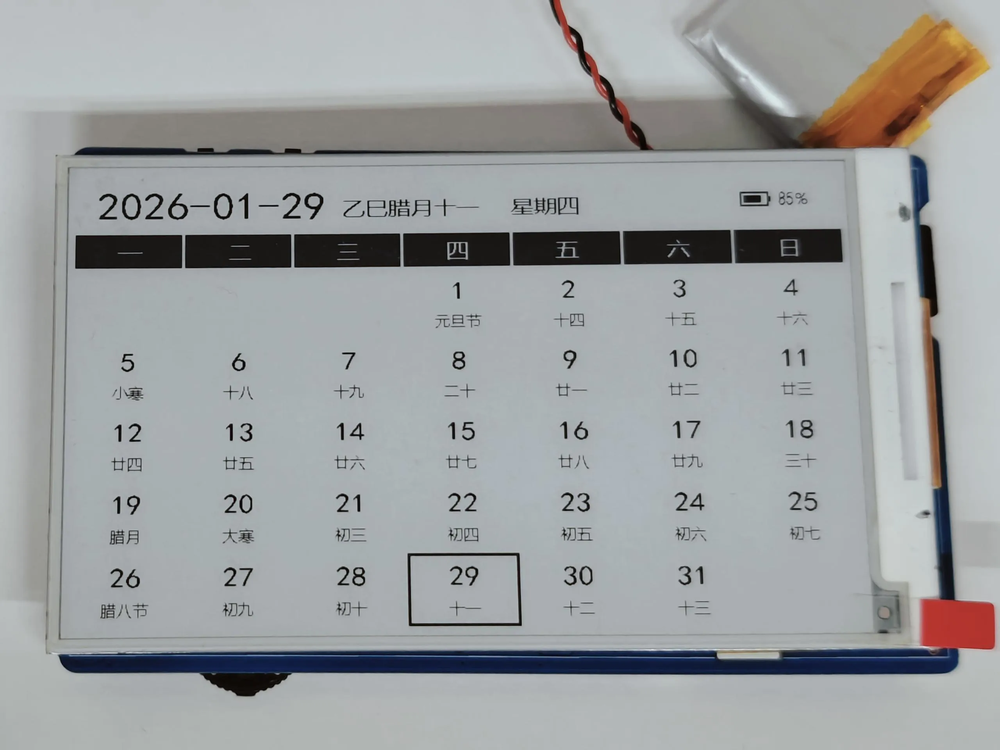</div>
   - Supports manual refresh: Long press the middle of the rotary encoder to fetch the latest date data from the network again. It automatically updates once per day.
   - Low power and wake-up rules: Automatically shuts down after 10 minutes of inactivity. By default, the RTC wakes up once every hour. If an alarm is detected as set on the current page, it changes to waking up once per minute.

4. Alarm Module
   - Main interface of the alarm module, supporting up to 5 alarm settings.
     <div style={{maxWidth:400}}> 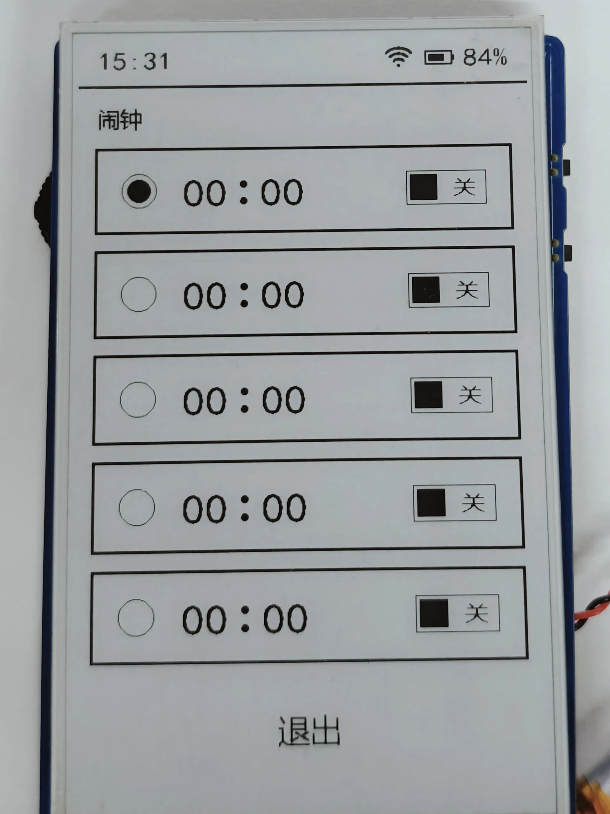</div>

   - After deleting an alarm, the time resets to 00:00 by default and the status is OFF. Click confirm to enter alarm editing mode. Use the rotary encoder up/down (↑↓) to select the content to edit (hour/minute/switch).
     <div style={{maxWidth:400}}> 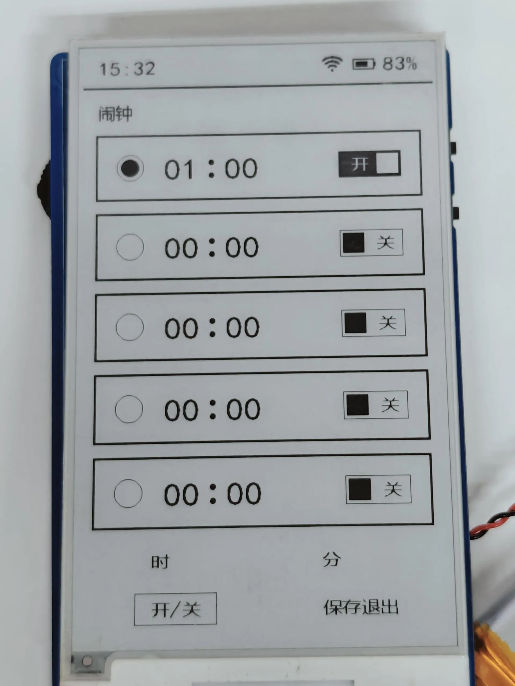</div>
   - Hour/Minute editing: Click confirm to enter value adjustment. The rotary encoder up/down (↑↓) buttons allow single-step adjustment or continuous adjustment when held. Switch editing: Click confirm to toggle the ON/OFF state once. Double-click confirm or press Boot to exit editing mode.
     <div style={{maxWidth:400}}> 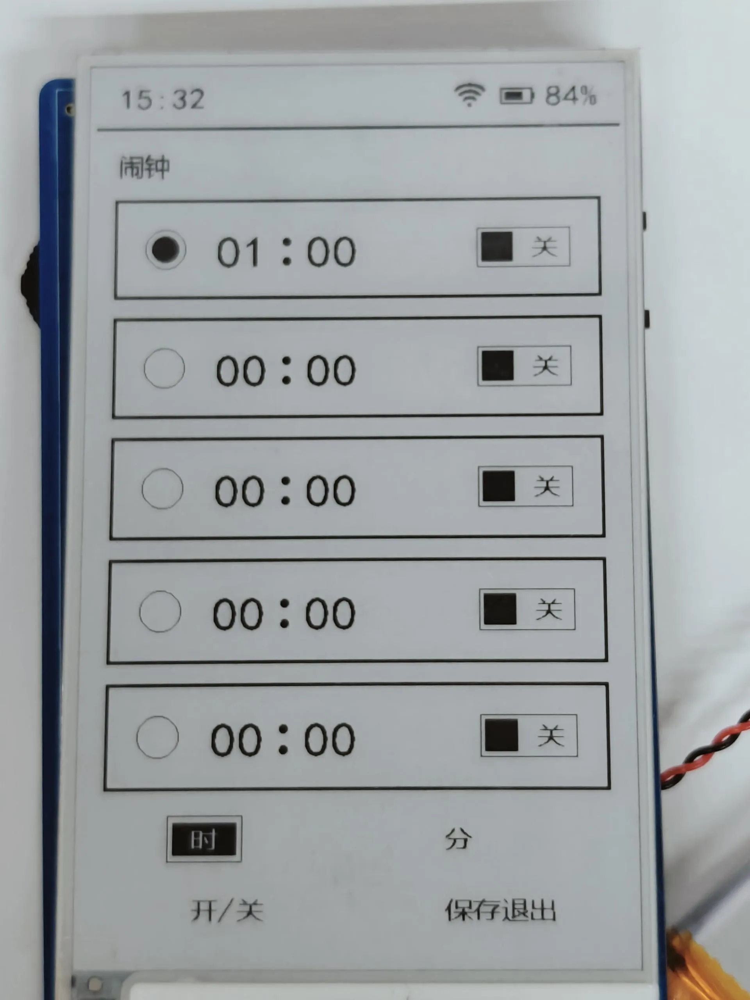</div>

   - Alarm trigger: When the set alarm time arrives, it automatically plays a built-in audio. Press any button to stop playback. Double-click confirm or press Boot to exit the alarm module and return to the main page.

5. Weather Module (Requires WiFi connection to be enabled first. It uses a Chinese weather service API and code tables, and is currently in the testing phase for adaptation to an English API.)
   - Main interface of the weather module, showing the date, temperature/humidity, and weather information for the next 4 days.
     <div style={{maxWidth:500}}> 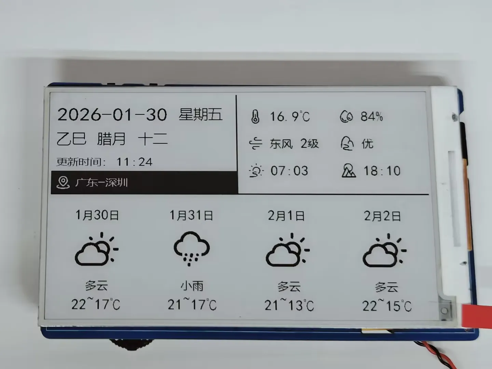</div>
   - Automatically updates weather data at four fixed times daily (4:00, 9:00, 14:00, 20:00). Long press the rotary encoder to manually fetch the latest weather from the network.
   - Automatically shuts down after 10 minutes of inactivity. By default, the RTC wakes up once every hour. If an alarm is detected as set on the current page, it changes to waking up once per minute.
   - The weather module's icon files are stored in: sdcard\Weather_img\Weather_img. Supports adding/modifying weather images:
     - Add new weather images in the sdcard\Weather_img\Weather_img folder.
     - Open Weather.txt, add the name to display and the corresponding image.
       <div style={{maxWidth:600}}> 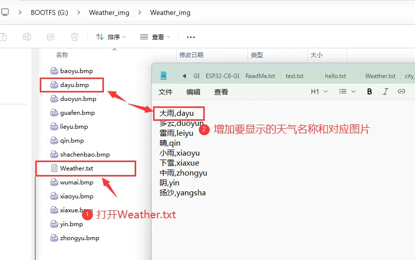</div>

6. Network Configuration Module
   - Supports turning WiFi ON/OFF and re-configuring the network. When WiFi is OFF, only "Turn ON WiFi" and "Return to Main Menu" are displayed. When WiFi is ON, "Turn OFF WiFi", "Re-configure Network", and "Return to Main Menu" are displayed.
     <div style={{maxWidth:400}}> 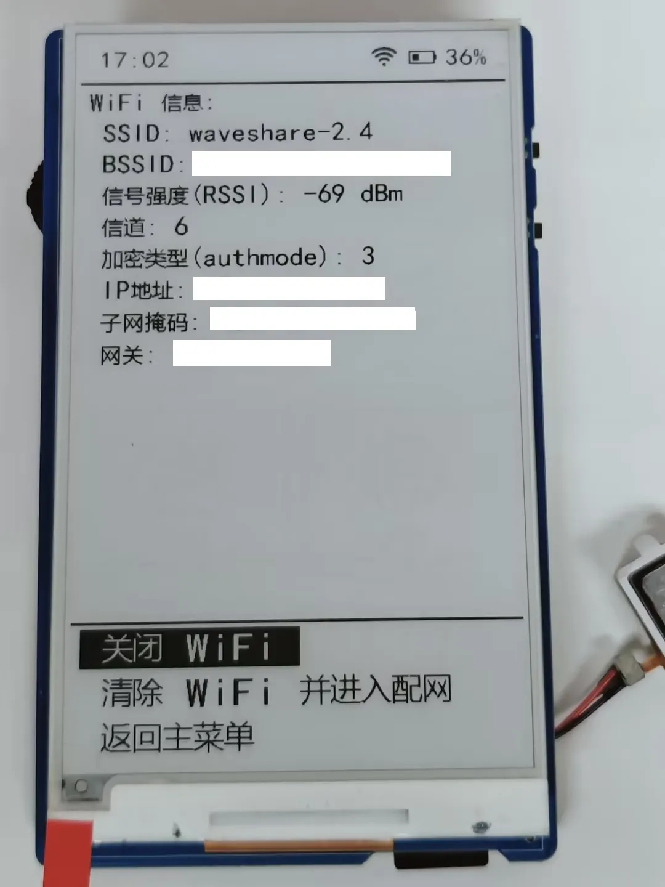</div>
   - After selecting network configuration, it enters STA mode. In this mode, auto-shutdown is not triggered; only the e-Paper enters sleep state, while the ESP32 continues to work. Connect a device to the WiFi name displayed on the e-Paper to complete the configuration.
   - It attempts to connect to the configured WiFi for 30 seconds, during which no other operations are possible. If the connection fails, it exits configuration. Upon successful connection, it automatically obtains an IP address, and the e-Paper prompts that configuration was successful.

7. Audio Playback Module
   - Supports three audio modes: Built-in audio, TF card audio, and Recording. Use the rotary encoder up/down (↑↓) to select the mode, then click confirm to enter. TF card audio reads files from the music folder in the TF card root directory. Recorded audio files are also automatically saved to this folder.
     <div style={{maxWidth:400}}> 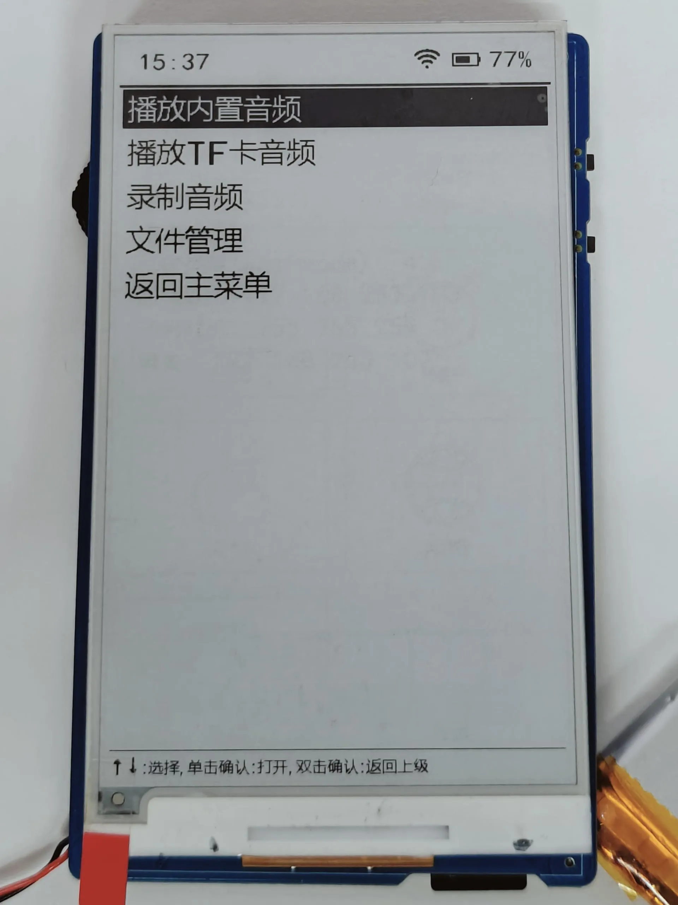</div>
   - For built-in audio, click confirm to play directly. For recording mode, click confirm to start recording immediately. In TF card audio mode, click confirm to select and play an audio file. There is no volume control function.
     <div style={{maxWidth:400}}> 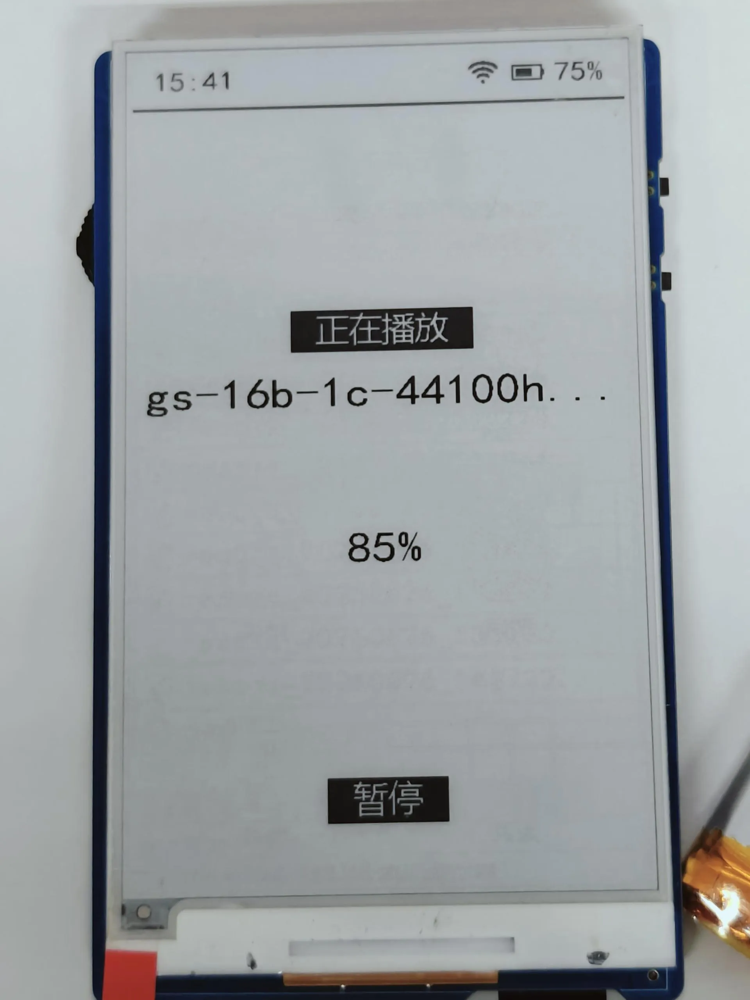</div>
     <div style={{maxWidth:400}}> 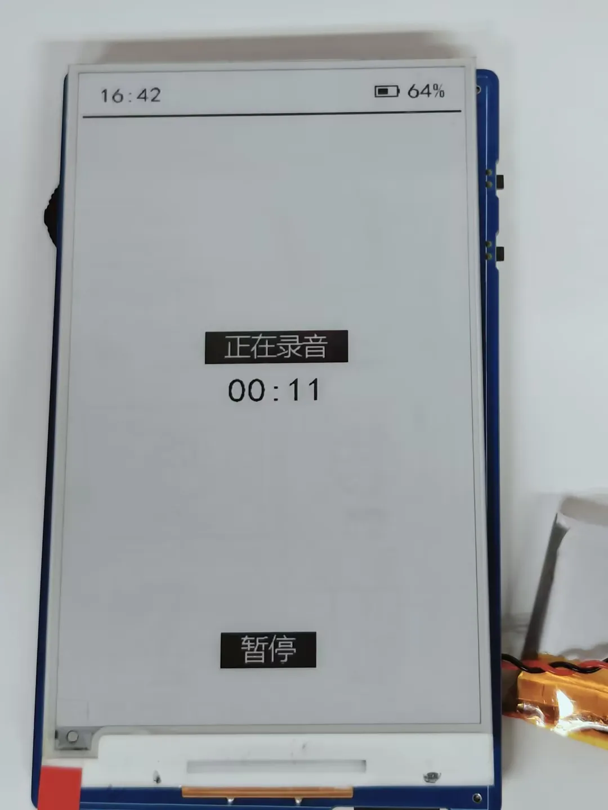</div>
   - After selecting an audio file, click confirm to enter the operation selection interface. Double-click confirm or press Boot to return to the previous level. Long press the middle of the rotary encoder performs a global refresh.

8. E-reader Module
   - Main interface of the e-reader module.
     <div style={{maxWidth:400}}> 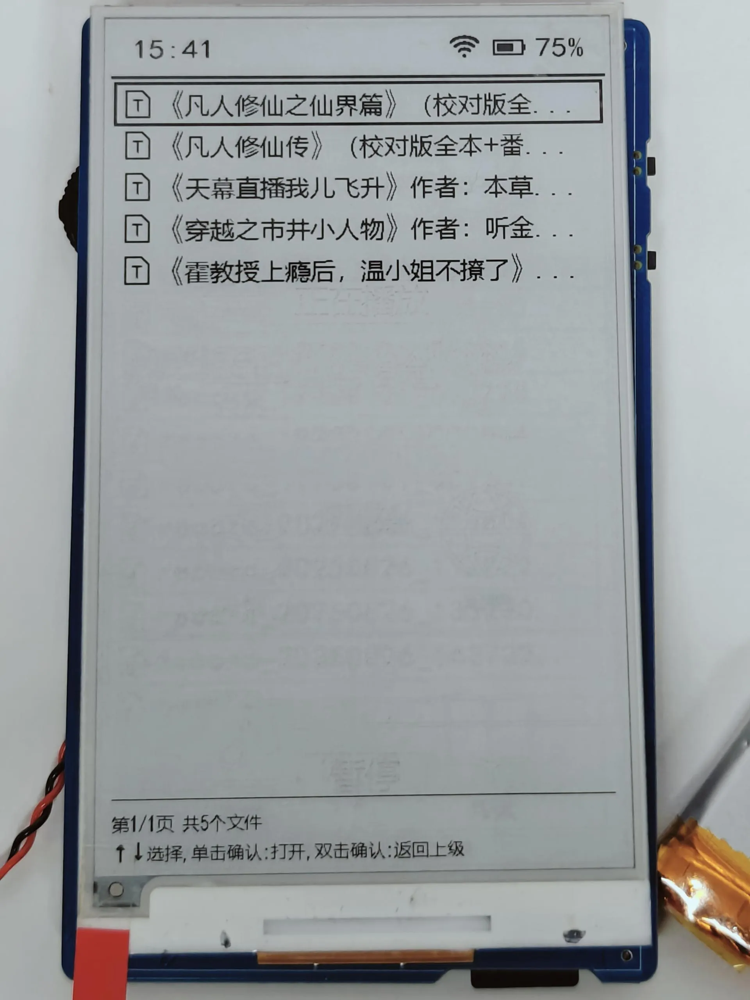</div>

   - Reads .txt text files from the fiction folder in the TF card root directory. Use the rotary encoder up/down (↑↓) to select a file, then click confirm to start reading. While reading, use the rotary encoder up/down (↑↓) to turn pages.
     <div style={{maxWidth:400}}> 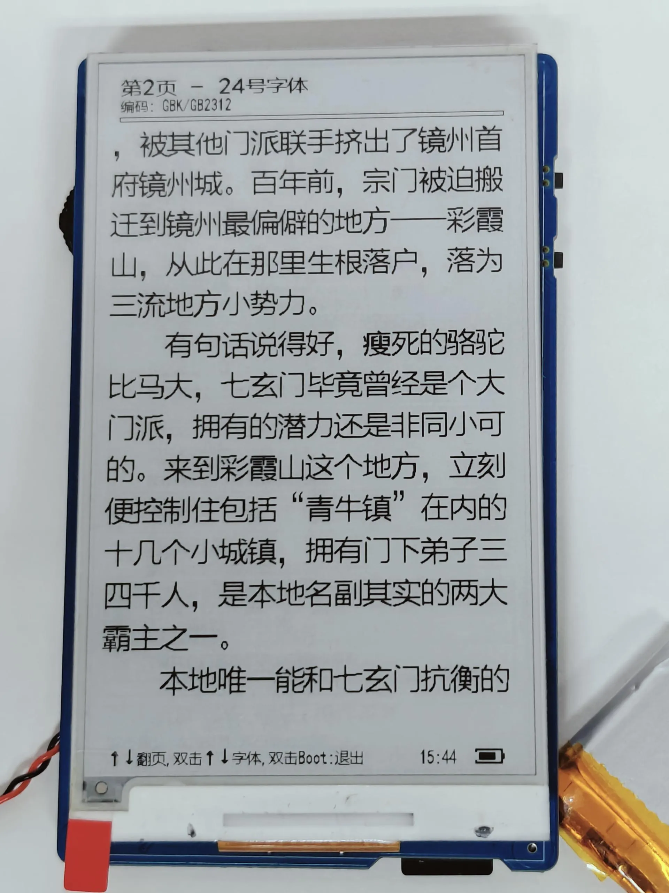</div>

   - Double-click the rotary encoder to enter the font selection interface. Click confirm to select a font and apply it.
     <div style={{maxWidth:400}}> 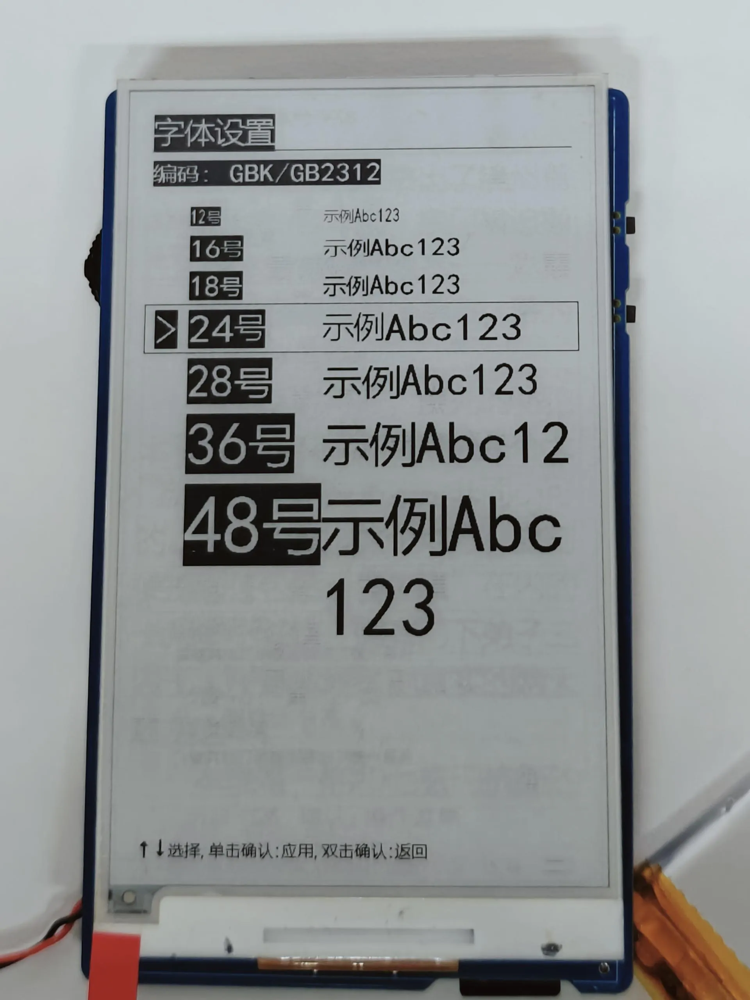</div>

   - Click the rotary encoder to enter the bookmark management interface. Click again to perform a bookmark operation. Double-click confirm to add a bookmark. Reading progress and bookmarks are automatically saved to the bookmarks folder on the TF card.
     <div style={{maxWidth:400}}> </div>

9. System Settings Module
   - Entry method: On the main page, long press the Boot button to enter the settings interface. Use the rotary encoder up/down (↑↓) to select a function item. Click confirm to view. Double-click confirm or press Boot to return to the main page.
   - Currently supports two major functions: Memory Display (shows the device's current memory status) and QMI8658 6-axis Status Display (real-time display of acceleration, angular velocity, etc.).
     <div style={{maxWidth:400}}> 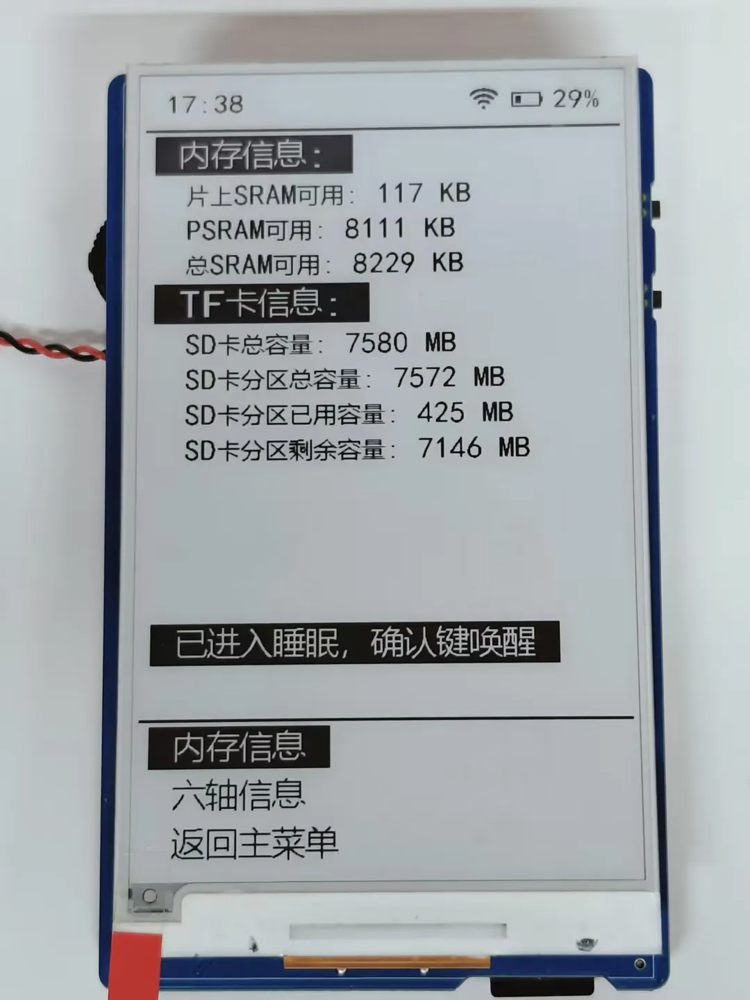</div>
     <div style={{maxWidth:400}}> 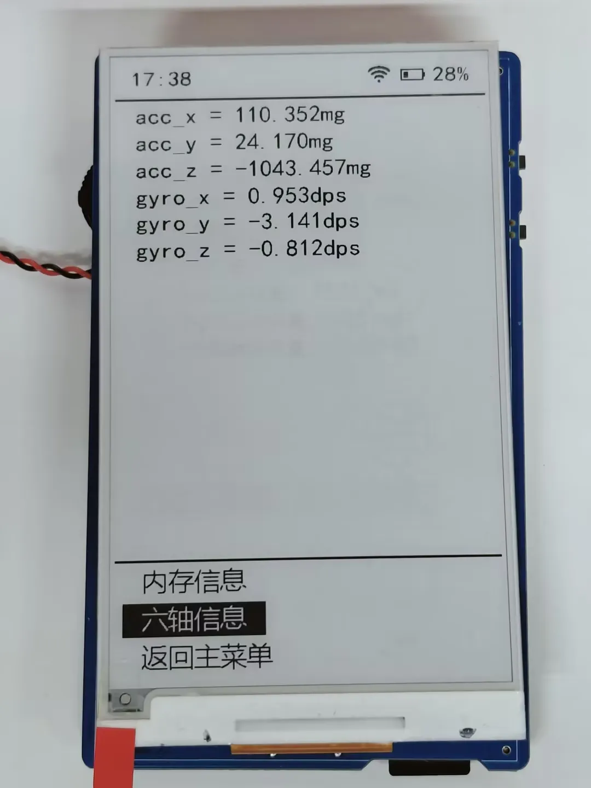</div>
   - Supports global refresh: Long press the middle of the rotary encoder to perform a global refresh of the e-Paper, following the low-power rules of 60-second sleep and 10-minute shutdown.

10. System Power ON/OFF
    - On the main page, double-click the Boot button to shut down the system.
    - Long press the Power button for 4 seconds to power on the system. The e-Paper refreshes and displays content.