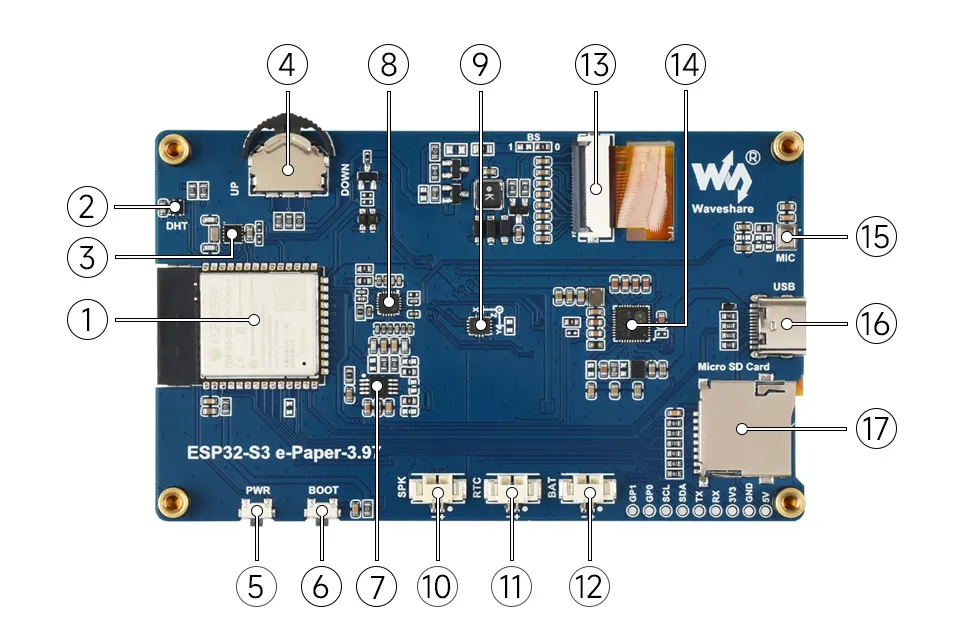
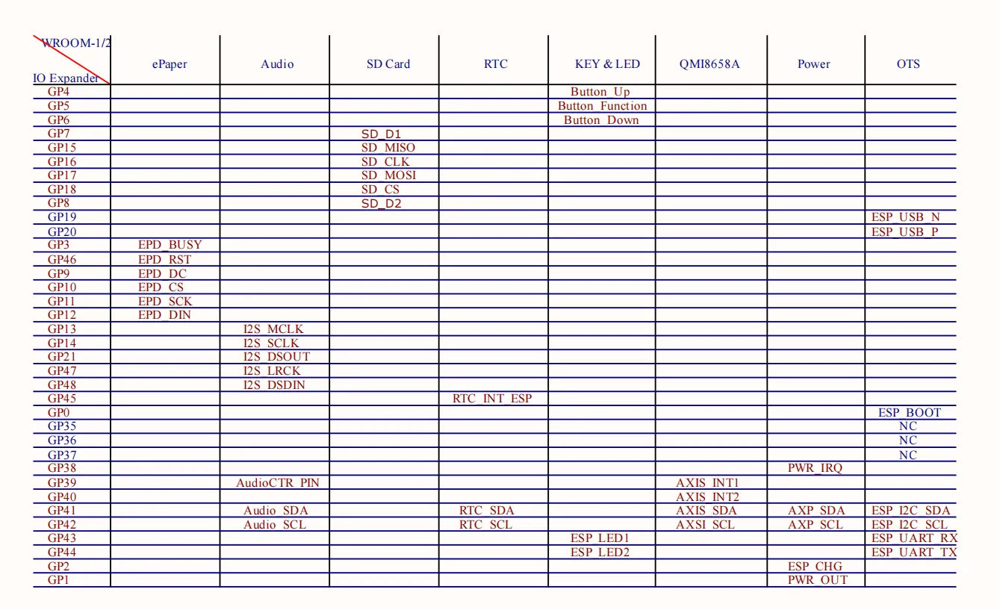
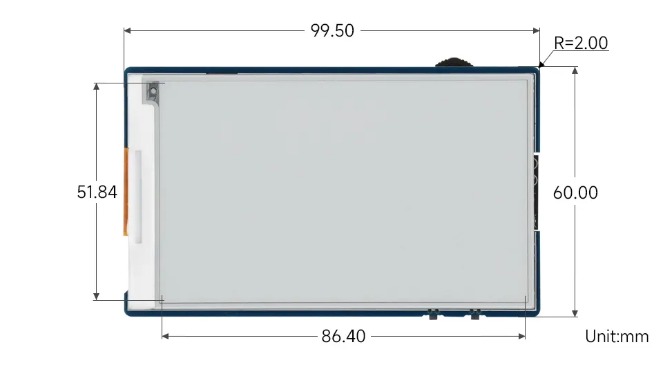

<!-- import esp32S3RLCD4_2UiInit from './images/ESP32-S3-RLCD-4.2-DocHeader.webp'; -->

# ESP32-S3-ePaper-3.97

This product is a high-performance, highly integrated microcontroller development board designed by Waveshare. It features the ESP32-S3 microcontroller, supporting dual-mode Wi-Fi and BLE communication. The board comes with a 3.97inch e-Paper display, which offers extremely low power consumption, is viewable under ambient light, and is suitable for portable devices and long-endurance scenarios. It integrates an RTC real-time clock, an SHTC3 temperature and humidity sensor, a TF card slot, a low-power audio codec chip, and a power management chip. It provides a flexible and reliable development platform for applications such as IoT endpoints, electronic shelf labels, and portable displays.

| SKU   | Product                                     |
| ----- | ------------------------------------------- |
| 33552 | ESP32-S3-ePaper-3.97      |
| 33810 | ESP32-S3-ePaper-3.97-EN   |
| 33811 | ESP32-S3-ePaper-3.97-Kit  |

## Features

- Equipped with ESP32-S3R8 high-performance Xtensa 32-bit LX7 dual-core processor, with a clock frequency up to 240MHz
- Supports 2.4GHz Wi-Fi (802.11 b/g/n) and Bluetooth 5 (LE) with an onboard antenna.
- Built-in 512KB SRAM and 384KB ROM, with stacked 8MB PSRAM and external 16MB Flash
- Features a 3.97inch e-paper display with a resolution of 800 × 480, offering high contrast, wide viewing angles, and other characteristics
- Onboard audio codec chip supports voice capture and playback, facilitating AI voice interaction applications
- Onboard QMI8658 6-axis IMU (3-axis accelerometer and 3-axis gyroscope) enables motion posture detection, step counting, and other functions
- Onboard PCF85063 RTC real-time clock and SHTC3 temperature and humidity sensor enable precise RTC time management and environmental monitoring
- Onboard TG28 power management chip accepts a 3.7V MX1.25 lithium battery for uninterrupted power supply. A backup battery interface is reserved to ensure RTC functionality continues when the main battery is replaced
- The TG28 provides an efficient power management solution, supports outputting multiple configurable voltages, and integrates charging and battery management functions, helping to extend battery life
- Utilizes a Type-C interface, improving user convenience and device compatibility
- Onboard TF card slot enables storage expansion and fast data transfer, suitable for data logging, media playback, and other scenarios, simplifying circuit design
- Onboard rotary button, along with side BOOT and PWR buttons, supports customizable key functions for more flexible development and use

## Onboard Resources

 
    

1. **ESP32-S3-WROOM-1-N16R8** Wi-Fi and Bluetooth SoC, up to 240MHz operating frequency, stacked with 16MB Flash and 8MB PSRAM
2. **SHTC3 Temperature and Humidity Sensor** Provides ambient temperature and humidity measurement, enabling environmental monitoring function
3. **PCF85063** RTC clock chip, supporting time-keeping functionality
4. **Rotary Button** Supports customizable button functions in three directions
5. **PWR Key** Can be used with programs to control all power functions when powered by a lithium battery
6. **BOOT Button** Press and hold the BOOT button to power on again to enter download mode
7. **NS4150B** Audio power amplifier chip
8. **ES8311** Low-power audio codec chip
9. **QMI8658** 6-axis IMU includes a 3-axis gyroscope and a 3-axis accelerometer
10. **MX1.25 Speaker Header** 
11. **MX1.25 RTC Backup Battery Header** Used to power the RTC when no battery is connected to the lithium battery interface
12. **MX1.25 Lithium Battery Header** MX1.25 2PIN connector for connecting a 3.7V lithium battery, supports charging and discharging
13. **3.97inch e-Paper Display Interface** 
14. **TG28** Highly integrated power management chip
15. **Microphone** 
16. **Type-C Interface** Used for program flashing and log printing
17. **TF Card Slot ** Supports FAT32-formatted TF card for data expansion

## Interfaces

 
    

## Dimensions

 
    

## Development Methods

The ESP32-S3-ePaper-3.97 supports two development frameworks: Arduino IDE and ESP-IDF, offering flexibility for developers. You can choose the appropriate development tool based on project requirements and personal preference.

Each method has its advantages, and developers can select based on their needs and skill level. Arduino is simple to learn and easy to get started with, suitable for beginners and non-professionals; ESP-IDF provides more advanced development tools and stronger control capabilities, suitable for developers with professional backgrounds or those with higher performance requirements, and is more suitable for complex project development.

- **Arduino IDE** is a convenient, flexible, and easy-to-use open-source electronics prototyping platform. It requires minimal foundational knowledge, allowing for rapid development after a short learning period. Arduino has a vast global community that provides a wealth of open-source code, project examples, tutorials, and rich libraries that encapsulate complex functionalities, enabling developers to implement various features quickly. You can refer to the **[Working with Arduino](./Arduino.md)** to complete the initial setup, and the tutorial also provides related demos for reference.

- **ESP-IDF** (Espressif IoT Development Framework) is a professional development framework released by Espressif for its ESP series chips. It is developed based on the C language, including a compiler, debugger, and flashing tool, etc. It supports development via command line or an Integrated Development Environment (such as Visual Studio Code with the Espressif IDF plugin), which provides features like code navigation, project management, and debugging, etc. We recommend using VS Code for development. For the specific configuration process, please refer to the **[Working with ESP-IDF](./ESP-IDF.md)**. The tutorial also provides relevant demos for reference.