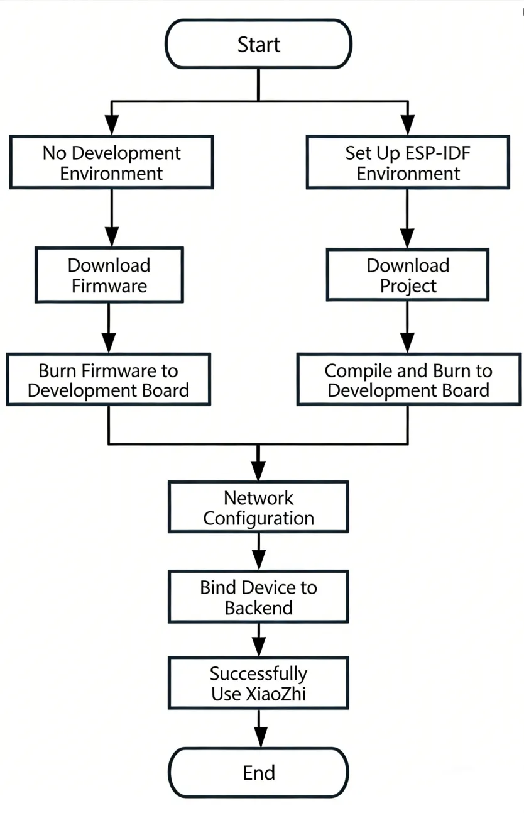
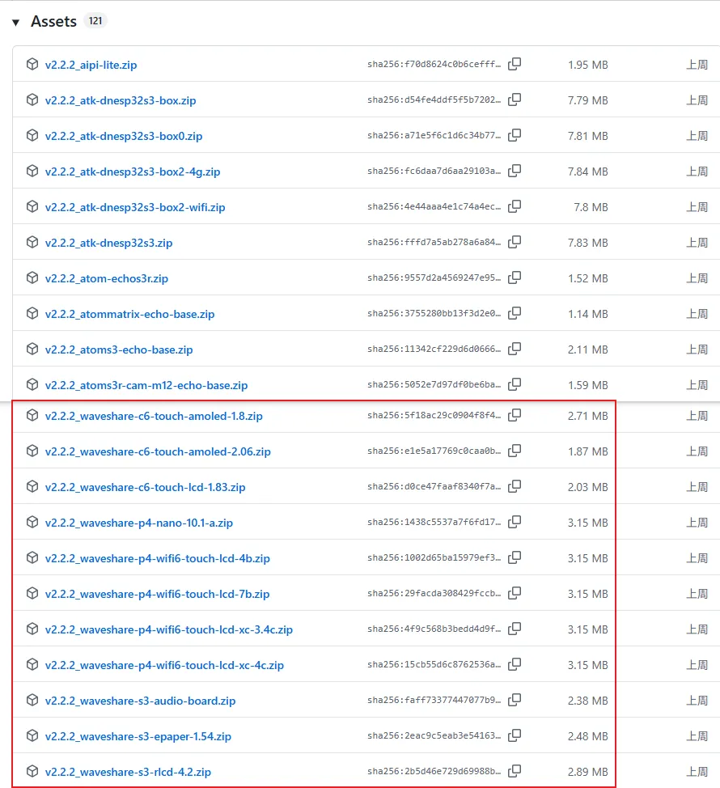
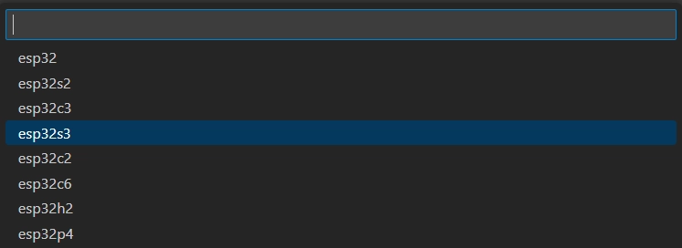
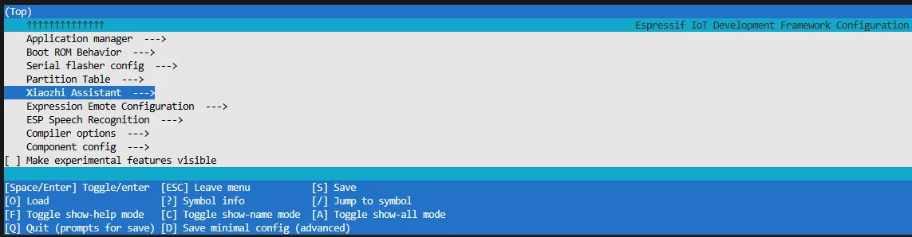
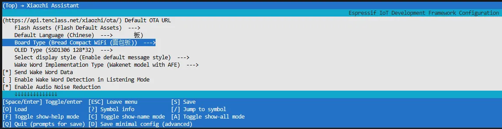
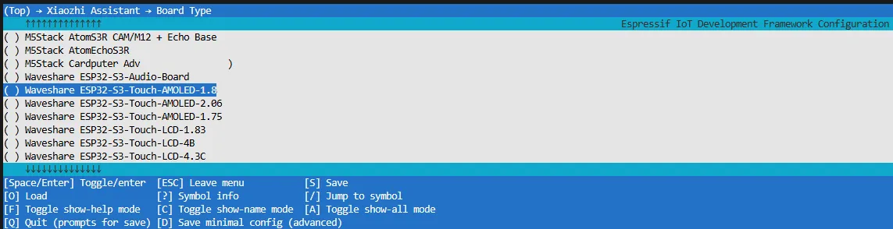

# XiaoZhi AI Application Tutorial

[XiaozhiAI](https://github.com/78/xiaozhi-esp32) (XiaoZhi AI) is an open-source AI voice chatbot project based on the ESP32 development board, aiming to bring the general intelligence of large language models (LLMs) to edge devices. It provides a software-hardware integrated solution supporting full-duplex voice conversations and IoT device control, dedicated to assisting developers in building highly customized physical AI agents quickly and at low cost.

This article demonstrates how to flash firmware for Waveshare ESP32 development boards that support XiaoZhi AI, covering two methods: **flashing without a development environment** (directly flashing precompiled firmware) and **flashing with a development environment** (compiling from source and flashing).

## 0. Firmware Flashing Process Reference

:::info
This section uses the **ESP32-S3-Touch-AMOLED-1.8** development board as an example. The steps are similar for other development boards.

Please first confirm that your hardware is listed in the **[XiaoZhi AI Supported Products List](./index.md#xiaozhi-supported-products)**.
:::

## 1. Flashing Without a Development Environment

### **1.1 Download Firmware from XiaoZhi Official GitHub**

1. Visit the [XiaoZhi GitHub](https://github.com/78/xiaozhi-esp32/releases) to download the firmware file for your device. Click **Assets** to expand the full file list:
   
 
   
   

2. Refer to the [Flash Firmware Flashing and Erasing Tutorial](https://www.waveshare.com/wiki/Flash_Firmware_Flashing_and_Erasing) to complete the firmware flashing.

### **1.2 Download Firmware from Waveshare GitHub**

:::info
[**This repository**](https://github.com/waveshareteam/ESP32-AIChats/tree/master/xiaozhi-esp32) aggregates firmware for Waveshare ESP32 development boards that support XiaoZhi AI. All firmware has been tested and verified on the corresponding boards, making it convenient for users to find and download. Firmware versions may be updated slightly later than the official XiaoZhi repository.
:::

1. Visit the [Waveshare GitHub](https://github.com/waveshareteam/ESP32-AIChats/tree/master/xiaozhi-esp32) repository and download the appropriate firmware version for your needs:
   
 
   
   

2. Refer to the [Flash Firmware Flashing and Erasing Tutorial](https://www.waveshare.com/wiki/Flash_Firmware_Flashing_and_Erasing) to complete the firmware flashing.

## 2. Flashing with ESP-IDF Environment

### **2.1 Download the Project from XiaoZhi GitHub**

Visit the [XiaoZhi AI Chatbot](https://github.com/78/xiaozhi-esp32) repository to download the complete project code:

 

### **2.2 Environment Setup**

Refer to the [ESP-IDF Environment Setup Tutorial](https://docs.waveshare.com/ESP32-ESP-IDF-Tutorials/ESP-IDF-Installation) to configure the development environment.

### **2.3 Configuration and Compilation**

1. Click  to select the target device. Choose the chip model corresponding to your development board (e.g., `esp32s3`):

   

   :::tip
   When setting the target device, ESP-IDF will automatically configure the corresponding toolchain and libraries. This process may take some time, please be patient. For more details, please refer to the [Official Documentation](https://docs.espressif.com/projects/esp-idf/en/latest/esp32s3/api-guides/tools/idf-py.html#select-the-target-chip-set-target).
   :::

2. Click  to open the ESP-IDF terminal, then execute the command `idf.py menuconfig` to enter the configuration interface. Select **Xiaozhi Assistant**:
   
 
   
   

3. Select **Board Type** to choose the development board type:
   
 
   
   

4. Choose the product model corresponding to your development board:
   
 
   
   

5. Press the **S** key to save the configuration and exit. Then click the  to automatically complete compilation, flashing, and serial monitoring.

### **2.4 Start Network Provisioning**

1. Connect your phone or computer to the device's Wi-Fi hotspot: **Xiaozhi-xxxxxx**. After successful connection, the configuration page should automatically pop up. If not, manually open a browser and visit `http://192.168.4.1`.

2. On the network configuration page, select the Wi-Fi name you want to connect to (only **2.4G** band is supported; to connect to an iPhone hotspot, enable **Max Compatibility** in your phone's system settings). The SSID will be auto-filled. Enter the password and click **Connect** to start connecting:
    

    
    

### **2.5 Add a New Device to the Management Console**

1. Ensure the device has successfully connected to the Internet. The device will then broadcast a 6-digit device verification code (you can wake the device again to replay the code).

2. Visit the [XiaoZhi AI Console](https://xiaozhi.me). If you haven't registered, complete the registration and log in:
    
 
    
    

    
 
    
    

3. Enter the 6-digit verification code. The device will automatically activate and appear on the **Device Management** page, ready for normal use.

4. Say the wake word **"Hello XiaoZhi"** to wake the device and start voice conversations.

5. **ESP32-S3-Touch-AMOLED-1.8** Button Instructions:
   - **BOOT** button: Press to wake XiaoZhi
   - **PWR** button: Short press to power on; long press for more than 6 seconds to power off
   
    
 
    
    

## 3. FAQ

import Details from '@theme/Details';

A: ESP32 series chips can generally be integrated with AI models, but the specific application depends on the hardware configuration. If the product is equipped with a microphone and speaker, it can support voice conversations; without these peripherals, it can only support text-based conversations (some products support external microphones and speakers).

A: Please refer to the [XiaoZhi AI Supported Products List](./index.md#xiaozhi-supported-products).

A: Yes, XiaoZhi can function normally without a TF card inserted.

A: Once the **OTA upgrade** feature is enabled in the XiaoZhi console, the firmware will update automatically without manual re-flashing.

A: By default, they connect to the official XiaoZhi server. In theory, it is possible to connect to a customer's own server, but corresponding configuration modifications are required.

A: No, XiaoZhi requires an internet connection to function properly.

A: Currently, XiaoZhi does not support reading files from a TF card.

A: Yes, it is possible to integrate with other AI services, but this requires custom development by the user.

A: No. The example program and the XiaoZhi firmware are two separate programs and cannot be used simultaneously or switched with one click. Re-flashing the firmware is required to switch between them.

A: Yes, as long as the hotspot is on the **2.4G band** (5G band is not supported).

