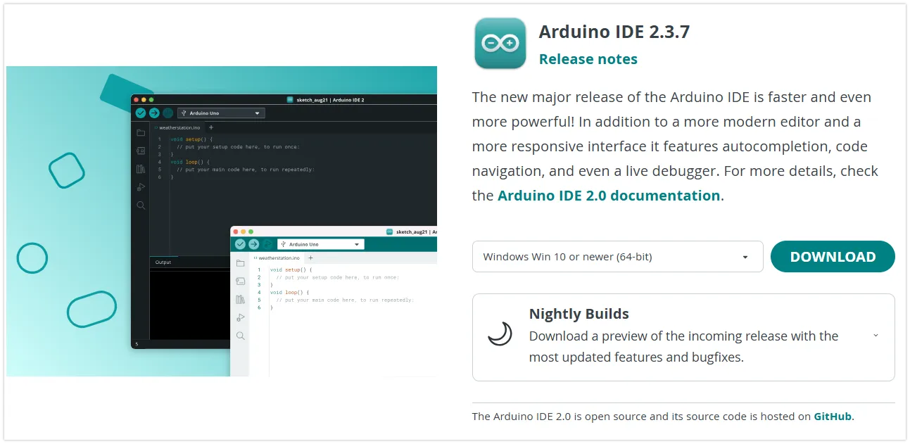
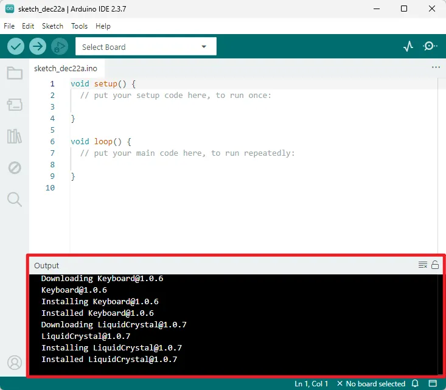
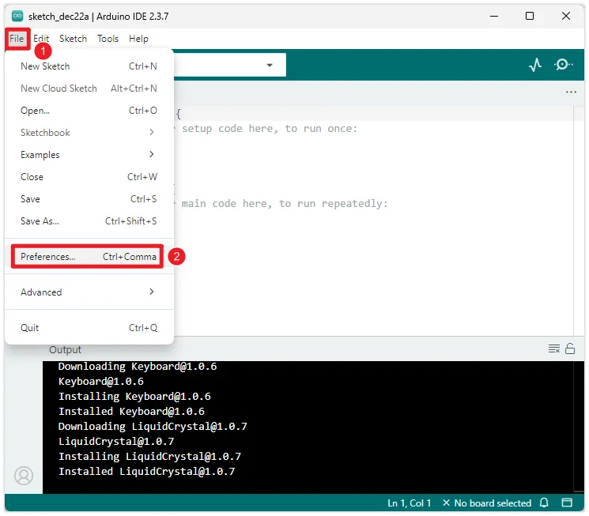
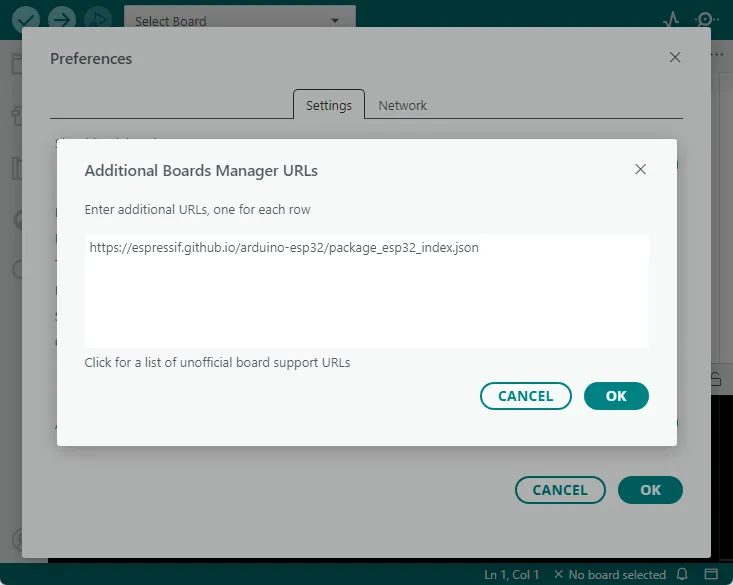
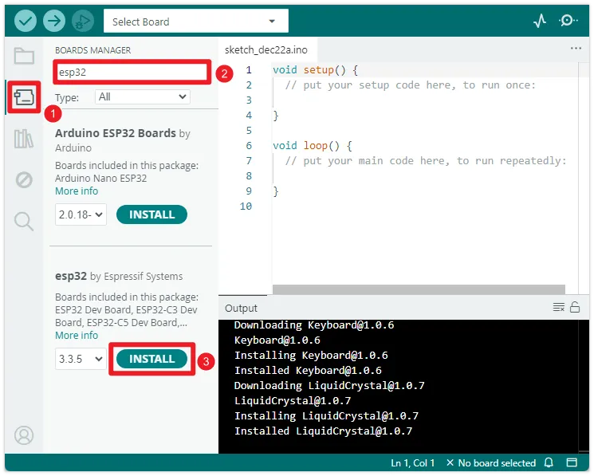
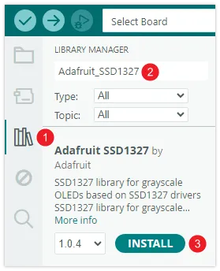
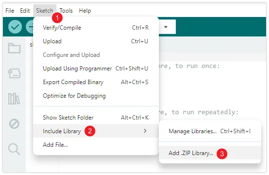

import Tabs from '@theme/Tabs';
import TabItem from '@theme/TabItem';

<!-- Image referencing -->

# Install and Configure Arduino IDE

:::tip[Important: About board compatibility]
The core logic of this tutorial applies to all ESP32 boards, but all the operation steps are explained using the example of the [**Waveshare ESP32-S3-Zero mini development board**](https://www.waveshare.com/esp32-s3-zero.htm). If you are using a development board of another model, please modify the corresponding settings according to the actual situation.
:::

The Arduino IDE is an [open-source](https://github.com/arduino/arduino-ide) development environment that supports Arduino microcontrollers and is compatible with a variety of third-party development boards, including the ESP32, allowing developers to easily write and upload code to these powerful Wi-Fi and Bluetooth integrated chips to implement IoT projects. It has rich libraries and sample code, widely used in prototype development and education fields, and is the preferred platform for beginners. This series of tutorials will use the Arduino IDE as the development environment.

## 1. Download and Install Arduino IDE 

1. Go to [Arduino official website](https://www.arduino.cc/en/software/) to download the Arduino IDE installer.

   [](https://www.arduino.cc/en/software/)

2. Run the installer to install the Arduino IDE. It is recommended to use the default settings during installation and choose a path containing **only English characters**.

   :::warning
   An installation path containing special characters may cause exceptions.
   :::

## 2. Set up Arduino IDE

1. After installation is complete, launch the Arduino IDE.

2. Upon the first launch, the IDE may automatically download and install core library files and drivers. If the operating system prompts for driver installation or network security permissions, it is recommended to allow them. The output window information shown in the figure below indicates the installation process and is normal; no action is required.

   <div style={{maxWidth:500}}> </div>

3. The Arduino IDE displays the English interface by default, but supports switching to other languages. Click “File -> Preferences” to open the settings.

   <div style={{maxWidth:500}}> </div>

   In the settings interface, find the "Language" option, select your preferred language, and then click "OK". The Arduino IDE will automatically restart and switch to the selected language interface.

   <div style={{maxWidth:500}}> </div>

4. In addition, you can also adjust the interface scale, font size, theme style, and default save location of sketches(program files) in "Preferences".

## 3. Install ESP32 Development Board Library

To develop for the ESP32 using the Arduino IDE, you need to add the ESP32 board configuration and install the relevant libraries.

- Open "File" -> "Preferences", find "Additional Board Manager Address" in the Settings screen, paste the following link and click OK:

  :::info
  This step can be skipped because the Arduino IDE has already indexed the ESP32 in the Board Manager, but it may not be up-to-date. Manually adding it ensures you get the latest ESP32 library first.
  :::

  ```
  https://espressif.github.io/arduino-esp32/package_esp32_index.json
  ```

  <div style={{maxWidth:500}}> </div>

- Open the "Board Manager", search for "ESP32" and install it. After installation, restart the Arduino IDE to use it

  <div style={{maxWidth:500}}> </div>

## 4. Install Libraries (As Needed){#ArduinoIDE-Install-Libraries}

In the Arduino ecosystem, a "Library" is a pre-written code package designed to simplify programming for specific tasks, such as driving sensors, controlling displays, network connections, or data processing. Using libraries avoids the need to write code from scratch, allowing developers to focus on the core logic of their projects and improving development efficiency.

Depending on the source and distribution method of the library, there are several common installation methods:

<Tabs>
  <TabItem value="Library-Manager" label="Install via library manager" default>

    Most libraries can be installed through the Arduino IDE's library manager.

    1. Select "**Tools > Manage Library...**" in the menu bar, or click the **Library Manager icon** in the sidebar.
    
    2. Enter the target library name in the search bar and the search results will be displayed in alphabetical order. You can view the library's description and author information. Once you find the library you need, click the "**Install**" button, and the system will install the latest version by default.
       
       
    
    3. Wait for the installation to complete.

  </TabItem>
  <TabItem value="Manual-Installation" label="Manual installation">

    This method is suitable for one-time installations of folders that contain one or more libraries that we provide with the product demo package. These libraries are usually versions that have been specifically screened or adapted to ensure that the demos run stably.

    1. Find the product demo package you downloaded and extracted. Typically, all required library files are stored in a single folder named `libraries`.

    2. Copy **all subfolders** under the `libraries` folder completely to the Arduino IDE libraries folder.

       :::info[How to find the Arduino library folder?]
       The default path to the Arduino libraries folder is usually: `C:\Users\<your username>\Documents\Arduino\libraries`.

       You can also quickly locate it by checking the **Project Folder Location** in the Arduino IDE by going to **File > Preferences**. The library folder (`libraries`) is located directly under that path. If the `libraries` folder doesn't exist, you can create one manually.
       :::

    3. Restart the Arduino IDE to ensure that all newly installed libraries are loaded correctly.

  </TabItem>
  <TabItem value="Install-Via-Zip" label="Install via .zip">

    This is a semi-automatic manual installation method, suitable for library files in `.zip` format downloaded from the Internet.

    1. In the menu bar, select "Project > Import Library > Add .ZIP Library...".
       
       

    2. In the file selection dialog that pops up, find and select the downloaded `.zip` library file, then click "Open".

    3. The IDE will automatically decompress this file and place it in the correct library folder.

  </TabItem>
</Tabs>

## 5. Arduino IDE Interface Introduction

