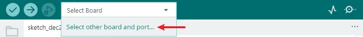
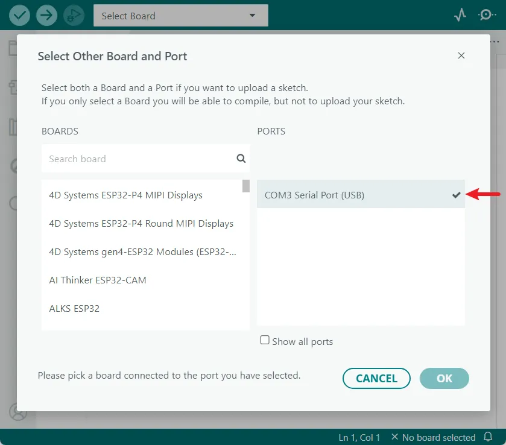
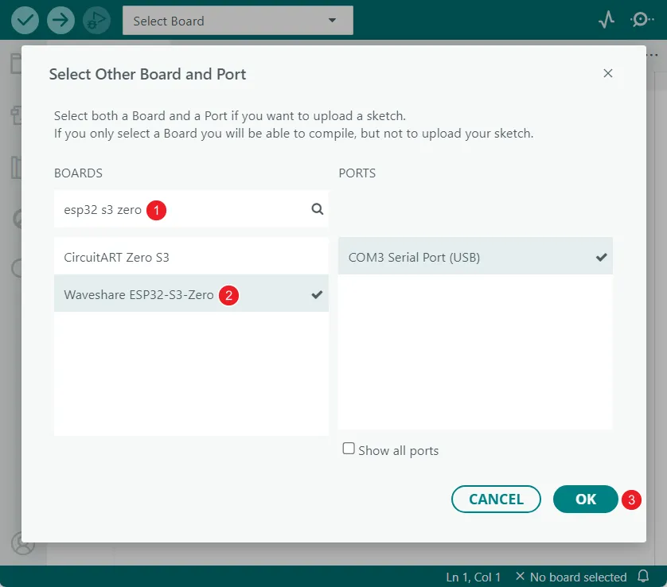
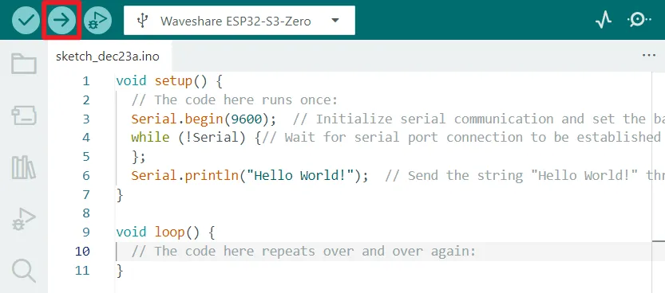
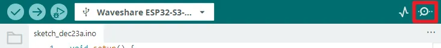
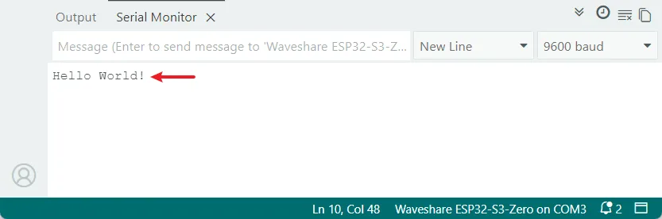
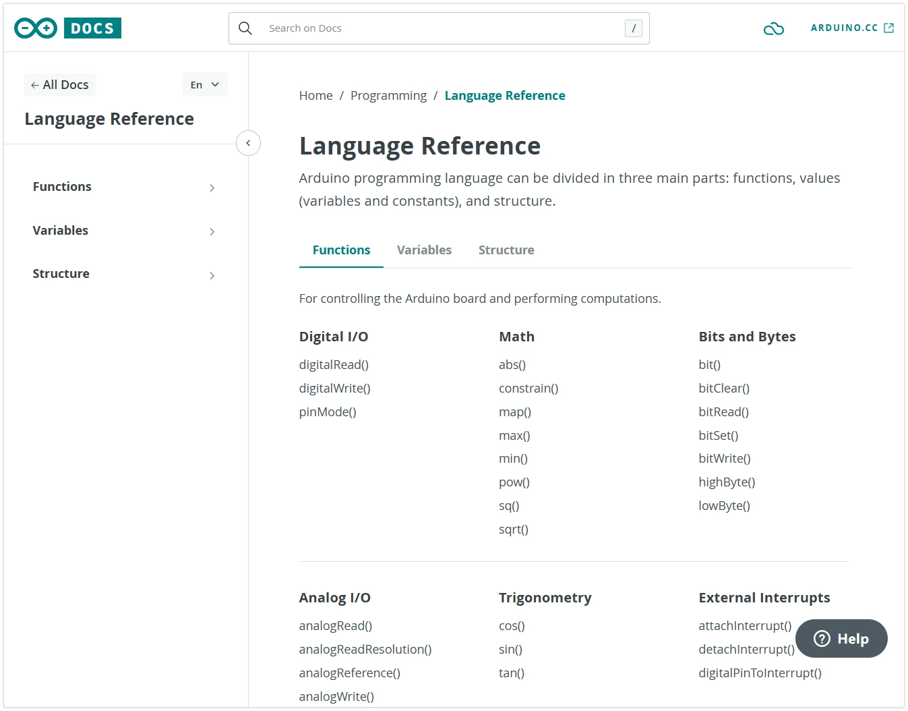
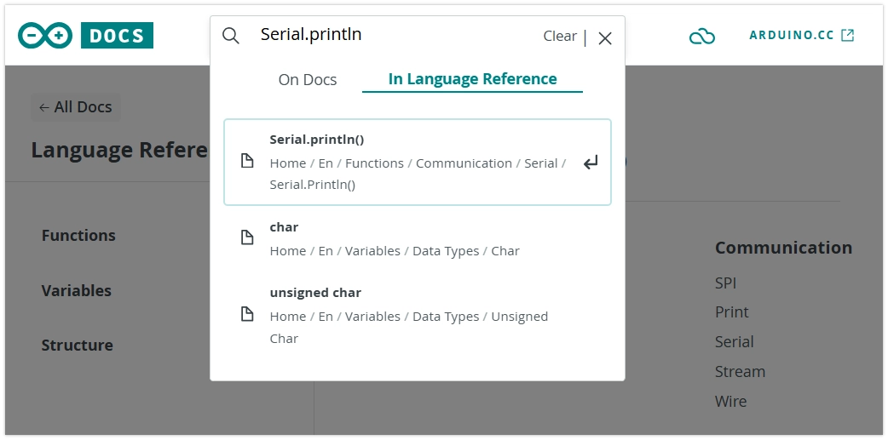

import VideoReset from './videos/02-Reset.mp4';
import VideoDownloadMode from './videos/02-DownloadMode.mp4';

import VideoPlayer from '@site/src/components/VideoPlayer';

# Arduino Basics

:::tip[Important: About board compatibility]
The core logic of this tutorial applies to all ESP32 boards, but all the operation steps are explained using the example of the [**Waveshare ESP32-S3-Zero mini development board**](https://www.waveshare.com/esp32-s3-zero.htm). If you are using a development board of another model, please modify the corresponding settings according to the actual situation.
:::

The Arduino programming language is based on C/C++ and is designed specifically for Arduino and its compatible microcontroller platforms. It greatly simplifies microcontroller programming through a set of easy-to-understand function libraries and core structure, making it easy for both beginners and professionals to operate the hardware.

## 1. Run the First Program

Next, we will run a classic "Hello World" program. By uploading the code to the ESP32 board, it will send "Hello World!" to the computer via the serial port. This example is used to test if the development environment is working correctly and to help you get familiar with Arduino programming.

:::caution Note:
Before starting, please ensure you have configured the development environment according to [this tutorial](./01-Arduino-IDE-Setup.md).
:::

### 1.1 Code

Open the Arduino IDE and copy the code below.

```cpp
void setup() {
  // The code here runs once:
  Serial.begin(9600);  // Initialize serial communication and set the baud rate to 9600
  while (!Serial){
    ; // Wait for serial port connection to be established
  }
  Serial.println("Hello World!");  // Send the string "Hello World!" through the serial port and wrap the line
}

void loop() {
  // The code here repeats over and over again:
}
```

### 1.2 Upload Program to the Board

#### Select Board and Port

- Open the board and port selector:

  

- **Select a Port**:

  Connect the ESP32 board to your computer via a USB cable. Normally, a new port (COMx or /dev/cu...) will **appear** in the port list; this is your development board. Click to select it.

  

  :::warning Port didn't appear?
  If the new port is not found, try entering download mode manually: **Hold the "BOOT" button, plug in the USB cable, and then release the button.** Check the port list again, and the port should appear.

  <VideoPlayer src={VideoDownloadMode} asGif />

  **Note**: If you connect the board this way, you may need to manually press the reset button or re-plug the USB cable after a successful upload to run the program.
  :::

- **Select the Board Model**:

  :::tip Can't find the model?
  If your board is not in the list, you can select the generic "ESP32XX Dev Module", such as the ESP32S3 Dev Module.
  :::

  Select the model corresponding to your board. Taking the Waveshare ESP32-S3-Zero as an example, search for `esp32 s3 zero`, select **Waveshare ESP32-S3-Zero**, and finally click "OK".

  

#### Enable USB CDC On Boot (Optional)

- In the **Tools** menu, check the **USB CDC On Boot** option.

  :::info
  Some ESP32 boards (e.g., the ESP32-S3 series) feature a native USB interface on the chip itself, which can be used for firmware uploading or serial communication without requiring a separate USB-to-serial chip (like CH340, CP2102).
  
  For such boards, you need to enable the USB CDC On Boot feature in the Arduino IDE. ([More Info](https://docs.espressif.com/projects/arduino-esp32/en/latest/tutorials/cdc_dfu_flash.html#usb-cdc))

  **For example, the Waveshare ESP32-S3-Zero development board relies on the USB CDC On Boot feature. This option is usually enabled by default. Please check and confirm that the "USB CDC On Boot" option is set to "Enabled" in the Arduino IDE's "Tools" menu.**
  :::

  

#### Compile and Upload Code

- Click the "Upload" button in the top-left corner of the IDE. The IDE will first compile the code and then write it to the board.

  

### 1.3 View Code Output

- After the code is successfully uploaded, open the Serial Monitor.

  

- Make sure that the baud rate is consistent with 9600 in the code. At this point, the message "Hello World" sent by the ESP32 through the serial port will be displayed in the serial port monitor.

  

- Press the RESET button on the board, the ESP32 will restart, the program will be executed again from top to bottom, and the serial port monitor will display the phrase "Hello World" again.

  <VideoPlayer src={VideoReset} asGif />

## 2. Arduino Program Structure

Every Arduino program has two core functions: **`setup()` and `loop()` functions**. Understanding the difference between these two functions is fundamental to learning Arduino programming.

- `setup()` function: **It runs only once after the board is powered on or reset for initialization settings.** It is commonly used to initialize serial port communication, set pin mode, and initialize sensors and modules.

- `loop()` function: **After the `setup()` function is executed, the `loop()` function will be executed in an infinite loop and is the main part of the program.**

In the previous "Hello World" example, `Serial.println("Hello World!");` is included in the `setup()` function, so it will only execute once. If you want it to print repeatedly, you can move it into the `loop()` function:

```cpp
void setup() {
  Serial.begin(9600);
  while (!Serial){
  };
}

void loop() {
  // highlight-next-line
  Serial.println("Hello World!");
  delay(1000);  // Pause program execution for 1000 milliseconds (1 second)
}
```

So "Hello World!" will be printed every second.

## 3. The "Sketch"

In the Arduino project, a program is referred to as a "sketch". A sketch is a file that you write your program inside. It has the `.ino` extension, and is always stored in a folder of the same name.

Throughout this tutorial series, we may not always use the term "sketch" and will simply refer to it as a "program" or "code." However, understanding this terminology is helpful for learning Arduino.

## 4. Official Libraries and Documentation

Arduino is convenient because it provides a simple and understandable set of libraries and core structures. Familiarity with these functions is important for learning Arduino.

### 4.1 Functions in the "Hello World" Program

Looking back at the "Hello World" program, we used several core Arduino APIs:

```cpp
void setup() {
  Serial.begin(9600);
  while (!Serial){
  };
}

void loop() {
  Serial.println("Hello World!");
  delay(1000);  // Wait for 1 second
}
```

In the "Hello World" program, we use some basic Arduino functions to implement serial port communication. Here is a quick overview of these functions. For detailed usage and more options, please refer to the official Arduino documentation.

1.  **`Serial`**:

    - This is a predefined object that represents the hardware serial port or USB virtual serial port of the Arduino board. Using this object, we can enable Arduino to send and receive text data with a computer or other serial devices.
    - On the ESP32-S3, it usually refers to a virtual serial port created over a USB connection.
    - Related documentation: [Serial | Arduino Documentation](https://docs.arduino.cc/language-reference/en/functions/communication/serial/)

2.  **`Serial.begin()`**:

    - Used to initialize serial communication and set the serial data transmission baud rate (bits per second). Common baud rates include 9600, 115200, etc. **The baud rate set in the code must be consistent with the baud rate set by the serial monitor (or receiver)**, otherwise it may cause the received data to appear garbled.
    - Related documentation: [Serial.begin() | Arduino Documentation](https://docs.arduino.cc/language-reference/en/functions/communication/serial/begin/)

3.  **`while (!Serial)`**:

    - Wait for the serial connection to be ready. Ensure the program continues after the connection is stable to avoid data loss caused by attempting to send data before the serial monitor is opened.
    - The `Serial` object evaluates to `false` in boolean value before the USB serial port connection is actually established. Once a connection is established (for example, after opening a serial port monitor on a computer), it is evaluated as `true`.
    - Related documentation: [if(Serial) | Arduino Documentation](https://docs.arduino.cc/language-reference/en/functions/communication/serial/ifSerial/)

4.  **`Serial.println()`**:

    - Sends data (can be a string, variable, number, etc.) to the serial port, followed by an automatic newline.
    - There is also a similar function `Serial.print(data)`, which sends data without automatically adding a newline.
    - Related documentation: [Serial.println() | Arduino Documentation](https://docs.arduino.cc/language-reference/en/functions/communication/serial/println/)

5.  **`delay()`**
    - Pauses program execution for the specified number of milliseconds. It is used to control the time intervals of the program flow, such as controlling how often the LEDs flash.
    - Related documentation: [delay() | Arduino Documentation](https://docs.arduino.cc/language-reference/en/functions/time/delay/)

### 4.2 Navigating Official Documentation

1. ESP32 Arduino Core Documentation:

   - While many core Arduino functions apply to the ESP32, the ESP32 chip is much more powerful than the traditional Arduino Uno, so it has many unique APIs and libraries (e.g., for Wi-Fi, Bluetooth, FreeRTOS, etc.).
   - Arduino Core for ESP32 Documentation: https://docs.espressif.com/projects/arduino-esp32/en/latest/index.html
   - Espressif official Documentation (ESP-IDF): https://docs.espressif.com/projects/esp-idf/en/latest/esp32s3/ (This is the underlying SDK documentation; the Arduino Core is wrapped around this).

2. Arduino Official Reference:

   - URL: https://www.arduino.cc/reference/en/
   - This is the authoritative official resource for learning Arduino programming. It details the core functions, data types, structures, and usage of commonly used libraries in the Arduino language.

     

   - How to use: On the website, you can search directly for function names (like `Serial.println`) or browse through categories on the left (Variables, Functions, Libraries, etc.). Each entry typically contains a function description, syntax, parameter explanation, return values, and example code.

     

3.  **Getting Started with Arduino**:

    - URL: https://docs.arduino.cc/learn/starting-guide/getting-started-arduino
    - This guide is highly recommended for beginners. It provides a comprehensive overview of the Arduino ecosystem, explaining the relationship between hardware and software, making it an ideal starting point for those new to microcontrollers.


:::tip Documentation Strategy
When developing for ESP32, the order of consulting documentation is crucial:

1.  **Preferred [ESP32 Arduino Core Documentation](https://docs.espressif.com/projects/arduino-esp32/en/latest/index.html)**: When using features related to hardware peripherals (such as GPIO, I2C, SPI, Wi-Fi, etc.), this documentation should be consulted first. It details the **specific implementation, parameter extensions, and enhanced features** of ESP32 for the standard Arduino API.

2.  **Next is the [Arduino Official Reference](https://www.arduino.cc/reference/en/)**: Used for querying the **general, cross-platform** programming language basics (such as program structure, variable types, basic functions, etc.).

Developing the habit of prioritizing the reference to ESP32-specific documentation is key to efficient learning and development.

:::

## 5. Troubleshooting

:::warning Having trouble? Try these solutions

**1. No new ports appear in the port list**

- Check if the USB cable is a data cable (not just a charging cable)
- Confirm if the BOOT key was pressed correctly (if necessary)
- Try plugging and unplugging the USB cable or replacing the USB port

**2. Code upload failed**

- Confirm that the correct development board model is selected in the Arduino IDE
- Check if the correct port is selected
- Retry entering download mode by pressing the BOOT key
- Close other programs that may be using the serial port

**3. Serial monitor displays garbled characters**

- Check if the baud rate setting in the serial monitor is consistent with the value of `Serial.begin()` in the code

**4. Upload successful but no output in Serial Monitor**

- For development boards with native USB ports, check if the **USB CDC On Boot** feature is enabled
- Confirm the Serial Monitor is connected to the correct port.
- Try pressing the RESET button on the board to restart the board.
  :::
