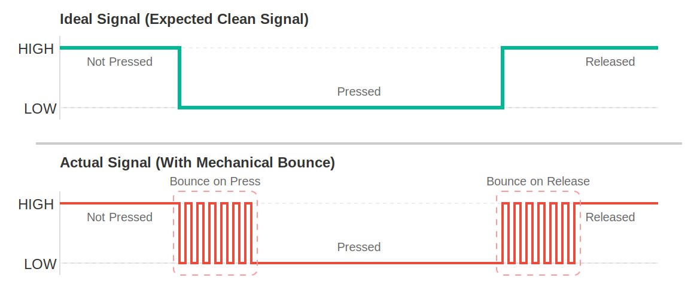

<!-- Image referencing -->
import ImgBlinkDiagram from './images/03-LED-Blink_bb.webp';
import ImgButtonDiagram from './images/03-Button_bb.webp';
import ImgButtonPullDiagram from './images/03-Button-10k_bb.webp';
import ImgButtonLEDDiagram from './images/03-Button-LED_bb.webp';
import ImgDigialSignalSvg from './images/03-Digial-Signal.svg';

<!-- Video referencing -->
import VideoBlink from './videos/03-Blink.mp4';
import VideoButtonExample1 from './videos/03-Button-Example-1.mp4';
import VideoButtonExample2 from './videos/03-Button-Example-2.mp4';
import VideoButtonExample3 from './videos/03-Button-Example-3.mp4';

import VideoPlayer from '@site/src/components/VideoPlayer';

# Digital Output/Input

:::tip[Important: About board compatibility]
The core logic of this tutorial applies to all ESP32 boards, but all the operation steps are explained using the example of the [**Waveshare ESP32-S3-Zero mini development board**](https://www.waveshare.com/esp32-s3-zero.htm). If you are using a development board of another model, please modify the corresponding settings according to the actual situation.
:::

## 1. Digital Signal

**A digital signal** is a signal that represents information using discrete numerical values. The simplest and most common digital signal is the **binary digital signal**, which has only two states.

In GPIO control of ESP32, this **binary digital signal** is mainly used, like a light switch in a room, where the binary digital signal is in one of two definite states at all times:

- **High level (HIGH):** Represents the logical "1" or "true". On the ESP32 board, this typically means that the pin output is close to 3.3V.
- **Low level (LOW):** Represents logical "0" or "false". On the ESP32 board, this typically means that the pins output about 0 volts, which is connected to ground (GND).


Simply put, digital signals use these two voltage states to convey information like Yes (HIGH) / No (LOW) or 1 / 0.

- When the ESP32 **outputs** a digital signal, it controls a pin to become high or low, as if it is "talking", like controlling the switch of the LED.
- When the ESP32 **inputs** a digital signal, it detects whether a pin is high or low, as if it is "listening," such as detecting whether a button is pressed.

:::tip Why is HIGH 3.3V?
**The HIGH level is always equal to the operating voltage of the microcontroller:**

- The operating voltage of ESP32 is 3.3V → HIGH = 3.3V
- The operating voltage of Arduino Uno is 5V → HIGH = 5V
- Some low-power chips operate at a voltage of 1.8V → HIGH = 1.8V

Therefore, the specific voltage value represented by "HIGH" depends on the development board being used.
:::

## 2. Digital Output{#digital-output}

This example uses an ESP32 board and an Arduino environment to make an external LED flash. This example will demonstrate how to control the digital output of an ESP32 board using the Arduino IDE.

### 2.1 Circuit Assembly

Components required:

- LED \* 1
- 330Ω resistor \* 1
- Breadboard \* 1
- Wire
- ESP32 development board

Connect the circuit according to the wiring diagram below:

<Details>
  <summary>ESP32-S3-Zero Pinout Diagram</summary>

  

</Details>


<div style={{maxWidth:500}}> </div>

#### Circuit Operating Principle

Let's understand how this simple circuit works:

1. **Current path:** When the GPIO7 outputs a high level (3.3V), current flows out from the pin → through a 330Ω resistor → through the LED → back to the GND pin of the ESP32, forming a complete circuit loop.

2. **The role of resistor:** The 330Ω resistor is a **current-limiting resistor**

   - Protect LED: Prevent excessive current from burning out the LED
   - Protect ESP32: Prevent GPIO pins from outputting excessive current
   <!-- - Calculation formula: I = (3.3V - LED voltage drop) ÷ 330Ω ≈ 6-8mA (within safe range) -->

3. **LED polarity:**

   - **Long leg (Anode)**: Connects to the other end of the resistor
   - **Short leg (Cathode)**: Connects to GND
   - The LED will not light up if it is connected backwards, but it will not be damaged

:::tip
If a 330Ω resistor is not available, a resistor in the 220Ω-1kΩ range can be used instead.
:::

### 2.2 Code

Open the Arduino IDE and run the code below.

```cpp
const int ledPin = 7;  // Pin number for LED connection

// The setup function runs once after the board is powered on or reset
void setup() {
  // Initialize the pin to output mode
  pinMode(ledPin, OUTPUT);
}

// The loop function will run forever and repeatedly
void loop() {
  digitalWrite(ledPin, HIGH);  // Light up LED (HIGH means high level)
  delay(1000);                 // Wait for a second
  digitalWrite(ledPin, LOW);   // Pin outputs low level, turn off LED
  delay(1000);                 // Wait for a second
}
```

After uploading the code, the LED connected to the ESP32 board will light up for one second, turn off for one second, and so on.

<!-- <VideoPlayer src={VideoBlink} asGif /> -->

#### Code analysis

1. `const int ledPin = 7;`: 

   - Define a constant using `const int` so that if you need to change the pin, you only need to modify this one place.
   - `const` means that this value does not change while the program is running.

2. `pinMode(ledPin, OUTPUT);`:

   - **The role of `pinMode()` function:** Configure the working mode of the specified pin, which needs to be called before using the digital pin.
   - **First parameter:** Pin number
   - **Second parameter:** Mode type
     - `OUTPUT`: Output mode, the ESP32 can control this pin to output high or low level.

3. `digitalWrite(ledPin, HIGH)`: 

   - **The role of `digitalWrite()` function:** Outputs values to the output pin
   - **First parameter:** Pin number
   - **Second parameter:** The level to be output
     - `HIGH`: Output high level (3.3V) with LED on.
     - `LOW`: Output low level (0V), LED off.

4. `delay(1000);`:

   - **The role of the `delay()` function:** Pause program execution for a specified number of milliseconds
   - 1000 milliseconds = 1 second.
   - During `delay()`, the program does not perform any other operations. This means that during the `delay()`, the ESP32 cannot respond to other events, such as reading sensors or buttons. In more complex projects, non-blocking delay methods are required.

## 3. Digital Input{#digital-input}

In this example, we will create a simple button circuit using an ESP32 development board to learn the basic operations of digital input by reading the button state.

### 3.1 Circuit Assembly

Components required:

- Button \* 1
- Breadboard \* 1
- Wire
- ESP32 development board
- 10kΩ resistor * 1 (optional, not required when using internal pull-ups)

:::tip Why do you need a pull-up resistor?
If the button pin is neither connected to power nor ground, it is in a "Floating" state and the value read is indeterminate. The pull-up resistor ensures that the pins have a clear high level state when the button is not pressed.
:::

<Details>
  <summary>ESP32-S3-Zero Pinout Diagram</summary>

  

</Details>


| Internal pull-up resistor (recommended)                                                                                                                                                                                                                                                                             | External pull-up resistor                                                                                                                                                                                                                                                                                                      |
| ------------------------------------------------------------------------------------------------------------------------------------------------------------------------------------------------------------------------------------------------------------------------------------------------ | ----------------------------------------------------------------------------------------------------------------------------------------------------------------------------------------------------------------------------------------------------------------------------------------------------------------- |
|                                                                                                                                                                                                                                                           |                                                                                                                                                                                                                                                                        |
| **Connection:**<br/>• Button end → GPIO8<br/>• Other end of the button → GND<br/><br/>**Working principle:**<br/>• ESP32 internal pull-up resistor pulls GPIO8 to HIGH (3.3V)<br/>• Button not pressed: Read HIGH<br/>• Button pressed: Read LOW<br/><br/>**Advantages:**<br/>• Save components<br/>• Simple wiring<br/>• Code: `pinMode(buttonPin, INPUT_PULLUP);` | **Connection:**<br/>• Button end → GPIO8<br/>• Other end of the button → GND<br/>• 10kΩ resistor: 3.3V ↔ GPIO8<br/><br/>**Working principle:**<br/>• External resistor pulls GPIO8 to HIGH (3.3V)<br/>• Button not pressed: Read HIGH<br/>• Button pressed: Read LOW<br/><br/>**Advantages:**<br/>• Controllable pull-up current<br/>• Better versatility<br/>• Code: `pinMode(buttonPin, INPUT);` |

<Details>
  <summary>ESP32-S3-Zero Pinout Diagram</summary>

  

</Details>


### 3.2 Code

#### Example 1: Read button status

```cpp
const int buttonPin = 8;  // Define the pin connected to the button

void setup() {
  Serial.begin(9600);                // Initialize serial communication and set the baud rate to 9600
  while (!Serial) {}                 // Wait for serial port connection to be established

  pinMode(buttonPin, INPUT_PULLUP);  // Set the button pin to pull-up input mode
}

void loop() {
  int buttonState = digitalRead(buttonPin);  // Read the current state of the button
  Serial.println(buttonState);               // Serial port output button status value
}
```

**Code Analysis:**

1.  `const int buttonPin = 8;`: Define the pin connected to the button.
2.  `Serial.begin(9600);`: Initialize serial communication and set the baud rate to 9600.
3.  `pinMode(buttonPin, INPUT_PULLUP);`:
    - Set `buttonPin` to `INPUT_PULLUP` mode.
    - `INPUT_PULLUP` is a special input mode that enables a pull-up resistor inside the ESP32 GPIO pin. In this way, when the button is not pressed, the pin is pulled to a high level; When the button is pressed to connect the pin to GND, the pin becomes low level. This avoids the need to connect an external pull-up resistor.
4.  `int buttonState = digitalRead(buttonPin);`:
    - `digitalRead()` function is used to read the level state of a specified digital pin.
    - It returns `HIGH` (usually an integer 1) or `LOW` (usually an integer 0).
    - Since `INPUT_PULLUP` is used:
      - Button not pressed: `buttonState` is `HIGH`.
      - Button pressed: `buttonState` is `LOW`.
5. `Serial.println()` : Prints the content inside the parentheses to the serial monitor and adds a newline.

**Running results:**

After flashing the code to the ESP32 board, open the serial monitor. The serial monitor continuously displays "1" when the button is not pressed; it shows "0" when the button is pressed. You can observe these states by pressing and releasing the buttons.

<!-- <VideoPlayer src={VideoButtonExample1} asGif /> -->

#### Example 2: Record the number of button presses

```cpp
const int buttonPin = 8;

int lastButtonState = 1;  // Last button status
int currentButtonState;   // Current button status
int count = 0;      // Counter

void setup() {
  Serial.begin(9600);                // Initialize serial communication
  while (!Serial) {}                 // Wait for the serial port to connect

  pinMode(buttonPin, INPUT_PULLUP);  // Set the button pin to pull-up input
}

void loop() {
  currentButtonState = digitalRead(buttonPin);  // Read the current state of the button

  if (lastButtonState == HIGH && currentButtonState == LOW) {
    // The button is pressed

  } else if (lastButtonState == LOW && currentButtonState == HIGH) {
    // The button is released
    count = count + 1;      // Counter plus 1
    Serial.println(count);  // Serial port outputs the current count value
  }

  lastButtonState = currentButtonState;  // Save the current button state
}
```

**Code Analysis:**

1. `int lastButtonState = HIGH;`: Since we are using the `INPUT_PULLUP` mode, the pin is high when the button is not pressed, so the initial value is set to `HIGH`.

2. **Status detection logic**:
   - `lastButtonState == HIGH && currentButtonState == LOW`: The pin is detected from high to low at the moment the button is pressed
   - `lastButtonState == LOW && currentButtonState == HIGH`: The pin is detected from low to high at the moment the button is released
   - We choose to count when the button is released

3. `lastButtonState = currentButtonState;`: Update the state at the end of each loop to prepare for the next comparison.

**Running results:**

Open the serial monitor after flashing the code. Try pressing the button multiple times and you may find that the counter sometimes increases by 1, but sometimes suddenly increases by 2, 3, or more. This is Button Bouncing.

<!-- <VideoPlayer src={VideoButtonExample2} asGif /> -->

:::caution What is Button Bouncing?
At the moment a mechanical button is pressed or released, its internal metal contacts experience a brief, rapid physical bounce. This results in the circuit actually being turned on and off many times in milliseconds when the person feels like it has only been pressed once. The ESP32 is so fast that it picks up every tiny on/off and therefore mistakenly recognizes it as multiple button presses.


:::

#### Example 3: Record the number of button presses

A simple way to eliminate bouncing is to add a short delay after a key press is detected, ignoring subsequent bouncing signals.

```cpp
const int buttonPin = 8;

int lastButtonState = 1;  // Last button status
int currentButtonState;   // Current button status
int count = 0;      // Counter

void setup() {
  Serial.begin(9600);                // Initialize serial communication
  while (!Serial) {}                 // Wait for the serial port to connect

  pinMode(buttonPin, INPUT_PULLUP);  // Set the button pin to pull-up input
}

void loop() {
  currentButtonState = digitalRead(buttonPin);  // Read the current state of the button

  if (lastButtonState == HIGH && currentButtonState == LOW) {
    // The button is pressed

  } else if (lastButtonState == LOW && currentButtonState == HIGH) {
    // The button is released
    count = count + 1;      // Counter plus 1
    Serial.println(count);  // Serial port outputs the current count value
    // highlight-next-line
    delay(100);             // Debounce delay of 100 milliseconds
  }

  lastButtonState = currentButtonState;  // Save the current button state
}
```

**Running results:**

As above, each time the button is released, the counter increases by 1, and because of the delay(100), the counter increments only once per button release, effectively reducing the number of false triggers. You can try pressing the button multiple times quickly, noting if the counter increment matches the actual press.

<!-- <VideoPlayer src={VideoButtonExample3} asGif /> -->

**Code Analysis:**

- Update the counter every time it detects that it changes from LOW to HIGH (i.e. the button is released), execute 'count=count+1' and 'Serial.println(count)';
- Add `delay(100)`, which pauses for 100 milliseconds, simply suppressing the repeated counting caused by button bounce

## 4. Extension exercises{#digital-io-exercise}

<Details>
  <summary>Please try to implement: when the button is pressed, the LED lights up. When the button is released, the LED turns off. </summary>

**Wiring diagram:**

<div style={{maxWidth:500}}> </div>

**Code:**

```cpp
const int ledPin = 7;  // Pin number for LED connection
const int buttonPin = 8;  // Pin number for button connection
int buttonState;          // Store button status

void setup() {
  pinMode(ledPin, OUTPUT);           // Set the LED pin to output mode
  pinMode(buttonPin, INPUT_PULLUP);  // Set the button pin to pull-up input mode
}

void loop() {
  buttonState = digitalRead(buttonPin);  // Read button status

  if (buttonState == LOW) {      // Button pressed (LOW)
    digitalWrite(ledPin, HIGH);  // Turn on the LED
  } else {                       // Button not pressed (HIGH)
    digitalWrite(ledPin, LOW);   // Turn off the LED
  }
}
```

</Details>

<Details>
  <summary>Please try to implement: when the button is pressed once, toggle the LED state once. </summary>

**Wiring diagram:**

<div style={{maxWidth:500}}> </div>

**Code:**

```cpp
const int ledPin = 7;  // Pin number for LED connection
const int buttonPin = 8;  // Pin number for button connection

int lastButtonState = HIGH;  // Last button status
int ledState = LOW;          // Current LED status (LOW = off, HIGH = on)
int currentButtonState;   // Current button status

void setup() {
  pinMode(ledPin, OUTPUT);           // Set the LED pin to output mode
  pinMode(buttonPin, INPUT_PULLUP);  // Set the button pin to pull-up input mode
}

void loop() {
  currentButtonState = digitalRead(buttonPin);  // Read the current state of the button

  // Detect the moment the button changes from pressed to released
  if (lastButtonState == LOW && currentButtonState == HIGH) {
    ledState = !ledState;           // Switch LED status (on to off, off to on)
    digitalWrite(ledPin, ledState); // Apply the new LED status
    delay(100);                     // Debounce delay
  }

  lastButtonState = currentButtonState;  // Save the current state for the next comparison
}
```

</Details>

## 5. Related Links

- [INPUT | INPUT_PULLUP | OUTPUT | Arduino Documentation](https://docs.arduino.cc/language-reference/en/variables/constants/inputOutputPullup/)

- [HIGH | LOW | Arduino Documentation](https://docs.arduino.cc/language-reference/en/variables/constants/highLow/)

- [pinMode() | Arduino Documentation](https://docs.arduino.cc/language-reference/en/functions/digital-io/pinMode/)

- [digitalWrite() | Arduino Documentation](https://docs.arduino.cc/language-reference/en/functions/digital-io/digitalwrite/)

- [digitalRead() | Arduino Documentation](https://docs.arduino.cc/language-reference/en/functions/digital-io/digitalread/)