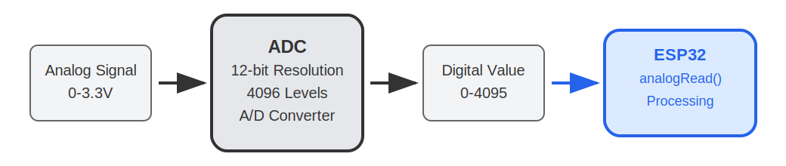
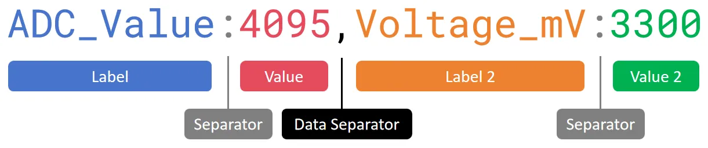
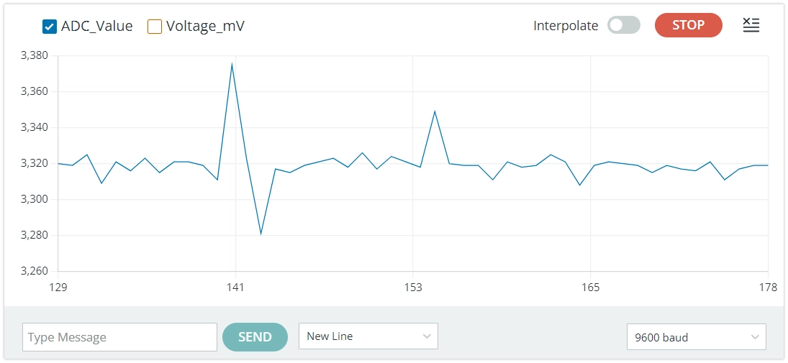

<!-- Image referencing -->

import ImgPotentiometerDiagram from './images/04-Potentiometer_bb.webp';
import ImgADCDiagram from './images/04-ADC.webp';
import ImgSerialMonitor from './images/04-Serial-Monitor.gif';
import ImgSerialPlotter from './images/04-Serial-Plotter.gif';

# Analog Input

:::tip[Important: About board compatibility]
The core logic of this tutorial applies to all ESP32 boards, but all the operation steps are explained using the example of the [**Waveshare ESP32-S3-Zero mini development board**](https://www.waveshare.com/esp32-s3-zero.htm). If you are using a development board of another model, please modify the corresponding settings according to the actual situation.
:::

## 1. Analog Signal

**Analog signal** is a signal that can **change continuously** within a certain range.

For example, the dimming knob can smoothly adjust the brightness of the light, from completely off to the brightest, with countless brightness levels in between. This brightness adjustment is an analog process. While digital signals are like ordinary light switches, they only have "on" and "off."

In the real world, many physical quantities such as temperature, light intensity, and sound volume are analog, with their changes being continuous and smooth.

For ESP32, measuring continuously changing signals (such as reading the value of a potentiometer or sensor) cannot be achieved using only the two digital states `HIGH` or `LOW`. At this point, you need to use an **ADC**.

- **Analog-to-Digital Converter (ADC)**: A device that can convert continuous analog voltage signals (e.g., 0V ~ 3.3V) into digital values that the ESP32 can process.

  

In simple terms, an ADC is like a ruler that divides the voltage between 0~3.3V into many "scales", so that each voltage range corresponds to a specific number. The ability of an ADC to divide voltage into how many levels is called **resolution**. The higher the resolution, the more detailed the voltage changes can be detected.

The ESP32 ADC is usually **12 bits**, which means that it can be divided into **2¹² (= 4096)** levels. Therefore, the ADC reading range is **0 ~ 4095**.

- The input voltage is **0V**, and the ADC reading is approximately **0**.
- When the input voltage **varies continuously from 0V to 3.3V**, the ADC readings **varies accordingly from 0 to 4095**.

<div style={{maxWidth:600, margin: '0 auto'}}> </div>

Thus, the ESP32 program can obtain an integer between 0~4095 using `analogRead()`, which directly corresponds to the voltage level on the input pin.

## 2. ADC Pins

Not all ESP32 pins support analog input. You need to check the pin diagram of the corresponding development board or the datasheet of the chip to find the pin marked "ADC" for analog input usage.  
**It is recommended to prioritize selecting the pins of the ADC1 channel to avoid conflicts with other functions.**

| Chip Model | ADC Channel 1 (Recommended) | ADC Channel 2 | Reference Document |
| :----------- | :-------------------- | :------------------------ | :------------------------------------------------------------------------------------------------------------------------------ |
| **ESP32**    | GPIO32 - GPIO39       | GPIO0, 2, 4, 12-15, 25-27 | [ESP32 Datasheet Section 2.2](https://documentation.espressif.com/esp32_datasheet_en.html#[14,%22XYZ%22,92.42,70.87,null])      |
| **ESP32-C3** | GPIO0 - GPIO4         | GPIO5 (Not available)           | [ESP32-C3 Datasheet Section 2.3.2](https://documentation.espressif.com/esp32-c3_datasheet_en.html?q=ESP32-C3#[14,%22XYZ%22,56.69,785.2,null])  |
| **ESP32-C6** | GPIO0 - GPIO6         | -                         | [ESP32-C6 Datasheet Section 2.3.3](https://documentation.espressif.com/esp32-c6_datasheet_en.html?q=ESP32-C6#[23,%22XYZ%22,56.69,785.2,null])  |
| **ESP32-C5** | GPIO1 - GPIO6         | -                         | [ESP32-C5 Datasheet Section 2.3.3](https://documentation.espressif.com/esp32-c5_datasheet_en.html?q=ESP32-C5#[22,%22XYZ%22,56.69,785.2,null])  |
| **ESP32-S3** | GPIO1 - GPIO10        | GPIO11 - GPIO20           | [ESP32-S3 Datasheet Section 2.3.3](https://documentation.espressif.com/esp32-s3_datasheet_en.html?q=ESP32-S3#[24,%22XYZ%22,56.69,785.2,null]) |
| **ESP32-P4** | GPIO16 - GPIO23       | GPIO49 - GPIO54           | [ESP32-P4 Datasheet Section 2.3.3](https://documentation.espressif.com/esp32-p4-chip-revision-v1.3_datasheet_en.html#[23,%22XYZ%22,56.69,785.2,null])  |
| **Other**     | -                     | -                         | [Espressif Documentation Center (CDP)](https://documentation.espressif.com/en/home)                                                              |

## 3. Circuit Assembly

Components required:

- Potentiometer \* 1
- Breadboard \* 1
- Wire
- ESP32 development board

<Details>
  <summary>ESP32-S3-Zero Pinout Diagram</summary>


</Details>

<div style={{maxWidth:500}}> </div>

**Circuit analysis**

Let's understand how this analog signal reading circuit works:

1. **Connection of potentiometer:**

   - **VCC pin**: Connected to the 3.3V of ESP32, providing the voltage for the potentiometer to operate
   - **GND pin**: Connected to the GND of the ESP32, forming a circuit loop
   - **Signal pin (middle)**: Connected to the GPIO7 (ADC pin) of the ESP32, outputting an analog voltage between 0V~3.3V

2. **Working principle of potentiometer:**
   - A potentiometer contains a variable resistor, and the resistance value can be changed by rotating it
   - When rotating the potentiometer knob, the output voltage of the signal pin will vary continuously between 0V~3.3V
   - Completely counterclockwise: Output is close to 0V
   - Completely clockwise: Output is close to 3.3V

## 4. Code

```cpp
const int potentiometerPin = 7;  // Define the pins connected to the potentiometer

void setup() {
  Serial.begin(9600);                // Initialize serial communication and set the baud rate to 9600
}

void loop() {
  int analogValue = analogRead(potentiometerPin);            // Read the analog value of potentiometer (0-4095)
  int analogVolts = analogReadMilliVolts(potentiometerPin);  // Read the voltage value on the pin, in millivolts (mV)

  // Print the first label and value
  Serial.print("ADC_Value:");
  Serial.print(analogValue);

  // Print the separator
  Serial.print(",");

  // Print the second tag and value, and end with println()
  Serial.print("Voltage_mV:");
  Serial.println(analogVolts);

  delay(100);  // Delay 0.1 seconds to avoid serial port scrolling too fast
}
```

**Running results:**

After flashing the code to the ESP32 development board, open the serial monitor to see continuously displayed values. When turning the potentiometer, the value changes accordingly: the value is 0 when the potentiometer is turned to one end and 4095 when it is turned to the other end.

- Serial monitor:

  <div style={{maxWidth:700}}> </div>

- Serial plotter:

  <div style={{maxWidth:700}}> </div>

:::tip[Advanced understanding: Why doesn't the maximum reading exactly correspond to 3.3V?]
You may find that the `analogRead()` value reaches 4095 even before the input voltage reaches 3.3V.

This is the design feature of the ESP32 ADC. Its internal core circuitry can handle a limited range of voltages directly, so it uses an internal attenuator to extend the measurable voltage range.

In the Arduino environment, a default attenuation option that measures the highest voltage (`ADC_ATTEN_DB_11`) is enabled. According to the official documentation, the reliable measurement upper limit of the **ESP32 S3** ADC is approximately 3.1V. (Note: The measurable input voltage range varies depending on the attenuation options for different chips. Please refer to [this table](https://docs.espressif.com/projects/arduino-esp32/en/latest/api/adc.html#analogsetattenuation).）

Therefore, when the input voltage exceeds 3.1V, the reading will "saturate," meaning it remains at the maximum value of 4095.

This default setting is sufficient for applications reading from 0% to 100%. If you need to optimize the accuracy for a specific voltage range, you can learn how to set different attenuation levels. For details, please refer to [description of analogSetAttenuation in the official documentation](https://docs.espressif.com/projects/arduino-esp32/en/latest/api/adc.html#analogsetattenuation).

**Suggestion:** For more accurate voltage readings, it is recommended to use the `analogReadMilliVolts()` function directly. This function internally converts the original ADC value to voltage (millivolts) using factory calibration data (if supported by the chip).
:::

**Code Analysis**

1. `analogRead(potentiometerPin)`

   It reads the analog voltage value on the specified pin. It returns an integer between 0 ~ 4095, representing the current sliding voltage in the range of 0V ~ 3.3V.

   :::note
   Before calling `analogRead()`, you don't need to define a pin with `pinMode()`.
   :::

2. `analogReadMilliVolts(potentiometerPin)`

   This is a function specific to ESP32. It also reads the analog signal of the specified pin, but directly converts it into a voltage value in millivolts (mV) and returns it. Furthermore, its internal implementation also includes calibration to make the readings more accurate.

3. Serial output and plotter format

   ```cpp
     // Print the first label and value
   Serial.print("ADC_Value:");
   Serial.print(analogValue);

   // Print the separator
   Serial.print(",");

   // Print the second tag and value, and end with println()
   Serial.print("Voltage_mV:");
   Serial.println(analogVolts);
   ```

   This code is used to send collected data through a serial port in a specific format. [This format](https://docs.arduino.cc/software/ide-v2/tutorials/ide-v2-serial-plotter/) is not only convenient to read in the **Serial Monitor**, but more importantly, it can be recognized and plotted as a curve graph by the **Serial Plotter** in the Arduino IDE.

   Let's analyze the structure of this format by referring to the following diagram:

   

   - **Labels and values**: Each data consists of labels and values, separated by a colon (:). This helps to display the name in the plotter's legend.

   - **Data separator**: Multiple data are separated by a data separator (such as a comma `,` , a space ` ` or a tab `\t`). This is a key signal to tell the plotter that "one data ends, the next begins".

   - **Line feed**: Use `Serial.println()` to add a line feed after all data output. This line feed is a marker for "record end," indicating to the plotter that all data up to this point has been sent and it can proceed with drawing.

   Finally, each line in the serial monitor will display a format similar to `ADC_Value:2048,Voltage_mV:1650`. In the serial plotter, you will see two curves representing the original ADC value and the voltage value, respectively.

## 5. Expansion: Reduce noise

When you stop turning the potentiometer, you may find that the ADC reading does not stabilize at a certain value but instead continues to fluctuate within a small range, sometimes even showing significant spikes.



This phenomenon is usually caused by noise. The ADC of ESP32 is sensitive to power noise and electromagnetic interference from the external environment.

There are typically two ways to reduce the impact of noise:

- **Hardware filtering**: Parallel a small bypass capacitor (e.g., a 100nF ceramic capacitor) between the ADC input pin and GND to effectively filter out high-frequency noise.

- **Software filtering**: Take the average value after multiple sampling in the code. For example, read the ADC value continuously 10 times, then divide the sum of them by 10 to get a smoother and more stable result.

In most low-demand applications, slight fluctuations can be ignored. But when you need high-precision readings, you can try using the above methods.

## 6. Related Links

- [ADC | Arduino-ESP32 documentation](https://docs.espressif.com/projects/arduino-esp32/en/latest/api/adc.html)

- [analogRead() | Arduino Documentation](https://docs.arduino.cc/language-reference/en/functions/analog-io/analogRead/)

- [Using the Serial Plotter Tool | Arduino Documentation](https://docs.arduino.cc/software/ide-v2/tutorials/ide-v2-serial-plotter/)

- [ADC Calibration Driver - ESP32 - — ESP-IDF Programming Guide v5.5 Documentation](https://docs.espressif.com/projects/esp-idf/en/v5.5.1/esp32/api-reference/peripherals/adc_calibration.html#minimize-noise)

- [Comparing ADC Performance of Espressif SoCs | Developer Portal](https://developer.espressif.com/blog/2025/08/adc-performance)
