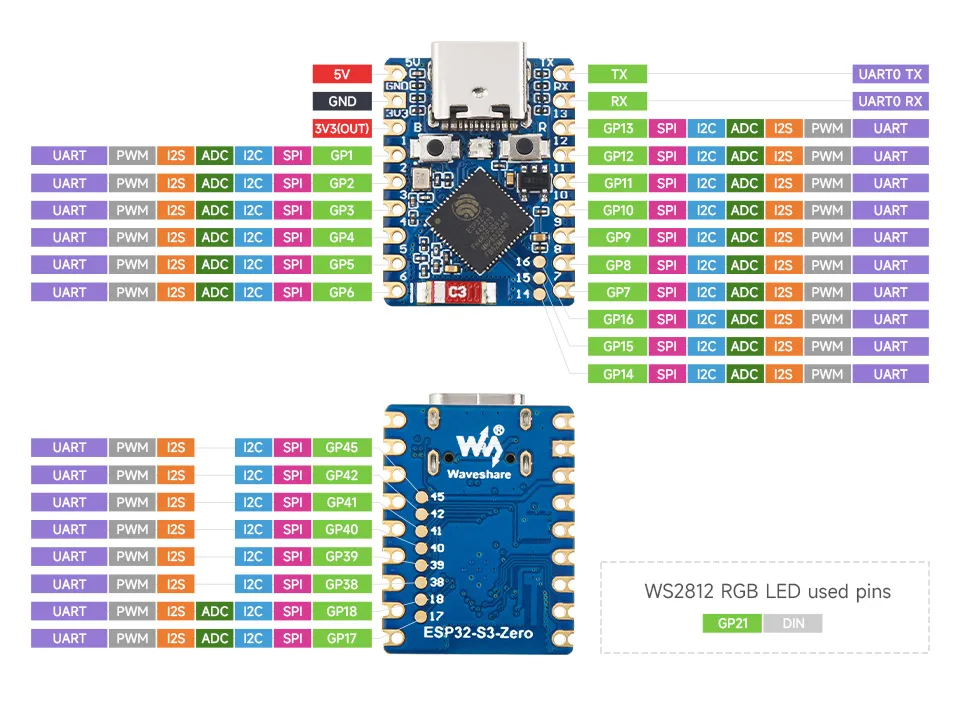

<!-- Image referencing -->
import ImgPWMLightDiagram from './images/03-LED-Blink_bb.webp';
import ImgPotentiometerLEDDiagram from './images/05-Potentiometer-LED_bb.webp';

# Pulse Width Modulation (PWM)

:::tip[Important: About board compatibility]
The core logic of this tutorial applies to all ESP32 boards, but all the operation steps are explained using the example of the [**Waveshare ESP32-S3-Zero mini development board**](https://www.waveshare.com/esp32-s3-zero.htm). If you are using a development board of another model, please modify the corresponding settings according to the actual situation.
:::

## 1. What is PWM?

**PWM (Pulse Width Modulation)** is a digital signal modulation technique that can be used to "simulate" continuously varying voltages.

When there is a need to control the "intensity" of a device's output (such as adjusting LED brightness or motor speed), rather than merely switching it on or off, **PWM (Pulse Width Modulation, Pulse Width Modulation)** is an effective solution.

The PWM signal is essentially still a digital signal, with only two states: HIGH and LOW. However, by controlling the duration ratio of the high level, a similar effect to analog output can be achieved.


The core concepts of PWM include:

- **Duty Cycle:** The percentage of time the high level (signal is HIGH) lasts within a PWM cycle. The duty cycle directly affects the average power or intensity of the output.

  Different duty cycles produce different average voltage effects:

  - **Duty cycle 0%**: Average voltage ≈ 0V
  - **Duty cycle 25%**: Average voltage ≈ 0.825V (3.3V \* 0.25)
  - **Duty cycle 50%**: Average voltage ≈ 1.65V (3.3V \* 0.50)
  - **Duty cycle 75%**: Average voltage ≈ 2.475V (3.3V \* 0.75)
  - **Duty cycle 100%**: Average voltage ≈ 3.3V

- **Frequency:** The number of times a PWM signal repeats a complete cycle per second, measured in hertz (Hz). Selecting the appropriate frequency is crucial for the application: for LED dimming, the frequency must be high enough to avoid visible flicker to the human eye; for motor control, the frequency affects efficiency and noise.

## 2. PWM Implementation on ESP32

The ESP32 integrates specialized hardware modules for generating PWM signals:

- **LEDC (LED Control) peripheral:** The primary PWM generator for the ESP32. Although named LED control, it can generate universal PWM signals. Depending on the chip model, it has 6 to 16 independent channels with a frequency range of 1Hz-40MHz.
- **MCPWM (Motor Control PWM) peripheral:** Specialized for motor control, incorporating advanced features like dead-time control. Its interface is not included in the standard Arduino ESP32 core library.

In the Arduino ESP32 programming environment, there are two main ways to generate PWM signals using the LEDC peripheral:

1.  **`analogWrite(pin, value)` functions:** This is the standard PWM function for the Arduino platform, which is well supported by ESP32 and easy to use.
2.  **LEDC API functions:** A series of functions such as `ledcAttach()`, `ledcWrite()`, and `ledcAttachChannel()` that allow for more detailed and flexible configuration of PWM parameters.

This section will demonstrate these two PWM implementation methods by controlling the brightness of external LEDs.

## 3. Circuit Assembly

Components required:

- LED \* 1
- 330Ω resistor \* 1
- Breadboard \* 1
- Wire
- ESP32 development board

Connect the circuit according to the wiring diagram below:

<Details>
  <summary>ESP32-S3-Zero Pinout Diagram</summary>

  

</Details>

<div style={{maxWidth:500}}> </div>

## 4. ESP32 PWM Example Code Using `analogWrite()`

```cpp
const int ledPin = 7;  // Pin number for LED connection

void setup() {
}

void loop() {
  // Brightness increase (Duty cycle value from 0 to 255)
  for (int dutyCycle = 0; dutyCycle <= 255; dutyCycle++) {
    analogWrite(ledPin, dutyCycle);  // Set PWM duty cycle value
    delay(10);                       // Delay to control the rate of change
  }
  // Brightness decrease (Duty cycle value from 255 to 0)
  for (int dutyCycle = 255; dutyCycle >= 0; dutyCycle--) {
    analogWrite(ledPin, dutyCycle);  // Set PWM duty cycle value
    delay(10);                       // Delay to control the rate of change
  }
}
```

**Code Analysis**

1.  For `analogWrite()`, the ESP32 implementation automatically handles the PWM initialization of the pins, so there is usually no need to explicitly call `pinMode()`.

2.  `loop()` function:

    - **The first `for` loop:**

      `for (int dutyCycle = 0; dutyCycle <= 255; dutyCycle++)`:
      The variable `dutyCycle` increases from 0 to 255.

    - **The second `for` loop:**

      `for (int dutyCycle = 255; dutyCycle >= 0; dutyCycle--)`
      The variable `dutyCycle` decreases from 255 to 0, gradually reducing the LED brightness.

    - **`analogWrite(ledPin, dutyCycle);`:**

      Set the current `dutyCycle` value (0-255) to the PWM duty cycle of `ledPin` to gradually increase the LED brightness.

      :::tip
      When using `analogWrite()`, ESP32 automatically manages the allocation of LEDC channels and sets the default frequency and 8-bit resolution.

    - **`delay(10);`:**

      Short delay, used to control the rate of brightness change.

## 5. ESP32 PWM Example Code Using LEDC API

```cpp
const int ledPin = 7;  // GPIO pins for LED connections

const int frequency = 5000;  // PWM frequency 5kHz
const int resolution = 8;    // PWM resolution 8-bit (0-255)
const int ledChannel = 0;    // PWM channel number

void setup() {
  // Initialize the LED PWM function
  ledcAttach(ledPin, frequency, resolution);

  // If you want to specify the channel
  // ledcAttachChannel(ledPin, frequency,resolution,ledChannel)
}

void loop() {
  // The LED gradually brightens as the duty cycle increases
  for (int dutyCycle = 0; dutyCycle <= 255; dutyCycle++) {
    ledcWrite(ledPin, dutyCycle);  // Set PWM duty cycle value
    delay(10);                     // 10ms delay to control the speed of change
  }

  // The LED dims as the duty cycle gradually decreases
  for (int dutyCycle = 255; dutyCycle >= 0; dutyCycle--) {
    ledcWrite(ledPin, dutyCycle);  // Set PWM duty cycle value
    delay(10);                     // 10ms delay to control the speed of change
  }
}
```

**Code Analysis**

1. **`ledcAttach(ledPin, frequency, resolution);`**

   - `ledPin`: Specify the GPIO pin to be used as the PWM output
   - `frequency`: The frequency of the PWM signal, in hertz (Hz)
   - `resolution`: The number of bits for resolution, determining the precision of the duty cycle

2. **`ledcWrite(ledPin, dutyCycle);`:**

   - Set the duty cycle of the LEDC pin `ledPin` to `dutyCycle`.
   - The numerical range depends on resolution setting: 0-255 (2⁸-1) at 8 bits

## 6. Extension

<Details>
  <summary>Try to implement: control the brightness of the LED light by adjusting the potentiometer knob, so that the knob position corresponds to the light brightness</summary>

**Wiring diagram:**

<div style={{maxWidth:500}}> </div>

**Code:**

```cpp
const int ledPin = 7;            // Pin for LED connection
const int potentiometerPin = 8;  // Pin for potentiometer connection

int potentiometerValue;  // Store potentiometer reading value
int brightness;          // Store the mapped brightness value

void setup() {
}

void loop() {
  // 1. Read the analog value of the potentiometer (range 0-4095)
  potentiometerValue = analogRead(potentiometerPin);

  // 2. Map the ADC reading to the PWM range (0-255)
  brightness = map(potentiometerValue, 0, 4095, 0, 255);

  // 3. Set LED brightness with the mapped value
  analogWrite(ledPin, brightness);

  delay(20);
}
```

**Code Analysis:**

1. **`map(potValue, 0, 4095, 0, 255);`:**

   Map the 0-4095 range of the potentiometer linearly to the 0-255 range of PWM to establish a correspondence between the potentiometer's rotation angle and the LED brightness.

   The syntax is:
   
   ```cpp
   map(value, fromLow, fromHigh, toLow, toHigh)
   ```
   
   - `value`: The input value to be converted (here is the potentiometer reading)
   - `fromLow, fromHigh`: The input range (0 to 4095)
   - `toLow, toHigh`: The output range (0 to 255)
   
   **Operating Principle:**
   
   The `map()` function converts values proportionally. For example:
   - Potentiometer value 0 (0% position) → LED brightness 0 (0% brightness)
   - Potentiometer value 2047 (50% position) → LED brightness 127 (50% brightness)
   - Potentiometer value 4095 (100% position) → LED brightness 255 (100% brightness)
   
   In simple terms, wherever the potentiometer turns, the LED corresponds to that brightness.

</Details>

## 7. Related Links

- [analogWrite() | Arduino-ESP32 documentation](https://docs.espressif.com/projects/arduino-esp32/en/latest/api/ledc.html#analogwrite)

- [LED Control (LEDC) | Arduino-ESP32 documentation](https://docs.espressif.com/projects/arduino-esp32/en/latest/api/ledc.html)

- [map() | Arduino Documentation](https://docs.arduino.cc/language-reference/en/functions/math/map/)