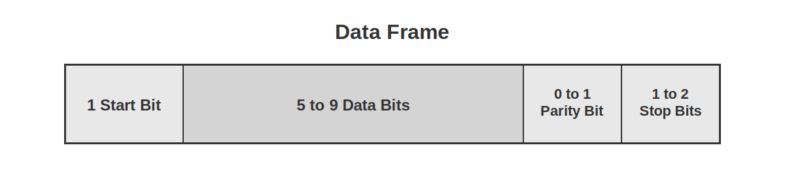

<!-- Image referencing -->

<!-- Video -->
import VideoUARTExample1 from './videos/06-UART-Example-1.mp4';
import VideoUARTExample2 from './videos/06-UART-Example-2.mp4';

import VideoPlayer from '@site/src/components/VideoPlayer';

# Serial Communication (UART)

:::tip[Important: About board compatibility]
The core logic of this tutorial applies to all ESP32 boards, but all the operation steps are explained using the example of the [**Waveshare ESP32-S3-Zero mini development board**](https://www.waveshare.com/esp32-s3-zero.htm). If you are using a development board of another model, please modify the corresponding settings according to the actual situation.
:::

UART (Universal Asynchronous Receiver/Transmitter) is a hardware interface circuit used to implement asynchronous serial communication. Common applications include: communication with sensors/modules, data transmission and reception between the board and the computer (such as printing logs, debugging information), etc.

UART-based serial communication has the following features:

- **Asynchronous communication**: Instead of sharing clock signals, sending and receiving devices synchronize data transmission through pre-agreed baud rates.
- **Serial transfer**: Data is sent bitwise instead of multiple bits in parallel.
- **Full-duplex**: Can perform send and receive operations simultaneously.

---

UART is **asynchronous** communication, meaning it has no shared clock lines. To ensure correct data transmission and reception, they agree to use the same **baud rate** and **data frame format**.

**Baud Rate** refers to the number of bits transmitted per second (bps, bits per second). The communicating parties must use the same baud rate to correctly transmit data. The common baud rates are 9600 and 115200.

Each **UART data frame** consists of the following parts:

- **Start Bit**: 1 bit, always 0, indicating the start of data transmission
- **Data Bits**: Typically 5-9 bits, commonly 8 bits, containing the actual data to be transmitted
- **Parity Bit**: Optional, used for error detection
- **Stop Bits**: 1-2 bits, always 1, indicating the end of data transmission



---

UART communication requires two core signal lines:

- **TX (Transmit)**: Data transmission line
- **RX (Receive)**: Data receiving line
- **GND (Ground)**: The "common reference point" between communication parties, ensuring voltage signals can be correctly interpreted.
- **Connection Method**: There needs to be a cross-connection between the two devices, i.e., the TX of Device A connects to the RX of Device B, and the RX of Device A connects to the TX of Device B. Furthermore, a common ground (GND) connection is required between the two devices to establish a stable reference for signal voltages.


---

## 1. UART in ESP32

The ESP32 chip typically has two or more UART controllers. Each UART controller can be independently configured with parameters such as baud rate, data bit length, bit order, number of stop bits, and parity bit.

In the Arduino environment, we can use them through objects like `Serial`, `Serial1`, etc.

- **`Serial`** is the default serial port, usually connected to the USB-to-serial chip on the development board. It can also point to native USB by enabling USB CDC on boot if it does not have a USB-to-serial chip. In either case, `Serial` can be used to communicate with the computer's serial monitor and is also a commonly used interface for uploading code and debugging.

- **`Serial1`** and serial ports are additional hardware UARTs, which can almost be assigned to any idle GPIO for connecting external devices.

- In addition to `Serial` and `Serial1`, some ESP32 models (such as ESP32-S3) also support more serial ports such as `Serial2`. The number of supported UARTs for each model can be found in the chip datasheet or [ESP32 Series Product Portfolio](https://products.espressif.com/static/Espressif%20SoC%20Product%20Portfolio.pdf).

This design allows us to use `Serial` to debug and print logs with the computer, and use other UARTs such as `Serial1` to communicate independently with the module without interfering with each other.

:::info

In the Arduino environment, the pointing of `Serial` varies depending on the board type and configuration, so it should be noted:

- **Development board with USB-to-serial chip (such as classic ESP32):**
  `Serial` usually corresponds to the underlying **UART0**, and the default TX/RX is dedicated to computer communication.

- **Development boards with native USB functionality (such as ESP32-S3/S2/C3):**

  If equipped with a USB-to-serial chip, `Serial` corresponds to **UART0**, and the default TX/RX is dedicated to computer communication

  When USB CDC is enabled, `Serial` will communicate directly through the USB interface, independent of the hardware UART0. If you don't have a USB-to-serial chip, you can use `Serial0` (UART0) via the marked RX/TX.

:::

## 2. Example 1: Controlling LEDs via Serial Monitor

This example will demonstrate a classic UART application: sending commands from a computer to control the hardware of the ESP32. We will send the "on" or "off" string through the serial monitor of the Arduino IDE to turn on or off the LED connected to the ESP32.

### 2.1 Circuit Assembly

Components required:

- LED \* 1
- 330Ω resistor \* 1
- Breadboard \* 1
- Wire
- ESP32 development board

Connect the circuit according to the wiring diagram below:

<Details>
  <summary>ESP32-S3-Zero Pinout Diagram</summary>


</Details>

<div style={{maxWidth:500}}> </div>

### 2.2 Code

```cpp
const int ledPin = 7;  // Define the pins for the LED connection

void setup() {
  pinMode(ledPin, OUTPUT);           // Set the LED pin to output mode

  Serial.begin(115200);                // Initialize serial communication and set the baud rate to 115200
  while (!Serial) {};    // Wait for the serial port to be ready
}

void loop() {
  if (Serial.available() > 0) {                 // If the serial port receives data
    String msg = Serial.readStringUntil('\n');  // Read a line of input (ending with a line break)
    msg.trim();                                 // Remove leading and trailing invisible characters that take up space, such as spaces and newline characters

    if (msg == "on") {
      // If the input is "on", turn on the LED
      digitalWrite(ledPin, HIGH);
      Serial.println("LED is on");
    } else if (msg == "off") {
      // If the input is "off", turn off the LED
      digitalWrite(ledPin, LOW);
      Serial.println("LED is off");
    }else{
      Serial.println("Please enter 'on' or 'off'");  // Prompt for valid input
    }
  }
}
```

### 2.3 Code Analysis

1. **`Serial.begin(115200); '**: Initialize 'Serial' and set the baud rate to 115200. The baud rate of the serial monitor also needs to be set to this value.
2.  **`Serial.available()`**: Check if there is data in the serial port receive buffer. If greater than 0, it indicates that the computer has sent a new message.
3. **`Serial.readStringUntil('\n')`**: Reads characters from the serial buffer until a newline character \n or a timeout occurs, and combines the read characters into a `String` object. This method is suitable for receiving commands sent by the serial monitor that end with a carriage return.
4.  **`msg.trim();`**: When we send text from the serial monitor and press Enter, along with the text itself, a newline character (`\n`) or carriage return character (`\r`) is usually sent. The `trim()` function removes these whitespace characters from the beginning and end of a string, ensuring that comparisons like `msg == "on"` can succeed.
5. **`if / else if`**: Perform the corresponding `digitalWrite()` operation to control the LED based on the cleaned `msg` string content, and print feedback information to the serial monitor.

### 2.4 Running Results

1. Open the serial monitor and set the baud rate to 115200, ensuring it matches the baud rate set in the code.

   

2. In the serial monitor, input "on" and press Enter, the LED light will turn on; input "off" and press Enter, the LED light will turn off.

   <!-- <VideoPlayer src={VideoUARTExample1} asGif /> -->

## 3. Example 2: Serial Communication Between ESP32s

This example will demonstrate how to achieve communication between two ESP32 development boards using the additional hardware serial ports (`Serial1`) of the ESP32. We will use a button connected to one board to control the LEDs connected to the other board.

### 3.1 Circuit Assembly

Components required:

- LED \* 1
- 330Ω resistor \* 1
- Breadboard \* 2
- Button \* 1
- Wire
- ESP32 development board \* 2

Connect the circuit according to the wiring diagram below:

<Details>
  <summary>ESP32-S3-Zero Pinout Diagram</summary>


</Details>

<div style={{maxWidth:600}}> </div>

| Transmitter (Board A) | Receiver (Board B) | Description                       |
| ------------------ | ------------------ | -------------------------- |
| GPIO 11 (RX)       | GPIO 2 (TX)        | Data is sent from B to A      |
| GPIO 12 (TX)       | GPIO 1 (RX)        | Data is sent from A to B      |
| GND                | GND                | **Common ground required** for stable signals |

### 3.2 Code

#### 3.2.1 Transmitter Code (ESP32 Development Board A)

Upload this code to the ESP32 development board connected to the button.

```cpp
#define UART1_RX_PIN 11  // Define the receive pin (RX) of UART1
#define UART1_TX_PIN 12  // Define the transmit pin (TX) of UART1

const int buttonPin = 7;    // Pin for button connection
int lastButtonState = LOW;  // The initial state is not pressed

void setup() {
  // Start the default serial port for debugging output to the computer
  Serial.begin(115200);
  // while(!Serial){};

  // Start Serial1 and specify RX and TX pins for device communication
  Serial1.begin(9600, SERIAL_8N1, UART1_RX_PIN, UART1_TX_PIN);

  pinMode(buttonPin, INPUT_PULLUP);  // Configure button pins to pull-up input mode

  Serial.println("Sender Ready. Press the button.");
}

void loop() {
  int currentButtonState = digitalRead(buttonPin);

  // If the button status changes
  if (currentButtonState != lastButtonState) {
    if (currentButtonState == HIGH) {
      Serial1.write('0');  // Send '0' when the button is released
      Serial.println("Sent: 0 (Button Released)");
    }else{
      Serial1.write('1');  // Send '1' when the button is pressed
      Serial.println("Sent: 1 (Button Pressed)");
    }

    lastButtonState = currentButtonState;  // Update button status
    delay(50);                             // Simple debouncing
  }
}
```

#### 3.2.2 Receiver Code (ESP32 Development Board B)

Upload this code to the ESP32 development board connected to the LED.

```cpp
#define UART1_RX_PIN 1  // Define the receive pin (RX) of UART1
#define UART1_TX_PIN 2  // Define the transmit pin (TX) of UART1

const int ledPin = 7;

void setup() {
  // Start the default serial port for debugging output to the computer
  Serial.begin(115200);
  // while(!Serial){};

  // Start Serial1 and specify RX and TX pins for device communication
  Serial1.begin(9600, SERIAL_8N1, UART1_RX_PIN, UART1_TX_PIN);

  pinMode(ledPin, OUTPUT);  // Configure LED pin to output mode

  Serial.println("Receiver Ready. Waiting for commands...");
}

void loop() {
  // Check if data is received from UART1 serial port
  if (Serial1.available()) {
    char command = Serial1.read();  // Read a byte (character)

    // Control the LED based on the received command
    if (command == '1') {
      // Light the LED when receiving '1'
      digitalWrite(ledPin, HIGH);
      Serial.println("Received: 1 -> LED ON");
    } else if (command == '0') {
      // Turn off the LED when receiving '0'
      digitalWrite(ledPin, LOW);
      Serial.println("Received: 0 -> LED OFF");
    }
  }
}
```

### 3.3 Code Analysis

#### 3.3.1 Commonalities Between the Two Codes

1. **`#define UART1_RX_PIN ...` / `#define UART1_TX_PIN ...`**: Use macro definitions to specify the RX and TX pins for `Serial1`. This makes the code more readable and easier to modify.
2. **`Serial.begin(115200);`**: Both boards have enabled the default `Serial` port, allowing them to be connected to two computers (or two serial port tools on the same computer) for printing debug information, making it easier for us to observe the communication process.
3. **`Serial1.begin(9600, SERIAL_8N1, UART1_RX_PIN, UART1_TX_PIN);`**:
   - This is the core of the example. It initializes the **`Serial1`** channel. The two boards communicate via their respective **`Serial1`** channels.
   - `9600`: This is the baud rate for communication between two ESP32 modules, **must be consistent**.
   - `SERIAL_8N1`: This is the standard serial port configuration (8 data bits, no parity, 1 stop bit).
     - `8`: 8-bit data length (optional 5, 6, 7 bits)
     - `N`: No parity (optional even parity E, odd parity O)
     - `1`: 1 stop bit (optional 2 bits)
   - `UART1_RX_PIN, UART1_TX_PIN`: Bind 'Serial1' to the defined GPIO pins.

#### 3.3.2 Transmitter (ESP32 Development Board A)

- **`if (currentButtonState != lastButtonState)`**: This judgment is used to detect a **change** in the button state (from pressed to released, or from released to pressed), ensuring data is sent only once when the state changes, rather than continuously.
- **`Serial1.write('1');`**: When the button is pressed (the status changes to 'LOW'), a single character `'1'` is sent to the receiver via 'Serial1'.
- **`Serial1.write('0');`**: When the button is released (status changes to 'HIGH'), `'1'` is sent.

#### 3.3.3 Receiver (ESP32 Development Board B)

- **`if (Serial1.available())`**: In the main loop, continuously check if there is data in the `Serial1` receive buffer.
- **`char command = Serial1.read();`**: Read a byte (character) into the `command` variable if data is available.
- **`if (command == '1')`**: Determine the received characters. If it's `1`, turn on the LED; if it's `'0'`, turn off the LED. At the same time, print received information and executed actions through your own `Serial` port for easy debugging.

### 3.4 Running Results

1.  Upload the two sets of code to the two ESP32 development boards separately.
2.  You can connect both boards to your computer with two USB cables and open two serial monitor windows corresponding to the COM ports of both boards.
3.  Press the button on **Transmitter (ESP32 Development Board A)**, and you will observe:
    - The serial monitor of ESP32 A prints out `"Sent: 1 (Button Pressed)"`.
    - **The LED on the **Receiver (ESP32 Development Board B)** **lights up**.
    - The serial monitor of ESP32 B prints out `"Received: 1 -> LED ON"`.
4. Release the button and you will observe:
    - The serial monitor of ESP32 A prints out `"Sent: 0 (Button Released)"`.
    - **The LED on the **Receiver (ESP32 Development Board B)** **turns off**.
    - The serial monitor of ESP32 B prints out `"Received: 0 -> LED OFF"`.

<VideoPlayer src={VideoUARTExample2} asGif />

## 4. Further Reading

### Why does communication remain normal after enabling USB CDC, even if the baud rate settings in the code do not match those of the serial monitor?

The core reason is that at this time, the development board is communicating with the computer via **native USB**, which emulates a **virtual serial port**, rather than the traditional UART serial communication. The concept of "baud rate" is not valid in the USB communication protocol.

To sum up:

1. The way of communication has changed: instead of relying on a fixed-rate UART signal, you are transmitting packets at a speed determined by the USB protocol itself. The data transfer speed is extremely fast, far exceeding conventional baud rates.
2. Baud rate settings are ignored: both the `Serial.begin(baud rate)` in the code and the baud rate settings in the monitor are ignored. This function is kept mainly for compatibility with the old code.
3. Applicable objects: This phenomenon only appears on development boards that support native USB (such as ESP32-S2/S3, Leonardo, Zero, etc.). For boards like Arduino Uno/Nano that use a separate USB-to-serial chip, the baud rate must match exactly.

## 5. Related Links

- [Serial (UART) | Arduino-ESP32 documentation](https://docs.espressif.com/projects/arduino-esp32/en/latest/api/serial.html)
- [Universal Asynchronous Receiver-Transmitter (UART) | Arduino Documentation](https://docs.arduino.cc/learn/communication/uart/)
- [Serial | Arduino Documentation](https://docs.arduino.cc/language-reference/en/functions/communication/serial/)
- [String() | Arduino Documentation](https://docs.arduino.cc/language-reference/en/variables/data-types/stringObject/)
- [String length() and trim() Commands | Arduino Documentation](https://docs.arduino.cc/built-in-examples/strings/StringLengthTrim/)
- [trim() | Arduino Documentation](https://docs.arduino.cc/language-reference/en/variables/data-types/stringObject/Functions/trim/)
- [Serial.write() | Arduino Documentation](https://docs.arduino.cc/language-reference/en/functions/communication/serial/write/)
- [USB CDC | Arduino-ESP32 documentation](https://docs.espressif.com/projects/arduino-esp32/en/latest/api/usb_cdc.html)
- [USB CDC On Boot | Arduino-ESP32 documentation](https://docs.espressif.com/projects/arduino-esp32/en/latest/guides/tools_menu.html?#usb-cdc-on-boot)