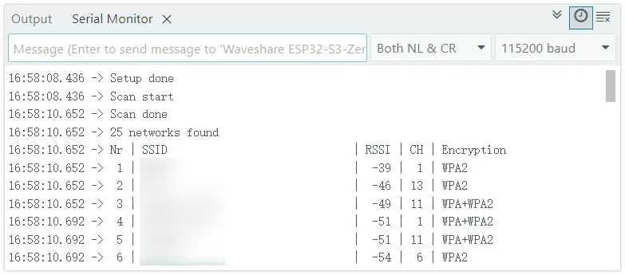
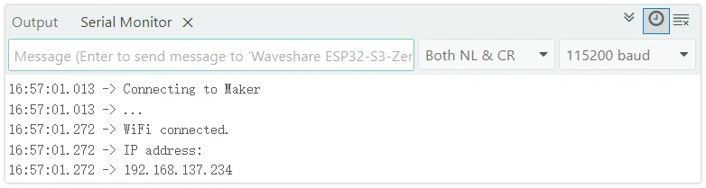
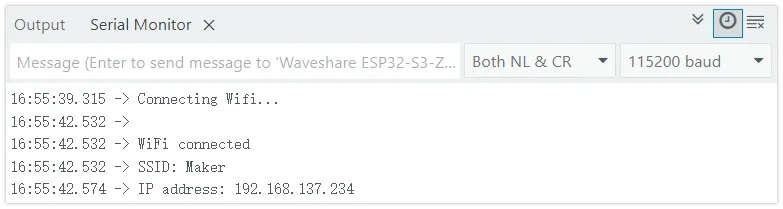
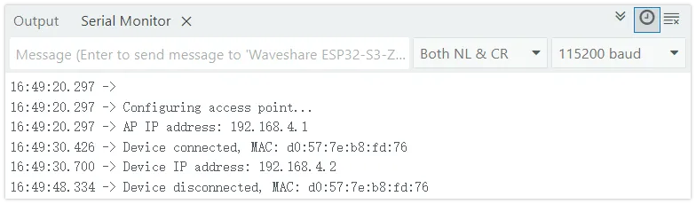

# WiFi Basic Usage

:::tip[Important: About board compatibility]
The core logic of this tutorial applies to all ESP32 boards, but all the operation steps are explained using the example of the [**Waveshare ESP32-S3-Zero mini development board**](https://www.waveshare.com/esp32-s3-zero.htm). If you are using a development board of another model, please modify the corresponding settings according to the actual situation.
:::

The ESP32 series chips are built-in with powerful wireless connectivity features. Most ESP32 chips have integrated Wi-Fi, which makes them ideal for Internet of Things (IoT) projects. (Some models are not integrated with Wi-Fi functionality to meet cost or specific application scenario requirements. Specific support for each model can be found in the official [ESP32 Product Overview](https://products.espressif.com/static/Espressif%20SoC%20Product%20Portfolio.pdf) documentation.)

The ESP32 can operate in various Wi-Fi modes:

- **STA mode (Station)**: ESP32 connects to a router or hotspot as a client.
- **AP mode (Access Point)**: ESP32 creates a hotspot, and other devices can connect to it.
- **AP+STA mode**: Connects to a network as a client while also providing a hotspot for other devices.

This tutorial will introduce the basic usage of ESP32 in the Arduino environment through the following examples:

- [Example 1: Scan WiFi](#example-1-scan-wifi)
- [Example 2: Connect to a Specified Wi-Fi (STA Mode)](#example-2-connect-to-specified-wifi)
- [Example 3: Manage Multiple Wi-Fi (WiFiMulti)](#example-3-manage-multiple-wifi)
- [Example 4: Create Wi-Fi Hotspot (AP Mode)](#example-4-create-wifi-hotspot)
- [Example 5: Configure Static IP](#example-5-configure-static-ip)

## 1. Example 1: Scan WiFi {#example-1-scan-wifi}

This example shows how to scan surrounding Wi-Fi networks and display their details, including network name, signal strength, channel, and encryption type.

### 1.1 Code

```cpp
#include "WiFi.h"
void setup() {
  Serial.begin(115200);

  // Set Wi-Fi to Station mode and disconnect any existing connections
  WiFi.mode(WIFI_STA);
  WiFi.disconnect();
  delay(100);

  Serial.println("Setup done");
}
void loop() {
  Serial.println("Scan start");
  // WiFi.scanNetworks() will return the number of networks found.
  int n = WiFi.scanNetworks();
  Serial.println("Scan done");

  if (n == 0) {
    Serial.println("no networks found");
  }else{
    Serial.print(n);
    Serial.println(" networks found");
    Serial.println("Nr | SSID                             | RSSI | CH | Encryption");
    for (int i = 0; i < n; ++i) {
      // Print the SSID and RSSI of each network found
      Serial.printf("%2d", i + 1);
      Serial.print(" | ");
      Serial.printf("%-32.32s", WiFi.SSID(i).c_str());
      Serial.print(" | ");
      Serial.printf("%4ld", WiFi.RSSI(i));
      Serial.print(" | ");
      Serial.printf("%2ld", WiFi.channel(i));
      Serial.print(" | ");
      switch (WiFi.encryptionType(i)) {
        case WIFI_AUTH_OPEN: Serial.print("open"); break;
        case WIFI_AUTH_WEP: Serial.print("WEP"); break;
        case WIFI_AUTH_WPA_PSK: Serial.print("WPA"); break;
        case WIFI_AUTH_WPA2_PSK: Serial.print("WPA2"); break;
        case WIFI_AUTH_WPA_WPA2_PSK: Serial.print("WPA+WPA2"); break;
        case WIFI_AUTH_WPA2_ENTERPRISE: Serial.print("WPA2-EAP"); break;
        case WIFI_AUTH_WPA3_PSK: Serial.print("WPA3"); break;
        case WIFI_AUTH_WPA2_WPA3_PSK: Serial.print("WPA2+WPA3"); break;
        case WIFI_AUTH_WAPI_PSK: Serial.print("WAPI"); break;
        default: Serial.print("unknown");
      }
      Serial.println();
      delay(10);
    }
  }
  Serial.println("");

  // Delete the scan results to free up memory
  WiFi.scanDelete();

  // Wait a moment before scanning again.
  delay(5000);
}
```

### 1.2 Code Analysis

- `WiFi.mode(WIFI_STA);`: Sets the ESP32's Wi-Fi working mode to Station mode.
- `WiFi.disconnect()`: Disconnects any previously existing connection to ensure it is in an unconnected state.
- `WiFi.scanNetworks()`: Performs a synchronous scan to detect surrounding Wi-Fi networks. This function is blocking and returns the number of networks discovered after the scan is completed.
- `WiFi.SSID(i)`: Gets the SSID (network name) of the network with the index `i`, returns the String type.
- `WiFi.RSSI(i)`: Gets the RSSI (Received Signal Strength Indication) of the network with the index `i`. The unit is dBm, and the value is negative. The closer it is to 0, the stronger the signal.
- `WiFi.channel(i)`: Gets the Wi-Fi channel where the network with the index `i` is located.
- `WiFi.encryptionType(i)`: Gets the encryption type of the network with index `i`.
- `WiFi.scanDelete()`: Deletes scan results to free memory, which is good programming practice.

### 1.3 Running Results

Open the serial monitor and set the baud rate to `115200`. The serial monitor will display a list of detected available Wi-Fi networks with output similar to the following:



## 2. Example 2: Connect to specified Wi-Fi (STA mode) {#example-2-connect-to-specified-wifi}

The ESP32 connects to the specified Wi-Fi network, obtains an IP address, and maintains the connection.

### 2.1 Code

```cpp
#include <WiFi.h>

// Please replace with your Wi-Fi network information
const char *ssid = "yourssid";        // Replace with your Wi-Fi name
const char *password = "yourpasswd";  // Replace with your Wi-Fi password

void setup() {
  Serial.begin(115200);

  delay(10);

  Serial.print("Connecting to ");
  Serial.println(ssid);

  WiFi.mode(WIFI_STA);
  WiFi.begin(ssid, password);

  while (WiFi.status() != WL_CONNECTED) {
    delay(500);
    Serial.print(".");
  }

  Serial.println("");
  Serial.println("WiFi connected.");
  Serial.println("IP address: ");
  Serial.println(WiFi.localIP());
}

void loop() {
}
```

### 2.2 Code Analysis

- `WiFi.begin(ssid, password);`: Start the connection process. This is an asynchronous function that returns immediately while the connection takes place in the background.
- `WiFi.status()`: Returns the current Wi-Fi connection status. `WL_CONNECTED` indicates a successful connection. The `while` loop waits for the connection to complete by polling for this state. Common Wi-Fi status values:
  - `WL_IDLE_STATUS`: Wi-Fi is in an idle state
  - `WL_NO_SSID_AVAIL`: The specified network name cannot be found
  - `WL_CONNECTED`: Successfully connected
  - `WL_CONNECT_FAILED`: Connection failed
  - `WL_CONNECTION_LOST`: Connection lost
- `WiFi.localIP()`: Gets the IP address assigned to the ESP32 by the DHCP server after a successful connection. The type is IPAddress.

### 2.3 Running Results

Upload the code after changing `yourssid` and `yourpassword` to your Wi-Fi information. The serial monitor will display the connection process, and after successful connection, it will print the obtained IP address:



## 3. Example 3: Manage Multiple Wi-Fi (WiFiMulti) {#example-3-manage-multiple-wifi}

Preset multiple Wi-Fi network information, and the ESP32 automatically connects to the network with the strongest signal available.

### 3.1 Code

```cpp
#include <WiFi.h>
#include <WiFiMulti.h>

WiFiMulti wifiMulti;

void setup() {
  Serial.begin(115200);
  delay(10);

  // Add multiple candidate Wi-Fi networks
  // highlight-start
  wifiMulti.addAP("ssid_from_AP_1", "your_password_for_AP_1");
  wifiMulti.addAP("ssid_from_AP_2", "your_password_for_AP_2");
  wifiMulti.addAP("ssid_from_AP_3", "your_password_for_AP_3");
  // highlight-end

  Serial.println("Connecting Wifi...");
  // highlight-next-line
  if (wifiMulti.run() == WL_CONNECTED) {
    Serial.println("");
    Serial.println("WiFi connected");
    Serial.print("SSID: ");
    Serial.println(WiFi.SSID());
    Serial.print("IP address: ");
    Serial.println(WiFi.localIP());
  }
}

void loop() {
  // Check connection status, if disconnected, try to reconnect
  if (wifiMulti.run() != WL_CONNECTED) {
    Serial.println("WiFi not connected!");
    delay(1000);
  }
}
```

### 3.2 Code Analysis

- `WiFiMulti wifiMulti;`: Create an instance of the `WiFiMulti` object to manage multiple Wi-Fi networks.
- `wifiMulti.addAP("ssid", "password");`: Add credentials for a candidate Wi-Fi network to the `WiFiMulti` instance. It can be called multiple times to add multiple networks.
- `wifiMulti.run()`: Core function. It scans, selects the available network with the strongest signal, and tries to connect. It returns the current connection status, similar to `WiFi.status()`. Continuously calling within the `loop` can achieve automatic reconnection upon disconnection.

### 3.3 Running Results

Upload the code after configuring at least one available Wi-Fi information. The ESP32 connects to the network with the strongest signal in the list and prints out the IP address. If the current connection is disconnected, it will automatically attempt to connect to other available networks in the list.



## 4. Example 4: Create Wi-Fi Hotspot (AP Mode){#example-4-create-wifi-hotspot}

ESP32 creates a Wi-Fi hotspot that other devices can connect to. When the device is connected or disconnected, the serial monitor displays information about the device. This example uses event callbacks to monitor client connections and disconnections.

### 4.1 Code

```cpp
#include <WiFi.h>

const char *ssid = "ESP32-S3-TEST";  // Set the hotspot name
const char *password = "12345678";  // Set hotspot password (at least 8 digits)

void setup() {

  Serial.begin(115200);
  Serial.println();
  Serial.println("Configuring access point...");

  // Set Wi-Fi event callback function
  WiFi.onEvent(WiFiStationConnected, WiFiEvent_t::ARDUINO_EVENT_WIFI_AP_STACONNECTED);
  WiFi.onEvent(WiFiStationGotIP, WiFiEvent_t::ARDUINO_EVENT_WIFI_AP_STAIPASSIGNED);
  WiFi.onEvent(WiFiStationDisconnected, WiFiEvent_t::ARDUINO_EVENT_WIFI_AP_STADISCONNECTED);

  // highlight-start
  // Create a Wi-Fi hotspot
  if (!WiFi.softAP(ssid, password)) {
    Serial.println("Soft AP creation failed.");
    while (1)
      ;
  }
  // highlight-end
  IPAddress myIP = WiFi.softAPIP();
  Serial.print("AP IP address: ");
  Serial.println(myIP);
}

void loop() {
}

// Device connection event
void WiFiStationConnected(WiFiEvent_t event, WiFiEventInfo_t info) {
  Serial.print("Device connected, MAC: ");
  Serial.println(macToString(info.wifi_ap_staconnected.mac));
}

// Device obtaining IP event
void WiFiStationGotIP(WiFiEvent_t event, WiFiEventInfo_t info) {
  Serial.print("Device IP address: ");
  Serial.println(IPAddress(info.got_ip.ip_info.ip.addr));
}

// Device disconnection event
void WiFiStationDisconnected(WiFiEvent_t event, WiFiEventInfo_t info) {
  Serial.print("Device disconnected, MAC: ");
  Serial.println(macToString(info.wifi_ap_stadisconnected.mac));
}

// MAC address to string conversion helper function
String macToString(const uint8_t *mac) {
  char buf[18];
  snprintf(buf, sizeof(buf), "%02x:%02x:%02x:%02x:%02x:%02x",
           mac[0], mac[1], mac[2], mac[3], mac[4], mac[5]);
  return String(buf);
}
```

### 4.2 Code Analysis

- `WiFi.onEvent(callback, event)`: Register Wi-Fi event callback function. When the specified event occurs, the system automatically calls the corresponding callback function. This is an event-driven programming model that does not require actively polling for status.
- **Event type description**:
  - `ARDUINO_EVENT_WIFI_AP_STACONNECTED`: Triggered when a device connects to the ESP32 hotspot
  - `ARDUINO_EVENT_WIFI_AP_STAIPASSIGNED`: Triggered when the connected device acquires an IP address
  - `ARDUINO_EVENT_WIFI_AP_STADISCONNECTED`: Triggered when the device is disconnected from the ESP32 hotspot
  - For other events, refer to [Wi-Fi Event Examples](https://docs.espressif.com/projects/arduino-esp32/en/latest/api/wifi.html#wi-fi-events-example)
- `WiFi.softAP(ssid, password)`: Create a Wi-Fi hotspot. The first parameter is the hotspot name, and the second parameter is the password (at least 8 digits). Returns a boolean value indicating whether the creation was successful.
- `WiFi.softAPIP()`: Gets the IP address of the ESP32 when acting as a hotspot, typically defaulting to 192.168.4.1.
- `WiFiEventInfo_t info`: A structure containing event-related information, with different information fields for various event types.
- `macToString()`: Helper function that converts a 6-byte MAC address array into a readable string format (e.g., "aa:bb:cc:dd:ee:ff").

### 4.3 Running Results

After running the program, the ESP32 will create a Wi-Fi hotspot named "ESP32S3-TEST". The serial monitor first prints out the IP address of the AP. When a device connects or disconnects the hotspot, the corresponding event information is printed:



## 5. Example 5: Configure Static IP {#example-5-configure-static-ip}

In specific application scenarios, setting a fixed IP address for the ESP32 (rather than dynamically obtaining one via DHCP) is a common requirement to facilitate stable device access.

### 5.1 STA Mode: Configure Static IP

Based on example 2, add a static IP configuration:

```cpp
#include <WiFi.h>

const char *ssid = "Maker";         // Wi-Fi name
const char *password = "12345678";  // Wi-Fi password

// Set static IP address, gateway, and subnet mask
// Modify it according to your LAN configuration
// highlight-start
IPAddress ip(192, 168, 137, 100);     // Set a static IP address
IPAddress gateway(192, 168, 137, 1);  // Set gateway
IPAddress subnet(255, 255, 255, 0);   // Set subnet mask
// highlight-end

void setup() {
  Serial.begin(115200);

  delay(10);

  WiFi.mode(WIFI_STA);

  // Configure the static IP before connecting, which must be called before WiFi.begin()
  // highlight-next-line
  WiFi.config(ip, gateway, subnet);

  Serial.print("Connecting to ");
  Serial.println(ssid);

  WiFi.begin(ssid, password);

  while (WiFi.status() != WL_CONNECTED) {
    delay(500);
    Serial.print(".");
  }

  Serial.println("");
  Serial.println("WiFi connected.");
  Serial.println("IP address: ");
  Serial.println(WiFi.localIP());
}

void loop() {
}
```

**Code Analysis**

- `IPAddress(a, b, c, d)`: Create an `IPAddress` object to represent the IP address.
- `WiFi.config(local_IP, gateway, subnet)`: Call before `WiFi.begin()` to configure a static IP. If the configuration fails, `false` is returned.

  :::warning
  Make sure that the IP address, gateway, and subnet mask you set matches the LAN environment you're in, and that the IP isn't occupied by other devices.
  :::

### 5.2 AP Mode: Configure Static IP

Based on example 4, set a custom IP address for the hotspot:

```cpp
#include <WiFi.h>

const char *ssid = "ESP32S3-TEST";  // Set the hotspot name
const char *password = "12345678";  // Set hotspot password (at least 8 digits)

// highlight-start
IPAddress ip(192, 168, 5, 1);        // Set static IP address
IPAddress gateway(192, 168, 5, 1);  // Set gateway
IPAddress subnet(255, 255, 255, 0);   // Set subnet mask
// highlight-end

void setup() {

  Serial.begin(115200);
  Serial.println();
  Serial.println("Configuring access point...");

  // Set Wi-Fi event callback function
  WiFi.onEvent(WiFiStationConnected, WiFiEvent_t::ARDUINO_EVENT_WIFI_AP_STACONNECTED);
  WiFi.onEvent(WiFiStationGotIP, WiFiEvent_t::ARDUINO_EVENT_WIFI_AP_STAIPASSIGNED);
  WiFi.onEvent(WiFiStationDisconnected, WiFiEvent_t::ARDUINO_EVENT_WIFI_AP_STADISCONNECTED);

  // Call before WiFi.softAP() creates a hotspot
  // highlight-next-line
  WiFi.softAPConfig(ip, gateway, subnet);

  // Create a Wi-Fi hotspot
  if (!WiFi.softAP(ssid, password)) {
    Serial.println("Soft AP creation failed.");
    while (1)
      ;
  }

  Serial.print("AP IP address: ");
  Serial.println(WiFi.softAPIP());
}

void loop() {
}

// Device connection event
void WiFiStationConnected(WiFiEvent_t event, WiFiEventInfo_t info) {
  Serial.print("Device connected, MAC: ");
  Serial.println(macToString(info.wifi_ap_staconnected.mac));
}

// Device obtaining IP event
void WiFiStationGotIP(WiFiEvent_t event, WiFiEventInfo_t info) {
  Serial.print("Device IP address: ");
  Serial.println(IPAddress(info.got_ip.ip_info.ip.addr));
}

// Device disconnection event
void WiFiStationDisconnected(WiFiEvent_t event, WiFiEventInfo_t info) {
  Serial.print("Device disconnected, MAC: ");
  Serial.println(macToString(info.wifi_ap_stadisconnected.mac));
}

// MAC address to string conversion helper function
String macToString(const uint8_t *mac) {
  char buf[18];
  snprintf(buf, sizeof(buf), "%02x:%02x:%02x:%02x:%02x:%02x",
           mac[0], mac[1], mac[2], mac[3], mac[4], mac[5]);
  return String(buf);
}
```

**Code Analysis**

- `WiFi.softAPConfig(local_IP, gateway, subnet)`: Call before `WiFi.softAP()` to set a custom IP address, gateway, and subnet mask for the ESP32 in AP mode.

## 6. Related Links

- [Wi-Fi API | Arduino-ESP32 documentation](https://docs.espressif.com/projects/arduino-esp32/en/latest/api/wifi.html)
- [WiFi Network | Arduino Documentation](https://docs.arduino.cc/language-reference/en/functions/wifi/wificlass/)
