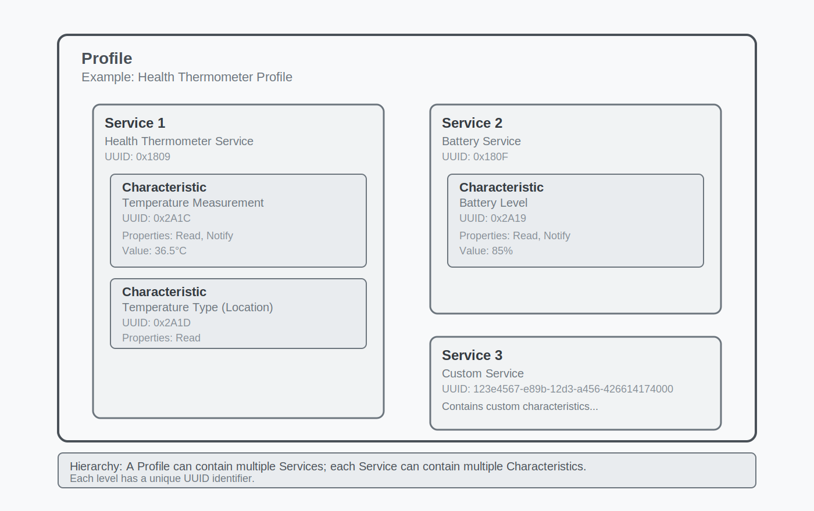
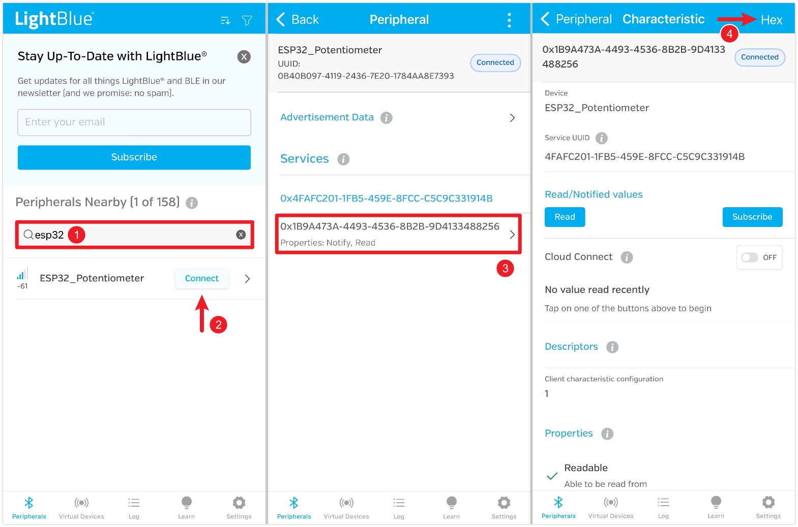
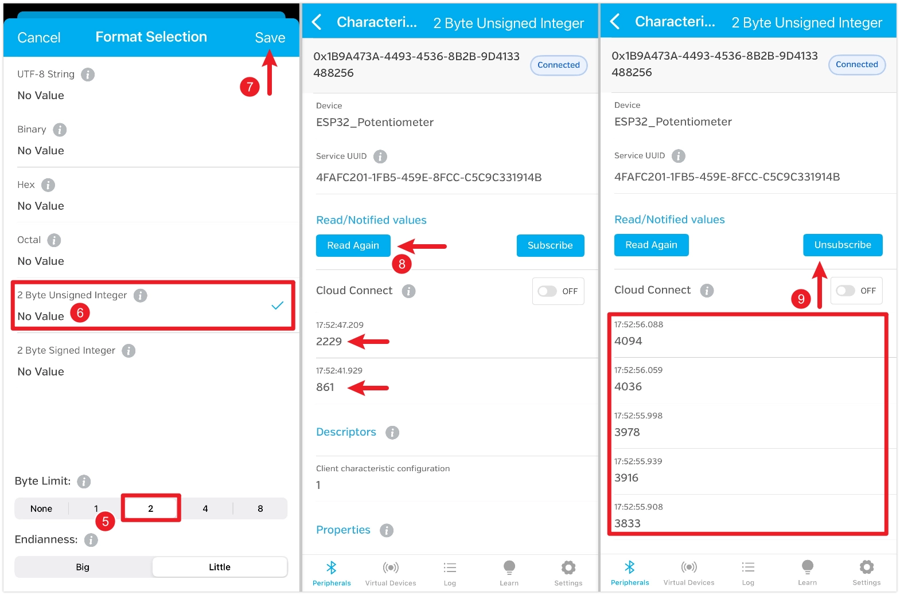
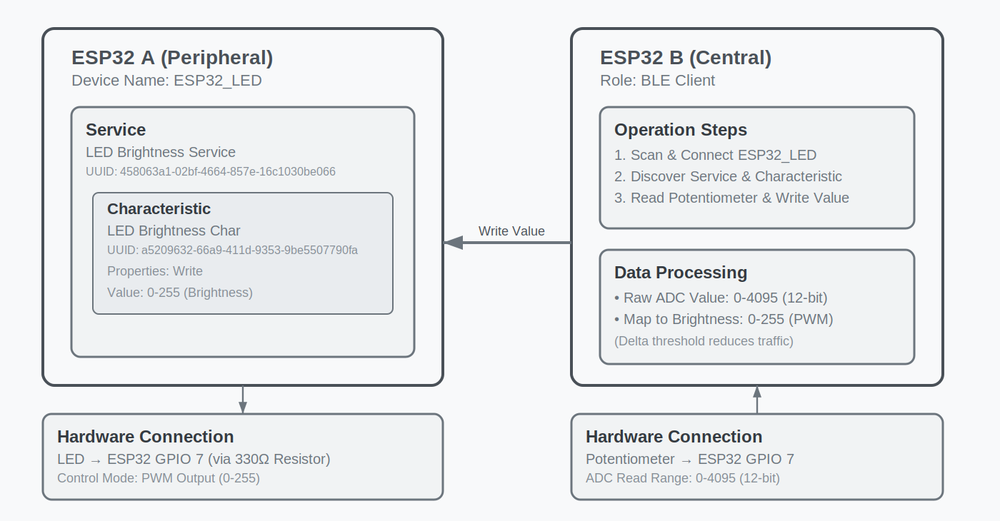

<!-- Image referencing -->
import ImgPotentiometerDiagram from './images/04-Potentiometer_bb.webp';
import ImgBlinkDiagram from './images/03-LED-Blink_bb.webp';
import ImgBLE2Diagram from './images/11-BLE_bb.webp';

# Bluetooth

:::tip[Important: About board compatibility]
The core logic of this tutorial applies to all ESP32 boards, but all the operation steps are explained using the example of the [**Waveshare ESP32-S3-Zero mini development board**](https://www.waveshare.com/esp32-s3-zero.htm).
If you are using a development board of another model, please modify the corresponding settings according to the actual situation.
:::

ESP32 series chips integrate powerful Bluetooth functionality, making them ideal choices for smart wearables, wireless sensing, and short-range communication between devices. Bluetooth technology is divided into two main types:

- **Bluetooth Classic**: Designed for continuous, high-throughput data transmission, commonly found in wireless audio devices.
- **Bluetooth Low Energy (BLE)**: Optimized for low-power, intermittent, small-packet communication, it is the mainstream choice for Internet of Things (IoT) applications, such as smart bands and wireless sensors.

[](https://products.espressif.com/static/Espressif%20SoC%20Product%20Portfolio.pdf)

Bluetooth support varies across ESP32 chips: classic ESP32 chips support both Classic Bluetooth and BLE, while newer subsequent models focus on supporting BLE to optimize cost and power consumption (for specific support details, please refer to: [ESP32 Product Portfolio](https://products.espressif.com/static/Espressif%20SoC%20Product%20Portfolio.pdf)). In fields like IoT and wearable devices, BLE is often the preferred choice due to its low power consumption and high compatibility.

This tutorial will focus on the application of Bluetooth Low Energy (BLE) technology.

## BLE Basic Concepts{#ble-basic-concepts}

BLE communication is based on two core components:

- **GAP (Generic Access Profile)**: Describes the rules for device broadcasting, discovery, and connection. For example, the ESP32 broadcasts its presence, and a smartphone scans for and connects to it.
- **GATT (Generic Attribute Profile)**: Defines the data structure and communication methods between BLE devices. The GATT layer consists of "Services" and "Characteristics".  Each data item has a unique UUID.

In simple terms, GAP is responsible for "allowing devices to find each other and connect." Once a connection is successfully established, GATT takes over and defines "how the two parties exchange data in a standardized manner."

### GAP (Generic Access Profile)

GAP is responsible for managing device connections and broadcasting, and it defines the roles devices play in Bluetooth communication.

GAP defines two primary roles:

- **Peripheral device**: Typically a device that holds data, such as a sensor. It announces its presence through Advertising and waits to be connected. In the examples, the ESP32 will primarily play this role.
- **Central device**: Usually a more powerful device, such as a smartphone or computer. It discovers peripheral devices through Scanning and initiates connections.


GAP facilitates interaction between devices through the following processes:

- **Advertising**: Peripheral devices periodically send advertising packets containing information such as the device name and service UUIDs, allowing central devices to discover them.
- **Scanning**: Central devices listen on advertising channels, receive, and parse advertising packets from peripheral devices.
- **Connecting**: The central device sends a connection request to its chosen peripheral device. Once the peripheral accepts, a one-to-one connection is established between the two.

### GATT (Generic Attribute Profile)

GATT (Generic Attribute Profile) becomes effective after devices establish a connection. It defines the framework and format for data exchange. GATT is based on a Client-Server architecture. These two roles typically directly correspond to the GAP roles:

- **GATT Server**: This is the device that holds the data (usually corresponding to the **Peripheral** in GAP). It stores and provides the data.
- **GATT Client**: This is the device that accesses the data (usually corresponding to the **Central** in GAP). It sends read/write requests to the server.

The data in GATT is organized in a standardized hierarchical structure:



- **Service**
  A Service is a logical collection of multiple related "Characteristics", representing a specific function of the device. Each service is identified by a unique UUID. For example, a "Battery Service" might contain a "Battery Level" characteristic.

- **Characteristic**
  A Characteristic is the fundamental unit for data exchange, encapsulating a specific data value. A complete characteristic contains:

  - **Value**: The actual stored data.
  - **Properties**: Define the operations a client can perform on the "Value". Common ones include:
    - `Read`: Allows the client to read the value.
    - `Write`: Allows the client to write a value.
    - `Notify`: Allows the server to actively send the new value to the client whenever it changes.
    - `Indicate`: Similar to Notify, but requires the client to acknowledge receipt.
  - **Declaration**: Contains the characteristic's properties, UUID, and its position within the service.

- **Descriptor**
  A descriptor is optional and provides additional metadata for a characteristic. For instance, it can be used to provide a human-readable description (e.g., "Temperature Measurement"), specify the unit of the value (e.g., "Celsius"), or define a valid range of values.

- **UUID (Universally Unique Identifier)**
  A UUID is a 128-bit number used to uniquely identify a service, characteristic, or descriptor. For convenience, the Bluetooth Special Interest Group (SIG) has predefined a set of official short UUIDs (usually 16-bit) for common functions, such as `0x180F` for the Battery Service. When developing custom applications, a randomly generated full 128-bit UUID should be used to ensure global uniqueness. All assigned standard UUIDs can be queried on the [SIG official website](https://bitbucket.org/bluetooth-SIG/public/src/main/assigned_numbers/uuids/).

## Example 1: Send Data via BLE (Peripheral Device)

This example configures the ESP32 as a peripheral device to read the analog value from a potentiometer and publish it through a BLE Characteristic. A smartphone app (such as LightBlue) can be used as a central device to connect to the ESP32 and read the value of this characteristic.


### Circuit Assembly

The components required are:

- Potentiometer \* 1
- Breadboard \* 1
- Wire
- ESP32 development board

Connect the circuit according to the wiring diagram below:

<Details>
  <summary>ESP32-S3-Zero wiring diagram</summary>

  

</Details>

<div style={{maxWidth:500}}> </div>

### Code

:::tip
To ensure the uniqueness of BLE devices, it is a best practice to use UUIDs you have generated yourself, rather than copying those directly from the tutorial. You can use online tools (such as [Online UUID Generator](https://www.uuidgenerator.net/)) to generate new UUIDs.
:::

```cpp
#include <BLEDevice.h>
#include <BLEServer.h>
#include <BLEUtils.h>
#include <BLE2902.h>

// Global variables
BLEServer *pServer = NULL;
BLECharacteristic *pPotentiometerCharacteristic = NULL;
bool deviceConnected = false;

// Definitions related to the potentiometer
const int potentiometerPin = 7;  // The potentiometer is connected to GPIO 7
uint16_t lastPotValue;            // Used to store the last potentiometer reading (0-4095)

// Define UUIDs for the service and characteristic
#define SERVICE_UUID "4fafc201-1fb5-459e-8fcc-c5c9c331914b"
#define POTENTIOMETER_CHARACTERISTIC_UUID "1b9a473a-4493-4536-8b2b-9d4133488256"

// Server callback class for handling connection and disconnection events
class MyServerCallbacks : public BLEServerCallbacks {
  void onConnect(BLEServer *pServer) {
    deviceConnected = true;
    Serial.println("Device Connected");
  }

  void onDisconnect(BLEServer *pServer) {
    deviceConnected = false;
    Serial.println("Device Disconnected, restarting advertising...");
    // When the device disconnects, immediately restart advertising
    pServer->getAdvertising()->start();
  }
};

void setup() {
  Serial.begin(115200);
  Serial.println("Starting BLE Potentiometer example...");

  // Initialize potentiometer input
  lastPotValue = analogRead(potentiometerPin);

  // 1. Initialize BLE device
  BLEDevice::init("ESP32_Potentiometer");

  // 2. Create BLE server and set callback
  pServer = BLEDevice::createServer();
  pServer->setCallbacks(new MyServerCallbacks());

  // 3. Create BLE service
  BLEService *pService = pServer->createService(SERVICE_UUID);

  // 4. Create BLE characteristic
  pPotentiometerCharacteristic = pService->createCharacteristic(
    POTENTIOMETER_CHARACTERISTIC_UUID,
    BLECharacteristic::PROPERTY_READ |    // Readable
      BLECharacteristic::PROPERTY_NOTIFY  // Supports notification subscription
  );
  pPotentiometerCharacteristic->addDescriptor(new BLE2902());  // Add the 2902 descriptor to enable subscription requests

  // Set initial value
  pPotentiometerCharacteristic->setValue(lastPotValue);

  // 5. Start the service
  pService->start();

  // 6. Start advertising
  pServer->getAdvertising()->start();
  Serial.println("BLE Server started, waiting for a client connection...");
}

void loop() {
  // Only check the potentiometer state when the device is connected
  if (deviceConnected) {
    uint16_t currentPotValue = analogRead(potentiometerPin);

    // To prevent data flooding caused by analog signal jitter, send updates only when the value change exceeds a threshold
    if (abs(currentPotValue - lastPotValue) > 30) {
      lastPotValue = currentPotValue;

      // Update the characteristic's value and send it to the client via notify
      pPotentiometerCharacteristic->setValue(currentPotValue);
      pPotentiometerCharacteristic->notify();

      Serial.print("Potentiometer value changed to: ");
      Serial.println(currentPotValue);
    }

    delay(50);
  }
}
```

#### Code Analysis

- `#include <BLE...>`: Includes the core libraries required for ESP32 BLE functionality.

  - `BLEDevice.h`: Core device library for initializing the BLE stack.
  - `BLEServer.h`: Used to create a BLE server (peripheral device).
  - `BLEUtils.h`: Provides BLE-related utility tools.
  - `BLE2902.h`: Provides support for the standard `0x2902` descriptor, which is necessary for a client to enable `Notify` or `Indicate`.

- `SERVICE_UUID` and `POTENTIOMETER_CHARACTERISTIC_UUID`:

  Custom 128-bit UUIDs used to uniquely identify the service and characteristic. In actual projects, it is recommended to generate these using an online UUID generator.

- `MyServerCallbacks` class:
  Inherits from `BLEServerCallbacks`. By overriding the `onConnect` and `onDisconnect` methods, you can define the actions to be performed when a client connects or disconnects. Here, we use it to update the `deviceConnected` flag, print logs, and automatically restart advertising when the device disconnects.

- `setup()` function:
  - `BLEDevice::init("ESP32_Potentiometer");`: Initializes the BLE device and sets the device name, which is displayed during Bluetooth scanning.
  - `pServer = BLEDevice::createServer();`: Creates a GATT server instance.
  - `pServer->setCallbacks(...)`:  Associates server events (connect/disconnect) with our custom callback class.
  - `pService = pServer->createService(...)`: Creates a service on the server and specifies its UUID.
  - `pPotentiometerCharacteristic = pService->createCharacteristic(...)`: Creates a characteristic within the service. The second parameter defines the characteristic's properties; here, `PROPERTY_READ` means it is readable, and `PROPERTY_NOTIFY` means it supports notifications.
  - `pPotentiometerCharacteristic->addDescriptor(new BLE2902());`: Adds a standard CCCD (Client Characteristic Configuration Descriptor) to the characteristic. This is a necessary component for enabling notification functionality.
  - `pPotentiometerCharacteristic->setValue(...)`: Sets the initial value of the characteristic.
  - `pService->start()` and `pServer->getAdvertising()->start()`: Starts the service and then begins advertising, making the device visible and connectable.

- `loop()` function:
  - `if (deviceConnected)`: Logic executes only when a client is connected, conserving resources.
  - `if (abs(currentPotValue - lastPotValue) > 30)`: This is a simple debounce and data filtering logic. It updates and sends data only when the change in the potentiometer reading exceeds a threshold, preventing frequent transmission of insignificant data due to minor analog signal jitter.
  - `pPotentiometerCharacteristic->setValue(...)`: Updates the value of the characteristic.
  - `pPotentiometerCharacteristic->notify()`: Actively pushes the updated value to all clients subscribed to this characteristic.

### Testing

:::tip
This example requires using a Bluetooth debugging tool, such as [LightBlue](https://apps.apple.com/cn/app/lightblue/id557428110). iOS users can download it from the [Apple Store](https://apps.apple.com/cn/app/lightblue/id557428110), and Android users can download it from [Google Play](https://play.google.com/store/apps/details?id=com.punchthrough.lightblueexplorer).
:::

Open LightBlue and follow the steps below:

First, search for "ESP32", find the device named "ESP32_Potentiometer", and click "Connect". On the device details page, locate the characteristic, which should show that both Read and Subscribe (or Notify) functions are enabled, and then click to enter it. Click the "HEX" setting in the upper right corner to select the data format for subsequent viewing.



Set the "Byte Limit" to 2, choose "2 Byte Unsigned Integer", and save. After saving, return to the characteristic details page and click "Read" to retrieve the data. Rotate the potentiometer and read again to see the change. You can also click "Subscribe" to receive automatic updates; the value will refresh automatically when you turn the potentiometer.



<!-- > 【todo】You can also consider making videos or GIFs with revenue-generating monitors and actual circuits. -->

## Example 2: Receive Data from BLE (Peripheral Device)

This example configures the ESP32 as a peripheral device, creating a writable BLE characteristic. A smartphone app (such as LightBlue) can write specific values (e.g., 0 or 1) to this characteristic to control an LED connected to the ESP32, turning it on or off.


### Circuit Assembly

The components required are:

- LED \* 1
- 330Ω resistor \* 1
- Breadboard \* 1
- Wire
- ESP32 development board

Connect the circuit according to the wiring diagram below:

<Details>
  <summary>ESP32-S3-Zero Pinout Diagram</summary>

  

</Details>

<div style={{maxWidth:500}}> </div>

### Code

```cpp
#include <BLEDevice.h>
#include <BLEServer.h>
#include <BLEUtils.h>
#include <BLE2902.h>

// Global variables
BLEServer *pServer = NULL;
BLECharacteristic *pLedCharacteristic = NULL;
bool deviceConnected = false;

// Definitions related to the LED
const int ledPin = 7;  // The LED is connected to GPIO 7
uint8_t ledState = 0;   // Used to store the state of the LED (0: OFF, 1: ON)

// Define UUIDs for the service and characteristic (Please use UUIDs you generated yourself to avoid conflicts)
#define SERVICE_UUID "48407a44-6e13-4d28-a559-210de862bc29"
#define LED_CHARACTERISTIC_UUID "539ca2ac-09e5-49be-90da-3b157549eac3"

// Server callback class for handling connection and disconnection events
class MyServerCallbacks : public BLEServerCallbacks {
  void onConnect(BLEServer *pServer) {
    deviceConnected = true;
    Serial.println("Device Connected");
  }

  void onDisconnect(BLEServer *pServer) {
    deviceConnected = false;
    Serial.println("Device Disconnected, restarting advertising...");
    // When the device disconnects, immediately restart advertising
    pServer->getAdvertising()->start();
  }
};

// Characteristic callback class for handling write requests from the client
class MyLedCallbacks : public BLECharacteristicCallbacks {
  // This function is called when a client writes data to this characteristic
  void onWrite(BLECharacteristic *pCharacteristic) {
    // Get the data sent by the client
    String value_str = pCharacteristic->getValue();

    if (value_str.length() > 0) {
      // We are only concerned with the first byte
      uint8_t command = value_str[0];

      Serial.print("Received command: ");
      Serial.println(command);

      // Control the LED based on the received command
      if (command == 1) {
        Serial.println("Turning LED ON");
        digitalWrite(ledPin, HIGH);
        ledState = 1;
      } else if (command == 0) {
        Serial.println("Turning LED OFF");
        digitalWrite(ledPin, LOW);
        ledState = 0;
      } else {
        Serial.print("Unknown command: ");
        Serial.println(command);
      }

      // Update the characteristic value to reflect the current LED state, ensuring the client reads the correct information.
      pLedCharacteristic->setValue(&ledState, 1);
    }
  }
};

void setup() {
  Serial.begin(115200);
  Serial.println("Starting BLE LED Control example...");

  // Initialize the LED pin
  pinMode(ledPin, OUTPUT);
  ledState = 0;

  // 1. Initialize the BLE device
  BLEDevice::init("ESP32_LED_Control");

  // 2. Create a BLE server and set the callback
  pServer = BLEDevice::createServer();
  pServer->setCallbacks(new MyServerCallbacks());

  // 3. Create a BLE service
  BLEService *pService = pServer->createService(SERVICE_UUID);

  // 4. Create a BLE characteristic
  pLedCharacteristic = pService->createCharacteristic(
    LED_CHARACTERISTIC_UUID,
    BLECharacteristic::PROPERTY_READ |   // Readable
      BLECharacteristic::PROPERTY_WRITE  // Writable
  );

  // Set the write callback for the characteristic
  pLedCharacteristic->setCallbacks(new MyLedCallbacks());

  // Set the initial value of the characteristic (LED initial state is OFF)
  pLedCharacteristic->setValue(&ledState, 1);

  // 5. Start the service
  pService->start();

  // 6. Start advertising
  pServer->getAdvertising()->start();
  Serial.println("BLE Server started, waiting for a client connection...");
}

void loop() {
  // The main loop can remain empty, as all BLE events are asynchronously handled through callback functions.
}
```

#### Code Analysis

- `MyLedCallbacks` class:
  Inherits from `BLECharacteristicCallbacks`. It is specifically designed to handle events related to a particular characteristic. By overriding the `onWrite` method, you can define the actions to be performed when a client writes data to this characteristic.

- `onWrite(BLECharacteristic *pCharacteristic)`:

  - `String value_str = pCharacteristic->getValue();`: Retrieves the data written by the client. The data is returned as a `std::string` .
  - `uint8_t command = value_str[0];`: Extracts the first byte from the received string as a command.
  - `digitalWrite(ledPin, ...)`: Controls the LED on/off based on the command.
  - `pLedCharacteristic->setValue(&ledState, 1);`: After processing the write command, updates the characteristic's own value. This ensures that when a client performs a read operation, it retrieves the latest value consistent with the physical state of the LED.

- `setup()` function:
  - `pLedCharacteristic = pService->createCharacteristic(...)`: When creating the characteristic, its properties are set to `PROPERTY_READ | PROPERTY_WRITE`, indicating that this characteristic can be both read from and written to by clients.
  - `pLedCharacteristic->setCallbacks(new MyLedCallbacks());`: Binds our custom `MyLedCallbacks` instance to the LED characteristic. This way, any write operation to this characteristic will trigger the `onWrite` method.

### Testing

:::tip
This example requires using a Bluetooth debugging tool, such as [LightBlue](https://apps.apple.com/cn/app/lightblue/id557428110). iOS users can download it from the [Apple Store](https://apps.apple.com/cn/app/lightblue/id557428110), and Android users can download it from [Google Play](https://play.google.com/store/apps/details?id=com.punchthrough.lightblueexplorer).
:::

Open LightBlue and follow the steps below:

First, search for "ESP32", find the device named "ESP32_LED_Control", and click "Connect". On the device details page, locate the characteristic, which should show that both Read and Write functions are enabled, and then click to enter it. Click the "HEX" setting in the upper right corner to select the data format for subsequent viewing.


Set the "Byte Limit" to 1, choose "1 Byte Unsigned Integer", and save. After saving, return to the characteristic details page and click "Read" to retrieve the data. The default value is 0, and the LED should be off at this time. Click "Write new value", enter the value 1, and the LED should turn on.


<!-- > 【todo】You can also consider making videos or GIFs with revenue-generating monitors and actual circuits. -->

## Example 3: BLE Communication Between ESP32 Devices

Using BLE, control an LED connected to one ESP32 with a potentiometer connected to another ESP32.



### Circuit Assembly

The components required are:

- LED \* 1
- 330Ω resistor \* 1
- Potentiometer \* 1
- Breadboard \* 2
- Wire
- ESP32 development board \* 2

Connect the circuit according to the wiring diagram below:

<Details>
  <summary>ESP32-S3-Zero Pinout Diagram</summary>

  

</Details>

<div style={{maxWidth:600}}> </div>

### Code

#### ESP32 Development Board A Code (Peripheral Device)

```cpp
#include <BLEDevice.h>
#include <BLEServer.h>
#include <BLEUtils.h>

// Global variables
BLEServer *pServer = NULL;
BLECharacteristic *pBrightnessCharacteristic = NULL;

bool deviceConnected = false;
bool newDataAvailable = false;
uint8_t brightness = 0;

// LED-related definitions
const int ledPin = 7; // LED connected to GPIO 7

// Define unique UUIDs for service and characteristic
#define SERVICE_UUID "458063a1-02bf-4664-857e-16c1030be066"
#define BRIGHTNESS_CHARACTERISTIC_UUID "a5209632-66a9-411d-9353-9be5507790fa"

// Server callback class for handling connection and disconnection events
class MyServerCallbacks : public BLEServerCallbacks {
  void onConnect(BLEServer *pServer) {
    deviceConnected = true;
    Serial.println("Client connected successfully");
  }

  void onDisconnect(BLEServer *pServer) {
    deviceConnected = false;
    Serial.println("Client disconnected, restarting advertisement");
    // Immediately restart advertising so that the client can reconnect
    pServer->getAdvertising()->start();
  }
};

// Characteristic callback class for handling write requests from the client
class MyBrightnessCallbacks : public BLECharacteristicCallbacks {
  // This function is called when a client writes data to this characteristic
  void onWrite(BLECharacteristic *pCharacteristic) {
    String value_str = pCharacteristic->getValue();

    if (value_str.length() > 0) {
      // Retrieve the brightness value from the received data
      brightness = value_str[0];
      newDataAvailable = true;
    }
  }
};

void setup() {
  Serial.begin(115200);
  Serial.println("Starting ESP32 BLE LED Controller");

  // Set pin as output
  pinMode(ledPin, OUTPUT);

  // 1. Initialize BLE device
  BLEDevice::init("ESP32_LED");

  // 2.Create BLE server and set callback
  pServer = BLEDevice::createServer();
  pServer->setCallbacks(new MyServerCallbacks());

  // 3. Create BLE service
  BLEService *pService = pServer->createService(SERVICE_UUID);

  // 4. Create BLE characteristic
  pBrightnessCharacteristic = pService->createCharacteristic(
    BRIGHTNESS_CHARACTERISTIC_UUID,
    BLECharacteristic::PROPERTY_WRITE // 只允许写入
  );

  // Set write callback for the characteristic
  pBrightnessCharacteristic->setCallbacks(new MyBrightnessCallbacks());

  // 5. Start the service
  pService->start();
  Serial.println("BLE service started");

  // 6. Start advertising
  BLEAdvertising *pAdvertising = BLEDevice::getAdvertising();
  pAdvertising->addServiceUUID(SERVICE_UUID);
  pAdvertising->setScanResponse(true);
  pServer->getAdvertising()->start();

  Serial.println("Advertisement started, ready for connections");
}

void loop() {
  if (newDataAvailable) {
    // Reset the flag to prevent duplicate processing
    newDataAvailable = false;

    Serial.print("Brightness received: ");
    Serial.println(brightness);

    // Set LED brightness
    analogWrite(ledPin, brightness);
  }
}
```

#### ESP32 Development Board B Code (Central Device)

```cpp
#include <BLEDevice.h>

// Service and Characteristic UUIDs of the server to connect to (must match the server code)
#define SERVICE_UUID "458063a1-02bf-4664-857e-16c1030be066"
#define BRIGHTNESS_CHARACTERISTIC_UUID "a5209632-66a9-411d-9353-9be5507790fa"

// Global variables
static boolean doConnect = false;
static boolean connected = false;
static BLEAddress *pServerAddress;
static BLERemoteCharacteristic *pRemoteCharacteristic;

// Definitions related to the potentiometer
const int potentiometerPin = 7;  // Potentiometer connected to GPIO 7
uint8_t lastBrightness = 0;       // Stores the last brightness value sent (0-255)

class MyClientCallbacks : public BLEClientCallbacks {
  void onConnect(BLEClient *pclient) {}

  void onDisconnect(BLEClient *pclient) {
    connected = false;
    Serial.println("onDisconnect: Client Disconnected");
  }
};

// Scan callback class, called when a BLE device is discovered
class MyAdvertisedDeviceCallbacks : public BLEAdvertisedDeviceCallbacks {
  void onResult(BLEAdvertisedDevice advertisedDevice) {
    // Found a device, check if it contains the service we are looking for.
    if (advertisedDevice.isAdvertisingService(BLEUUID(SERVICE_UUID))) {
      Serial.print("Found target server by Service UUID: ");
      Serial.println(advertisedDevice.getAddress().toString().c_str());

      // Stop scanning
      advertisedDevice.getScan()->stop();

      // Save the server address and set the connection flag
      pServerAddress = new BLEAddress(advertisedDevice.getAddress());
      doConnect = true;
    }
  }
};

// Function to connect to the server
bool connectToServer(BLEAddress pAddress) {
  Serial.print("Connecting to ");
  Serial.println(pAddress.toString().c_str());

  // Create BLE client
  BLEClient *pClient = BLEDevice::createClient();
  Serial.println(" - Client created");

  pClient->setClientCallbacks(new MyClientCallbacks());

  // Connect to the remote BLE server
  if (!pClient->connect(pAddress)) {
    Serial.println(" - Connection failed");
    return false;
  }
  Serial.println(" - Connected to server");

  // Get the service on the server
  BLERemoteService *pRemoteService = pClient->getService(SERVICE_UUID);
  if (pRemoteService == nullptr) {
    Serial.print("Failed to find service UUID: ");
    Serial.println(SERVICE_UUID);
    pClient->disconnect();
    return false;
  }
  Serial.println(" - Service found");

  // Get the characteristic within the service
  pRemoteCharacteristic = pRemoteService->getCharacteristic(BRIGHTNESS_CHARACTERISTIC_UUID);
  if (pRemoteCharacteristic == nullptr) {
    Serial.print("Failed to find characteristic UUID: ");
    Serial.println(BRIGHTNESS_CHARACTERISTIC_UUID);
    pClient->disconnect();
    return false;
  }
  Serial.println(" - Characteristic found");

  connected = true;
  return true;
}

void setup() {
  Serial.begin(115200);
  Serial.println("Starting BLE LED Brightness Controller (Client)...");

  // Initialize BLE. When acting as a client, a device name is not mandatory as it only scans and does not advertise itself.
  BLEDevice::init("");

  // Get the scan object and set its callback
  BLEScan *pBLEScan = BLEDevice::getScan();
  pBLEScan->setAdvertisedDeviceCallbacks(new MyAdvertisedDeviceCallbacks());
  pBLEScan->setActiveScan(true);  // Active scanning
  pBLEScan->start(30, false);     // Start scanning, lasting for 30 seconds
}

void loop() {
  // If we have received a connect instruction and are not yet connected, attempt to connect
  if (doConnect == true) {
    if (connectToServer(*pServerAddress)) {
      Serial.println("Successfully connected to the server!");
      doConnect = false;  // Clear the connection instruction
    } else {
      Serial.println("Failed to connect to the server. Rescanning after 3 seconds...");
      delay(3000);
      BLEDevice::getScan()->start(5, false);  // Restart scanning for 5 seconds
    }
  }

  // If connected, read the potentiometer and send data
  if (connected) {
    // Read the analog value from the potentiometer (ESP32 ADC is 12-bit, range 0-4095)
    int potValue = analogRead(potentiometerPin);

    // Map the value from 0-4095 to the brightness range 0-255
    uint8_t brightness = map(potValue, 0, 4095, 0, 255);

    // Send data only when the brightness value changes sufficiently, to reduce unnecessary communication
    if (abs(brightness - lastBrightness) > 2) {
      Serial.print("Potentiometer value: ");
      Serial.print(potValue);
      Serial.print(" -> Sending brightness: ");
      Serial.println(brightness);

      // Write the single-byte brightness value to the server's characteristic
      pRemoteCharacteristic->writeValue(&brightness, 1);

      lastBrightness = brightness;
    }

    delay(100);  // Check every 100 milliseconds
  } else {
    // If disconnected, rescan
    if (!doConnect) {
      Serial.println("Disconnected. Rescanning...");
      BLEDevice::getScan()->start(5, false);
    }
  }
}
```

#### Code Analysis

##### **Peripheral Device (A - LED Side)**

This code is very similar to Example 2 but has been adapted for the new scenario:

- **Callback handling**: In the  `onWrite` callback of `MyBrightnessCallbacks`, the code retrieves the received brightness value, stores it in the global variable `brightness` , and sets the `newDataAvailable` flag.
- **Main `loop()`**:

 The `loop()` function is no longer empty. It checks the `newDataAvailable` flag. If true, it prints the received data, then uses the `analogWrite()` function to set the received brightness value for the LED, and finally clears the flag.

  Separating data reception (in the callback) from data processing (in the main loop) is a common programming pattern. This helps avoid performing time-consuming operations within callback functions and maintains system responsiveness.

##### **Central Device (B - Potentiometer Side)**

This code demonstrates the programming model for an ESP32 acting as a BLE Central Device, whose logic differs from that of a peripheral.

- `MyAdvertisedDeviceCallbacks` class:
  Inherits from `BLEAdvertisedDeviceCallbacks`. The `onResult` method is called whenever any BLE device is discovered during scanning.

- `if (advertisedDevice.isAdvertisingService(BLEUUID(SERVICE_UUID)))`:

  Core logic. It filters devices by checking their advertising packets to precisely find the target device that broadcasts the specific service UUID we are looking for.

- `advertisedDevice.getScan()->stop()`: Immediately stops scanning upon finding the target to save power.
- `pServerAddress = new BLEAddress(...)`: Saves the address of the target device and sets the `doConnect` flag to instruct the main loop to initiate a connection.

- `connectToServer(BLEAddress pAddress)` function: Encapsulates the complete connection and discovery process.

  - `BLEClient *pClient = BLEDevice::createClient();`: Creates a client instance.
  - `pClient->connect(pAddress)`: Initiates a connection using the previously saved address.
  - `pClient->getService(SERVICE_UUID)`: After a successful connection, retrieves the specified service from the remote server.
  - `pRemoteService->getCharacteristic(...)`: Gets the remote characteristic we want to operate from the service.

- `setup()` function:
  - `BLEScan *pBLEScan = BLEDevice::getScan();`: Gets the global scan object.
  - `pBLEScan->setAdvertisedDeviceCallbacks(...)`: Associates the scan callback with the scan object.
  - `pBLEScan->start(30, false);`: Starts a scan lasting for 30 seconds.

- `loop()` function:
  - **Connection management**:Checks the `doConnect` flag; if true, it calls `connectToServer`. If the connection fails or is later disconnected, it triggers a rescan.
  - **Data transmission**: If the `connected` flag is true, then:
    - `potValue = analogRead(...)`: Reads the value of the local potentiometer.
    - `brightness = map(...)`: Maps the 12-bit ADC reading (0-4095) to an 8-bit PWM brightness value (0-255).
    - `if (abs(brightness - lastBrightness) > 2)`: Uses a threshold check as well; data is sent only when the brightness value changes significantly. This effectively reduces unnecessary Bluetooth communication, lowering power consumption.
    - `pRemoteCharacteristic->writeValue(&brightness, 1);`: Writes the calculated brightness value (1 byte) via BLE to the characteristic of the remote peripheral device.

### Testing

1. Upload the code for development board A and B respectively.
2. The client will automatically scan for and connect to the server.
3. Rotate the potentiometer connected to development board B, and the brightness of the LED connected to development board A will change accordingly.
4. You can also check the connection status and data transmission process in the Serial Monitor.

<!-- > 【todo】Screenshots of the two monitor windows
> 【todo】Capture the actual setup, which can be combined with the image above -->

## Related Links

- [BLE | Arduino-ESP32 documentation](https://docs.espressif.com/projects/arduino-esp32/en/latest/api/ble.html)
- [BLE-Server | arduino-esp32 Github](https://github.com/espressif/arduino-esp32/blob/master/libraries/BLE/examples/Server/Server.ino)
- [BLE-Client | arduino-esp32 Github](https://github.com/espressif/arduino-esp32/blob/master/libraries/BLE/examples/Client/Client.ino)
- [Online UUID Generator](https://www.uuidgenerator.net/)
- [Bluetooth® Low Energy | Arduino Documentation](https://docs.arduino.cc/learn/communication/bluetooth/)
- [ArduinoBLE | Arduino Documentation](https://docs.arduino.cc/libraries/arduinoble/)
