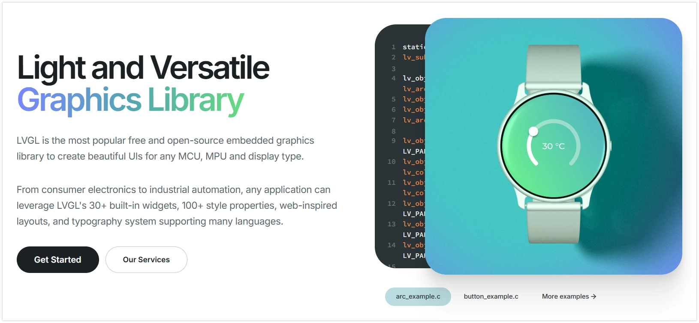

<!-- Image referencing -->
import ImgLVGLLogo from './images/12-LVGL-Logo.webp';
import ImgLVGLLayer from './images/12-LVGL-Layer.webp';
import ImgS3TouchLCD169 from './images/12-ESP32-S3-Touch-LCD-1.69-1.webp';

# LVGL Graphic Interface Development

[LVGL](https://lvgl.io/) (Light and Versatile Graphics Library) is an open-source embedded graphics library used to create graphical user interfaces (GUIs) on resource-constrained microcontrollers. It provides a rich set of widgets (such as buttons, labels, sliders, and charts), enabling developers to build interactive graphical interfaces efficiently. The library is written in C, offers high portability, and is optimized for low memory footprint and high performance. With its efficient performance and active community support, LVGL has become one of the popular choices for GUI development on the ESP32 platform.

[](https://lvgl.io/)

LVGL separates graphics processing logic from specific hardware operations through its Hardware Abstraction Layer (HAL). This means the LVGL library itself does not directly control any specific hardware (such as display driver chips or touch controllers).

<div style={{maxWidth:500, margin: '0 auto'}}> </div>

LVGL connects to hardware by registering driver functions. These driver functions form the bridge between LVGL and the specific hardware. LVGL calls these pre-registered functions when needed (e.g., to refresh the screen or read input), thereby indirectly controlling the hardware. This design grants LVGL good portability, allowing it to adapt to a wide variety of hardware platforms.

It mainly consists of the following three parts:

- **Display Driver Interface**

 This interface is used to send image data rendered by LVGL to the display device. You need to provide a display driver function. After LVGL renders part of the interface to its internal buffer, it calls this function. This function is responsible for transmitting this block of pixel data to the display controller via SPI or other bus protocols.

- **Input Device Driver Interface**

  This interface is used to report the state of input devices (such as touchscreens, physical buttons, encoders) to LVGL. Developers need to provide an input device driver function, which LVGL calls periodically. This function needs to read the hardware state and convert it into the format defined by LVGL, such as touch coordinates or key events.

- **System Tick Interface**

  LVGL's internal tasks, such as animations and event handling, rely on a stable time reference. Developers need to provide a function that returns the number of milliseconds elapsed since system startup. LVGL calls this function to track the passage of time and manage all time-related tasks.

:::info

<Details>

  <summary>The examples in this article are based on the Waveshare ESP32-S3 1.69inch Touch LCD Development Board (ESP32-S3-Touch-LCD-1.69)  </summary>
  
  [Waveshare ESP32-S3-Touch-LCD-1.69](https://www.waveshare.com/esp32-s3-touch-lcd-1.69.htm) features an onboard 1.69inch capacitive touch LCD screen, a six-axis sensor (three-axis accelerometer and three-axis gyroscope), RTC, and other peripherals. The screen uses the ST7789V2 display driver chip and the CST816T capacitive touch chip solution.
  
  <div style={{maxWidth:500}}> 
    <a href='https://www.waveshare.com/esp32-s3-touch-lcd-1.69.htm' target="_blank">
    
    </a>  
  </div>
  
</Details>
:::

## Configure LVGL Environment

Using LVGL on ESP32 typically involves two main steps: first, installing the LVGL core library and the necessary hardware driver libraries, and then configuring LVGL.

### Instal Libraries

The example in this tutorial is based on the [Waveshare ESP32-S3-Touch-LCD-1.69 Development Board](https://www.waveshare.com/esp32-s3-touch-lcd-1.69.htm). The display driver chip for this board is ST7789V2, and the touch chip is CST816T. The example code uses the `GFX Library for Arduino` library to drive the display and the `Arduino_DriveBus` library to drive the touch chip.

You can download the demo package for the ESP32-S3-Touch-LCD-1.69 development board from the [official link](https://files.waveshare.com/wiki/ESP32-S3-Touch-LCD-1.69/ESP32-S3-Touch-LCD-1.69_Demo.zip). The `Arduino\libraries` directory inside the package contains all the library files required for this tutorial.

| Library or File Name | Description | Version | Installation Method |
| :------------------: | :---------: | :-----: | :-----------------: |
|    Arduino_DriveBus     | CST816 Touch Chip Driver Library | v1.0.1 | Manual Installation |
| GFX Library for Arduino |  ST7789 Display Driver Graphics Library | v1.4.9 | Via Library Manager or Manual Installation |
|          lvgl           |     LVGL Graphics Library | v8.4.0 | Via Library Manager or Manual Installation |
| Mylibrary/pin_config.h  |   Development Board Pin Macro Definitions | — | Manual Installation |
|        lv_conf.h        |     LVGL Configuration File | — | Manual Installation |


:::warning Version Compatibility Description

There are strong dependencies between versions of LVGL and its driver libraries. For example, drivers written for LVGL v8 may not be compatible with LVGL v9. To ensure the tutorial examples can be reproduced stably, it is recommended to use the specific versions listed in the table above. Mixing libraries of different versions may cause compilation failures or runtime exceptions.
:::

**Installation steps:**

1. Unzip the downloaded [demo package](https://files.waveshare.com/wiki/ESP32-S3-Touch-LCD-1.69/ESP32-S3-Touch-LCD-1.69_Demo.zip).
2. Copy all folders (`Arduino_DriveBus`, `GFX_Library_for_Arduino`, etc.) from its `Arduino\libraries` directory to the Arduino library folder.

   :::info
   The path to the Arduino library folder is typically: `c:\Users\<username>\Documents\Arduino\libraries`.

   You can also locate it in Arduino IDE via **File > Preferences**, and check the "**Project Folder Location**". **The library folder is the `libraries` folder under this path.**
   :::

3. For other installation methods, please refer to: [Arduino Library Management Tutorial](./01-Arduino-IDE-Setup.md#ArduinoIDE-Install-Libraries).

### Modify LVGL Configuration File

After installation, you still need to configure LVGL. LVGL is configured through a file called `lv_conf.h`. All feature switches and key parameters for LVGL are centrally managed via this configuration file.

Generally, you need to follow these steps:

1. Navigate to the directory where the Arduino libraries are installed.
2. Enter the installed `lvgl` library directory, copy the file `lv_conf_template.h` and rename it to `lv_conf.h`. Then, move this file to the root directory of your Arduino library folder (e.g., `.../Arduino/libraries`), placing it at the same level as the `lvgl` folder.
3. Open `lv_conf.h` and change the first `#if 0` to `#if 1` to enable the file's contents.
4. Set the color depth for your display in `LV_COLOR_DEPTH`.

:::tip
For the examples in this section, you do not need to perform the above configuration steps manually.

To simplify the process, the official example package already provides a pre-optimized `lv_conf.h` file for the ESP32-S3-Touch-LCD-1.69 development board. You only need to copy this file from the example package to the root directory of your Arduino library folder.

For specific development boards, directly using the preset configuration files provided by the hardware manufacturer is an efficient and error-resistant adaptation method.
:::

## Example 1: Basic Display (Hello World)

This example demonstrates a minimal LVGL application that displays a line of text "Hello World!" on the screen, covering the basic initialization process for LVGL.

### Code

```cpp
#include <lvgl.h>
#include "Arduino_GFX_Library.h"
#include "lv_conf.h"
#include "pin_config.h"

#define EXAMPLE_LVGL_TICK_PERIOD_MS 2

static const uint16_t screenWidth = 240;
static const uint16_t screenHeight = 280;

static lv_disp_draw_buf_t draw_buf;
static lv_color_t buf[screenWidth * screenHeight / 10];

/* LCD - Display Hardware Interface Definitions */
Arduino_DataBus *bus = new Arduino_ESP32SPI(LCD_DC, LCD_CS, LCD_SCK, LCD_MOSI);

Arduino_GFX *gfx = new Arduino_ST7789(bus, LCD_RST /* RST */,
                                      0 /* rotation */, true /* IPS */, LCD_WIDTH, LCD_HEIGHT, 0, 20, 0, 0);

/* LVGL  Display Refresh Callback */
void my_disp_flush(lv_disp_drv_t *disp, const lv_area_t *area, lv_color_t *color_p) {
  uint32_t w = (area->x2 - area->x1 + 1);
  uint32_t h = (area->y2 - area->y1 + 1);

  gfx->draw16bitRGBBitmap(area->x1, area->y1, (uint16_t *)&color_p->full, w, h);

  lv_disp_flush_ready(disp);
}

/* LVGL Tick Increment Callback */
void example_increase_lvgl_tick(void *arg) {
  /* Inform LVGL of the elapsed milliseconds */
  lv_tick_inc(EXAMPLE_LVGL_TICK_PERIOD_MS);
}

void setup() {
  // 1. Hardware Initialization
  // It is recommended to group all initialization code directly related to physical hardware together.

  // Initialize the screen display
  gfx->begin();
  pinMode(LCD_BL, OUTPUT);
  digitalWrite(LCD_BL, HIGH);

  // 2. LVGL Core and Tick Initialization
  // This is the foundation for LVGL to run and should be completed as early as possible.
  lv_init();

  const esp_timer_create_args_t lvgl_tick_timer_args = {
    .callback = &example_increase_lvgl_tick,
    .name = "lvgl_tick"
  };
  esp_timer_handle_t lvgl_tick_timer = NULL;
  esp_timer_create(&lvgl_tick_timer_args, &lvgl_tick_timer);
  esp_timer_start_periodic(lvgl_tick_timer, EXAMPLE_LVGL_TICK_PERIOD_MS * 1000);

  // 3. LVGL Display Driver Initialization
  // Connect LVGL with the hardware driver

  // --- Initialize Display Driver ---
  lv_disp_draw_buf_init(&draw_buf, buf, NULL, screenWidth * screenHeight / 10);
  static lv_disp_drv_t disp_drv;
  lv_disp_drv_init(&disp_drv);
  disp_drv.hor_res = screenWidth;
  disp_drv.ver_res = screenHeight;
  disp_drv.flush_cb = my_disp_flush;
  disp_drv.draw_buf = &draw_buf;
  lv_disp_drv_register(&disp_drv);

  //highlight-start
  // 4. UI Creation and Style Application
  // This is the application layer, executed after all underlying layers are ready.

  // --- Style Definition Optimization ---
  // Defining all related style properties (font, color, etc.) within the same style object is more modular.
  static lv_style_t style_large_white_font;
  lv_style_init(&style_large_white_font);
  lv_style_set_text_font(&style_large_white_font, &lv_font_montserrat_24);
  lv_style_set_text_color(&style_large_white_font, lv_color_hex(0xffffff));

  // Set screen background color
  lv_obj_set_style_bg_color(lv_scr_act(), lv_color_hex(0x003a57), LV_PART_MAIN);

  // Create Label
  lv_obj_t *label = lv_label_create(lv_scr_act());
  lv_label_set_text(label, "Hello World!");
  lv_obj_align(label, LV_ALIGN_CENTER, 0, 0);

  // Apply the style containing all properties to the label at once
  lv_obj_add_style(label, &style_large_white_font, 0);
  //highlight-end
}

void loop() {
  lv_timer_handler(); /* let the GUI do its work */
  delay(5);
}
```

#### Code Analysis

- **Library Inclusion and Global Definitions**

  - `#include <lvgl.h>`: Includes the LVGL core library.
  - `#include "Arduino_GFX_Library.h"`: Includes the display driver library.
  - `#include "pin_config.h"`: Includes the pin definition file for the development board (ESP32-S3-Touch-LCD-1.69).
  - `draw_buf` and `buf`: Define the drawing buffer for LVGL. LVGL first renders graphical content into this memory area and then "flushes" it to the screen all at once to improve efficiency. The buffer size is set to one-tenth of the screen's pixel count, which is a common compromise between memory usage and performance.

- **Hardware Interface Instantiation**

  - `Arduino_DataBus *bus = ...`: Creates an SPI bus instance for communicating with the LCD display. The parameters are the SPI-related pins.
  - `Arduino_GFX *gfx = ...`: Creates an instance of the ST7789 display driver and associates it with the SPI bus created above. It encapsulates the low-level screen operation commands.

- **LVGL Callback Functions**

  - `my_disp_flush()`: This is the **core bridging function** connecting LVGL to the hardware display driver. When LVGL finishes rendering a small area, it calls this function and passes the rendered pixel data (`color_p`). Inside the function, `gfx->draw16bitRGBBitmap()` sends this data block to the specified location on the screen. Finally, `lv_disp_flush_ready()` informs LVGL that the data has been sent, and it can proceed to render the next part.
  - `example_increase_lvgl_tick()`: This is LVGL's **system tick (heartbeat) function**. It tells LVGL how many milliseconds have elapsed via `lv_tick_inc()`. This time reference is crucial for time-related tasks such as animations and cursor blinking.

- **`setup()` Function**

 The `setup()` function completes all initialization work in a logical order:

  1.  **Hardware Initialization**: Calls `gfx->begin()` to initialize the display controller and turns on the screen backlight.
  2.  **LVGL Core and Tick Initialization**: Calls `lv_init()` to initialize the LVGL library itself. Then, it creates a high-precision `esp_timer` to call `example_increase_lvgl_tick()` every `EXAMPLE_LVGL_TICK_PERIOD_MS` (2 milliseconds), providing a stable heartbeat for LVGL.
  3.  **LVGL Display Driver Initialization**: This is the process of registering the `my_disp_flush` callback function with LVGL. It tells LVGL: "When the screen needs to be refreshed, please call the  `my_disp_flush` function." It also configures the screen resolution and the drawing buffer.
  4.  **UI Creation**: After all underlying layers are ready, it starts building the user interface. The code first creates and configures a style (24-point font, white), then creates a label (`lv_label`), sets its text to "Hello World!", aligns it to the center, and applies the predefined style.

- **`loop()` Function**

  - `lv_timer_handler()`: This is LVGL's main processing function and must be called repeatedly in the `loop`. It is responsible for handling all pending tasks, such as redrawing the screen, executing animations, and responding to events.
  - `delay(5)`: Adds a brief delay, which can prevent the `loop` cycle from occupying all CPU resources, reserving processing time for other background tasks (such as Wi-Fi communication).

<!-- #### Running Results

【todo】Image -->

## Example 2: Interactive Example (Clickable Button)

This example builds upon the "Hello World" foundation by adding touch input functionality and creating a clickable button. Each time the button is clicked, the text on the button updates.

### Code

```cpp
#include <lvgl.h>
#include "Arduino_GFX_Library.h"
#include "Arduino_DriveBus_Library.h"
#include "lv_conf.h"
#include "pin_config.h"

#define EXAMPLE_LVGL_TICK_PERIOD_MS 2

static const uint16_t screenWidth = 240;
static const uint16_t screenHeight = 280;

static lv_disp_draw_buf_t draw_buf;
static lv_color_t buf[screenWidth * screenHeight / 10];

/* LCD - Display Hardware Interface Definitions */
Arduino_DataBus *bus = new Arduino_ESP32SPI(LCD_DC, LCD_CS, LCD_SCK, LCD_MOSI);

Arduino_GFX *gfx = new Arduino_ST7789(bus, LCD_RST /* RST */,
                                      0 /* rotation */, true /* IPS */, LCD_WIDTH, LCD_HEIGHT, 0, 20, 0, 0);

/* Touch - Touchscreen Hardware Interface Definitions */
std::shared_ptr<Arduino_IIC_DriveBus> IIC_Bus =
  std::make_shared<Arduino_HWIIC>(IIC_SDA, IIC_SCL, &Wire);

void Arduino_IIC_Touch_Interrupt(void);  // Function forward declaration

std::unique_ptr<Arduino_IIC> CST816T(new Arduino_CST816x(IIC_Bus, CST816T_DEVICE_ADDRESS,
                                                         TP_RST, TP_INT, Arduino_IIC_Touch_Interrupt));
// Touch Interrupt Service Function
void Arduino_IIC_Touch_Interrupt(void) {
  CST816T->IIC_Interrupt_Flag = true;
}

/* LVGL Display Refresh Callback */
void my_disp_flush(lv_disp_drv_t *disp, const lv_area_t *area, lv_color_t *color_p) {
  uint32_t w = (area->x2 - area->x1 + 1);
  uint32_t h = (area->y2 - area->y1 + 1);

  gfx->draw16bitRGBBitmap(area->x1, area->y1, (uint16_t *)&color_p->full, w, h);

  lv_disp_flush_ready(disp);
}

/* LVGL Touch Read Callback */
void my_touchpad_read(lv_indev_drv_t *indev_driver, lv_indev_data_t *data) {
  // Read coordinates from the touch chip
  int32_t touchX = CST816T->IIC_Read_Device_Value(CST816T->Arduino_IIC_Touch::Value_Information::TOUCH_COORDINATE_X);
  int32_t touchY = CST816T->IIC_Read_Device_Value(CST816T->Arduino_IIC_Touch::Value_Information::TOUCH_COORDINATE_Y);

  // Check the interrupt flag to determine if a new touch event has occurred
  if (CST816T->IIC_Interrupt_Flag == true) {
    CST816T->IIC_Interrupt_Flag = false;  // Clear the flag
    data->state = LV_INDEV_STATE_PR;      // State: Pressed

    /* Set coordinates after checking their validity */
    if (touchX >= 0 && touchY >= 0) {
      data->point.x = touchX;
      data->point.y = touchY;
    }
  } else {
    data->state = LV_INDEV_STATE_REL;  // State: Released
  }
}

/* LVGL Tick Increment Callback */
void example_increase_lvgl_tick(void *arg) {
  /* Inform LVGL of the elapsed milliseconds */
  lv_tick_inc(EXAMPLE_LVGL_TICK_PERIOD_MS);
}

//highlight-start
/* --- UI Interface Code --- */

// Button event callback function
static void btn_event_cb(lv_event_t *e) {
  lv_event_code_t code = lv_event_get_code(e);
  lv_obj_t *btn = lv_event_get_target(e);
  if (code == LV_EVENT_CLICKED) {
    static uint8_t cnt = 0;
    cnt++;

    /* Get the first child object of the button (i.e., the label) and modify its text */
    lv_obj_t *label = lv_obj_get_child(btn, 0);
    lv_label_set_text_fmt(label, "Clicked: %d", cnt);
  }
}

/*Create a button with a label that responds to click events (UI example)*/
void lv_example_get_started_1(void) {
  lv_obj_t *btn = lv_btn_create(lv_scr_act());                /* Create a button on the current screen */
  lv_obj_set_pos(btn, 70, 100);                               /* Set position */
  lv_obj_set_size(btn, 100, 50);                              /* Set size */
  lv_obj_add_event_cb(btn, btn_event_cb, LV_EVENT_ALL, NULL); /* Assign an event callback to the button */

  lv_obj_t *label = lv_label_create(btn); /* Create a label on the button */
  lv_label_set_text(label, "Click Me");   /* Set label text */
  lv_obj_center(label);                   /* Center the label */
}
//highlight-end

void setup() {
  // 1. Hardware Initialization
  // First, complete all initialization for direct communication with physical hardware (screen, touch, backlight, etc.).

  // Initialize screen display
  gfx->begin();
  pinMode(LCD_BL, OUTPUT);
  digitalWrite(LCD_BL, HIGH);  // Turn on backlight

  // Initialize touch controller
  while (CST816T->begin() == false) {
    delay(2000);  // If it fails, wait for a period and then retry
  }
  CST816T->IIC_Write_Device_State(CST816T->Arduino_IIC_Touch::Device::TOUCH_DEVICE_INTERRUPT_MODE,
                                  CST816T->Arduino_IIC_Touch::Device_Mode::TOUCH_DEVICE_INTERRUPT_PERIODIC);

  // 2. LVGL Core and Tick Initialization
  lv_init();

  const esp_timer_create_args_t lvgl_tick_timer_args = {
    .callback = &example_increase_lvgl_tick,
    .name = "lvgl_tick"
  };
  esp_timer_handle_t lvgl_tick_timer = NULL;
  esp_timer_create(&lvgl_tick_timer_args, &lvgl_tick_timer);
  esp_timer_start_periodic(lvgl_tick_timer, EXAMPLE_LVGL_TICK_PERIOD_MS * 1000);

  // 3. LVGL Driver Registration
  // Connect LVGL's logical operations with hardware callback functions

  // --- Initialize display driver ---
  lv_disp_draw_buf_init(&draw_buf, buf, NULL, screenWidth * screenHeight / 10);
  static lv_disp_drv_t disp_drv;
  lv_disp_drv_init(&disp_drv);
  disp_drv.hor_res = screenWidth;
  disp_drv.ver_res = screenHeight;
  disp_drv.flush_cb = my_disp_flush;
  disp_drv.draw_buf = &draw_buf;
  lv_disp_drv_register(&disp_drv);

  // --- Initialize input device (touch) driver ---
  static lv_indev_drv_t indev_drv;
  lv_indev_drv_init(&indev_drv);
  indev_drv.type = LV_INDEV_TYPE_POINTER;  // Type: pointer/touch
  indev_drv.read_cb = my_touchpad_read;    // Register read callback
  lv_indev_drv_register(&indev_drv);

  //highlight-start
  // 4. UI Creation & Application Initialization
  // After all underlying layers are ready, begin creating the graphical interface.

  // Set screen background color
  lv_obj_set_style_bg_color(lv_scr_act(), lv_color_hex(0x003a57), LV_PART_MAIN);

  // Call the UI creation function
  lv_example_get_started_1();
  //highlight-end
}

void loop() {
  lv_timer_handler(); /* Let the LVGL GUI handle its tasks (such as animations, events, etc.) */
  delay(5);
}
```

#### Code Analysis

This example builds upon Example 1 by adding touch interaction functionality. The core differences lie in the introduction of the touch driver and event handling.

- **Touch Hardware Interface Instantiation**

  - `std::shared_ptr<Arduino_IIC_DriveBus> IIC_Bus = ...`: Creates an I2C bus instance for communicating with the CST816T touch controller.
  - `std::unique_ptr<Arduino_IIC> CST816T = ...`: Creates a driver instance for the CST816T touch chip and associates it with the I2C bus.
  - `Arduino_IIC_Touch_Interrupt`: This is a touch interrupt callback function. When the touch chip detects a touch action, it triggers this function via an interrupt signal. Inside the function, the `IIC_Interrupt_Flag` is set to `true`.

- **LVGL Touch Read Callback**

  - `my_touchpad_read()`: This function is the **core bridge** connecting LVGL to the hardware touch driver. LVGL periodically calls this function to query the state of the input device.
  - Function Logic: It first checks the `IIC_Interrupt_Flag`. If it is `true` (indicating a new touch event), it reads the current X/Y coordinates from the touch chip and sets the state `data->state` to `LV_INDEV_STATE_PR` (pressed); otherwise, it sets the state to `LV_INDEV_STATE_REL` (released). LVGL uses the state and coordinates returned by this function to determine the user's touch operation.

- **UI Interface Code**

  - `btn_event_cb()`: This is an **event callback function** used to respond to button interaction events.
    - When the button is clicked (`LV_EVENT_CLICKED`), this function is triggered.
    - Inside the function, a static counter `cnt` increments.
    - `lv_obj_get_child(btn, 0)` retrieves the child object of the button (i.e., the label on the button), and then `lv_label_set_text_fmt` updates the label's text to display the new count value.
  - `lv_example_get_started_1()`: This is a packaged UI creation function.
    - `lv_obj_add_event_cb(btn, btn_event_cb, LV_EVENT_ALL, NULL)`: This is the key step. It **binds** the `btn` object to the `btn_event_cb` callback function. From then on, all events (`LV_EVENT_ALL`) occurring on `btn` will trigger the `btn_event_cb` function.

- **`setup()` Function**
  - **1. Hardware Initialization**: Added initialization for the touch controller `CST816T`.
  - **2. LVGL Driver Registration**: Compared to Example 1, after registering the display driver, **the initialization and registration of the input device driverthe initialization and registration of the input device driver** is added.
    - `lv_indev_drv_init()`: Initializes the input device driver structure.
    - `indev_drv.type = LV_INDEV_TYPE_POINTER`: Sets the device type to a pointer device (e.g., touchscreen, mouse).
    - `indev_drv.read_cb = my_touchpad_read`: Registers the `my_touchpad_read` callback function with LVGL. This tells LVGL: "When the touch state needs to be obtained, please call the `my_touchpad_read` function".
  - **3. UI Creation**: Call `lv_example_get_started_1()` to create the interactive button interface.

<!-- #### Running Results

【todo】Image -->

## Example 3: Minimal Functional Template

This example provides a minimal LVGL project template with integrated display and touch functionality for the ESP32-S3-Touch-LCD-1.69 development board. It integrates all the underlying code required for display and touch, forming a solid starting point for development. It can be used to quickly verify official LVGL examples or implement custom UI designs.

### Code

```cpp
#include <lvgl.h>
#include "Arduino_GFX_Library.h"
#include "Arduino_DriveBus_Library.h"
#include "lv_conf.h"
#include "pin_config.h"

#define EXAMPLE_LVGL_TICK_PERIOD_MS 2

static const uint16_t screenWidth = 240;
static const uint16_t screenHeight = 280;

static lv_disp_draw_buf_t draw_buf;
static lv_color_t buf[screenWidth * screenHeight / 10];

/* LCD - Display Hardware Interface Definitions */
Arduino_DataBus *bus = new Arduino_ESP32SPI(LCD_DC, LCD_CS, LCD_SCK, LCD_MOSI);

Arduino_GFX *gfx = new Arduino_ST7789(bus, LCD_RST /* RST */,
                                      0 /* rotation */, true /* IPS */, LCD_WIDTH, LCD_HEIGHT, 0, 20, 0, 0);

/* Touch - Touchscreen Hardware Interface Definitions */
std::shared_ptr<Arduino_IIC_DriveBus> IIC_Bus =
  std::make_shared<Arduino_HWIIC>(IIC_SDA, IIC_SCL, &Wire);

void Arduino_IIC_Touch_Interrupt(void); // Function forward declaration

std::unique_ptr<Arduino_IIC> CST816T(new Arduino_CST816x(IIC_Bus, CST816T_DEVICE_ADDRESS,
                                                         TP_RST, TP_INT, Arduino_IIC_Touch_Interrupt));
//Touch Interrupt Service Function
void Arduino_IIC_Touch_Interrupt(void) {
  CST816T->IIC_Interrupt_Flag = true;
}

/* LVGL Display Refresh Callback */
void my_disp_flush(lv_disp_drv_t *disp, const lv_area_t *area, lv_color_t *color_p) {
  uint32_t w = (area->x2 - area->x1 + 1);
  uint32_t h = (area->y2 - area->y1 + 1);

  gfx->draw16bitRGBBitmap(area->x1, area->y1, (uint16_t *)&color_p->full, w, h);

  lv_disp_flush_ready(disp);
}

/* LVGL Touch Read Callback */
void my_touchpad_read(lv_indev_drv_t *indev_driver, lv_indev_data_t *data) {
  // Read coordinates from the touch chip
  int32_t touchX = CST816T->IIC_Read_Device_Value(CST816T->Arduino_IIC_Touch::Value_Information::TOUCH_COORDINATE_X);
  int32_t touchY = CST816T->IIC_Read_Device_Value(CST816T->Arduino_IIC_Touch::Value_Information::TOUCH_COORDINATE_Y);

  // Check the interrupt flag to determine if a new touch event has occurred
  if (CST816T->IIC_Interrupt_Flag == true) {
    CST816T->IIC_Interrupt_Flag = false; // Clear the flag
    data->state = LV_INDEV_STATE_PR; // State: Pressed

    /* Set coordinates after checking their validity */
    if (touchX >= 0 && touchY >= 0) {
      data->point.x = touchX;
      data->point.y = touchY;
    }
  } else {
    data->state = LV_INDEV_STATE_REL; // State: Released
  }
}

/* LVGL Tick Increment Callback */
void example_increase_lvgl_tick(void *arg) {
  /* Inform LVGL of the elapsed milliseconds */
  lv_tick_inc(EXAMPLE_LVGL_TICK_PERIOD_MS);
}

// highlight-start
/* --- UI Interface Code --- */

// https://docs.lvgl.io/8.4/examples.html
// Place the example code functions here
// highlight-end

void setup() {
  // 1. Hardware Initialization
  // First, complete all initialization for direct communication with physical hardware (screen, touch, backlight, etc.).

  // Initialize screen display
  gfx->begin();
  pinMode(LCD_BL, OUTPUT);
  digitalWrite(LCD_BL, HIGH); // Turn on the backlight

  // Initialize touch controller
  while (CST816T->begin() == false) {
    delay(2000); // If it fails, wait for a period and then retry
  }
  CST816T->IIC_Write_Device_State(CST816T->Arduino_IIC_Touch::Device::TOUCH_DEVICE_INTERRUPT_MODE,
                                  CST816T->Arduino_IIC_Touch::Device_Mode::TOUCH_DEVICE_INTERRUPT_PERIODIC);

  // 2. LVGL Core and Tick Initialization
  lv_init();

  const esp_timer_create_args_t lvgl_tick_timer_args = {
    .callback = &example_increase_lvgl_tick,
    .name = "lvgl_tick"
  };
  esp_timer_handle_t lvgl_tick_timer = NULL;
  esp_timer_create(&lvgl_tick_timer_args, &lvgl_tick_timer);
  esp_timer_start_periodic(lvgl_tick_timer, EXAMPLE_LVGL_TICK_PERIOD_MS * 1000);

  // 3. LVGL Driver Registration
  // Connect LVGL's logical operations with hardware callback functions

  // --- Initialize display driver ---
  lv_disp_draw_buf_init(&draw_buf, buf, NULL, screenWidth * screenHeight / 10);
  static lv_disp_drv_t disp_drv;
  lv_disp_drv_init(&disp_drv);
  disp_drv.hor_res = screenWidth;
  disp_drv.ver_res = screenHeight;
  disp_drv.flush_cb = my_disp_flush;
  disp_drv.draw_buf = &draw_buf;
  lv_disp_drv_register(&disp_drv);

  // --- Initialize input device (touch) driver ---
  static lv_indev_drv_t indev_drv;
  lv_indev_drv_init(&indev_drv);
  indev_drv.type = LV_INDEV_TYPE_POINTER; // Type: pointer/touch
  indev_drv.read_cb = my_touchpad_read;   // Register read callback
  lv_indev_drv_register(&indev_drv);

  // highlight-start
  // 4. UI Creation & Application Initialization
  // After all underlying layers are ready, begin creating the graphical interface.

  // Call the UI creation function
  // lv_example_xxx();
  // highlight-end
}

void loop() {
  lv_timer_handler(); /* Let the LVGL GUI handle its tasks (such as animations, events, etc.) */
  delay(5);
}
```

#### Code Analysis

This example provides a fully functional LVGL project template for the ESP32-S3-Touch-LCD-1.69 development board. It comes pre-configured with all necessary hardware initialization and driver registration logic, forming the foundational environment for LVGL to run.

- **Using as a Template**
  - The primary value of this code lies in its **reusability**. For any new project using the same hardware (ESP32-S3-Touch-LCD-1.69), you can directly copy this template.
  - **Development Workflow**:
    :::info
    This example is based on LVGL v8.4.0. You can directly use [LVGL8.4 Official Demos](https://docs.lvgl.io/8.4/examples.html).
    :::
    1. Write or paste your new UI creation function (for example, an example from the LVGL official documentation) in the `/* --- UI Interface Code --- */` section.
    2. At the end of the `setup()` function, call the UI creation function you just added (e.g., `lv_example_roller_1();`).

<!-- #### Running Results

【todo】Image -->

## Related Links

- [LVGL Official Documentation: Arduino Integration Guide](https://docs.lvgl.io/master/integration/frameworks/arduino.html)
- [LVGL Official Documentation: Getting Started Guide](https://docs.lvgl.io/master/intro/getting_started/index.html)
- [LVGL Official Documentation: Connecting LVGL to Hardware](https://docs.lvgl.io/master/integration/overview/connecting_lvgl.html)
- [Waveshare ESP32-S3-Touch-LCD-1.69 Wiki: Demos](https://www.waveshare.com/wiki/ESP32-S3-Touch-LCD-1.69#Demos)
