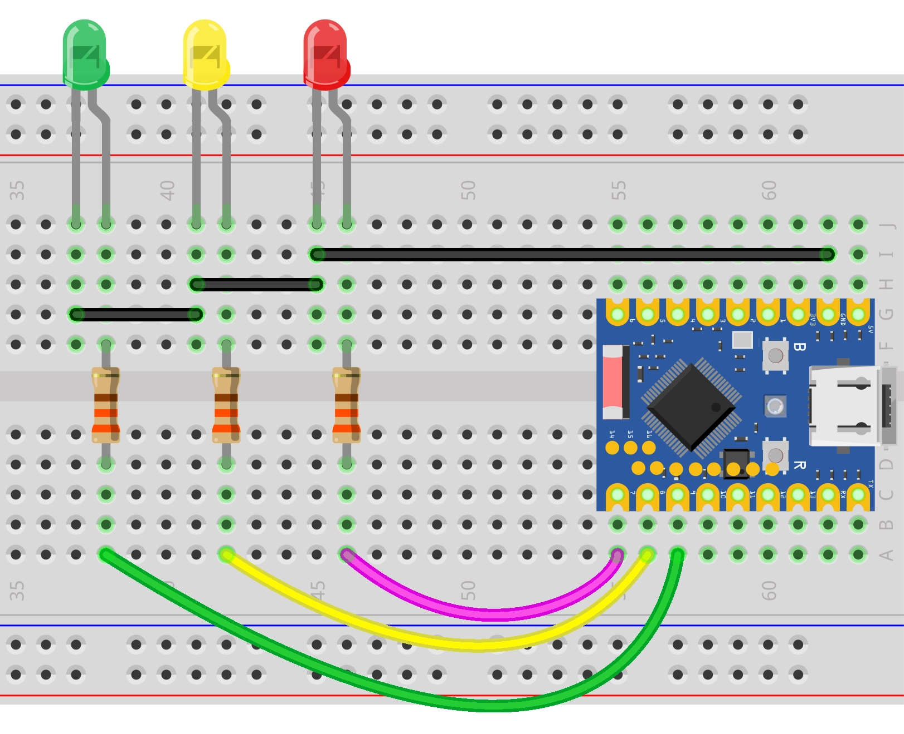

<!--Image Reference -->


:::tip[Important Note on Board Compatibility]
The core logic of this tutorial applies to all ESP32 development boards. However, all operational steps are explained using the [**Waveshare ESP32-S3-Zero Mini Development Board**](https://www.waveshare.com/esp32-s3-zero.htm) as an example. If you are using a different model of development board, please modify the relevant settings according to your actual situation.
:::

## Project Introduction

This project demonstrates a simulation of a traffic light. It controls three LED lights connected to the GPIO pins of an ESP32 to simulate the switching sequence of red, yellow, and green traffic lights.

## Hardware Connection

The components required are:
- LED \* 3
- 330Ω resistor \* 3
- Breadboard \* 1
- Wire
- ESP32 development board

Connect the circuit according to the wiring diagram below:

<Details>
  <summary>ESP32-S3-Zero Pinout Diagram</summary>


</Details>

<div style={{maxWidth:500}}> </div>

## Code Implementation

```c
/*
  Traffic Light Simulation

   Simulates a traffic light system with red, green, and blinking yellow lights.
  The current state is printed to the serial monitor.

  Circuit Connection:
  - Red LED connected to pin 7
  - Yellow LED connected to pin 8
  - Green LED connected to pin 9

  Wulu (Waveshare Team)
*/

// Pin Definitions
const int redPin = 7;
const int yellowPin = 8;
const int greenPin = 9;

// Timing Definitions (unit: milliseconds)
const unsigned long redDuration = 10000;    // Red light duration
const unsigned long greenDuration = 8000;   // Green light duration
const unsigned long yellowDuration = 3000;  // Total yellow light duration
const unsigned long blinkInterval = 500;    // Blink interval

void setup() {
  // Initialize serial communication
  Serial.begin(115200);

  Serial.println("Traffic light simulation program started...");
  Serial.print("Current configuration: Red=");
  Serial.print(redDuration / 1000);
  Serial.print("s, Green=");
  Serial.print(greenDuration / 1000);
  Serial.print("s, Yellow=");
  Serial.println(yellowDuration / 1000);

  // Configure LED pins as output mode
  pinMode(redPin, OUTPUT);
  pinMode(yellowPin, OUTPUT);
  pinMode(greenPin, OUTPUT);
}

// Helper function: Turn off all lights
void allLightsOff() {
  digitalWrite(redPin, LOW);
  digitalWrite(yellowPin, LOW);
  digitalWrite(greenPin, LOW);
}

void loop() {
  // ---Green Light Phase ---
  Serial.println("Status: Green Light ON");
  allLightsOff();                // Make sure to start with a clean state
  digitalWrite(greenPin, HIGH);
  delay(greenDuration);

  // --- Yellow Blinking Phase ---
  Serial.println("Status: Yellow Light Blinking");
  digitalWrite(greenPin, LOW);

  // Calculate the number of blinks
  // A complete cycle consists of "on" and "off" and lasts for blinkInterval * 2
  int numBlinks = yellowDuration / (blinkInterval * 2);

  // Ensure at least one blink even if the duration is very short
  if (numBlinks == 0) {
    numBlinks = 1;
  }

  for (int i = 0; i < numBlinks; i++) {
    digitalWrite(yellowPin, HIGH);
    delay(blinkInterval);
    digitalWrite(yellowPin, LOW);
    delay(blinkInterval);
  }

  // --- Red Light Phase ---
  Serial.println("Status: Red Light ON");
  // Yellow and green lights are already off, directly turn on the red light
  digitalWrite(redPin, HIGH);
  delay(redDuration);
}
```

## Code Analysis

- **Constant Definitions**: 
  - `redPin`, `yellowPin`, `greenPin`: Defines the GPIO pin numbers connected to the LEDs.
  - `redDuration`, `greenDuration`, `yellowDuration`: Defines the duration each light stays on (unit: milliseconds).。
  - `blinkInterval`: Defines the interval time for the yellow light blinking.

- **Initialization (`setup`)**:
  - `Serial.begin(115200)`: Initializes serial communication with a baud rate of 115200, used to view the program status in the serial monitor.
  - `pinMode(pin, OUTPUT)`: Configures the pins connected to the LEDs as output mode to control the LED state (ON/OFF).

- **Helper Function (`allLightsOff`)**:
  - This is a custom function used to set all LED pins to `LOW`, turning off all lights. This helps ensure that no lights remain on before switching states.

- **Main Loop (`loop`)**:
  - **Green Light Phase**: First, call `allLightsOff()` to turn off all lights, then turn on the green light (`digitalWrite(greenPin, HIGH)`)  and hold for `greenDuration` milliseconds.
  - **Yellow Blinking Phase**: 
    - Turn off the green light.
    - Calculate the number of blinks: `numBlinks = yellowDuration / (blinkInterval * 2)`.
    - Use a `for` loop to control the yellow light alternating between ON and OFF (`HIGH` -> `delay` -> `LOW` -> `delay`).
  - **Red Light Phase**: Turn on the red light (`digitalWrite(redPin, HIGH)`) and hold for `redDuration` milliseconds.

## Reference Link

- [Section 3 GPIO Digital Output/Input](./03-Digital-IO.md)