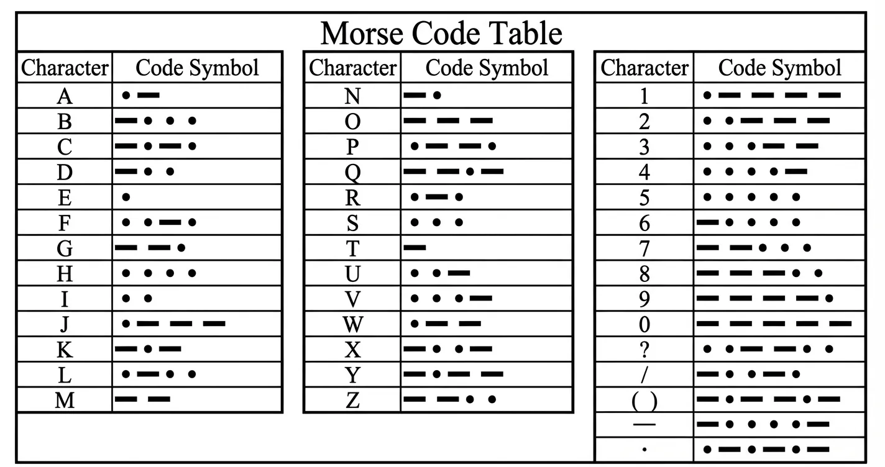

<!-- Image Reference -->

import ImgSOSDiagram from './images/13-2-SOS_bb.webp';

:::tip[Important Note on Board Compatibility]
The core logic of this tutorial applies to all ESP32 development boards. However, all operational steps are explained using the [**Waveshare ESP32-S3-Zero Mini Development Board**](https://www.waveshare.com/esp32-s3-zero.htm) as an example. If you are using a different model of development board, please modify the relevant settings according to your actual situation.
:::

## Project Introduction

This project demonstrates a simulation of an SOS signal. It controls an LED and a buzzer via the GPIO pins of an ESP32 to simulate the SOS signal in Morse code.

## Morse Code

First, let's understand the rules of [Morse Code](https://en.wikipedia.org/wiki/Morse_code). Morse code expresses different letters, numbers, and punctuation marks by arranging basic signals in different sequences. It primarily consists of two fundamental signals:

- **Dot**: A short signal, denoted as `.`
- **Dash**: A long signal, denoted as `-`



This project simulates the internationally recognized distress signal **SOS**. Its encoding rules are as follows:

- **S**: Composed of 3 dots, i.e., `...`
- **O**: Composed of 3 dashes, i.e., `---`

Therefore, the entire transmission sequence for the SOS signal is: `... --- ...`.

**Timing Definitions**:

Understanding the character composition is not enough; we also need to strictly adhere to the international standard timing ratios, which dictates the numerical relationships of the variables in our code:

- **Base Unit**: We define the duration of a "dot" as 1 time unit (1t).
- **Dash Length**: Is 3 times the length of a dot (3t).
- **Interval Timing**:
  - **Intra-character Gap**: The pause between dots and dashes within the same letter is 1t.
  - **Inter-letter Gap**: The pause between letters is 3t.
  - **Inter-word Gap**: The pause between words (or SOS sequences) is 7t.

## Hardware Connection

The components required are:

- LED \* 1
- 330Ω resistor \* 3
- Active buzzer \* 1
- Breadboard \* 1
- Wire
- ESP32 development board

Connect the circuit according to the wiring diagram below:

<Details>
  <summary>ESP32-S3-Zero Pinout Diagram</summary>


</Details>

<div style={{maxWidth:500}}> </div>

## Code Implementation

```cpp
/*
  SOS Signal

  Simulates an SOS signal using an LED and a buzzer.

  Hardware:
  - LED connected to pin 7
  - Buzzer connected to pin 8

  Wulu (Waveshare Team)
*/

// Define pins for LED and Buzzer
const int ledPin = 7;
const int buzzerPin = 8;

// --- Morse Code Timing Definitions (unit: milliseconds) ---
const int dotDuration = 200;                 // "Dot" duration (1t)
const int dashDuration = dotDuration * 3;    // "Dash" duration (3t)
const int interElementGap = dotDuration;     // Gap between elements of a letter (1t)
const int interLetterGap = dotDuration * 3;  // Gap between letters (3t)
const int interWordGap = dotDuration * 7;    //  Gap between SOS sequences (7t)

// Function Declarations
void signalOn();
void signalOff();
void dot();
void dash();
void letterS();
void letterO();
void playSOS();

void setup() {
  // Initialize serial communication
  Serial.begin(115200);
  Serial.println("Program started, preparing to transmit SOS signal...");

  // Configure pins as OUTPUT
  pinMode(ledPin, OUTPUT);
  pinMode(buzzerPin, OUTPUT);

  // Ensure devices are initially off
  signalOff();
  delay(2000);  // Wait 2 seconds before starting
}

void loop() {
  playSOS();

  // After a complete SOS sequence, wait for the inter-word gap
  Serial.print("Waiting ");
  Serial.print(interWordGap);
  Serial.println(" milliseconds before repeating...\n");
  delay(interWordGap);
}

// --- Core Function Definitions ---

// Turn on both LED and Buzzer simultaneously
void signalOn() {
  digitalWrite(ledPin, HIGH);
  digitalWrite(buzzerPin, HIGH);
}

// Turn off both LED and Buzzer simultaneously
void signalOff() {
  digitalWrite(ledPin, LOW);
  digitalWrite(buzzerPin, LOW);
}

// Transmit a "dot" signal
void dot() {
  signalOn();
  delay(dotDuration);
  signalOff();
}

// Transmit a "dash" signal
void dash() {
  signalOn();
  delay(dashDuration);
  signalOff();
}

// Transmit the letter 'S' (...): three dots
void letterS() {
  Serial.print(".");
  dot();
  delay(interElementGap);
  Serial.print(".");
  dot();
  delay(interElementGap);
  Serial.print(".");
  dot();
}

// Transmit the letter 'O' (---): three dashes
void letterO() {
  Serial.print("-");
  dash();
  delay(interElementGap);
  Serial.print("-");
  dash();
  delay(interElementGap);
  Serial.print("-");
  dash();
}

// Play the complete SOS sequence
void playSOS() {
  Serial.print("Transmitting S: ");
  letterS();
  Serial.print(" | ");
  delay(interLetterGap);

  Serial.print("Transmitting O: ");
  letterO();
  Serial.print(" | ");
  delay(interLetterGap);

  Serial.print("Transmitting S: ");
  letterS();
  Serial.println();
  Serial.println("SOS sequence transmission complete.");
}
```

## Code Analysis

- **Pin Definitions**: Uses `const int` to define the pin numbers for the LED and the buzzer, making management and modification convenient.

  ```cpp
  const int ledPin = 7;
  const int buzzerPin = 8;
  ```

- **Morse Code Timing Definitions**: Defines the base time unit `dotDuration` (dot). All other time intervals (dash, gaps) are calculated based on this. Note that the unit for the Arduino `delay()` function is milliseconds, so all time units here are in milliseconds.

  ```cpp
  const int dotDuration = 200;                 // Duration of a "dot" (1t)
  const int dashDuration = dotDuration * 3;    // Duration of a "dash" (3t)
  const int interElementGap = dotDuration;     // Gap between signals within the same letter (1t)
  const int interLetterGap = dotDuration * 3;  // Gap between letters (3t)
  const int interWordGap = dotDuration * 7;    // Gap between SOS sequences (7t)
  ```

- **Initialization (`setup`)**: 

  - `Serial.begin(115200)`: Initializes serial communication for printing debug information to the serial monitor.
  - `pinMode(pin, OUTPUT)`: Configures the LED and buzzer pins as OUTPUT mode.
  - `signalOff()`: Ensures the devices are in the OFF state when the program starts.

- **Main Loop (`loop`)**: 

  - `playSOS()`: Calls the function to play the complete SOS signal.
  - `delay(interWordGap)`: Waits for the specified interval after each SOS sequence before repeating.

- **Basic Control Functions**: 

  - `signalOn()` / `signalOff()`: Encapsulates the `digitalWrite` operation to control the HIGH/LOW level of both the LED and buzzer simultaneously.

    The **active buzzer** used in this project has the characteristic of **sounding whenever it is powered (GPIO outputs HIGH)** and stopping when power is cut (GPIO outputs LOW).
  - `dot()` / `dash()`: Implement the signal logic for a "dot" and a "dash" respectively, controlling the duration of light/sound.

- **Letter Functions**: `letterS()` and `letterO()` combine calls to `dot()` and `dash()` to form the corresponding letters and handle the small gaps (`interElementGap`) between signals within the letter.

- **Play Function**: `playSOS()` calls the letter functions in the S-O-S order and inserts the longer gap (`interLetterGap`) between letters.

## Reference Link

- [Section 3 GPIO Digital Output/Input](./03-Digital-IO.md)
