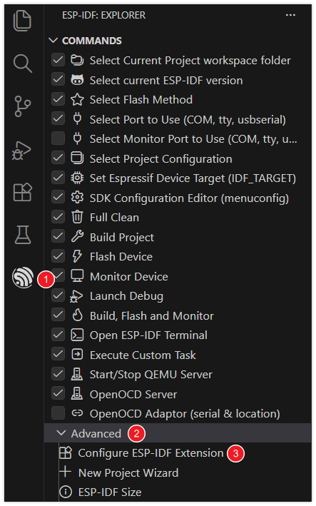
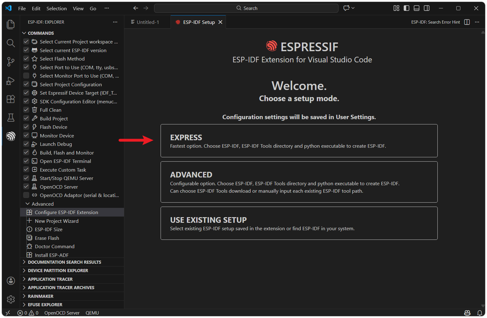
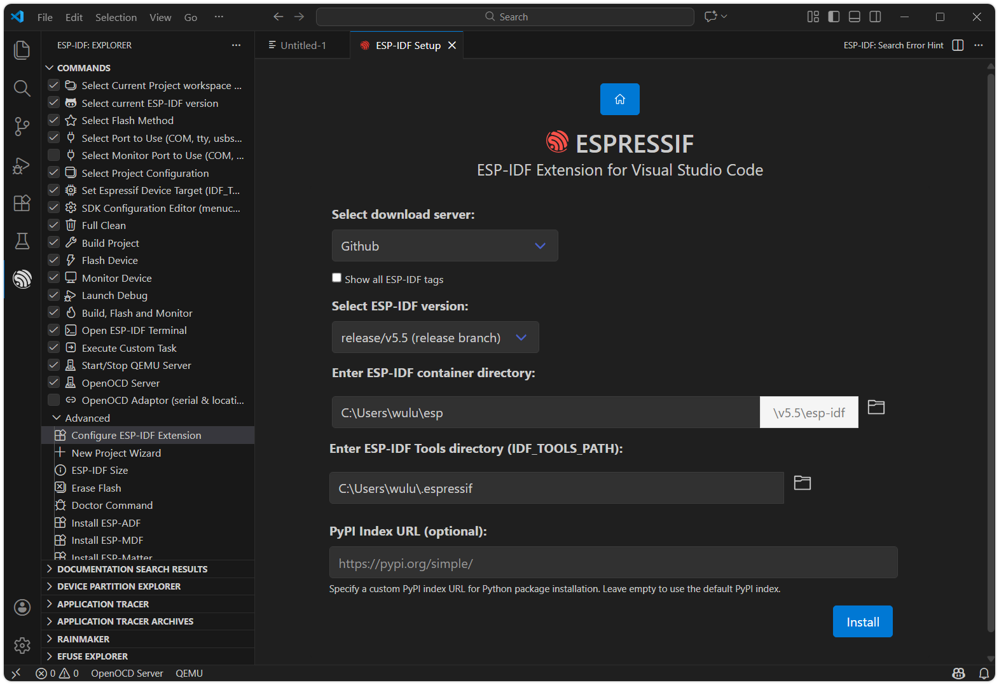
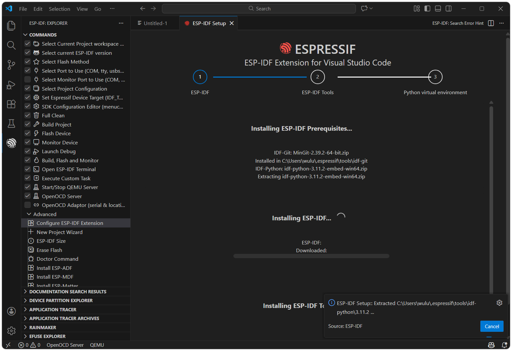

> This section introduces the basic concepts of ESP-IDF and demonstrates how to set up the development environment for the official ESP32 development framework (ESP-IDF) in VS Code, laying the foundation for subsequent project development.

## 1. What is ESP-IDF?

ESP-IDF (Espressif IoT Development Framework) is the official IoT development framework released by Espressif. It is the official development framework for ESP32, ESP32-S, ESP32-C, ESP32-H, and ESP32-P series chips.

Based on the C/C++ language, it provides a complete software development toolchain, including compilers, debuggers, and flashing tools, enabling developers to fully leverage the powerful capabilities of the ESP32 series chips.

Official repository: https://github.com/espressif/esp-idf

## 2. Why Choose ESP-IDF?

Many developers start with ESP32 through platforms like Arduino or MicroPython, which are excellent for rapid prototyping and simple projects. However, when developing more complex, stable, and high-performance commercial-grade products, ESP-IDF is the professional developer's first choice. It provides deeper hardware control, superior performance, and production-ready features such as secure boot and OTA firmware updates.

**Core Advantages of ESP-IDF**:

- **Official Priority Support**: As Espressif's core official development framework, ESP-IDF has the highest priority for maintenance and adaptation. New chips, features, and standards (such as Matter) are typically implemented first in ESP-IDF, allowing developers to experience and apply the latest technologies as soon as possible.
- **Built-in FreeRTOS Real-Time Operating System**: ESP-IDF integrates the FreeRTOS kernel, supporting multi-tasking concurrency and real-time scheduling. Developers can easily create multiple independent tasks (e.g., Wi-Fi connection, sensor data collection, UI refresh) to implement complex IoT applications.
- **Strong Low-Level Control and Comprehensive Features**: ESP-IDF provides comprehensive access to hardware resources and low-level APIs, making it suitable for developers who need advanced features, low-level optimization, and complex projects. Compared to approaches like Arduino, developers can flexibly configure system parameters, optimize performance, and implement more sophisticated functionalities.
- **High Performance and Component-Based Architecture**: ESP-IDF supports organizing code in "components." Developers can use the ESP Registry component management platform to conveniently search for, integrate, and maintain third-party or official components, improving development efficiency and project maintainability.
- **Suitable for Mass Production and Commercial Product Development**: ESP-IDF supports OTA updates, secure boot, Flash encryption, partition management, and other features, facilitating mass production deployment and later maintenance of products, meeting the high requirements for security and maintainability in commercial products.

## 3. Installing the ESP-IDF Development Environment{#setup-esp-idf}

There are several primary methods for developing with ESP-IDF for ESP32:

- **ESP-IDF Command-Line Tools**: Use the official [installer](https://docs.espressif.com/projects/esp-idf/en/stable/esp32/get-started/windows-setup.html#esp-idf) or scripts to set up the command-line environment, then use the `idf.py` tool for project configuration, compilation, flashing, and monitoring. Code can be written using any text editor.
- **Eclipse Plugin (Espressif-IDE)**: An integrated development environment based on Eclipse CDT, built-in with ESP-IDF toolchain and plugins. It supports one-stop development experience including project creation, compilation, flashing, debugging, and monitoring. Suitable for users with some embedded development experience who are accustomed to using Eclipse.
- **VS Code Extension**: Install the official Espressif ESP-IDF extension in the Visual Studio Code editor. It integrates environment installation, project management, compilation, flashing, monitoring, debugging, and all other functions. Supports one-click configuration of ESP-IDF and related toolchains.

:::info
We recommend using **VS Code + ESP-IDF Extension**, which is currently the most mainstream and beginner-friendly method. For offline installation, please refer to **[this tutorial](./appendix/Offline-Installation.md)**.
:::

:::note
The following environment settings are applicable to Windows 10/11 systems. For Mac/Linux users, please refer to the **[official guide](https://docs.espressif.com/projects/esp-idf/en/latest/esp32/get-started/index.html)**.
:::

### 3.1 Install Visual Studio Code

1. Download and install [Visual Studio Code](https://code.visualstudio.com/).

2. During installation, it is recommended to check the option "Add 'Open with Code' action to Windows Explorer file context menu”.

### 3.2 Install the ESP-IDF Extension

1. In VS Code, open the **Extensions** view by clicking the  in the VS Code sidebar's activity bar (or use the shortcut <kbd>Ctrl</kbd> + <kbd>Shift</kbd> + <kbd>X</kbd>).

2. Then, search for the [ESP-IDF](https://marketplace.visualstudio.com/items?itemName=espressif.esp-idf-extension) extension and install it.

   

### 3.3 Run the Quick Configuration Wizard

1. After installing the extension, the  icon will appear in the left activity bar of VS Code. Click this icon to view the basic command list of the ESP-IDF extension. Under **Advanced**, select **Configure ESP-IDF Extension**.

   

2. Choose "**Express**" to enter the quick configuration mode:

   

3. Modify the following options as needed.

   

   - **Select download server**:
     - Espressif: For users in China, use Espressif's China server for faster downloads.
     - Github: Use the official GitHub release link.
   - **ESP-IDF Version**: Typically, select the version required by the development board. If no specific requirement, it's recommended to use the latest stable version. For this tutorial, it is recommended that the Espressif IDF version be ≥ v5.5.
   - **ESP-IDF Repository Installation Path**: It is recommended to use the default path or use a path in pure English without spaces.
   - **ESP-IDF Tools Installation Path**: It is recommended to use the default path or use a path in pure English without spaces.
     :::warning
     Note that the **ESP-IDF Repository Installation Path** and the **ESP-IDF Tools Installation Path** **must not** be the same directory.
     :::

4. Click **Install** to start the installation. You will see a page displaying the installation progress, including the progress status of ESP-IDF download, ESP-IDF tool download and installation, as well as the creation of the Python virtual environment.

   

5. If installed correctly, you will see a prompt indicating that all settings have been configured successfully, and you can start using the extension.

   

   :::warning
   If ESP-IDF installation fails or needs to be reinstalled, you can try deleting the `C:\Users\%Username%\esp` and `C:\Users\%Username%\.espressif` folders and then retry.
   
   If reinstallation still fails, please refer to **[this tutorial](./appendix/Offline-Installation.md)** for offline installation.
   :::

## 4. VS Code ESP-IDF Extension Interface Overview{#VsCode-ESP-IDF-ToolBar}

After opening an ESP-IDF project, when the ESP-IDF extension finishes loading, a toolbar will be displayed at the bottom, as shown in the figure:

- **① ESP-IDF Version**: Displays and switches the ESP-IDF version used by the current project. When a project requires a specific version, it can be switched via this feature.
- **② Select Flash Method**: Selects the flashing method for the project flashing command, options include DFU, JTAG, or UART interfaces.
- **③ Select Port to Use**: Selects the serial port used for ESP-IDF tasks (e.g., flashing or monitoring the device).
- **④ Set Espressif Device Target**: This command sets the target (IDF_TARGET) for the current project, equivalent to `idf.py set-target`. Select the corresponding chip model here.
- **⑤ SDK Configuration Editor**: Launches a UI interface for ESP-IDF project settings. This command is equivalent to `idf.py menuconfig`.
- **⑥ Full Clean**: Deletes the build directory of the current ESP-IDF project.
- **⑦ Build Project**: Uses `CMake` and `Ninja-build` to build the project.
- **⑧ Flash Project**: Flashes the binary file generated by the current project to the target device.
- **⑨ Monitor Device**: Starts serial communication between the computer and the Espressif device. Equivalent to `idf.py monitor`.
- **⑩ Debug**: Starts the debugger.
- **⑪ Build, Flash, and Monitor**: Used to build the project, write the binary program to the device, and start the monitor terminal. Similar to `idf.py build flash monitor`.
- **⑫ Open ESP-IDF Terminal**: Opens a terminal and activates the IDF_PATH and Python virtual environment.

## 5. Install C/C++ Language Extension

For code navigation and C/C++ syntax highlighting, it is recommended to use the [Microsoft C/C++ Extension](https://marketplace.visualstudio.com/items?itemName=ms-vscode.cpptools).

1. In VS Code, open the **Extensions** view by clicking the  in the VS Code sidebar's activity bar (or use the shortcut <kbd>Ctrl</kbd> + <kbd>Shift</kbd> + <kbd>X</kbd>).

2. Then, search for the [C/C++ Extension Pack](https://marketplace.visualstudio.com/items?itemName=ms-vscode.cpptools-extension-pack) extension and install it.

   

## 6. Appendix: Core Toolchain Overview

The ESP-IDF development process is supported by a series of tools. Here is a brief introduction to give you a preliminary impression:

- **`idf.py`**

  The top-level command-line tool for ESP-IDF. It provides developers with a unified and convenient interface, encapsulating the underlying build system (CMake), compilation tool (Ninja), flashing tool (esptool.py), and debugging tools.

  Preview of common commands:

  - Create a new project: `idf.py create-project <project name>`
  - Select target chip: `idf.py set-target <target>`
  - Start the graphical configuration tool: `idf.py menuconfig`
  - Build the project: `idf.py build`
  - Flash the project: `idf.py flash`

- **Kconfig / menuconfig**

  A component configuration system originating from the Linux kernel. ESP-IDF uses the Kconfig mechanism to manage the numerous configurable options in a project. By running the `idf.py menuconfig` command, developers can launch a text-based user interface (TUI) to enable or disable specific components, configure network parameters, adjust log levels, etc. All configuration items are ultimately saved in the `sdkconfig` file in the project root directory and provided to the source code in the form of macro definitions during compilation.

- **[CMake](https://cmake.org/)**

  An open-source, cross-platform automated build system. In ESP-IDF, it is responsible for parsing the `CMakeLists.txt` files in the project, managing source code, component dependencies, compiler options, and linker scripts, and finally generating the build instructions required by specific build tools (like Ninja).

- **[Ninja](https://ninja-build.org/)**

  A small build system focused on speed. In ESP-IDF, after CMake generates the build rules during the configuration phase, Ninja is used by default to execute these rules efficiently. Ninja's main advantage is its extremely fast incremental build speed. It can precisely determine which files have changed since the last compilation and only recompile those files, significantly reducing compilation time during the development cycle.

- **[esptool.py](https://github.com/espressif/esptool/#readme)**

  A Python tool for communicating with Espressif chip ROM Bootloaders. Its core functions include: flashing compiled firmware binary files (`.bin`) to the chip's Flash, reading chip information (such as MAC addresses), erasing Flash, and performing other low-level Flash read/write operations. The `idf.py flash` command internally calls `esptool.py` to accomplish the actual flashing task.

## 7. Reference Links

- [ESP-IDF Programming Guide](https://docs.espressif.com/projects/esp-idf/en/release-v5.5/esp32s3/get-started/index.html)
- [ESP-IDF VSCode Extension Documentation](https://docs.espressif.com/projects/vscode-esp-idf-extension/en/latest/index.html)
- [ESP Techpedia](https://docs.espressif.com/projects/esp-techpedia/en/latest/index.html)
- [ESP DevCon23 Beginner's Guide: Key Concepts and Resources](https://www.bilibili.com/video/BV1114y1r7du/)
