import Tabs from '@theme/Tabs';
import TabItem from '@theme/TabItem';

:::tip[Important: About board compatibility]
The core logic of this tutorial applies to all ESP32 boards, but all the operation steps are explained using the example of the [**Waveshare ESP32-S3-Zero mini development board**](https://www.waveshare.com/esp32-s3-zero.htm). If you are using a development board of another model, please modify the corresponding settings according to the actual situation.
:::

:::info
Before following this guide, you need to install the ESP-IDF extension on VS Code and configure your development environment. If you haven't completed it yet, please follow the installation guide below:

- [**ESP-IDF Getting Started - Section 1 Environment Setup**](./01-Setup.md)

:::

> This section will help you familiarize yourself with the ESP-IDF project structure and demonstrate the complete development process of configuring, building, flashing, and monitoring in Visual Studio Code (VS Code) based on the official "Hello World" and "Blink" examples from ESP-IDF.

## 1. Hello World Example

Let's start with "Hello World" example. This program prints "Hello, world!" to the device's serial monitor.

## 1.1 Open the Example

1. Open VS Code and click the icon to start the ESP-IDF extension. Under the "**Advanced**" option, click "**Show Examples Project**".

   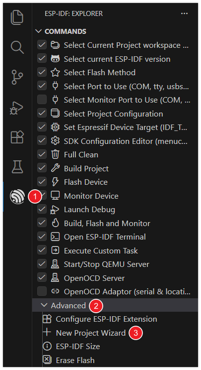

2. Select your ESP-IDF version.

   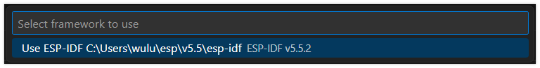

3. Set the project name, storage location, and relevant parameters. Board-related parameters can be modified after the project is created. After completing the settings, click **"Choose Template"**.

   :::warning
   The project path should not contain spaces, Chinese characters, or special characters.
   :::

   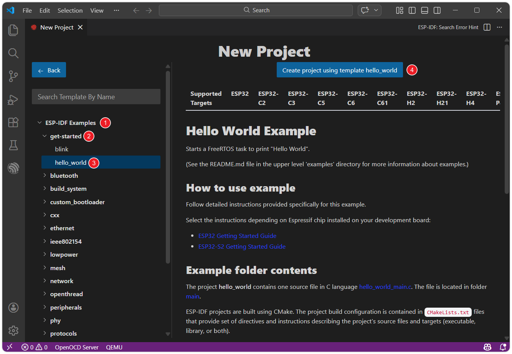

4. Under the ESP-IDF category, navigate to **"get-started"** and select **"hello_world"**. Then click **"Create project using template hello_world"**.

   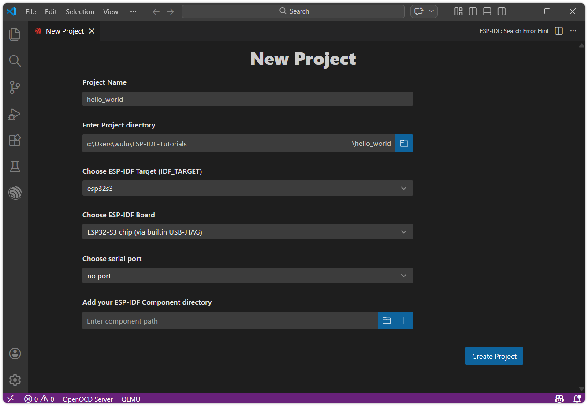

5. The ESP-IDF extension will automatically copy the example code to the specified location and display "Project has been created!". Click **"Open project"** to open the example project.

   

### 1.2 Project Structure

After the project is created, you can see the following core files and folder structure:

```
hello_world/
├── CMakeLists.txt
├── pytest_hello_world.py
├── main
│   ├── CMakeLists.txt
│   └── hello_world_main.c
└── README.md
```

- `main/`: The main code directory of the project, which is also the default main component of ESP-IDF.
  - `hello_world_main.c`: The C language source file of the project, containing the main logic and the entry function `app_main`.
  - `CMakeLists.txt`: The component-level build script. Defines the source files, inclusion paths, etc. of the component for building system compilation links.
- `CMakeLists.txt` (project root directory): Project-level build script. Declares this as an ESP-IDF project and includes subdirectories, etc. The project name (e.g., `project(hello_world)`) is defined here.

The project will automatically generate the following after building:

- `build/`: A directory automatically generated by the build system. It contains all the intermediate files, object files, and the final firmware binary files (.bin) generated during the compilation process.
- `sdkconfig`: The project configuration file. The relevant settings are saved into this file after modifying the configuration via `menuconfig` (such as Wi-Fi, log level, etc.). It is automatically generated during the first build or configuration. Avoid manually modifying `sdkconfig` to prevent breaking dependencies between configurations.

### 1.3 Configuration{#Flash-Option}

Before building and flashing, we need to set up the target hardware and connection. The VS Code ESP-IDF extension provides an [integrated toolbar](./01-Setup.md#VsCode-ESP-IDF-ToolBar) in the bottom status bar, which can be set directly in the toolbar.


1. Click   to select the flashing method: Select the UART interface.

   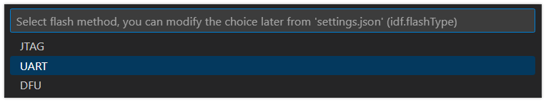

2. Click  to select the serial port: Connect the ESP32 development board to the computer. Click the port number and select the serial port corresponding to the development board from the list.

   - Tip: If you're unsure which port, unplug and replug the board to see which one appears.

   - Troubleshooting: If you can't find a new port, try manually entering download mode: **Press and hold the "BOOT" button, plug in the USB cable, and then release the button**. Then check again to find the correct port.

   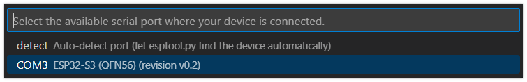

3. Click  to select the target device: Click the chip name (e.g., esp32s3) and select the chip model that exactly matches the development board.

   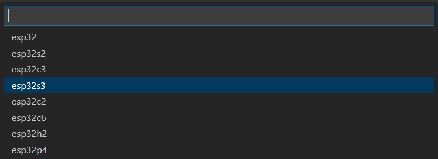

   When setting up the target device, ESP-IDF requires configuring the corresponding toolchain and libraries. This process may take some time, please wait patiently for it to complete. For more details, please refer to the [Official Documentation](https://docs.espressif.com/projects/esp-idf/en/latest/esp32s3/api-guides/tools/idf-py.html#set-target).

### 1.4 Build

Build: Use CMake/Ninja to compile and link the project and its components into executable firmware.

Click  button to compile the firmware.

In this step, the following is generated:

- Application ELF file (for debugging)
- Flashable binary file (.bin)
- Bootloader (bootloader.bin)
- Partition table (partition-table.bin)

For detailed instructions, please refer to: [ESP-IDF Build System](https://docs.espressif.com/projects/esp-idf/en/latest/esp32s3/api-guides/build-system.html)

### 1.5 Flash

Flashing: The built firmware is written into the flash memory (Flash) of the target ESP32 development board via serial port or other methods.

Click  button to compile the firmware.

During flashing, the ESP-IDF extension will automatically call the [esptool.py](https://github.com/espressif/esptool/#readme) tool to perform the actual communication and writing operations. The terminal will display the flashing progress.

### 1.6 Monitor

Monitor: Open the [IDF Monitor](https://docs.espressif.com/projects/esp-idf/en/latest/esp32/api-guides/tools/idf-monitor.html) to view device runtime logs and printed output, which is an important method for debugging programs and observing operational status.

Click  to monitor the ESP32 serial port.

After startup, the terminal will connect to the development board. You will see the output of the "Hello World" example.

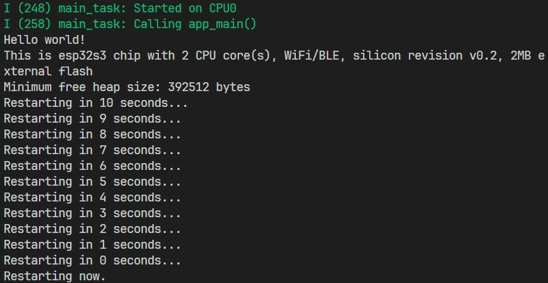

You can exit the ESP-IDF monitor using the shortcut key <kbd>Ctrl</kbd> + <kbd>]</kbd>.

### 1.7 Build, Flash & Monitor Combined Operations

You can also click  to automatically perform the build, flash, and monitor steps in sequence with one click.

## 2. Blink Example

Next, we will learn how to modify project configurations by using the classic "Blink" (LED Blinking) example.

This program's function is to make the onboard LED on the development board blink at a fixed frequency. The example supports both standard LEDs (GPIO) and addressable LEDs (such as WS2812, driven using RMT or SPI).

## 2.1 Open the Project

The steps to open the "Blink" example are exactly the same as "Hello World", just select get-started/blink from the example list.

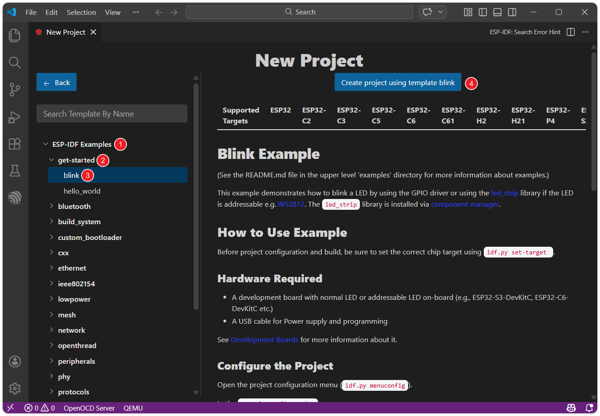

### 2.2 Project Structure & sdkconfig

The Blink project has an overall structure similar to Hello World, but provides an additional set of sdkconfig default value files for different target chips.

```
blink/
├── CMakeLists.txt
├── main
│   ├── blink_example_main.c
│   ├── CMakeLists.txt
│   ├── idf_component.yml
│   └── Kconfig.projbuild
├── pytest_blink.py
├── README.md
├── sdkconfig.defaults
├── sdkconfig.defaults.esp32
├── sdkconfig.defaults.esp32c3
├── sdkconfig.defaults.esp32c5
├── sdkconfig.defaults.esp32c6
├── sdkconfig.defaults.esp32c61
├── sdkconfig.defaults.esp32h2
├── sdkconfig.defaults.esp32p4
├── sdkconfig.defaults.esp32s2
└── sdkconfig.defaults.esp32s3
```

When building, ESP-IDF applies the generic `sdkconfig.defaults` first, and then appends `sdkconfig.defaults.<TARGET>`(e.g. `sdkconfig.defaults.esp32s3`) based on the target chip. If the same key appears in multiple files, the value applied later overwrites the previous value.

To facilitate configuration of project-specific parameters such as LED pins, the Blink example provides a `Kconfig.projbuild` file under `main/` to define the project configuration options (such as `Blink LED type` and `BLINK_GPIO`). These options will appear in `menuconfig` and will be written to `sdkconfig`.

### 2.3 Basic Project Configuration

Firstly, before building and flashing, please make sure to check and set the correct target device, serial port, and flashing method. Refer to [1.3](./02-Example.md#Flash-Option).


### 2.4 Configure LED Pins

<Tabs queryString="method">
  <TabItem value="VS Code" label="VS Code" default>
    1. Click  to open the SDK configuration editor.

       Unlike the command-line configuration tool (TUI) provided by `idf.py menuconfig`, the ESP-IDF VS Code plugin offers a more intuitive graphical configuration interface.

    2. Modify the configuration according to the onboard LED of the development board:
    
       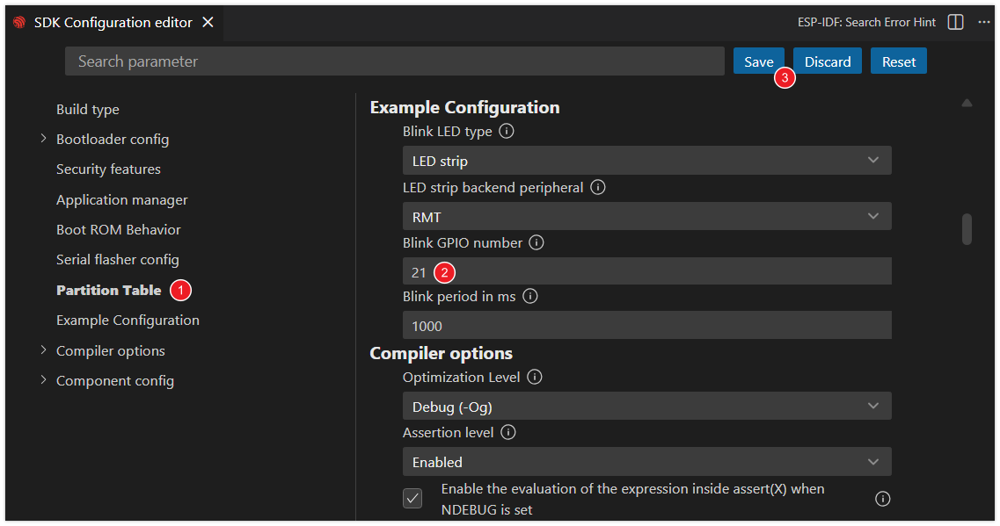
       
       - Blink LED type: Select the LED type.
         - `GPIO`: Regular LED.
         - `LED strip`: Addressable LED (such as WS2812).
       - Blink GPIO number: Set the GPIO pin number connected to the LED.
       - Blink period in ms: Set the period of LED blinking (unit: milliseconds).
       
       :::info
       This tutorial uses the [**Waveshare ESP32-S3-Zero Mini Development Board**](https://www.waveshare.com/esp32-s3-zero.htm), which has a WS2812 addressable LED connected to GPIO 21 pin.
       :::
    
    3. After making the modifications, click the "Save" button.
  </TabItem>
  <TabItem value="menuconfig" label="menuconfig">
    1. Click  to open the ESP-IDF terminal, and enter the following command:
    
       ```
       idf.py menuconfig
       ```
       
       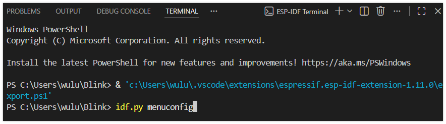
    
       This will open a text-based menu interface that can be navigated using the arrow keys, and you can enter by pressing the Enter key or the Space key. Press <kbd>Esc</kbd> to return, which is used to set the specific parameters of the project.
    
       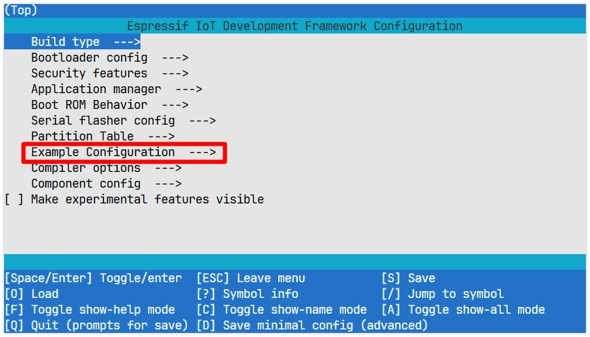
    
    2. Enter **Example Configuration** to modify the project settings:
    
       - Blink LED type: Select the LED type.
          - `GPIO`: Regular LED.
          - `LED strip`: Addressable LED (such as WS2812).
       - Blink GPIO number: Set the GPIO pin number connected to the LED.
       - Blink period in ms: Set the period of LED blinking (unit: milliseconds).
    
       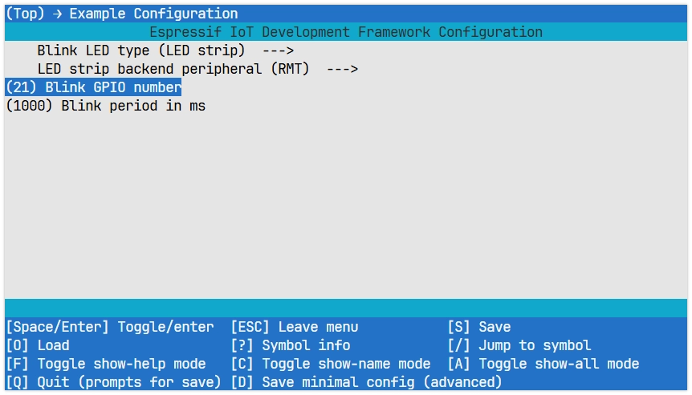
          
       :::info
       This tutorial uses the [**Waveshare ESP32-S3-Zero Mini Development Board**](https://www.waveshare.com/esp32-s3-zero.htm), which has a WS2812 addressable LED connected to GPIO 21 pin.
       :::
    
    3. After making changes, press <kbd>S</kbd> to save and <kbd>Q</kbd> to exit.
  </TabItem>
</Tabs>

### 2.5 Build, Flash & Monitor

1. Click  to automatically perform the build, flash, and monitor steps in sequence with one click.

2. After the flashing is completed, you will see the LED on the development board start to blink. At the same time, the serial monitor will start and output the following log information:

   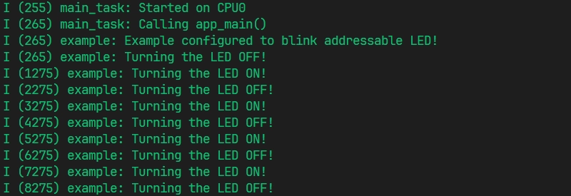
