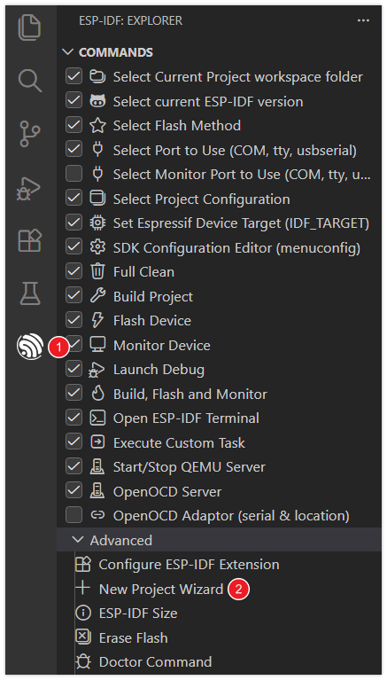
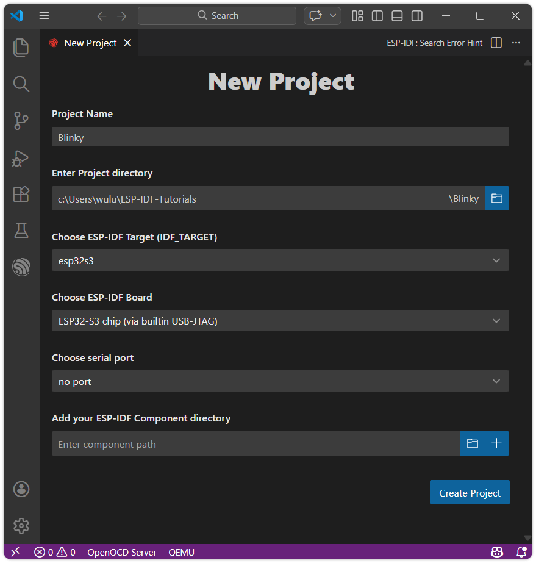
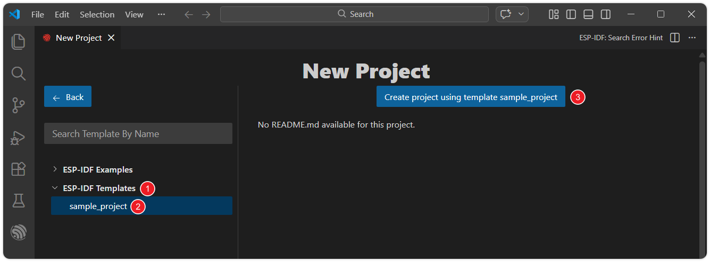
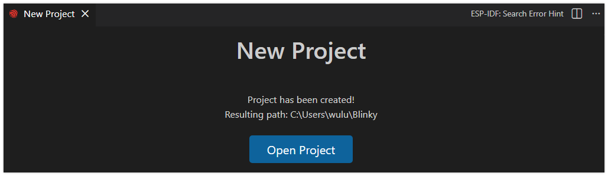
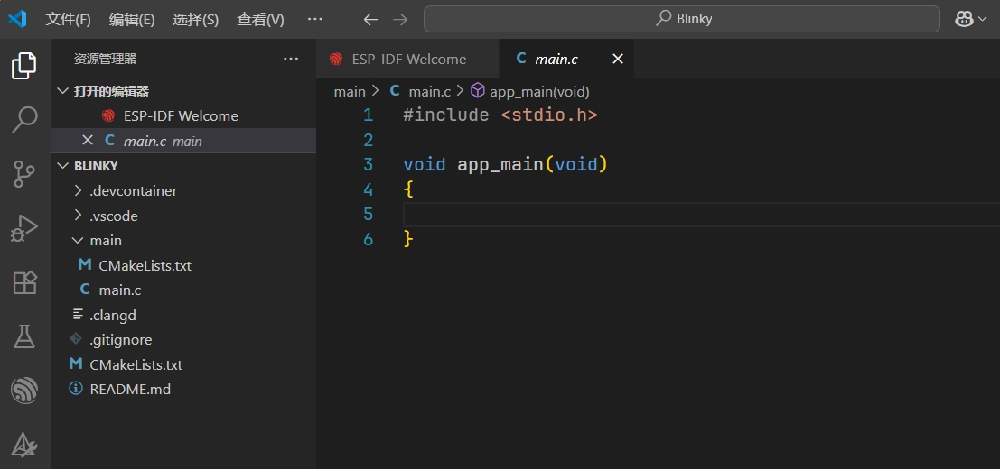
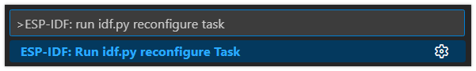
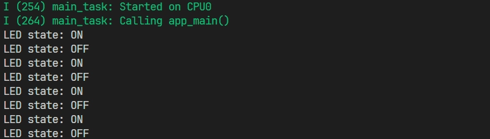

<!-- Image Reference -->
import ImgBlinkDiagram from './images/03-LED-Blink_bb.webp';

:::tip[Important: About board compatibility]
The core logic of this tutorial applies to all ESP32 boards, but all the operation steps are explained using the example of the [**Waveshare ESP32-S3-Zero mini development board**](https://www.waveshare.com/esp32-s3-zero.htm). If you are using a development board of another model, please modify the corresponding settings according to the actual situation.
:::

> This section explains how to create an ESP-IDF project using VS Code and demonstrates the practical example of illuminating an externally connected LED.

## 1. Circuit Assembly

Components required:

- LED \* 1
- 330Ω resistor \* 1
- Breadboard \* 1
- Wires
- ESP32 development board ([Waveshare ESP32-S3-Zero Mini Development Board](https://www.waveshare.com/esp32-s3-zero.htm))

Connect the circuit according to the wiring diagram below:

<Details>
  <summary>ESP32-S3-Zero Pinout Diagram</summary>


</Details>

<div style={{maxWidth:500}}> </div>

## 2. Create a Project from a Template

1. Open VS Code, click on the ESP-IDF extension, and open the "**New Project Wizard**" under "**Advanced**".

   

2. Select the ESP-IDF version.

   

3. Set the project name, storage location, and relevant parameters. Board-related parameters can be modified after the project is created. After completing the settings, click "**Choose Template**".

   :::warning
   The project path should not contain spaces, Chinese characters, or special characters.
   :::

   

4. Select the "**sample_project**" template, then click "**Create project using template sample_project**".

   

5. After the project is created, the ESP-IDF extension will display "Project created!" Click "Open Project" to open the new project.

   

## 3. Write Code

ESP-IDF will generate many files and folders for the project. In this getting started guide, it is recommended to keep all the default files intact and we will only need to modify the `main.c` file.



1. Write the following code:

   ```c
   #include <stdio.h>

   #include "driver/gpio.h"
   #include "freertos/FreeRTOS.h"
   #include "freertos/task.h"

   static const gpio_num_t led_pin = GPIO_NUM_7;

   void app_main(void)
   {
       gpio_reset_pin(led_pin);                       // Reset the pin
       gpio_set_direction(led_pin, GPIO_MODE_OUTPUT); // Set the pin as output mode

       while (1)
       {
           gpio_set_level(led_pin, 1);      // Set the pin to high level, turn on the LED
           printf("LED state: ON\n");       // Print the current state of the LED
           vTaskDelay(pdMS_TO_TICKS(1000)); // Task delay of 1000 milliseconds (1 second)

           gpio_set_level(led_pin, 0);      // Set the pin to low level, turn off the LED
           printf("LED state: OFF\n");      // Print the current state of the LED
           vTaskDelay(pdMS_TO_TICKS(1000)); // Delay the task again for 1000 milliseconds (1 second)
       }
   }
   ```

2. Code Navigation and Syntax Highlighting

   For code navigation and C/C++ syntax highlighting, it is recommended to use the [Microsoft C/C++ Extension](https://marketplace.visualstudio.com/items?itemName=ms-vscode.cpptools).

   After installing the plugin, VS Code is usually able to automatically perform syntax highlighting and recognize macro definitions, library variables, etc. If you encounter red squiggly lines indicating undefined symbols or other issues while writing code, these can generally be resolved by building the project once. Alternatively, you can follow these steps to fix the issue:

   - Typically, the C/C++ language extension relies on a file named `compile_commands.json`, which is located in the project's build directory. You can use the `ESP-IDF: Run idf.py reconfigure Task` to generate this file.

   - Use the shortcut keys <kbd>Ctrl</kbd> + <kbd>Shift</kbd> + <kbd>P</kbd> to open the VS Code command panel. Then run `ESP-IDF: Run idf.py reconfigure Task`.

     

## 4. Build and Flash the Code

1. Configure Flash Options

   Firstly, before building and flashing, please make sure to check and set the correct target device, serial port, and flashing method. Refer to [Section 2  Run Demo 1.3](./02-Example.md#Flash-Option) 。

   

2. Click  to automatically perform the build, flash, and monitor steps in sequence with one click.

3. After the flashing is complete, you will see the LED start blinking. At the same time, the serial monitor will start and output the following log information:

   

## 5. Code Analysis

- First include the required libraries:

  ```c
  #include "driver/gpio.h"
  #include "freertos/FreeRTOS.h"
  #include "freertos/task.h"
  ```

  - `stdio.h`: The C standard input/output library, used here to call the `printf` function for printing information to the serial port.
  - `driver/gpio.h`: The [GPIO driver library](https://docs.espressif.com/projects/esp-idf/en/v5.5.1/esp32/api-reference/peripherals/gpio.html#api-gpio) provided by ESP-IDF, which includes functions for configuring and operating GPIO pins, such as setting pin direction and reading/writing pin levels.
  - `freertos/FreeRTOS.h` and `freertos/task.h`: ESP-IDF uses FreeRTOS as its real-time operating system. These two header files provide APIs related to the operating system core and task management. Here, we mainly use the `vTaskDelay` function to achieve precise delays.

- GPIO pin definition

  ```c
  static const gpio_num_t led_pin = GPIO_NUM_7;
  ```

  - This line of code defines a constant `led_pin` to represent the GPIO pin number to which the LED is connected.
  - `gpio_num_t` is an enumeration type used in ESP-IDF to represent GPIO numbers.
  - `GPIO_NUM_7` is one of the values in this enumeration, representing the general-purpose I/O pin numbered 7 (GPIO7). For readability and type safety, it is recommended to use `GPIO_NUM_7` instead of the literal value `7`.

  :::note
  The availability and limitations of GPIO7 vary across different chips. Please check the pin definitions of the development board you are using.
  :::

- GPIO initialization

  ```c
  gpio_reset_pin(led_pin);                       // Reset the pin
  gpio_set_direction(led_pin, GPIO_MODE_OUTPUT); // Set the pin as output mode
  ```

  Inside the `app_main` function, the GPIO pins are first initialized and configured.

  - `gpio_reset_pin(led_pin);`: Resets the pin to its default state before configuration, which helps avoid unexpected issues.
  - `gpio_set_direction(led_pin, GPIO_MODE_OUTPUT);`: This line of code sets the selected `led_pin` (GPIO 7) to the output mode.

- Infinite loop `while(1)`

  In FreeRTOS task functions, `while(1)` is typically used to keep the task running continuously. This ensures the task remains managed by the FreeRTOS scheduler and will not exit unless explicitly deleted via `vTaskDelete()`. By combining an infinite loop with functions like `vTaskDelay()`, the task can perform operations periodically while yielding the CPU to other tasks, enabling concurrent multitasking.

  ```c
  while (1)
  {
      gpio_set_level(led_pin, 1);      // Set the pin to high level, turn on the LED
      printf("LED state: ON\n");       // Print the current state of the LED
      vTaskDelay(pdMS_TO_TICKS(1000)); // Task delay of 1000 milliseconds (1 second)

      gpio_set_level(led_pin, 0);      // Set the pin to low level, turn off the LED
      printf("LED state: OFF\n");      // Print the current state of the LED
      vTaskDelay(pdMS_TO_TICKS(1000)); // Delay the task again for 1000 milliseconds (1 second)
  }
  ```

  - `gpio_set_level(led_pin, 1);`: Sets the `led_pin` to output a high logic level.

  - `printf()`: ESP-IDF supports the standard C `printf()` function, allowing information to be output to the serial terminal for debugging and status monitoring.

  - `vTaskDelay(pdMS_TO_TICKS(1000));`:

    This function delays the current FreeRTOS task for a specified number of ticks. During the delay, the task enters the blocked state, releasing the CPU for use by other tasks. The macro `pdMS_TO_TICKS(1000)` converts 1000 milliseconds into the corresponding tick count, ensuring a precise 1000-millisecond delay. This process is non-blocking for the system. For more details, please refer to [this link](https://docs.espressif.com/projects/esp-techpedia/en/latest/esp-friends/get-started/basic-concepts/common-freertos-api/task-control.html#vtaskdelay).

## 6. Reference Links

- [Espressif IoT Development Framework Style Guide - C Code Formatting](https://docs.espressif.com/projects/esp-idf/en/latest/esp32/contribute/style-guide.html#c)
- [API Reference - General Purpose GPIO](https://docs.espressif.com/projects/esp-idf/en/v5.5.1/esp32/api-reference/peripherals/gpio.html#api-gpio)
- [Common FreeRTOS APIs - Task Delay API](https://docs.espressif.com/projects/esp-techpedia/en/latest/esp-friends/get-started/basic-concepts/common-freertos-api/task-control.html#vtaskdelay)
