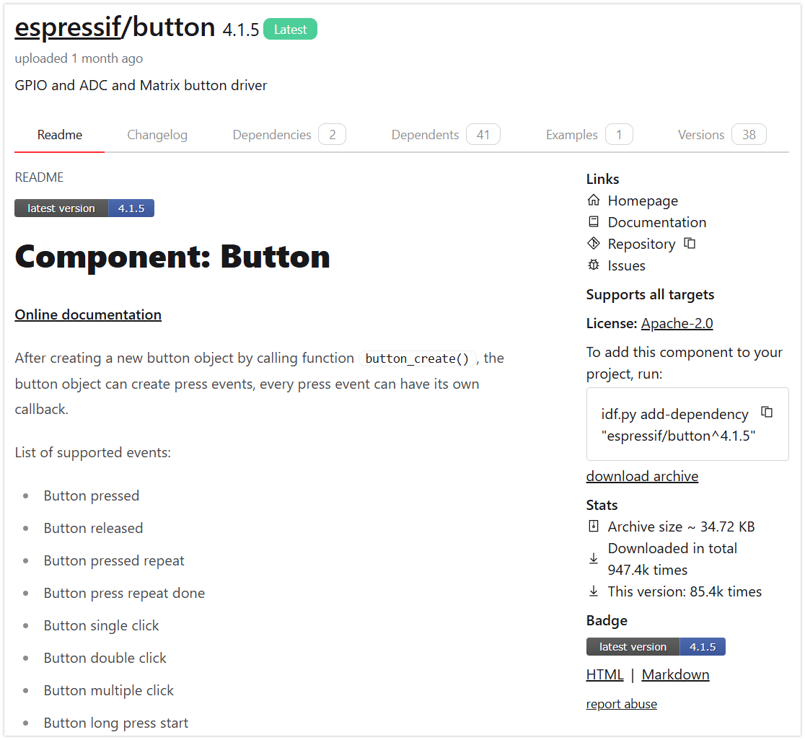
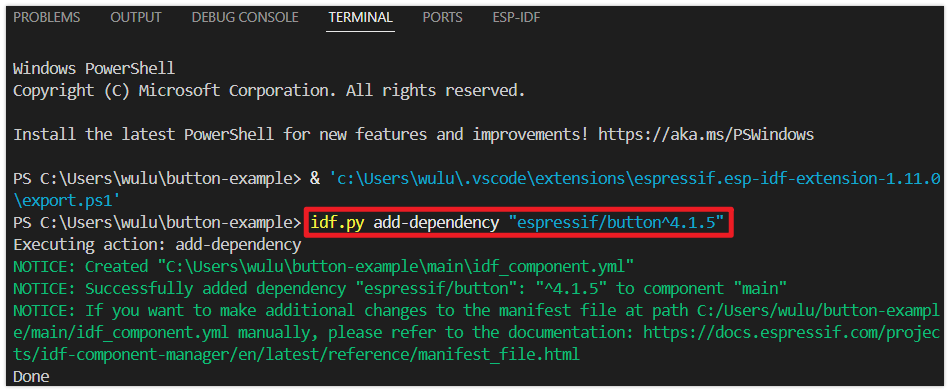
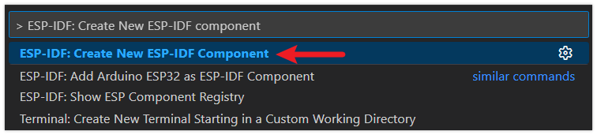

<!-- Image Reference -->
import ImgBlinkDiagram from './images/04-Button_bb.webp';

:::tip[Important: About board compatibility]
The core logic of this tutorial applies to all ESP32 boards, but all the operation steps are explained using the example of the [**Waveshare ESP32-S3-Zero mini development board**](https://www.waveshare.com/esp32-s3-zero.htm). If you are using a development board of another model, please modify the corresponding settings according to the actual situation.
:::

> This section introduces the basic concepts of the ESP-IDF component system, including the types and structures of components. Through examples of built-in components (GPIO) and external components (Button), it explains their application in projects.

## 1. Overview of ESP-IDF Components


ESP-IDF adopts a modular design, dividing various system functionalities—such as the operating system, network protocol stacks, drivers, and peripheral support—into independent "components”. Each component is a reusable, independent code package focused on implementing a specific functionality. During project building, components are compiled into static libraries and linked and invoked by the main application or other components.

Based on this architecture, developers can flexibly add custom components or integrate third-party components (e.g., specific cloud services, protocols, or drivers). By combining external components with ESP-IDF’s internal core components, project functionality can be extended and customized, achieving overall modularity and efficient reuse for the project. The advantages include: clear layering and dependency management, code reusability, ease of extension and updates, thereby reducing project complexity and accelerating development iterations.

## 2. Component Types

In ESP-IDF projects, components are primarily categorized into the following three types:

- **Core/Built-in Components**: These are core components included with the ESP-IDF framework, located in the `components` folder under the ESP-IDF installation directory. They provide foundational functionalities such as low-level drivers, network protocol stacks, and the FreeRTOS operating system. Developers can directly include their header files and use them without additional configuration.

- **Project Components**: These are components created by developers within the `components` folder under the project root directory. They are suitable for storing project-specific, reusable functional modules, which help keep the main logic (`main`) clean and enhance the modularity of the project.

- **External/Managed Components**: These components are created by the community or third-party developers and published to the [ESP-IDF Component Registry](https://components.espressif.com/). They can be automatically downloaded and integrated into projects using the [IDF Component Manager](https://docs.espressif.com/projects/esp-idf/en/stable/esp32s3/api-guides/tools/idf-component-manager.html). Once downloaded, they are stored in the `managed_components` folder under the project root directory.

## 3. Component Structure

A complete ESP-IDF component typically includes the following elements:

- **Source Code**  
  The core functional code files that implement the component.
- **Header Files**  
  Interface declarations exposed to the outside, allowing other components or the main program to call them.
- **CMakeLists.txt**
  - Defines how the source code and header files are compiled
  - Declares component dependencies
  - Registers the component with the build system
  - Configures optional features
  - Serves as the CMake build description file, instructing the compiler on how to compile, link, and build the component
- **idf_component.yml**  
  The component manager description file, listing other components that this component depends on, along with their version information. The ESP-IDF component manager uses this file to automatically download and integrate the required dependencies, ensuring that dependency requirements are satisfied.

## 4. Project Components

An example directory structure for a project containing components is as follows:

```text
myProject/
├── CMakeLists.txt
├── sdkconfig
├── dependencies.lock
├── main/
│   ├── CMakeLists.txt
│   ├── main.c
│   ├── src1.c
│   └── idf_component.yml
├── components/
│   ├── component1/
│   │   ├── CMakeLists.txt
│   │   ├── Kconfig
│   │   └── src1.c
│   └── component2/
│       ├── CMakeLists.txt
│       ├── Kconfig
│       ├── src1.c
│       └── include/
│           └── component2.h
├── managed_components/
│   └── namespace__component-name/
│       ├── CMakelists.txt
│       ├── idf_component.yml
│       ├── src1.c
│       └── include/
│           └── src1.h
└── build/
```

- **main/**  
  The project's main component directory, containing the primary source code for the project. The `main` directory typically has its own CMakeLists.txt and an optional `idf_component.yml` file to declare dependencies for the main component. An application must include a main component (the name can be changed), which is the primary component holding the application logic.

- **components/**  
  The directory for project-specific custom components. Each subdirectory is a component containing source code, header files, CMakeLists.txt, Kconfig, etc. This directory can be used to organize reusable code or to include third-party components. If a component with the same name exists elsewhere, the version under `components/` takes precedence.

- **managed_components/**  
  Automatically created by the [IDF Component Manager](https://docs.espressif.com/projects/esp-idf/en/v5.5.2/esp32s3/api-guides/tools/idf-component-manager.html), used to store managed components downloaded via the Component Manager. Each managed component typically includes an `idf_component.yml` file that defines the component's metadata and dependencies. Do not manually modify the contents of this directory. If modifications are needed, copy the component to the `components/` directory.

- **idf_component.yml**  
  The Component Manager description file that declares a component's metadata and its dependencies. This file can exist in each component directory under `main/` or `components/`, as well as in managed component directories under `managed_components/`. This file is optional and is only required when dependencies need to be declared.

- **dependencies.lock**  
  Automatically generated by the [IDF Component Manager](https://docs.espressif.com/projects/esp-idf/en/v5.5.2/esp32s3/api-guides/tools/idf-component-manager.html), it records all managed components used in the current project along with their exact versions. Do not modify this file manually. This file is generated only when an `idf_component.yml` file exists in the project.

## 5. Example: Using the Built-in GPIO Component

Read the button's level state by utilizing the ESP-IDF's built-in [esp_driver_gpio component](https://docs.espressif.com/projects/esp-idf/en/v5.5.2/esp32/api-reference/peripherals/gpio.html).

### 5.1 Circuit Assembly

Components required:

- Button \* 1
- Breadboard \* 1
- Wires
- ESP32 development board ([Waveshare ESP32-S3-Zero Mini Development Board](https://www.waveshare.com/esp32-s3-zero.htm))

<Details>
  <summary>ESP32-S3-Zero Pinout Diagram</summary>


</Details>

<div style={{maxWidth:500}}> </div>

### 5.2 Include the GPIO Library

1. Create a Project. If you are unsure how to do this, please refer to [Create a Project from a Template](./03-Create-Project.md#2-create-a-project-from-a-template).

2. Before including ESP-IDF built-in components, please refer to the [documentation for the corresponding component](https://docs.espressif.com/projects/esp-idf/en/v5.5.1/esp32s3/api-reference/peripherals/gpio.html#api-reference-normal-gpio). Follow the instructions in the documentation to complete the following steps.

   First, include the header file in **main.c**:

   ```c
   #include "driver/gpio.h"
   ```

   Then, declare the `esp_driver_gpio` component in **main/CMakeLists.txt**:

   ```
   idf_component_register(SRCS "main.c"
                         INCLUDE_DIRS "."
                         REQUIRES esp_driver_gpio)
   ```

### 5.3 Example Code

Copy the following code into **main/main.c**:

```c
#include <stdio.h>

#include "driver/gpio.h"
#include "freertos/FreeRTOS.h"
#include "freertos/task.h"

#define BUTTON_GPIO GPIO_NUM_7

void app_main(void)
{
    gpio_config_t io_conf = {
        .pin_bit_mask = (1ULL << BUTTON_GPIO),
        .mode = GPIO_MODE_INPUT,
        .pull_up_en = GPIO_PULLUP_ENABLE,
        .pull_down_en = GPIO_PULLDOWN_DISABLE,
        .intr_type = GPIO_INTR_DISABLE
    };
    gpio_config(&io_conf);

    while (1) {
        int level = gpio_get_level(BUTTON_GPIO);
        printf("Button value: %d\n", level);
        vTaskDelay(pdMS_TO_TICKS(20));
    }
}
```

### 5.4 Build and Flash the Code

1. Configure Flash Options

   Firstly, before building and flashing, please make sure to check and set the correct target device, serial port, and flashing method. Refer to [Section 2  Run Demo - 1.3 Configure the Project](./02-Example.md#Flash-Option).

   

2. Click  to automatically perform the build, flash, and monitor steps in sequence with one click.

3. After flashing completes, the serial monitor will start printing information.

   - When the button is not pressed, the internal pull-up resistor causes GPIO7 to read a high level. The serial monitor outputs `Button value: 1`.
   - When the button is pressed, GPIO7 is connected to GND and reads a low level. The serial monitor outputs `Button value: 0`.

### 5.5 Code Analysis

- **Include Header Files**

  ```c
  #include "driver/gpio.h"
  #include "freertos/FreeRTOS.h"
  #include "freertos/task.h"
  ```

  - `driver/gpio.h`: Contains the function declarations and type definitions needed to configure and operate GPIOs.
  - `freertos/FreeRTOS.h` and `freertos/task.h`: Provide the FreeRTOS operating system API. We use `vTaskDelay` to implement a non-blocking delay.

- **Define GPIO Pin**

  ```c
  #define BUTTON_GPIO GPIO_NUM_7
  ```

  A macro definition is used to assign a meaningful name to the pin (GPIO7) connected to the button, enhancing code readability and ease of modification.

  :::note
  The availability and limitations of GPIO7 vary across different chips. Please check the pin definitions of the development board you are using.
  :::

- **Configure GPIO**

  ```c
  gpio_config_t io_conf = {
      .pin_bit_mask = (1ULL << BUTTON_GPIO),
      .mode = GPIO_MODE_INPUT,
      .pull_up_en = GPIO_PULLUP_ENABLE,
      .pull_down_en = GPIO_PULLDOWN_DISABLE,
      .intr_type = GPIO_INTR_DISABLE
  };
  gpio_config(&io_conf);
  ```

  - Use the `gpio_config_t` structure to configure all parameters at once.
  - `.mode = GPIO_MODE_INPUT`: Sets the pin to input mode to read the external logic level.
  - `.pull_up_en = GPIO_PULLUP_ENABLE`: Enables the internal pull-up resistor. When the button is not pressed, this resistor pulls the pin level high to VCC, ensuring a stable default high state and preventing the pin from being unconnected.
  - `.pin_bit_mask`: Specifies the pin(s) to configure. The bitwise operation `(1ULL << BUTTON_GPIO)` is used to select GPIO7. The expression `(1ULL << BUTTON_GPIO)` is an efficient bitwise operation. `1ULL` represents the unsigned 64-bit integer 1. Shifting it left by `BUTTON_GPIO`(i.e., 7) bits generates a bitmask where only bit 7 is set to 1, thereby precisely selecting `GPIO7`.

- **Main Loop**
  ```c
  while (1) {
      int level = gpio_get_level(BUTTON_GPIO);
      printf("Button value: %d\n", level);
      vTaskDelay(pdMS_TO_TICKS(20));
  }
  ```
  - The `while(1)` loop runs continuously, constantly checking the button state.
  - `gpio_get_level(BUTTON_GPIO)`: Reads the current logic level (0 or 1) of the specified GPIO pin.
  - `vTaskDelay(...)`: Suspends the current task for a short period (20 milliseconds), yielding CPU time to other tasks. This is crucial in a loop to prevent the task from monopolizing CPU resources and is a fundamental practice in FreeRTOS programming.

## 6. Example: Using the External Button Component

The example above is just a simple demonstration. In practical applications, more complex considerations such as key debouncing and interrupt handling need to be considered. Using ready-made components can help developers streamline this process.

Next, we will use the community-provided [espressif/button](https://components.espressif.com/components/espressif/button) component to manage key debouncing and event handling.

### 6.1 Circuit Assembly

Components required:

- Button \* 1
- Breadboard \* 1
- Wires
- ESP32 development board ([Waveshare ESP32-S3-Zero Mini Development Board](https://www.waveshare.com/esp32-s3-zero.htm))

<Details>
  <summary>ESP32-S3-Zero Pinout Diagram</summary>


</Details>

<div style={{maxWidth:500}}> </div>

### 6.2 Include the Button Component

For external libraries (such as button), we will use the Component Manager and Registry.

1. Go to the [ESP Component Registry](https://components.espressif.com/).

2. Search for the "button" component ([espressif/button](https://components.espressif.com/components/espressif/button)).

3. Copy the command from the right-hand side:
   ```
   idf.py add-dependency "espressif/button^4.1.5"
   ```

   

4. Click  to open the ESP-IDF terminal, then paste the command.

   

5. Additionally, you need to include the corresponding header files in your code and call the functions provided in the component's documentation and folder. See the code section for details.

### 6.3 Example Code

```c
#include <stdio.h>

#include "driver/gpio.h"
#include "freertos/FreeRTOS.h"
#include "freertos/task.h"
#include "esp_log.h"
#include "iot_button.h"
#include "button_gpio.h"

#define BUTTON_GPIO GPIO_NUM_7
#define BUTTON_ACTIVE_LEVEL 0

static const char *TAG = "button_example";

// Single-click callback function
static void button_single_click_cb(void *arg, void *usr_data)
{
    ESP_LOGI(TAG, "BUTTON_SINGLE_CLICK");
}

// Double-click callback function
static void button_double_click_cb(void *arg, void *usr_data)
{
    ESP_LOGI(TAG, "BUTTON_DOUBLE_CLICK");
}

void app_main(void)
{
    // Define button configuration
    const button_config_t btn_cfg = {0};
    const button_gpio_config_t btn_gpio_cfg = {
        .gpio_num = BUTTON_GPIO,             // GPIO number the button is connected to
        .active_level = BUTTON_ACTIVE_LEVEL, // Active level (0 for active low, 1 for active high)
    };

    // Create button handle
    button_handle_t gpio_btn = NULL;
    esp_err_t ret = iot_button_new_gpio_device(&btn_cfg, &btn_gpio_cfg, &gpio_btn);
    if (gpio_btn == NULL)
    {
        ESP_LOGE(TAG, "Button create failed");
        return;
    }

    // Register single-click event
    iot_button_register_cb(gpio_btn, BUTTON_SINGLE_CLICK, NULL, button_single_click_cb, NULL);

    // Register double-click event
    iot_button_register_cb(gpio_btn, BUTTON_DOUBLE_CLICK, NULL, button_double_click_cb, NULL);

    // Main loop
    while (1)
    {
        vTaskDelay(pdMS_TO_TICKS(1000));
    }
}
```

### 6.4 Build and Flash the Code

1. Configure Flash Options

   Firstly, before building and flashing, please make sure to check and set the correct target device, serial port, and flashing method. Refer to [Section 2  Run Demo - 1.3 Configure the Project](./02-Example.md#Flash-Option).

   

2. Click  to automatically perform the build, flash, and monitor steps in sequence with one click.

3. After flashing completes, the serial monitor will start printing information.

   - When the button is single-clicked, the monitor will output: `I (xxxx) button_example: BUTTON_SINGLE_CLICK`
   - When the button is double-clicked quickly, the monitor will output: `I (xxxx) button_example: BUTTON_DOUBLE_CLICK`

### 6.5 Code Analysis

The [espressif/button](https://components.espressif.com/components/espressif/button) component supports detecting various button events such as press, release, single-click, double-click, serial click, long-press start, long-press hold, and long-press release, among others. It allows registering a callback function for each event type.

A separate callback function can be registered for each button event. When an event occurs, the component automatically calls the corresponding callback function, ensuring high efficiency and real-time responsiveness without missing events.

- **Include Header Files**

  ```c
  #include "iot_button.h"
  #include "button_gpio.h"
  ```

  - `iot_button.h` provides the core API and event definitions for the button component.
  - `button_gpio.h` provides the specific configuration structure and creation functions for GPIO-based buttons. The component also supports ADC buttons and matrix buttons. 

- **Define Callback Functions**

  ```c
  // Single-click callback function
  static void button_single_click_cb(void *arg, void *usr_data)
  {
      ESP_LOGI(TAG, "BUTTON_SINGLE_CLICK");
  }
  
  // Double-click callback function
  static void button_double_click_cb(void *arg, void *usr_data)
  {
      ESP_LOGI(TAG, "BUTTON_DOUBLE_CLICK");
  }
  ```

  Dedicated callback functions are defined for different button events (e.g., single-click, double-click). These functions are automatically called by the component when it detects the corresponding event. Here, we simply log the detected event information.

- **Configure and Create the GPIO Button**

  ```c
  const button_config_t btn_cfg = {0};
  const button_gpio_config_t btn_gpio_cfg = {
      .gpio_num = BUTTON_GPIO,
      .active_level = BUTTON_ACTIVE_LEVEL,
  };

  button_handle_t gpio_btn = NULL;
  esp_err_t ret = iot_button_new_gpio_device(&btn_cfg, &btn_gpio_cfg, &gpio_btn);
  if (gpio_btn == NULL) {
      ESP_LOGE(TAG, "Button create failed");
      return;
  }
  ```

  `button_config_t` is used for general configuration, while `button_gpio_config_t` is for GPIO-specific parameters.

  The `iot_button_new_gpio_device()` function is used to create a GPIO button instance.
  
- **Register Event Callbacks**
  ```c
  iot_button_register_cb(gpio_btn, BUTTON_SINGLE_CLICK, NULL, button_single_click_cb, NULL);
  iot_button_register_cb(gpio_btn, BUTTON_DOUBLE_CLICK, NULL, button_double_click_cb, NULL);
  ```
  - The `iot_button_register_cb()` function "binds" an event to a callback function.
  - The first parameter is the button handle.
  - The second parameter is the event type, such as `BUTTON_SINGLE_CLICK` (single click) or `BUTTON_DOUBLE_CLICK` (double click). For more events, refer to: [Button Events](https://docs.espressif.com/projects/esp-iot-solution/en/latest/input_device/button.html#button-event).
  - The third parameter is `event_args`, used to pass event parameters. For common events, `NULL` can be passed; for special events requiring custom settings (like long-press duration, multiple clicks, etc.), corresponding arguments must be provided.
  - The fourth parameter is the callback function.
  - The fifth parameter is a user data pointer.

- **Main Loop**

  Event detection and callback invocation for this component are handled internally by its own task (driven by a FreeRTOS soft timer). Therefore, there is no need to write any polling code within the main `while(1) ` loop. Keeping an empty `while(1)` loop ensures that `app_main()` does not return prematurely, which maintains the continuous operation of the main task and ensures system stability and reliability.

## 7. Appendix: Custom Components

There are two ways to help you quickly create a component, or you can create it manually:

- **VS Code Command**

  Use the shortcut keys <kbd>Ctrl</kbd> + <kbd>Shift</kbd> + <kbd>P</kbd> to open the VS Code command panel. Then run `> ESP-IDF: Create New ESP-IDF component`.

  

- **idf.py**

  ```
  idf.py create-component <component_name>
  ```

## 8. Appendix: Board Support Package (BSP)

A Board Support Package (BSP) is a hardware abstraction and initialization package provided as a component within ESP-IDF for a specific development board. It encapsulates the pin configuration and driver initialization for onboard peripherals (such as displays, touchscreens, audio codecs, TF cards, LEDs, buttons, etc.), providing a unified API. This facilitates quick onboarding, code reuse across different boards, and reduces configuration errors.

Like any ESP-IDF component, BSPs can be integrated into projects via the Component Manager using `idf_component.yml`.

## 9. Reference Links

- [ESP TechPedia - Component Management and Usage](https://docs.espressif.com/projects/esp-techpedia/en/latest/esp-friends/advanced-development/component-management.html)
- [Espressif DevCon23 - Development, Release, and Maintenance of ESP-IDF Components](https://www.youtube.com/watch?v=D86gQ4knUnc)
- [ESP- Jumpstart Programming Guide](https://docs.espressif.com/projects/esp-jumpstart/en/latest/esp32/gettingstarted.html)
- [ESP-IDF Basics: Your First Project with ESP32-C3 and Components](https://developer.espressif.com/workshops/esp-idf-basic/)
- [ESP-IDF Advanced Workshop](https://developer.espressif.com/workshops/esp-idf-advanced/)
- [What is the ESP Component Registry?](https://developer.espressif.com/blog/2024/10/what-is-the-esp-registry/)
- [How to create an ESP-IDF component?](https://developer.espressif.com/blog/2024/12/how-to-create-an-esp-idf-component/)
- [Simplify Your Embedded Projects with ESP-BSP](https://developer.espressif.com/blog/simplify-embedded-projects-with-esp-bsp/)
- [Migrating from ESP-IDF 5.2 to 5.3 - Explanation on Splitting Drivers into Independent Components](https://docs.espressif.com/projects/esp-idf/en/latest/esp32s3/migration-guides/release-5.x/5.3/peripherals.html)
